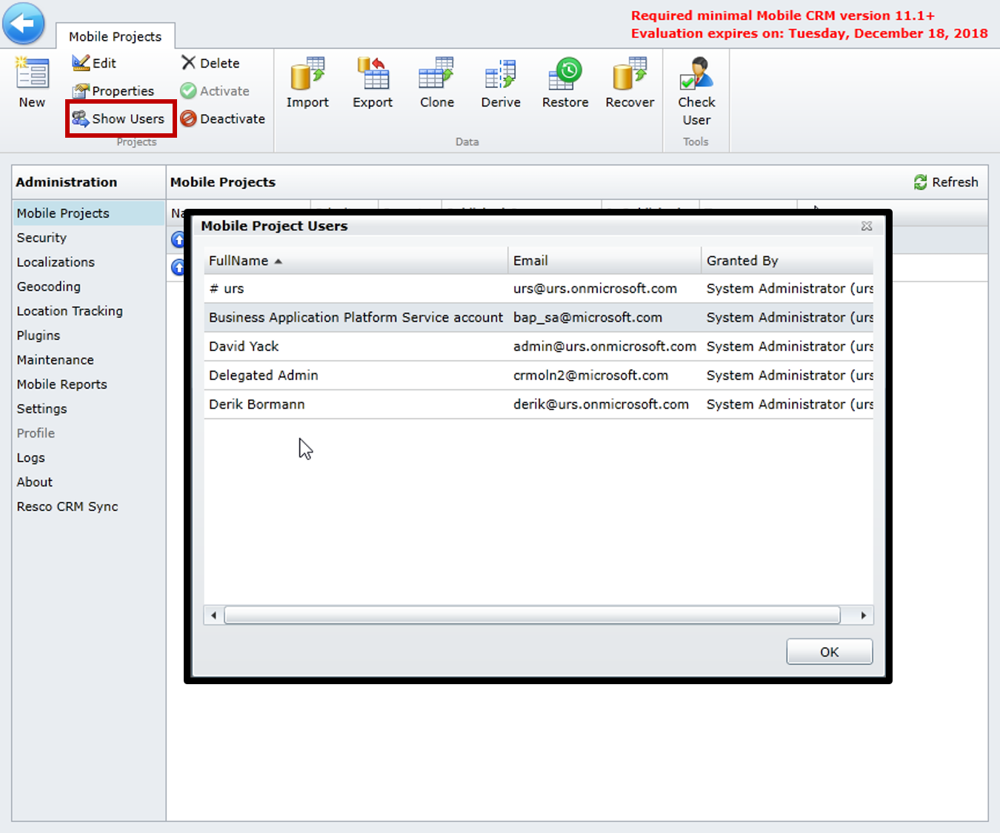

يحدد حل Resco Woodford مجموعة متنوعة من حالات الاستخدام ويعاملها بشكل فريد. على سبيل المثال، قد يحدد الحل مجموعات من الفنيين للوصول إلى العناصر، مثل أصول العملاء أو المنتجات. أو قد يحد من قدرة مجموعات معينة من الفنيين على قبول أوامر العمل. قد يكون لدى بعض الفنيين مثل كبار الموظفين القدرة على قبول أو رفض أوامر العمل المعينة إليهم، في حين قد لا يتم تزويد الفنيين الجدد بهذه القدرة. من خلال تعريف وإنشاء ونشر عدة مشاريع متنقلة في Microsoft Dynamics 365 for Field Service، يمكنك استيعاب حالات استخدام مختلفة مثل هذه.

لبدء إنشاء مشاريع الأجهزة المحمولة في Field Service، ستقوم باستخدام [قالب مشروع الأجهزة المحمولة](/dynamics365/customer-engagement/field-service/install-the-mobile-app). يعرض القالب الكيانات الضرورية التي يمكن استخدامها في التطبيق. 

بعد تنزيل المشروع، ستقوم باستيراده كمشروع محمول. حدد **استيراد**، ثم حدد قالب **CentaurusStoreVersion.woodford** الذي قمت بتنزيله سابقاً.

عند استيراد مشروع، ستحتاج إلى تقديم المعلومات التالية:

- **النوع:** تحديد نوع المستخدم الذي سيصل إلى هذا المشروع. عادةً، ستختار قياسي، ما لم تكن بحاجة إلى مستخدمين خارجيين أو مجهولين للوصول.
- **الاسم:** تحديد اسم المشروع
- **الأولوية:** تحديد أولوية رقمية للمشروع
- **الأدوار:** تحديد أدوار الأمان التي سيكون لها حق الوصول إلى المشروع. تمثل الأدوار أدوار أمان Dynamics 365 الموجودة في مؤسستك.

> [!NOTE] 
> في المرة الأولى التي تقوم فيها باستيراد مشروع إلى التطبيق باستخدام قالب مشروع الأجهزة المحمولة، سيظهر المشروع تلقائياً في قائمة مشروعات الأجهزة المحمولة. سيتم إلغاء نشره وسيتطلب النشر قبل أن يتمكن المندوبون من استخدامه. إذا قمت باستيراد مشروع ثان باستخدام نفس القالب، فسيتم سؤالك عما إذا كنت تريد استبدال المشروع الحالي أو إنشاء مشروع جديد. إذا حددت إنشاء مشروع جديد، فستحدد نوعه واسمه وأولويته وأدواره. سيظهر المشروع الجديد في قائمة مشروع الأجهزة المحمولة، ومثل المشروع الأول، يجب نشره قبل أن يتمكن المندوبون من استخدامه.

إذا نسيت إضافة دور أمان، أو إذا كنت تريد تغيير اسم أو أولوية مشروع الأجهزة المحمولة بعد إنشاء المشروع، فحدد المشروع، ثم حدد **خصائص**. سيؤدي هذا إلى فتح نفس النافذة التي تم استخدامها عند استيراد المشروع في البداية.

### أولوية المشروع

يمكن أن يكون لمؤسستك مشاريع متعددة محددة في التطبيق. ومع ذلك، يمكن لكل فني تحميل مشروع واحد فقط لملف التعريف الخاص به عند تشغيل التطبيق. للتأكد من أن الفنيين يتلقون المشروع الصحيح، يمكنك تعيين رقم أولوية لكل مشروع. تعتبر المشاريع ذات الأرقام الأعلى مشاريع مفضلة وسيتم تحميلها على المشاريع ذات الأرقام الأقل.

لنفترض أن المشرف الميداني لديه مشروعان محتملان يمكن تحميلهما عند تشغيل تطبيق الأجهزة المحمولة.

- المشروع الأول يسمى "المندوبون الميدانيون" وله أولوية 1.
- المشروع الثاني يسمى المشرفون الميدانيون والثاني له أولوية 2.

نظراً لأن أولوية مشروع المشرفين الميدانيين هي 2، فسيتم تحميله للمستخدم عند بدء تشغيل تطبيق الأجهزة المحمولة.

يجب أن تكون على دراية بالسيناريوهات التي قد يكون فيها للمندوب عدة مشاريع مخصصة له، وتأكد من تعيين الأولويات حسب الحاجة.

> [!VIDEO https://www.microsoft.com/videoplayer/embed/RE2Kmlv]

### ‏‏أدوار الأمان

سيحتاج كل مشروع أجهزة محمولة تقوم بإنشائه إلى الحصول على دور أمان Dynamics 365 واحد على الأقل مرتبط به. يحدد دور الأمان مستوى الوصول إلى التطبيق. يتم استخدام دور الأمان مع مستوى الأولوية لتحميل مشروع معين لمستخدم.

لتحديد المستخدمين الذين يمكنهم الوصول إلى مشروع أجهزة محمولة، حدد **إظهار المستخدمين**. ستظهر قائمة بجميع المستخدمين الذين لديهم حق الوصول إلى التطبيق وأدوار الأمان الخاصة بهم.

### تحرير مشاريع الأجهزة المحمولة

يمكنك إجراء مجموعة متنوعة من التغييرات على Field Service Mobile بناءً على احتياجات مؤسستك. يمكن أن تتراوح هذه التغييرات من التغيير البسيط لألوان التطبيق لتعكس العلامة التجارية للمؤسسة، إلى تغييرات البرمجة النصية الأكثر تقدماً للتنفيذ التلقائي لأجزاء معينة من الوظائف في التطبيق.

لتخصيص التطبيق، حدد مشروع الأجهزة المحمولة الذي ترغب في تغييره، ثم حدد **تحرير**. سيؤدي ذلك إلى فتح صفحة محرر المشروع. من هنا، يمكنك إجراء العديد من التخصيصات:

- **تعديل الصفحة الرئيسية**: عن طريق تحديد الرمز **الرئيسي**، يمكنك تغيير العناصر المعينة التي يتم تقديمها إلى الفنيين على الصفحة الرئيسية.
- **لوحه المعلومات:** يمكنك تحرير لوحة معلومات الأداء عن طريق إضافة عناصر مرئية مثل طرق العرض والمخططات. يمكنك أيضاً تحديد عدد الأعمدة والصفوف في لوحة المعلومات.
- **تعديل الكيان:** يمكنك التحكم في كيانات Dynamics 365 المتوفرة في التطبيق، ثم تعديل العناصر الخاصة بها. وتتضمن هذه الكيانات ما يلي:
  - **إعدادات الكيان**: تعريف الأذونات التي ستكون لدى مستخدمي تطبيق الأجهزة المحمولة إلى الكيان مثل القراءة والكتابة والإنشاء والحذف.
    - حدد ما إذا كان يمكن استخدام الكيان في وضع عدم الاتصال أو الاتصال عبر الإنترنت أو كليهما
    - تحديد إعدادات المزامنة لكيان.
            
> [!IMPORTANT]
> لا يمكن تمكين جميع الكيانات لتطبيق الأجهزة المحمولة. يسمح ترخيص الخدمة الميدانية فقط بالقدرة على استخدام الكيانات ذات الصلة بالخدمة الميدانية وما يصل إلى 10 كيانات مخصصة. لا يتم تضمين الكيانات المرتبطة بالمبيعات مثل العملاء المتوقعين والفرص في اتفاقية الترخيص.

لمزيد من التفاصيل حول تخصيصات الكيان، ارجع إلى صفحة [كيان Resco 4.2](https://www.resco.net/woodford-user-guide/#_Toc426143547).

- **الحقول:** تحديد حقول Dynamics 365 المتوفرة للاستخدام في تطبيق الأجهزة المحمولة. بالإضافة إلى ذلك، يتوفر لكل حقل خيارات تنسيق محددة.
    - على سبيل المثال، يمكن تنسيق حقل النص الذي سيخزن رموز UPC أو الأرقام التسلسلية كرمز شريطي للاستفادة من ماسح الرمز الشريطي لتعبئة البيانات في الحقل.
    - 
لمزيد من التفاصيل حول تخصيصات الحقول، ارجع إلى صفحة [تقارير Resco 3.8 Mobile](https://www.resco.net/woodford-user-guide/#_Toc483815895).
- **النماذج:** إنشاء وتحرير وحذف نماذج محددة متاحة للكيان.
    - يمكن تخصيص النماذج لتضمين عناصر مثل الصور وخطوط التوقيع والعناصر ذات الصلة والعناصر المرئية الأخرى.
    - يمكن إضافة البرمجة النصية للنموذج للتحقق من صحة العناصر وتنفيذها بشكل تلقائي

   للاطلاع على المزيد حول إنشاء النماذج وتخصيصها، راجع صفحة [إنشاء نموذج Resco 4.5](https://www.resco.net/woodford-user-guide/#__RefHeading__5837_1627906509).
    - **طرق العرض:** إنشاء وتحرير وحذف طرق العرض المرتبطة بالكيان. قد يشمل ذلك طرق العرض المستخدمة في النماذج ذات الصلة وطرق عرض الكيانات.
   لمزيد من التفاصيل حول تخصيصات طرق العرض، ارجع إلى صفحة [طرق عرض Resco 4.4](https://www.resco.net/woodford-user-guide/#__RefHeading__5821_1627906509).
    - **سمه اللون:** توفير القدرة على تمييز التطبيق ليلائم احتياجات المؤسسة.

أثناء إجراء تغييرات على عناصر مثل الصفحة الرئيسية ولوحات المعلومات والنماذج، ستحتاج إلى حفظ التغييرات قبل الخروج من كل عنصر. على سبيل المثال، إذا أضفت بعض الحقول إلى كيان ما، فستحتاج إلى حفظ التغييرات قبل أن تتمكن من إضافة هذه الحقول إلى طرق العرض والنماذج باستخدام المصمم. سيحذرك التطبيق إذا كنت تريد حفظ تغييراتك.

بعد تحديد التخصيصات الضرورية، ستحتاج إلى نشر التطبيق قبل أن يصبح متاحاً للمستخدمين.

لمزيد من التفاصيل حول إمكانات التخصيص، ارجع إلى [دليل دعم Resco لـ Woodford](https://www.resco.net/support/guides/woodford/).