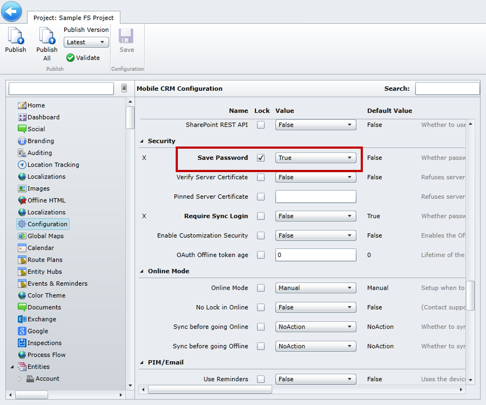
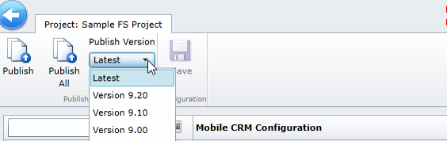

بعد إجراء التخصيصات اللازمة لمشروع ما، ستحتاج إلى نشره قبل أن تنعكس هذه التغييرات في تطبيق الأجهزة المحمولة.

### تكوين إعدادات المشروع

قبل نشر مشروع، ضع في اعتبارك إجراء تغييرات التكوين على التطبيق. على سبيل المثال، قد ترغب في تغيير الإعداد الافتراضي "حفظ كلمة المرور"، والذي لا يحفظ معلومات كلمة مرور المستخدم. هذا يعني أنه في أي وقت ينتقل فيه المستخدم بعيداً عن التطبيق، سيُطلب منه إدخال كلمة المرور الخاصة به.

>[!VIDEO https://www.microsoft.com/videoplayer/embed/RE2Kmlu]

تتضمن الخيارات المتوفرة للتكوين ما يلي:

- **تكوين تجربة المستخدم:** إعدادات تجربة المستخدم، مثل عرض النموذج والخريطة أو عرض لوحة المعلومات وإعدادات الرمز الشريطي
- **إعدادات البيانات:** الإعدادات المتعلقة بالبيانات، مثل الحد الأقصى لحجم تحميل المرفقات وتنسيق الصورة وتشفير قاعدة البيانات
- **إعدادات المزامنة:** إعدادات مزامنة البيانات، مثل عوامل تصفية المزامنة، والحد الأقصى للسجلات، والمزامنة التلقائية
- **التأمين:** إعدادات الأمان للمشروع، مثل حفظ كلمات المرور
- **وضع الاتصال بالإنترنت:** إعدادات للعمل أثناء الاتصال وغير متصل، بما في ذلك إعدادات المزامنة

> [!Note]
> بشكل افتراضي، لم يتم تكوين هذه الإعدادات في مشروع محمول، باستثناء حفظ كلمة المرور، الذي تم تعيينه إلى *خاطئ*. ويمكنك تعيينه إلى *صواب* لحفظ كلمة مرور المستخدم تلقائياً، أو يمكنك اختيار عدم تكوينها وتزويد المستخدم بالقدرة على تحديد إعدادات كلمة المرور على أجهزته.

### نشر مشروع

قبل أن تنشر مشروعاً، تحقق من أنك تنشر على نفس إصدار الحل الذي تم نشره في بيئتك، بالإضافة إلى إصدار متوافق لإصدار تطبيق الهاتف المحمول الذي يتم استخدامه. للقيام بذلك:

- **حدد مكان إصدار الحل في Dynamics 365:** في Dynamics 365، حدد **الإعدادات** \> **الحلول** واعرض رقم إصدار حل Woodford.
- **تحديد موقع رقم إصدار الأجهزة المحمولة:** في تطبيق الأجهزة المحمولة، حدد **حول**، ثم قم بعرض رقم الإصدار.

إذا قمت بالنشر إلى إصدار أعلى من الإصدار المستخدم في تطبيق الهاتف المحمول، فمن المحتمل أن تحصل على خطأ في البيانات الوصفية عند تحميل التطبيق.

> [!Note]
> إذا كنت لا ترى تغييراتك مطبقة في تطبيق الهاتف المحمول، فتحقق من أن دور الأمان الذي أنت عضو فيه لديه الأذونات المناسبة.
