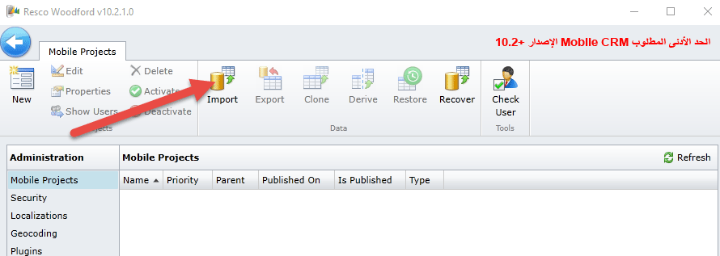
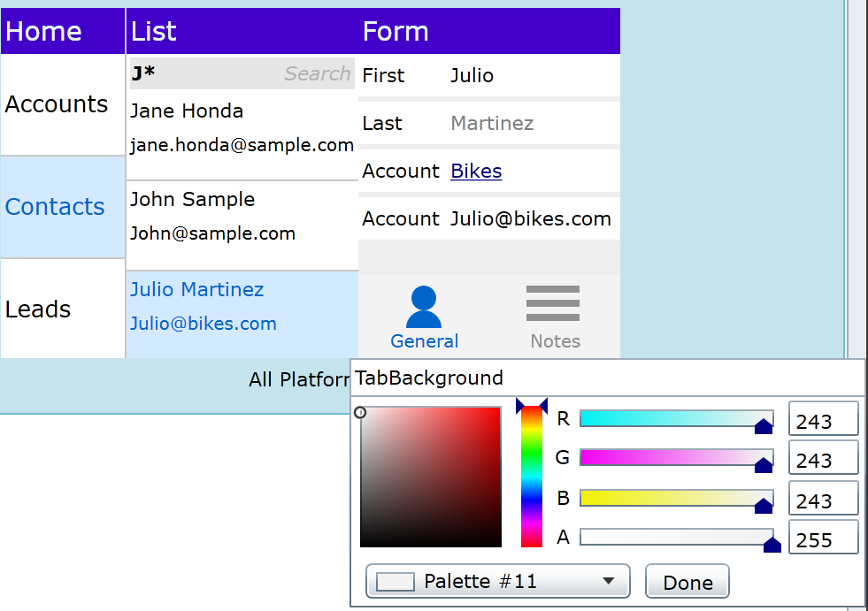
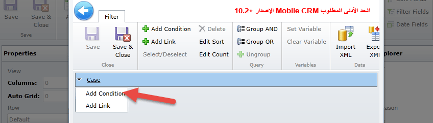
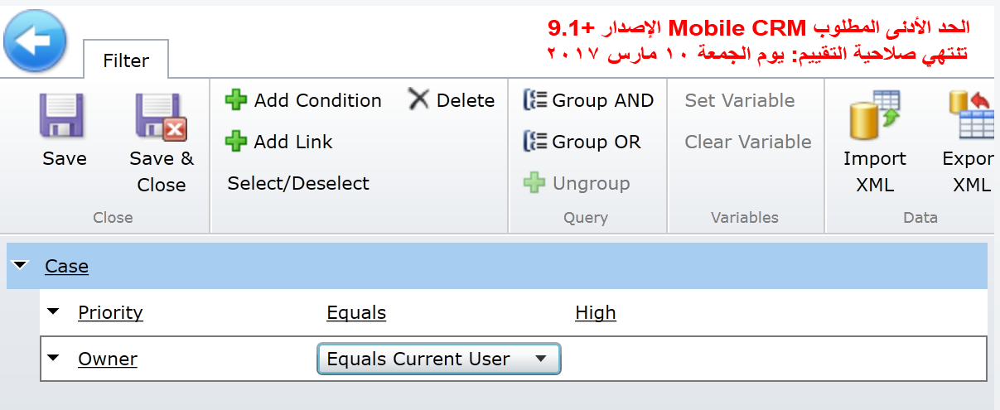

تعمل المعامل والتمارين في هذه الوحدة بشكل أفضل عندما تتوفر لديك البيانات النموذجية للعمل معها. يوفر Microsoft Dynamics 365 القدرة على إضافة بيانات نموذجية حسب الحاجة. إذا لم يتم تثبيت عينة من البيانات في بيئة العمل الخاصة بك، فاتبع الخطوات أدناه لتثبيت مجموعة.

تعمل المعامل والتمارين في هذه الوحدة بشكل أفضل عندما تتوفر لديك البيانات النموذجية للعمل معها. إذا لم تتضمن البيئة الخاصة بك عينه البيانات، راجع صفحة [نموذج تثبيت البيانات لتطبيق Field Service](/dynamics365/customer-engagement/field-service/install-sample-data-8-x).

### تنزيل حل Field Service Mobile وتثبيته

قبل أن تبدأ، ستحتاج إلى أذونات المسؤول لتثبيت حل Resco Mobile CRM Woodford. كما سيلزم أيضا استخدام Internet ExplorerSilverlight أو Firefox.

1.  انتقل إلى [صفحة Resco Woodford](https://www.resco.net/mobilecrm/woodford.html) وقم بتنزيل حل Woodford للأجهزة المحمولة وحفظه من موقع Resco إلى جهاز الكمبيوتر الخاص بك. تأكد من تنزيل الحل الذي يعمل مع إصدار تطبيق Field Service Mobile الذي تقوم بتشغيله وتثبيته.

> [!Note]
> يتضمن الحل محرراً يمكن تشغيله من Dynamics 365. يوصى بتنزيل محرر سطح المكتب المستقل، والذي يمكن تنفيذه من سطح المكتب الخاص بك ولا يعتمد على أي تقنية أخرى.

2. حدد موقع المقطع التطبيق المستقل وحدد **تثبيت**.
3. قم بالتبديل إلى مثيل Dynamics 365 الخاص بك حيث تم تثبيت Field Service.
4. حدد **الإعدادات** > **الحلول**.
5. في منطقة **الحلول**، حدد **استيراد**.
6. حدد موقع حل **Woodford** الذي قمت بتنزيله مسبقاً وقم بتحديده، وحدد **التالي**، ثم حدد **استيراد**.
7. بعد استيراد الحل، يجب أن تشاهد حل **‎Woodford** المسرد في قائمة **الإعدادات**. للتحقق من ذلك، انتقل إلى **الإعدادات**، ثم حدد **Woodford**. إذا لم ترى **Woodford** ضمن قائمة **الإعدادات**، فقم بتحديث الصفحة.

8. حدد موقع المحرر المستقل الذي قمت بتنزيله. إذا لم يتم بدء تشغيل التطبيق المستقل، فقم بتشغيل التطبيق.
9. إذا تمت مطالبتك بزيادة الحصة النسبية، فقم بتعيين الحصة إلى 100 ميغابايت، ثم حدد **موافق**.
10. في مربع الحوار **تحديث المتوفر**، عند إعادة المطالبة بتحديث متوفر، حدد **لاحقاً**. 

> [!IMPORTANT]
> لا تقم بالتحديث حتى إذا كان متاحاً.

11. إذا طلب منك تثبيت Silverlight، انقر بزر الماوس الأيمن فوق التطبيق، ثم حدد **تثبيت**.
12. قم بتوفير بيانات الاعتماد الخاصة بك، وحدد **موافق**.

### استيراد قالب مشروع Field Service Mobile إلى حل Woodford

بعد تثبيت حل Woodford، ستحتاج إلى تنزيل نموذج يساعدك في تكوين Field Service Mobile. ستستخدمه لإضافة الحقول والكيانات وطرق العرض والنماذج وإزالتها وتغييرها.

1. قم بتنزيل ملف القالب وحفظه.
    - إذا كنت تستخدم تحديث ديسمبر 2016 لتطبيق Microsoft Dynamics 365 (online)، فاستخدم قالب[مشروع الأجهزة المحمولة](https://go.microsoft.com/fwlink/p/?linkid=836310) هذا.
    - إذا كنت تستخدم تطبيق Microsoft Dynamics 365، فاستخدم قالب[مشروع الأجهزة المحمولة](https://go.microsoft.com/fwlink/p/?LinkId=808250) هذا.
2. افتح المحرر، وحدد **استيراد**، ثم قم باستيراد ملف قالب مشروع الأجهزة المحمولة.

3. في مربع الحوار إضافة مشروع متنقل:
    - بالنسبة إلى **النوع**، حدد **المستخدم القياسي**.
    - قم بتسمية القالب.
    - قم بتعيين **الأولوية** إلى *10*.

4. بالنسبة **للأدوار**، حدد الأدوار التي تريد تطبيق هذا القالب عليها، ثم حدد **موافق**. سيرث المستخدم الذي يقوم بتسجيل الدخول ويكون له دوراً يتطابق مع الدور الذي تحدده هنا، هذا التكوين على تطبيق الأجهزة المحمولة.

5. لنشر ملف القالب، من علامة التبويب **مشروع الأجهزة المحمولة**، حدد **تحرير**، ثم حدد **موافق**.
6. في الصفحة التالية، حدد **نشر الكل.**

### تخصيص Field Service Mobile

والآن بعد إنشاء البيئة الخاصة بك، حان الوقت لبدء تخصيص التطبيق. أولاً، ستقوم بتخصيص الصفحة الرئيسية:

1. في تطبيق تخصيص Woodford، حدد زر **الصفحة الرئيسية**.
2. حدد واسحب كيان **الحالة** من قائمة العناصر المتوفرة وضعه أسفل **المنتج** في قسم **الصفحة الرئيسية**.
3. حدد **حفظ**.
4. انتقل إلى **سمه اللون**، وحدد **خلفية العنوان** في قسم **السمة**.
5. حدد لوناً، ثم قم بتحديد **تم**.
6. حدد **خلفية علامة التبويب**، وحدد لوناً، ثم حدد **تم**.

7. حدد **حفظ**.
8. على الجانب الأيسر من التطبيق، حدد موقع وحدد كيان **الحالة**.
9. قم بتوسيع كيان **الحالة**، وحدد **الحقول**.
10. حدد الحقول الآتية:
   - الاستحقاق
   - الحالة الأصلية
   - الرقم التسلسلي
   - مستوى الخدمة
11. حدد **حفظ**.
12. في كيان **الحالة**، حدد **طرق العرض**، ثم حدد **استنساخ**.
13. أدخل حالات الأولوية القصوى للاسم، وحدد **موافق**.
14. حدد **تحرير عامل التصفية**.
15. قم بتوسيع كيان **الحالة**، وحدد **إضافة شرط**.

16. قم بتعيين **الشرط** إلى **الأولوية** > **يساوي** > **عال**.
17. حدد **الحالة** مرة أخرى، وأضف شرطاً آخر.
18. قم بتعيين **الشرط** إلى **المالك** > **يساوي المستخدم الحالي**.

19. حدد **حفظ وإغلاق**.
20. حدد حقل **العميل** ضمن عنوان الحالة.
21. في شريط الأوامر، حدد رمز **الأزرار**.
22. ضمن **الأوامر المتوفرة**، حدد **بريد إلكتروني**، ثم حدد **إضافة**.
23. حدد **حفظ وإغلاق** لحفظ طريقة العرض.
24. ضمن **الحالة**، حدد **النماذج**.
26. حدد **تحرير**.
27. اسحب حقل **الرقم التسلسلي** الموجود أسفل **سبب الحالة**.
28. حدد **حفظ وإغلاق**.
29. حدد **التحقق من الصحة**.
30. حدد **نشر الكل**.
31. افتح Field Service Mobile وتحقق من تطبيق التغييرات.
