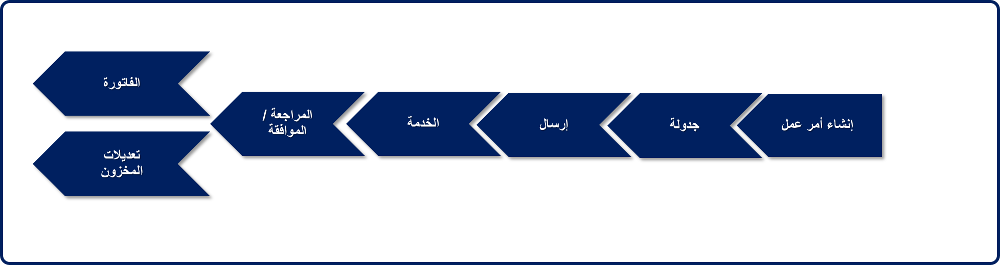
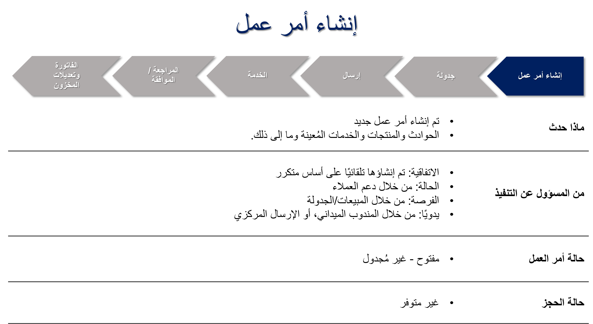
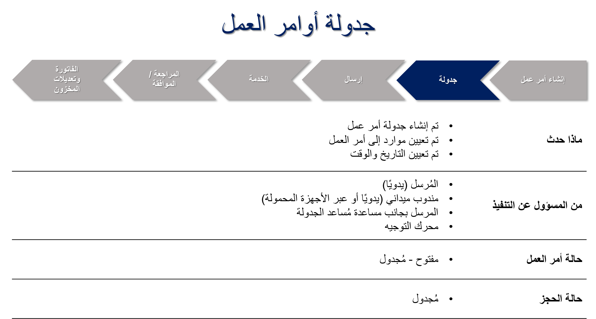
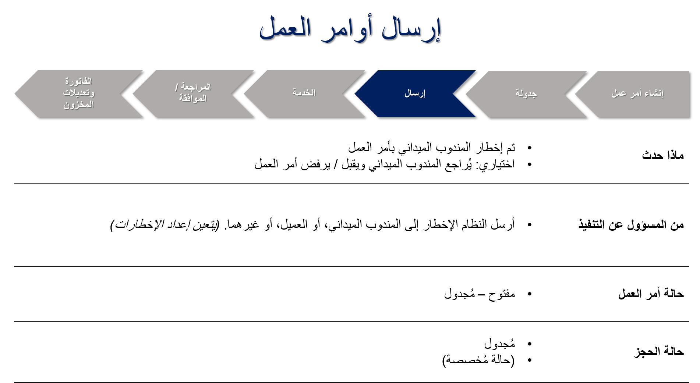
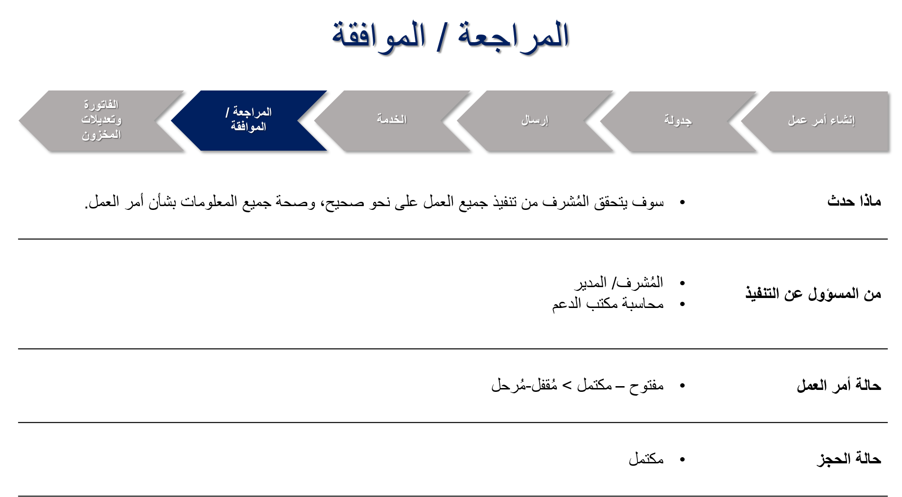
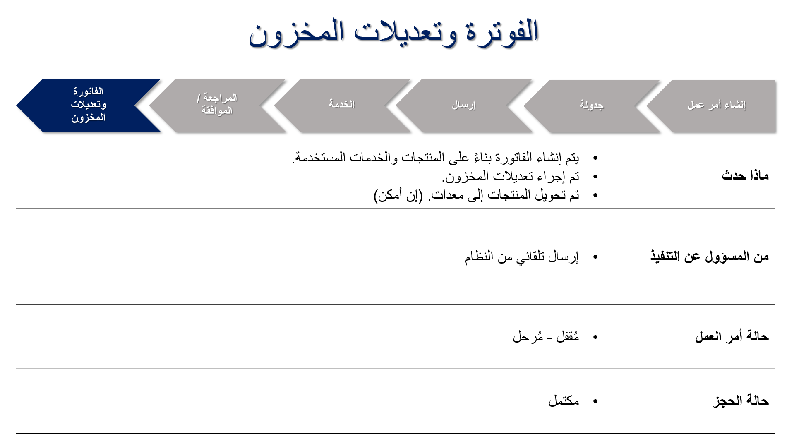

ما المقصود بأمر العمل؟ أمر العمل هو مهمة أو وظيفة يمكن جدولتها أو تعيينها لشخص ما. قد يتضمن أمر العمل النموذجي معلومات مثل المنتجات والخدمات ونوع العمل والمهام التي سيتم تنفيذها ومعلومات أخرى خاصة بالحادث.

وتتضمن أمثلة أوامر العمل ما يلي:
- فرن سيتم إصلاحه.
- طلب داخلي لتركيب قطعة جديدة من المعدات.
- متابعه الفحص أو التدقيق.
- إرسال فني بناء على تنبيه تم إنشاؤه بواسطة جهاز IoT.

في Microsoft Dynamics 365 Field Service، يشتمل أمر العمل على معلومات معينة حول العمل الذي يجب القيام به. يتضمن أمر العمل Field Service النموذجي ما يلي:
- معلومات الموقع والفوترة.
- نوع العمل الذي سيتم إكماله، مثل التثبيت أو الإصلاح أو الصيانة الوقائية.
- تتضمن المنتجات والخدمات.
- مهام محدده لينفذها عامل الحقل.
- معلومات التاريخ والوقت.

يمكن إنشاء أوامر العمل عن طريق تحويل حالة موجودة أو فرصة، أو يمكنك إنشاؤها تلقائياً وفقاً لجدول مقترن بعقد الصيانة. تشتمل أوامر العمل على حالات مرتبطة بها تساعد على تحديد الجدولة الحالية. وبمجرد جدولة أوامر العمل ومعالجتها بواسطة الفنيين، يتم تحديث الحالات وفقاً لذلك.

وعادةً ما سيمر أمر العمل بست مراحل:

دعونا ندرس كل مرحلة عن كثب.

**إنشاء أمر عمل**

**جدولة أمر عمل**

**إرسال أمر العمل**

**تقديم خدمة أوامر العمل**

**مراجعة العمل والموافقة عليه**

**الفاتورة والمخزون**

