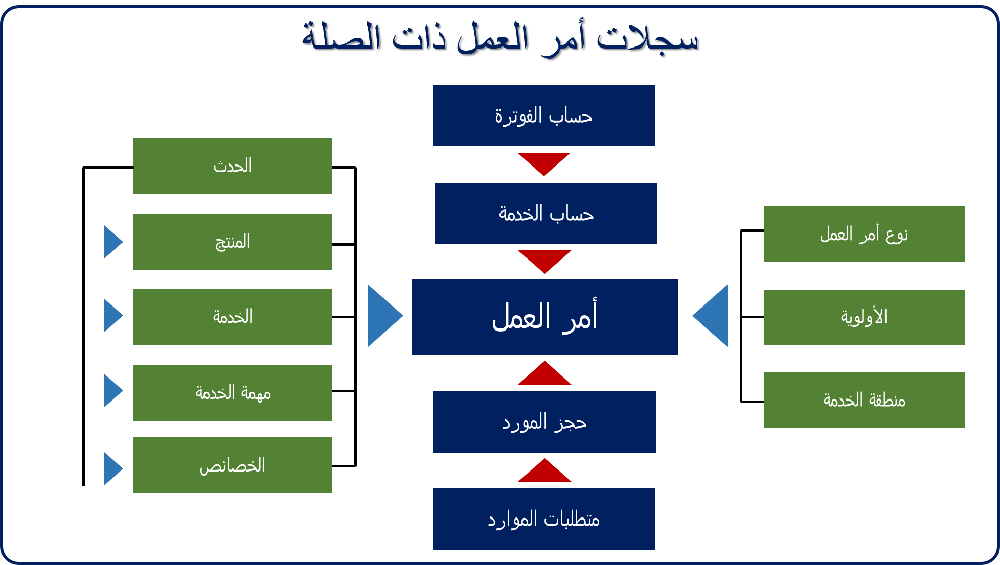
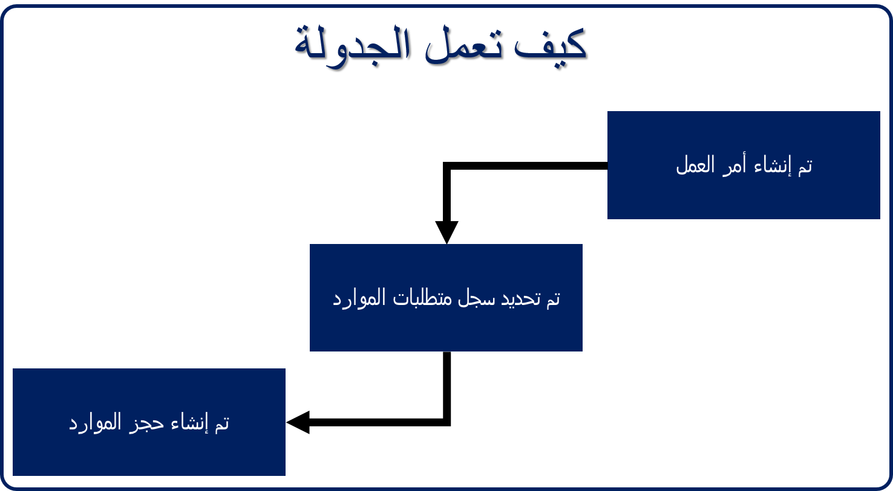
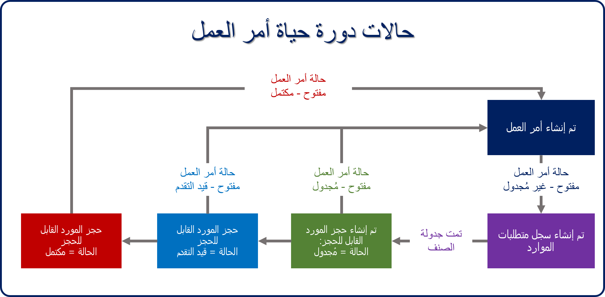

أمر العمل في Microsoft Dynamics Field Serviceله علاقات مع سجلات متعددة. يساعد هذا في ضمان تنفيذ أمر العمل بشكل صحيح، ويساعد في جدولته، ويوفر معلومات مفصلة حول المنتجات والخدمات المحددة المعنية. عادةً ما تكون سجلات أوامر العمل مرتبطة بالطريقة التالية:

### علاقات الحساب

ترتبط أوامر العمل في Field Service دائماً بأحد سجلات الحساب. عند إنشاء أمر عمل، ستحتاج إلى تحديد الحساب المرتبط به.

يوجد مكانان حيث يتم تحديد الحسابات في أمر العمل:

-   **حساب الخدمة:** يحدد الحساب الذي يتم العمل من أجله
    -   تتم إضافة معلومات العنوان من حساب الخدمة إلى أمر العمل وتُستخدم للمساعدة على جدولة الصنف. 
-   **حسابات الفوترة:** يحدد سجل الحساب المسؤول عن الدفع والمكان الذي سيتم إرسال الفاتورة إليه
    -   سيكون حساب الفوترة لأمر العمل افتراضياً لحساب الخدمة ما لم يتم تعريف حساب الفوترة في سجل الحساب لحساب الخدمة.
    -   يمكن استبدال حساب الفواتير في أي وقت.

### أنواع أوامر العمل والأولويات ومناطق الخدمة

يمكنك تقديم معلومات إضافية للمساعدة على إعداد التقارير والجدولة. للقيام بذلك، حدد أصناف مثل نوع العمل وأولوية أمر العمل ومنطقة الخدمة.

-   **أنواع أمر العمل:** تُستخدم لتصنيف أوامر العمل حسب النوع. ستحدد عادةً أنواع أوامر العمل حسب نوع العمل المنجز للعملاء. من أمثلة أنواع أوامر العمل: عمليات التثبيت والإصلاحات والصيانة الوقائية وإصلاح الأعطال.
-   **الأولوية**: تقيّم أهمية أمر العمل. يمكن للمؤسسات تحديد مستويات الأولوية، والتي يتم استخدامها مع أنواع أوامر العمل لتحديد أولوية الجدولة. على سبيل المثال، قد يكون لأوامر العمل من نوع *صيانة وقائية* الأولوية *1*، وقد يكون لنوع *إصلاح التوقف* الأولوية *5*.
-   **منطقة الخدمة**: تُستخدم على تنظيم أوامر العمل والموارد حسب المنطقة الجغرافية. يمكن تعيين الحسابات لمنطقة خدمة.
    -   عندما يتم إنشاء أوامر العمل لحساب ما، سيتم إدخال منطقة الخدمة تلقائياً في أمر العمل. يمكن بعد ذلك جدولة الموارد المرتبطة بإقليم ما للعمل على أوامر في تلك المنطقة.

### التعامل مع الحوادث

الحوادث عبارة عن قوالب يمكن استخدامها لتجميع الأصناف مثل المهام والمنتجات وتعريفات الخدمة حول المشكلات التي يعمل عليها الوكلاء الميدانيون بشكل شائع. عند تحديد حادثة لأمر عمل، فسيقوم تلقائياً بتعبئة أي منتجات وخدمات ومهام تم تحديدها له. على سبيل المثال، لنفترض أن الشركة تقدم خدمات التصوير بالرنين المغناطيسي، ويتم إرسال الفنيين بانتظام لإجراء عمليات فحص التصوير بالرنين المغناطيسي.

قد يحتوي الفحص على ما يلي:

-   المنتجات
    -   بطارية ليثيوم واحدة
    -   ملفان متدرجان
-   الخدمات
    -   صحة التصوير بالرنين المغناطيسي
-   المهام
    -   قياس استخدام الطاقة: 30 دقيقة
    -   استبدال البطارية: 15 دقيقة
    -   استبدال ملفات التدرج: 30 دقيقة
    -   جمع توقيع العملاء: 15 دقيقة

إذا كانت 90 بالمائة من عمليات فحص التصوير بالرنين المغناطيسي في مؤسستك تحتوي على هذه المعلومات، فيمكنك إنشاء نوع حدث يسمى *عمليات فحص التصوير بالرنين المغناطيسي*. سيؤدي ذلك إلى تبسيط العملية عن طريق إضافة هذه المجموعة من الأصناف تلقائياً إلى أمر عمل، لذلك لن تضطر إلى إضافة كل صنف يدوياً في كل مرة.

عندما تقوم بتحديد **تعريف نوع أمر العمل** لحدث الأساسي، يتم ملء المعلومات التالية تلقائياً:

-   **نوع أمر العمل الافتراضي:** يحدد نوع أمر العمل الذي سيتم تنفيذه، مثل *فحص*، *إصلاح كسر*، *صيانة وقائية*، إلخ.
-   **المهارة / الخصائص:** تحدد المهارات أو الشهادات التي يجب أن يمتلكها المورد للعمل على هذا النوع من الأصناف.
  
-   **المهام المراد تنفيذها:** يوفر مندوب الحقل قائمة بالمهام التي سيتم إجراؤها لأمر العمل، ومدة كل مهمة. يتم عرض إجمالي الوقت لجميع المهام المضافة إلى أمر العمل وسيتم ملء حقل *المدة المقدرة* في أمر العمل.

-   **المنتجات المطلوبة**: تحدد كل منتج، بما في ذلك الكمية المطلوبة لأمر العمل.
-  **الخدمات المطلوبة**: تحدد كل خدمة سيتم إجراؤها كجزء من أمر العمل.
   
تعتبر الحوادث طريقة رائعة للتعبئة التلقائية للمعلومات المدرجة أعلاه، ولكن يمكن إضافة أي من هذه العناصر يدوياً في أي وقت. أيضاً، يمكن إضافة حوادث إضافية إلى أوامر العمل الموجودة. عند إضافة حوادث إضافية، تتم إضافة جميع الأصناف المحددة للحدث أيضاً.

### تفضيلات الخدمة

يمكن تحديد تفضيلات الخدمة لكل أمر عمل. توفر هذه الإرشادات عندما تتم جدولة صنف يدوياً، باستخدام مساعد الجدولة، أو من خلال resource scheduling optimization. يمكن ملء بعض التفضيلات تلقائياً بناءً على المعلومات المخزنة في حساب الخدمة. يمكن تعريف الآخرين في أمر العمل نفسه. ستتم إضافة أي تفضيلات محددة إلى متطلبات المورد التي تم إنشاؤها لأمر العمل. تشمل التفضيلات التي يمكن تحديدها ما يلي:

-   **وقت بدء التعهد / وقت انتهاء التعهد**: تحدد النافذة الزمنية التي وعد بها العميل أن فنياً سيصل لحل الحادث. تأخذ النوافذ الموعودة بالوقت أولوية أعلى على جميع تفضيلات التاريخ والوقت الأخرى.
-   **بداية إطار التاريخ / نهاية إطار التاريخ**: يوفر نطاقاً للتاريخ يرغب فيه العميل في أن يعمل شخص ما على الحدث
-   **بداية النافذة الزمنية / نهاية النافذة الزمنية**: يوفر نطاقاً للوقت يرغب فيه العميل في أن يعمل شخص ما على الحدث
-   **تفضيل التنفيذ**: يوفر خيارات جدولة إضافية

أثناء إنشاء أوامر العمل، يتم إنشاء سجل آخر يسمى *سجل متطلبات المورد*. يتم استخدام سجل متطلبات المورد للمساعدة على عملية الجدولة.

هناك ثلاثة أنواع من السجلات تُستخدم لجدولة أمر عمل: 
-   أمر العمل
-   متطلبات الموارد
-   حجز المورد القابل للحجز

توفر الصورة أدناه نظرة عامة عالية المستوى حول كيفية عمل الجدولة.

عند إنشاء أمر عمل، سيتضمن عادةً:

-   نوع أمر العمل والأولوية والموقع.
-   المهام والمنتجات والخدمات ومهارات الموارد المطلوبة.
-   تفضيلات تقديم الخدمة مثل النوافذ الزمنية والفني المفضل وما إلى ذلك.

بعد إنشاء أمر عمل، يتم إنشاء سجل متطلبات المورد تلقائياً. يستخدم هذا السجل لجدولة أمر العمل في النظام. وهي تحدد كل ما هو مطلوب لجدولة مورد لأمر العمل.

تتضمن متطلبات المورد لأمر العمل ما يلي:

-   تم سحب العميل والمدة من أمر العمل.
-   أي نوافذ التاريخ والوقت، أو تفضيلات الموارد.
-   معلومات الجدولة الإضافية ذات الصلة مثل المهارات والأقاليم.

بعد جدولة أحد متطلبات المورد، يتم إنشاء *سجل حجز مورد قابل للحجز* يوفر تفاصيل حول المورد المسؤول عن إكمال الصنف. يحتوي أيضاً على تفاصيل إضافية مثل أوقات الوصول المقدرة والفعلية وحالة الحجز.

يتضمن سجل حجز المورد القابل للحجز لمتطلبات المورد ما يلي:

-   اسم المورد المسؤول عن إكمال أمر العمل.
-   معلومات الوقت والحالة لكل من القيم المقدرة والفعلية.
-   معلومات السفر مثل الأميال والمدة.

يستخدم سجل حجز المورد القابل للحجز حالات الحجز للإبلاغ عن الحالة الحالية للحجز. على سبيل المثال، قد يشير إلى أن المندوب الميداني يسافر إلى موقع أمر العمل، وقد وصل، ويعمل الآن على الأمر. نظراً لتحديث المندوبين الميدانيين لحالات الحجز، تنعكس هذه الحالات في أمر العمل في الحقل *حالة أمر العمل*.

### حالة أمر العمل

سيكون لكل أمر عمل حالة تحدد الحالة الحالية لأمر العمل. تتيح الحالة للأفراد معرفة مكان أمر العمل في دورة حياته.

حالات أمر العمل المتوفرة هي:

-   **مفتوح—غير مجدول:** تم إنشاء أمر العمل ولكن لم تتم جدولته في النظام بعد.
-   **مفتوح—مجدول:** تمت جدولة أمر العمل، وتم تعيين أحد الموارد بمسؤولية إكمال العمل.
-   **مفتوح—قيد التقدم:** المندوب الميداني يعمل بشكل فعال علي الصنف.
-   **مفتوح—مكتمل:** تم الانتهاء من العمل، وقد يكون أمر العمل في انتظار تسجيل الخروج النهائي للتأكد من أن كل شيء قد تم بشكل صحيح.
-   **مغلق — تم الترحيل:** تم إغلاق أمر العمل ويمكن إصدار الفواتير.
-   **مغلق—ملغى:** لم يكتمل العمل علي الصنف، وقد تم إلغاؤه.

نظراً لجدولة أمر العمل وإنشاء حجز مورد قابل للحجز، ستنعكس التغييرات التي تم إجراؤها على حالة الحجز في أمر العمل.

توضح الصورة أدناه هذه العملية:

لمزيد من المعلومات حول السجلات ذات الصلة بأمر العمل، راجع هذا الفيديو:
    
> [!VIDEO https://www.microsoft.com/videoplayer/embed/RE2Kmly]
