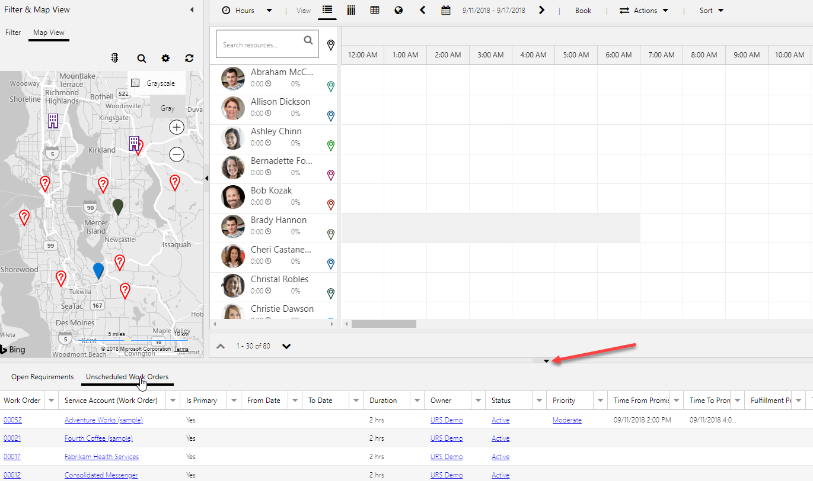
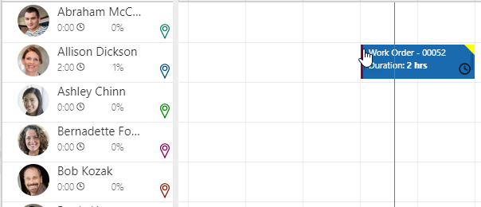
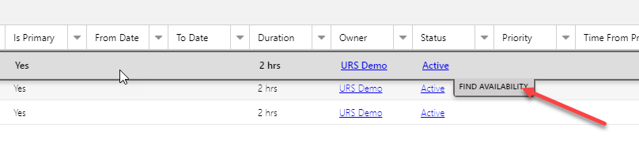
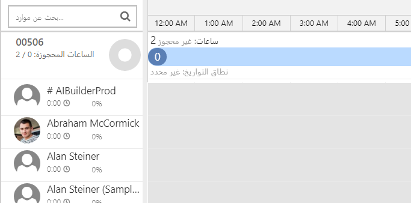
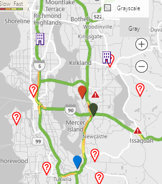

Microsoft Dynamics 365 Field Service يسمح لمؤسستك بخدمة عملائها والتكيف مع احتياجاتهم الخاصة. ولكن قبل أن تتمكن من استخدام Field Service، ستحتاج إلى تكوينها.

الغرض من هذه المشاركة العملية هو تعريفك بإنشاء أوامر العمل وجدولتها باستخدام Dynamics 365 Field Service.

## الأهداف التعليمية

في نهاية هذه التمارين، ستكون قادراً على:

-   إنشاء أوامر العمل

-   جدولة أوامر العمل

تعمل المعامل والتمارين في هذه الوحدة بشكل أفضل عندما تتوفر لديك البيانات النموذجية للعمل معها. بناءً على البيئة الخاصة بك، قد تحتاج إلى تثبيت مجموعة للمساعدة على التدريبات. يوفر Dynamics 365 القدرة على إضافة بيانات نموذجية حسب الحاجة. إذا لم يكن لديك مجموعة مثبتة على البيئة التي تعمل فيها، فاتبع الخطوات التالية.

تعمل المعامل والتمارين في هذه الوحدة بشكل أفضل عندما تتوفر لديك البيانات النموذجية للعمل معها. إذا لم تتضمن البيئة الخاصة بك عينه البيانات، راجع صفحة [نموذج تثبيت البيانات لتطبيق Field Service](/dynamics365/customer-engagement/field-service/install-sample-data-8-x).

## قم بإنشاء أمر عمل باستخدام نوع الحدث

يحتوي Dynamics 365 Field Service على كيان أمر العمل الذي تم تمكينه للاستخدام مع ميزة جدولة الموارد. في هذه المهمة، ستقوم بإنشاء أمر عمل جديد يمكنك جدولته باستخدام التطبيق.

1.  إذا لم تكن Dynamics 365 Field Service مفتوحة بالفعل، افتح التطبيق.

1.  باستخدام التنقل الموجود علي يمين الشاشة، حدد **أوامر العمل** ضمن مجموعه الجدولة.

1.  في شريط الأوامر، حدد **جديد** لإنشاء أمر عمل جديد.

1.  قم بتكوين أمر العمل على النحو التالي:

    -   **حساب الخدمة:** *Adventure Works (نموذج)*

    -   **نوع أمر العمل:** *‎تثبيت أو استبدال*

    -   **خاضع للضريبة:** *لا*

    -   **نوع الحدث الرئيسي:** *استبدال الجزء المقطوع*

1.  حدد علامة التبويب **إعدادات**، وقم بتكوين الإعدادات كما يلي:

    -   **الأولوية:** *متوسطة*

    -   **منطقة الخدمة:** *واشنطن*

    -   **وقت بدء التعهد:** *اليوم في 1:00 مساءً*

    -   **وقت انتهاء التعهد:** *اليوم في 3:00 مساءً*

1.  حدد الزر **حفظ وإغلاق** في أمر العمل.

> [!NOTE] 
> السبب في تحديد استبدال الجزء المقطوع لنوع الحدث لأنه يتم استخدام أنواع الحوادث في Field Service للمساعدة في تجميع البيانات مسبقاً عند إنشاء أمر عمل. تم إنشاء نوع حدث استبدال الجزء المقطوع مسبقاً وله العديد من مهام الخدمة والمنتجات والخدمات والخصائص المرتبطة به.

عند إنشاء أمر عمل يستخدم نوع الحدث استبدال الجزء المقطوع، تتم تعبئة هذه المعلومات تلقائياً في أمر العمل.

> [!Important]
> يقوم سير عمل Dynamics 365 بتعبئة هذه المعلومات لك عند حفظ السجل. قد تستغرق تعبئة هذه المعلومات عدة دقائق.

1.  قم بتحديد موقع أمر العمل وفتحه لـ **Adventure Works**.

1.  حدد علامة تبويب **المنتج**. (لاحظ أنه قد تمت إضافة العديد من المنتجات إلى أمر العمل. وهذه التي قمت بربطها مع نوع الحدث استبدال الجزء المقطوع المستخدم مع أمر العمل هذا.)

1.  حدد علامة التبويب **خدمات**. (لاحظ الخدمات التي تمت إضافتها.)

1.  حدد علامة تبويب **مهام الخدمة** (ستجد هنا المهام التي يجب على الفني تنفيذها عند العمل على أمر العمل.)

## جدولة أمر العمل باستخدام لوحة الجدولة

تقدم Field Service العديد من الأصناف التي يمكن استخدامها للمساعدة على جدولة الموارد لأصناف محددة. المكونان الأساسيان المستخدمان هما لوحة الجدولة ومساعد الجدولة. توفر لوحة الجدولة القدرة على جدولة العناصر يدوياً، ويقدم مساعد الجدولة اقتراحات حول الموارد بناءً على الموقع والمهارات والتوافر. في هذه المهمة، ستقوم بفحص كيفية استخدام لوحة الجدولة لجدولة الأصناف على مستوى عالٍ.

1.  باستخدام التنقل الموجود علي اليمين، حدد **لوحه الجدولة**.

1.  توفر لوحة الجدولة خيارات متعددة يمكن استخدامها لجدولة العناصر وأيضاً كعامل تصفية وطريقة عرض الخريطة.

1.  قم بتوسيع جزء **متطلبات الحجز** الموجود أسفل الشاشة.

    

1.  حدد **أوامر العمل غير المجدولة**.

1.  حدد الموقع وأمر العمل لـ **Adventure Works (نموذج)** التي قمت بإنشائها في مهمة سابقة، واسحبها إلى Allison Dickson في لوحة الجدولة. لاحظ ان النص سيظهر باللون الأحمر حتى تجد الوقت الذي يقع ضمن النافذة الزمنية المنتظرة.

1.  حرر زر الماوس وسيتم وضع العنصر على لوحة الجدولة.

    

1.  حدد موقع وحدد أمر العمل الخاص بـ **Fourth Coffee (نموذج)** ضمن **أوامر العمل غير المجدولة.** حدد **بحث عن التوافر**.

    

    -   سيقوم Dynamics 365 بتحليل المتطلبات لهذا الصنف وسيعمل في العناصر الأخرى مثل أي مهارات مطلوبة وأمر العمل ومواقع الموارد، وتوافر الموارد لإنشاء قائمة بالموارد المقترحة التي من شأنها أن تكون قادرة على العمل على هذا الصنف.

    

1.  عند تمرير مؤشر الماوس فوق الكتلة الزمنية المحددة لـ **Van Amundson**، سوف تظهر أيقونة **الدفتر**. حدد أيقونة **الدفتر** لجدولة الشاحنة لأمر العمل.

1.  حدد أيقونة **إنهاء البحث** للعودة إلى لوحة الجدولة.

## العمل مع عرض الخريطة

ومن الطرق الأخرى التي يمكن فيها جدولة الأصناف باستخدام طريقة عرض الخريطة على لوحة الجدولة. عند تحديد عرض الخريطة، سيتم ترميز الموارد بالألوان. ستظهر أية أصناف غير مجدولة على الخريطة بعلامة استفهام. يمكنك جدولة هذه العناصر عن طريق سحبها إلى المورد الذي تريد تعيينها إليه.

عند البدء في تعيين أصناف إلى الموارد، سيتغير الصنف إلى لون المورد المحدد. بالإضافة إلى ذلك، ستبدأ الخريطة في رسم مسار للمورد بناءً على موقع أوامر العمل المعينة لها.

يمكن إضافة عناصر إضافية مثل خرائط الطريق وحركة المرور على الخريطة للمساعدة في الجدولة.

1.  في لوحة الجدولة، حدد **عرض الخريطة**.

    

1.  لمشاهدة حركة المرور، حدد **عرض حركة المرور**.

1.  حدد موقع صنف غير مجدول على الخريطة. اسحب الصنف إلى فترة زمنية مفتوحة في جدول Allison Dickson مباشرةً قبل أمر العمل الذي قمت بجدولته لـ Allison مسبقاً.
