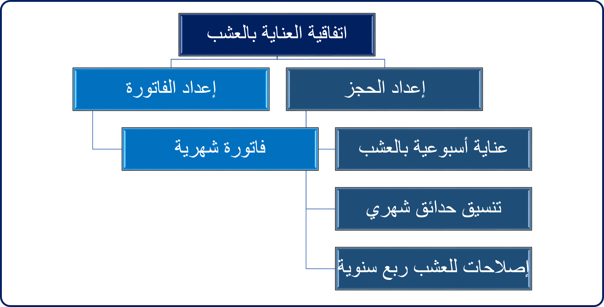
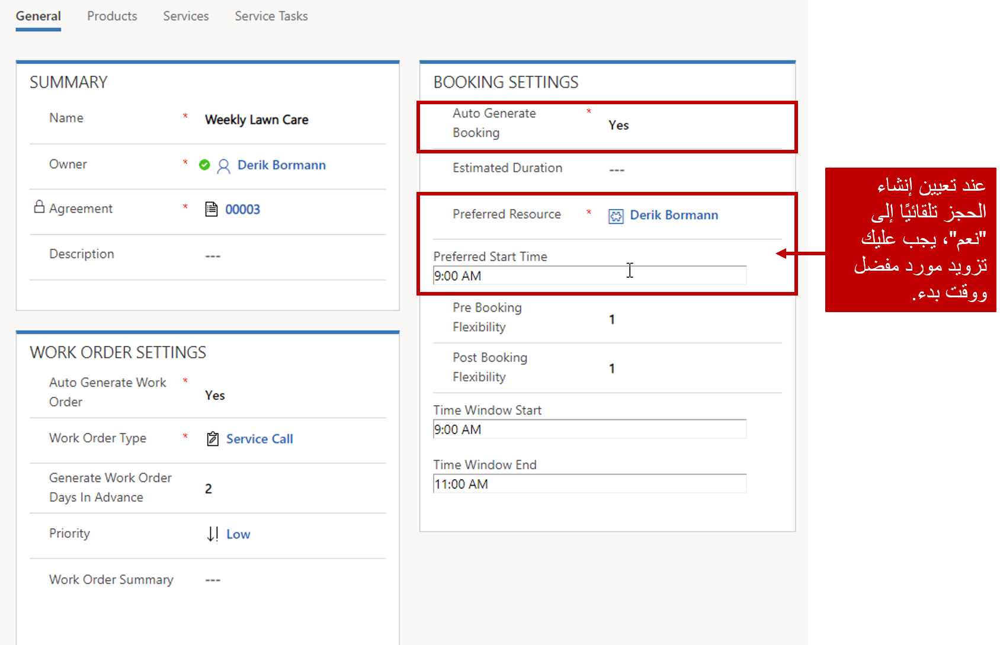
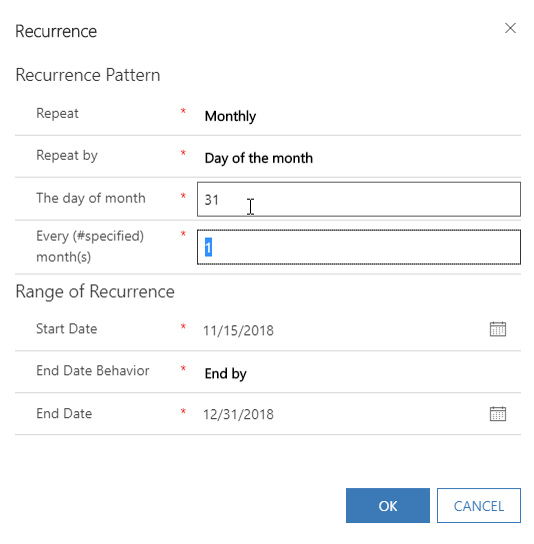

تدخل العديد من المؤسسات في اتفاقيات الصيانة مع عملائها. بشكل عام، تزود العملاء بخدمة مجدولة بانتظام على فترات زمنية محددة مسبقاً. على سبيل المثال، قد تقدم شركة تنسيق الحدائق خدمات على مدار العام لعملائها:

-   **الربيع، والصيف، والخريف**:

    -   توفير رعاية أسبوعية للحديقة مثل جز العشب وإزالة الأوراق والحطام.

    -   توفير المناظر الطبيعية الشهرية مثل تقليم التحوط وتقليم الأشجار.

    -   قدم علاجات العشب مرة كل ثلاثة أشهر، مثل رش الآفات والأعشاب الضارة.

-   **الشتاء**:

    -   تقديم خدمات إزالة الجليد حسب الحاجة.

قد تفرض شركة تنسيق الحدائق رسوماً ثابتة على عملائها مقابل جميع الخدمات التي تتم محاسبتها شهرياً. للتأكد من أنها تلبي توقعات عملائهم، قد ترغب في إنشاء أوامر العمل الخاصة بالعناصر المتكررة تلقائياً في وقت الخدمة. نظراً لأنها لا تستطيع معرفة موعد حدوث حدث ثلجي، فهي لا تزال تريد المرونة لإنشاء أوامر العمل هذه حسب الحاجة.

يسمح Dynamics 365 Field Service للمؤسسات بتسليم هذا النوع من الخدمات إلى عميلها من خلال ما يطلق عليه اتفاقيات. الاتفاقية في جوهرها هي إطار عمل لإنشاء أوامر العمل والفواتير تلقائياً على فترات زمنية محددة مسبقاً. يمكن أن تحتوي اتفاقية واحدة على العديد من إعدادات الحجز والفواتير المحددة والتي ستنشئ أوامر العمل والفواتير وفقاً لجدول زمني محدد.

تعد الاتفاقيات مفيدة عندما تحتاج إلى إنشاء أوامر عمل وحجوزات وفواتير وفقاً لجدول زمني يمكن التنبؤ به وقابل للتكرار مثل:

-   الفحص الشهري لمدة سنتين.

-   صيانة ربع سنوية لمدة عام.

-   فاتورة شهرية في اليوم الأول من الشهر للعام التالي.

الاتفاقات ليست حلاً مثالياً عندما يكون الجدول غير متسق مثل:

-   قم بجدولة كل ثلاثة أشهر، وقم بتخطي شهر، ثم تابع.

-   الفاتورة أحياناً مرة في الشهر، وأوقات أخرى كل شهرين.

-   أنت بحاجة إلى معلومات تتبع أكثر تفصيلاً حول الموارد والمعدات والأداة وما إلى ذلك.

الصورة أدناه توضح مثالاً:

## تحديد الاتفاقيات

يمكن تعريف الاتفاقيات في Field Service ضمن تقديم الخدمة. عندما يتم إنشاء اتفاقية، ستحتاج إلى تحديد ما يلي:

-   **حسابات الخدمة والفوترة**: مثل أوامر العمل، تحدد هذه الحسابات الحساب الذي سيتم توفير الخدمات له، والحساب المسؤول مالياً عن دفع الفاتورة.

-   **تاريخ البدء والانتهاء**: تحديد فترة الخدمة المرتبطة بالاتفاقية ومتى سيبدأ إنشاء الأصناف.

-   **حالة النظام**: تحديد حالة الاتفاقية. الاتفاقيات لها الحالات التالية المتاحة:

    -   **التقدير**: تحديد اتفاقية لم يتم تنفيذها حالياً. ستبدأ جميع الاتفاقيات في حالة تقدير. لا يتم إنشاء أوامر العمل عندما تكون الاتفاقية في حالة تقدير.

    -   **نشط**: تحديد الاتفاقية التي يتم تنفيذها حالياً وتقوم بإنشاء أوامر العمل بشكل نشط وفقاً للجدول المحدد.

    -   **منته الصلاحية**: تحديد وصول الاتفاقية إلى تاريخ انتهائها ولم يعد يتم إنشاء أوامر العمل.

    -   **تم الإلغاء**: الإشارة إلى أنه تم إلغاء الاتفاقية.

-   **الحالة الفرعية**: توفير معلومات إضافية حول حالة الاتفاقية. على سبيل المثال، يمكن إضافة حالة فرعية لانتظار توقيع العميل للاتفاقيات التي لها حالة تقدير.

-   **قائمه الأسعار**: تحديد قائمة الأسعار المرتبطة بالاتفاقية. ستستخدم أوامر العمل التي تم إنشاؤها من الاتفاقية قائمة الأسعار هذه.

    -   من المهم إضافة جميع المنتجات والخدمات التي سيتم استخدامها أثناء الاتفاقية إلى قائمة أسعار الاتفاقية. تحتوي الاتفاقيات عادةً على سعر متفاوض عليه للسلع والخدمات التي تنعكس عادةً في قائمة أسعار جديدة تماماً.

-   **منطقة الخدمة**: تحديد منطقة الخدمة المقترنة بالاتفاقية.

-   **خاضع للضريبة**: تحديد ما إذا كانت أوامر العمل التي تم إنشاؤها بواسطة هذه الاتفاقية خاضعة للضريبة.

## عمليات إعداد الحجز

بمجرد حفظ الاتفاقية لأول مرة، يمكنك إضافة إعدادات الحجز التي ستحدد كيف ومتى يتم إنشاء أوامر عمل محددة. في مثال تنسيق الحدائق، سيكون هناك ثلاثة إعدادات حجز محددة محددة لإنشاء أوامر عمل لكل من السيناريوهات المطلوبة. يتم تحديد إعدادات الحجز عن طريق تحديد **إضافة إعداد الحجز** على الشبكة الفرعية لإعداد الحجز في النموذج الخاص بالاتفاقية.

سيتعين عليك تحديد اسم لعملية الحجز. سيتم ملء الاسم كاسم أمر العمل لأوامر العمل التي تم إنشاؤها من الاتفاقية. بالإضافة إلى ذلك، يمكنك تحديد الإعدادات الخاصة بأمر العمل والحجوزات التي تم إنشاؤها بواسطة عنصر الإعداد هذا.

## إعدادات أوامر العمل

تتمثل إحدى المزايا الرئيسية لتحديد الاتفاقيات في القدرة على إنشاء أوامر العمل تلقائياً. يسمح لك قسم إعدادات أمر العمل بتحديد تفاصيل أوامر العمل التي تم إنشاؤها مثل ما يلي:

-   **إنشاء أمر العمل تلقائياً**: تحديد ما إذا كان يجب على إعداد الحجز إنشاء أمر عمل تلقائياً. 
    -   **إنشاء أيام أوامر العمل مقدماً**: تحديد عدد الأيام مقدماً لإنشاء أمر العمل. على سبيل المثال، إذا كان أمر العمل مطلوباً في اليوم الأول من الشهر، فقد ترغب في إنشاء أمر العمل قبل ثلاثة أيام للتأكد من أن المرسل يمكنه الحصول عليه في الجدول الزمني.

> [!IMPORTANT] 
> احرص على عدم تداخل أوامر العمل. على سبيل المثال، إذا كنت تنشئ أمر عمل أسبوعياً قبل 5 أيام، فمن المحتمل أن تتداخل مع أوامر العمل.

-   **نوع أمر العمل**: تحديد نوع أمر العمل الذي سيتم إنشاؤه.

## إعدادات الحجز

يسمح لك قسم إعدادات الحجز بإنشاء حجز وجدولته عند إنشاء أمر العمل. يعمل إنشاء الحجوزات تلقائياً بشكل جيد عندما يفضل العميل مورداً معيناً في نفس الوقت نسبياً. إذا لم تكن تقوم بجدولة نفس المورد لكل عنصر، فيجب عليك إما جدولة المرسل يدوياً أو استخدام تحسين جدولة الموارد.

-   **إنشاء تلقائي لعملية الحجز**: تحديد ما إذا كنت تريد أن يقوم الإعداد بإنشاء حجز وجدولته تلقائياً لأمر عمل.

-   **المدة المقدرة**: تحديد المدة التي يتوقع أن يتخذها الحجز.

-   **المورد المفضل**: تحديد المورد الذي يجب جدولته لهذا الحجز. هذا مطلوب إذا حددت إنشاء الحجز تلقائياً.

-   **وقت البدء المفضل**: تحديد الوقت المفضل الذي يجب جدولة هذا العنصر فيه. هذا مطلوب إذا حددت إنشاء الحجز تلقائياً.

-   **مرونة ما قبل وبعد الحجز**: السماح لك بتحديد عدد الأيام المقبولة قبل أو بعد التاريخ المستهدف.

-   **البدء والانتهاء لإطار الوقت**: السماح لك بتحديد إطار زمني يجب استهدافه في يوم جدولته.

## تحديد نمط التكرار

تأكد من تحديد الجدول الزمني لإعداد الحجز، وكيفية إنشاء العناصر المكونة. حدد **حجز التكرار** في شريط الأوامر، ثم حدد:

-   **نمط التكرار**: تحديد عدد المرات التي يجب أن يتم فيها تنفيذ العنصر. يمكنك تحديد يومي أو أسبوعي أو شهري أو سنوي. اعتماداً على ما تم تحديده، سيتم تقديم خيارات مختلفة.

-   **نطاق التكرار**: تحديد الإطار الزمني للنمط. يتم تعيينه افتراضياً إلى التواريخ المحددة في الاتفاقية، ولكن يمكن تعيينه إلى أي نطاق تفضله.

تُظهر الصورة أدناه مثالاً على نمط التكرار الشهري.

> [!Note] 
> بالنسبة للأشهر التي تقل عن 31 يوماً، سيتم تشغيله تلقائياً في اليوم الأخير من ذلك الشهر.

## إضافة الحوادث

مثل أوامر العمل الأخرى في النظام، من المحتمل أن تشتمل العناصر التي تم إنشاؤها بواسطة الاتفاقيات على حوادث مرتبطة بها ستعمل على تعبئة منتجات وخدمات ومهام أوامر العمل مسبقاً. يمكنك إضافة حوادث متعددة إلى اتفاقية. ستكون الإضافات مزيجاً من جميع العناصر المحددة. يمكن إضافة الحوادث من الشبكة الفرعية للحوادث في الاتفاقية.

## تحديد الفواتير

تعد إضافة الفواتير إلى اتفاقية مشابهة جداً لتحديد إعدادات الحجز. الاختلاف الأساسي هو أنك تحدد المنتجات المحددة التي تريد تضمينها في الفاتورة. يعد إنشاء الفواتير باستخدام الاتفاقيات أمراً مثالياً عندما تريد إصدار فاتورة لنفس العنصر وفقاً لجدول زمني محدد مسبقاً. يمكنك إعداد الفواتير باستخدام الشبكة الفرعية "إعداد الفاتورة". تتطلب كل فاتورة اسماً.

بعد حفظ الفاتورة، ستحدد المنتجات المراد تضمينها فيها. أضف منتجات الفاتورة في علامة التبويب منتجات الفاتورة. عند تحديد منتجات الفاتورة، يمكنك تحديد ما يلي:

-   **عام**
    -   **المنتج**: تحديد منتج من الكتالوج الذي تريد تضمينه في الفاتورة.

> [!IMPORTANT]
> يمكن إنشاء منتجات فواتير فقط للمنتجات التي لها نوع *المخزون* أو *غير المخزون*.

    -   **الوحدة**: تحديد الوحدة التي سيتم استخدامها لتسعير المنتج.
    -   **قائمة الأسعار**: تحديد قائمة الأسعار التي سيتم استخدامها للمنتج. وبشكل افتراضي، سيستخدم قائمة أسعار الاتفاقية.

-   **الكمية ومبلغ المبيعات**:
    -   **الكمية**: تحديد عدد الأصناف لكل منتج مطلوب تضمينه.
    -   **مبلغ الوحدة**: تحديد السعر لكل وحدة.

بمجرد تحديد جميع منتجات الفاتورة، يمكنك تحديد نمط التكرار للفاتورة تماماً كما فعلت في إعداد الحجز.

## تنشيط الاتفاقية

بمجرد تحديد جميع الفواتير وإعدادات الحجز اللازمة، ستقوم بتغيير حالة النظام لتنشيط الاتفاقية. بمجرد الوصول إلى تاريخ بدء الاتفاقية، سيبدأ في إنشاء العناصر المحددة باستخدام المحدد المجدول لكل منها.

لمزيد من المعلومات حول التعامل مع الاتفاقيات، يرجى الرجوع إلى هذا الفيديو:

> [!VIDEO https://www.microsoft.com/videoplayer/embed/RE2KjKv]
