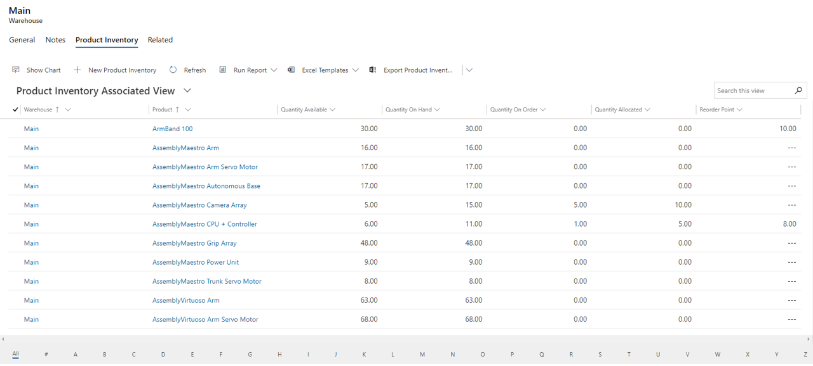
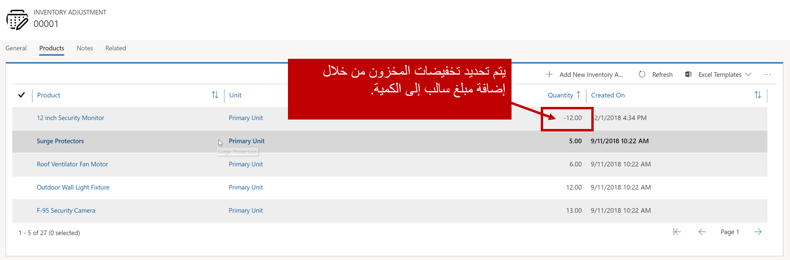
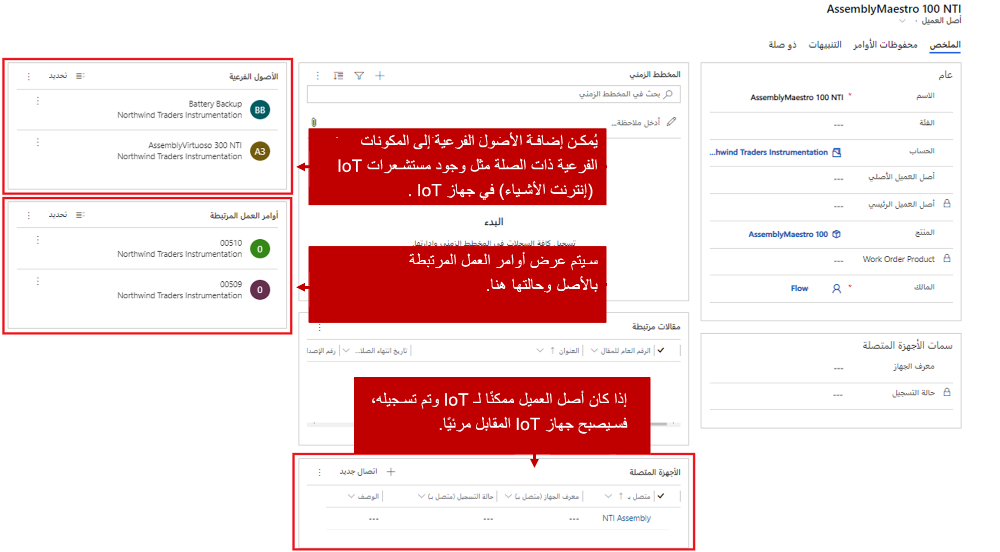

تعد إدارة وفهم مستويات المخزون أمراً مهماً عند استخدام Microsoft Dynamics 365 Field Service. أن تكون قادراً على فهم ما لديك حالياً، عند الطلب، وملتزم بالوظائف، يساعد مؤسستك على التخطيط بشكل أفضل والتأكد من أن المندوبين الميدانيين لديهم الإمدادات التي يحتاجون إليها.

## التعامل مع المستودعات

يستخدم Dynamics 365 المستودعات لإدارة ما هو متوفر لديهم للتأكد من أن المندوبين الميدانيين لديهم ما يحتاجون إليه. يمثل *المستودع* مكاناً يتم فيه تخزين المخزون. يعتقد معظم الأشخاص أن المستودعات هي مباني تحتفظ فيها المؤسسات بالمخزون قبل أن تصبح جاهزة للاستهلاك، ولكن يمكن أن تمثل المستودعات أيضاً عناصر مثل الشاحنات.

على سبيل المثال، لنفترض أنك تعمل في شركة تدفئة وتكييف. لديك العديد من الوكلاء الميدانيين الذين يتم إرسالهم بانتظام لتثبيت معدات العملاء وخدمة المنتجات الحالية. قد يكون لمؤسستك مستودع مركزي يحتوي على جميع المعدات الجديدة قبل تثبيتها، وأجزاء لخدمة المعدات الموجودة. يأخذ John، أحد وكلائك الميدانيين الحاليين، بانتظام شاحنة الخدمة رقم 1 في مكالماته. من خلال تعريف شاحنة الخدمة 1 كمستودع، يمكن نقل المخزون الذي يحتاجه John لإكمال مكالمات الخدمة اليومية من المستودع المركزي إلى شاحنة الخدمة 1.

من خلال تحديد المستودعات بهذه الطريقة، تعرف مؤسستك دائماً مكان وجود كل شيء. تُعد إدارة مستويات المخزون وفهمها أمراً مهماً عند استخدام Field Service. أن تكون قادراً على فهم ما لديك في متناول اليد وعند الطلب وما هو ملتزم حالياً بالوظائف، يساعد المؤسسات على التخطيط بشكل أفضل والتأكد من أن المندوبين الميدانيين لديهم ما يحتاجون إليه لوظائف محددة عند ظهورها.

يمكنك تحديد المستودعات في تطبيق Field Service بتحديد علامة الحذف (...) وتحديد **إعدادات Field Service**. توجد المستودعات ضمن إعدادات **المخزون والشراء**. تحتاج فقط إلى توفير اسم للمستودع.

لمزيد من التفاصيل حول المستودعات، راجع [إنشاء مستودع لتتبع المخزون (Field Service)](/dynamics365/customer-engagement/field-service/create-warehouse).

## التعامل مع مخزون المنتجات

يمكنك مراقبة مستويات المخزون لمستودعات محددة من داخل سجل المستودع. لمراجعة مستويات المخزون، حدد علامة التبويب **ذات الصلة**، ثم حدد **مخزون المنتج**. ستعرض شبكة مخزون المنتجات جميع العناصر المرتبطة بهذا المستودع. ستعرض كل بند من بنود المخزون:

-   اسم كل منتج مخزن في المستودع.

-   كمية المنتج المتوفرة.

-   كمية المنتج المتاحة.

-   كمية المنتج في الأمر.

-   المقدار الحالي للمنتج الذي تم تخصيصه لعناصر مثل أوامر العمل.

-   نقطة إعادة الطلب لكل منتج.

يمكن إضافة منتجات أخرى يدوياً عن طريق استيرادها، أو من خلال التكامل مع أنظمة تخطيط موارد المؤسسات الخارجية.

لمزيد من العرض حول مخزون المنتجات، راجع [عرض مخزون المنتجات في أحد المستودعات (Field Service)](/dynamics365/customer-engagement/field-service/view-product-inventory).

## تعديلات وعمليات نقل المخزون

يمكن أن تؤثر عناصر مثل أوامر الشراء على مستويات المخزون عند استلام الأصناف، حيث يمكنك اختيار استلام هذه العناصر في مستودعات محددة. بالإضافة إلى ذلك، يمكن تعديل مستويات المخزون للمستودع بطريقتين.

-   **تعديلات المخزون**: إضافة أو طرح المخزون من أو إلى المستودع.

-   **عمليات نقل المخزون**: تغيير موقع المستودع الخاص بمخزون المنتجات.

تسمح *تسوية المخزون* لمديري المخزون بتسوية كمية المنتجات في مستودع معين. يمكنك استخدام تعديلات المخزون عند إحضار مستودع جديد وتحتاج إلى ملء المخزون، أو عند الحاجة إلى تعديل يدوي لسبب محدد.

تتوفر تعديلات المخزون في Field Service ضمن **المخزون والشراء**. عند إنشاء سجل تعديل، تحتاج إلى تحديد المستودع الذي سيتم تطبيقه عليه.

يمكن أن يحتوي سجل تعديل واحد على عدة تعديلات فردية للمنتج. على سبيل المثال، إذا كنت تقوم بتعيين المستويات الأولية لمستودع جديد، فسيتم إنشاء منتج تعديل يحدد المنتج والكمية الأولية لكل منهما. يحتوي سجل منتج التعديل على المعلومات التالية:

-   **المنتج**: المنتج الذي تتم تسويته.

-   **الوحدة**: وحدة القياس التي يمكن بيع المنتج بها.

-   **الكمية**: كمية المنتج الذي تريد إضافته أو إزالته من المستودع. تتم الإشارة إلى الكميات السالبة بإدخال قيمة سالبة.

لمزيد من المعلومات حول إنشاء تسويات المخزون، راجع [إضافة أو طرح المخزون من أحد المستودعات (Field Service)](/dynamics365/customer-engagement/field-service/create-inventory-adjustment).

يتم *نقل المخزون* عندما تقوم بنقل كمية معينة من المنتج من مستودع إلى آخر. مثلاً، إذا كان لدى John أربعة أوامر عمل تتطلب نوعاً معيناً من الضاغط وكان لديه اثنين فقط في شاحنته، فيمكن تحميل ضاغطين على شاحنة John من المستودع المركزي. سيتم إنشاء سجل تحويل المخزون للإشارة إلى الحركة.

تتوفر عمليات نقل المخزون في Field Service ضمن **المخزون والشراء**. عند إنشاء سجل نقل، تحتاج إلى تحديد كل من المستودع الذي يتم أخذ المخزون منه والمستودع الذي يتم إرساله إليه.

مثل عمليات التسوية، يمكن أن يحتوي سجل النقل الفردي على عمليات نقل متعددة للمنتج. على سبيل المثال، بالإضافة إلى الضاغطين اللذين يحتاجهما جون، فقد يحتاج إلى ثلاثة مفاتيح تنظيم. سيحدد سجل النقل كلاً من منتجات الضاغط والمنظم كعناصر بنود فردية. يحتوي سجل النقل على نفس المعلومات الخاصة بالتسوية.

-   **المنتج**: المنتج الذي تتم تسويته.

-   **الوحدة**: وحدة القياس التي يمكن بيع المنتج بها.

-   **الكمية**: كمية المنتج الذي تريد إضافته أو إزالته من المستودع. تتم الإشارة إلى الكميات السالبة بإدخال قيمة سالبة.

لمزيد من المعلومات حول عمليات نقل المخزون، راجع [تغيير موقع مستودع المخزون (Field Service)](/dynamics365/customer-engagement/field-service/create-inventory-transfer).

## أصول العملاء

تتيح لك أصول العميل تعقب المعدات التي تكون مسؤولاً عن فحصها وصيانتها وإصلاحها. في أبسط صورها، تشير أصول العملاء إلى المنتجات الموجودة في كل موقع من مواقع العميل. ولكن يمكنهم أيضا تعقب سجل الخدمة لكافة أوامر العمل السابقة والحالية لكل أصل. وإذا كنت تستخدم Connected Field Service، فيمكنك توصيل أصول العملاء بأجهزة الاستشعار التي تراقب سلامة الأصول وتشغيل تنبيهات IoT وأوامر العمل حسب الحاجة.  باستخدام أصول العملاء، يمكنك:

-   تسجيل معلومات محددة حول أحد الأصناف.

-   إنشاء سجل تاريخي لجميع أوامر العمل المرتبطة بأحد الأصناف.

في كثير من الأحيان، يبدأ أصل العميل كمنتج يتم تخزينه في أحد المستودعات. بعد تسليم المنتج للعميل، يمكن تحويله تلقائياً إلى أصل. يمكن تحديد القدرة على تحويل المنتج تلقائياً إلى أصل عميل في سجل المنتج عند إنشائه.

بعد إنشاء أصول العميل، يمكنك تعقب الإصلاحات وعمليات الفحص والاختبارات وبيانات IoT والمشكلات لإنشاء سجل خدمة. يعد فهم سجل الخدمة أمراً مهماً لاتخاذ قرارات إصلاح أفضل، والحفاظ على عمر الأصول ووقت التشغيل، وفي النهاية إرضاء العملاء. 

هناك بعض الطرق لإنشاء سجل خدمة، بما في ذلك:

-   **إضافة الملاحظات باستخدام الجدول الزمني**: إضافة ملاحظة إلى الجدول الزمني للأصول الخاصة بالعميل.  على سبيل المثال، من خلال Field Service Mobile، يمكن للفني الميداني الانتقال إلى سجل أصول العميل وإضافة ملاحظة.

-   **أوامر العمل**: عند إنشاء أمر عمل، يمكنك إقرانه بأصل العميل. يتم إجراء ذلك عادةً عن طريق إقران إضافة أصل العميل إلى نوع الحدث. سيتم تحديد الأصل تلقائياً في أمر العمل. ستكون جميع أوامر العمل المقترنة مرئية في سجل أصول العميل.

-   **‏‫العمل مع الاتفاقيات**: عند تحديد اتفاقية، يمكنك تحديد أصل العميل الذي تقترن به الاتفاقية.  

لمزيد من المعلومات حول إنشاء سجل الخدمة، راجع [إنشاء سجل الخدمة](/dynamics365/field-service/configure-set-up-customer-assets?azure-portal=true#build-service-history).

Microsoft Dynamics 365 Connected Field Service يستخدم أصول العميل لتمثيل أجهزة IoT في موقع العميل. تم تسجيل هذه الأجهزة مع مركز IoT ويمكن الوصول إليها مباشرة من Dynamics 365.

لمزيد من التفاصيل حول أصول العملاء، راجع [تكوين أصول العملاء وإعدادها للاحتفاظ بقائمة بالأصناف القابلة للخدمة (Field Service)](/dynamics365/customer-engagement/field-service/configure-set-up-customer-assets).

لمزيد من المعلومات حول استخدام Connected Field Service لمراقبة المعدات وصيانتها، راجع [مراقبة وصيانة معدات العملاء عن بُعد باستخدام Connected Field Service for Dynamics 365 وAzure IoT](/learn/modules/remotely-monitor-and-service-customer-equipment/).

