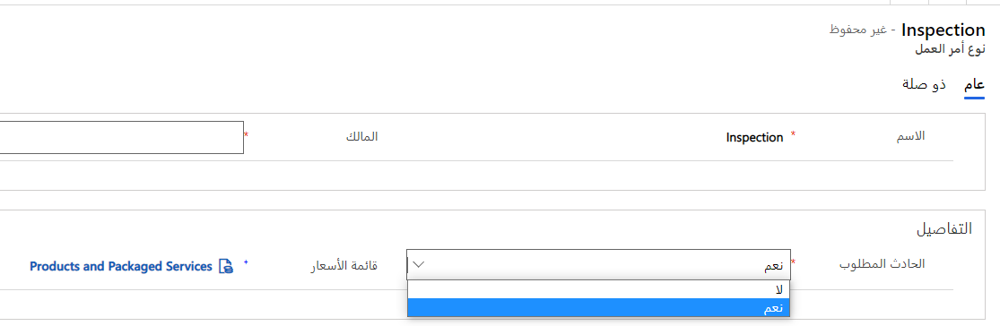

عند إنشاء نوع حدث، يمكنك تحديد المعلومات التالية:

- **نوع أمر العمل الافتراضي:** - يحدد نوع أمر العمل الذي سيتم تنفيذه.

- **المنتجات** - تحديد المنتجات التي قد يحتاجها المورد الذي يعمل على أمر العمل.

- **الخدمات**: تحدد كل خدمة سيتم إجراؤها كجزء من أمر العمل.

- **مهام الخدمة** - توفير قائمة المهام للمورد.
  حدد كل مهمة سيتم تنفيذها (بما في ذلك مده المهمة).

- **الخصائص** - تحديد أي مهارات أو شهادات سيطلبها المورد للعمل على هذا النوع من العناصر.

- **الحلول** - تحديد الطرق الشائعة لحل أوامر العمل.

## نوع أمر العمل

يساعدك نوع أمر العمل في Dynamics 365 Field Service تصنيف أنواع مختلفة من أوامر العمل وإنشاؤها، مثل الفحص أو الإصلاح أو الصيانة.

بينما تحدد أنواع أمر العمل الفئة العامة لأمر العمل، تحدد أنواع الحوادث الطلب المحدد لأمر العمل وتقوم بإضافة مزيد من التفاصيل إلى نوع أمر العمل بشكل فعال.

يكون نوع أمر العمل مطلوباً عند إنشاء أمر عمل، ولكن نوع الحدث ليس حقلاً مطلوباً في أمر العمل. يمكنك تغيير هذا السلوك بتعيين **الحدث المطلوب** إلى **نعم** في نموذج **نوع أمر العمل**، كما هو موضح في لقطة الشاشة التالية.

> [!div class="mx-imgBorder"]
> 

لتحديد أنواع أوامر العمل، انتقل إلى **الإعدادات > أوامر العمل > أنواع أوامر العمل**.

عند تحديد نوع أمر العمل مع تعيين خيار **الحدث المطلوب** إلى **نعم**، يتم تعيين حقل **نوع الحدث الأساسي** في نموذج أمر العمل تلقائياً على النحو المطلوب، كما هو موضح في لقطة الشاشة التالية.

> [!div class="mx-imgBorder"]
> 

يمكنك تحديد قائمة أسعار افتراضية في نوع أمر العمل. عند تحديد نوع حدث لأمر العمل، ستتم إضافة نوع أمر العمل المرتبط إلى أمر العمل وسيقوم نوع أمر العمل بعد ذلك بإضافة قائمة الأسعار إلى أمر العمل. يساعدك هذا الأسلوب على توفير الوقت مع تجميع البيانات التلقائي.

## المنتجات والخدمات

قبل تحديد نوع الحدث، يجب تحديد المنتجات والخدمات التي ستتم إضافتها إلى أمر العمل.

- **المنتجات** - تمثل الأصناف التي قد يستخدمها الفني الميداني أثناء إكمال أمر العمل الذي قد يتم إصدار فاتورة به إلى العميل.
  يتم قياس المنتجات بوحدة القياس المحددة على المنتج. يمكن أن تكون المنتجات أحد الأنواع التالية:

  - **المخزون** - الأصناف الفعلية التي يتم تعقبها في المخزون.

  - **غير المخزون** - الأصناف غير القابلة للاستهلاك التي لم يتم تعقبها في المخزون، مثل طول الكابل من بكرة.

- **الخدمات** - تمثل العمل الذي يؤديه الفني الميداني وقد يقوم بإصدار فواتير للعميل. يتم قياس الخدمات في المدة الزمنية.

> [!div class="mx-imgBorder"]
> 

إذا لم تقم بتعيين خيار **نوع منتج الخدمة الميدانية** على سجل المنتج، فلن تتمكن من إضافة المنتج أو الخدمة إلى نوع الحدث.

## مهام الخدمة

تمثل مهام الخدمة المهام المحددة التي يجب إكمالها في أمر العمل. غالباً ما يتم استخدامها كقوائم مهام أو قوائم فحص خاصة بالفنيين للتأكد من أنهم يقومون بإكمال كل ما ينبغي إنجازه أثناء إجراء العمل في وظيفة معينة.

يمكن إضافة مهام الخدمة يدوياً إلى أمر العمل، أو يمكن تعبئتها تلقائياً عن طريق إرفاقها بنوع الحدث. عند إضافة نوع حدث يحتوي على مهمة الخدمة إلى أمر عمل، سيتم إضافة مهمة الخدمة تلقائياً إلى أمر العمل.  

### أنواع مهمة الخدمة

في Dynamics 365 Field Service، يمكنك استخدام أنواع مهام الخدمة لتحديد أنواع مهام الخدمة التي ستقوم بتضمينها في أنواع الحوادث وأوامر العمل. يمكنك تعيين مدة لأنواع مهام الخدمة التي تصل إلى مدة نوع الحدث ومدة أمر العمل.

يمكنك إنشاء أنواع مهام الخدمة في تطبيق Field Service. لتحديد أنواع مهام الخدمة، انتقل إلى **الإعدادات > أوامر العمل > ‏‫أنواع مهمة الخدمة**.

عند إنشاء نوع مهمة خدمة، سيتضمن المعلومات التالية:

- **الاسم** - يحدد اسم المهمة.

- **المدة المقدرة** - تحدد مقدار الوقت المقدر الذي تستغرقه المهمة بشكل عام.

- **الوصف** - يوفر تفاصيل إضافية حول المهمة.

> [!div class="mx-imgBorder"]
> 

وبمجرد إنشاء أنواع مهام الخدمة، يمكن الرجوع إليها من خلال العديد من الحوادث وأوامر العمل. على سبيل المثال، إذا كان كل أمر عمل يتطلب من الفني جمع توقيع العملاء، فيمكنك تحديد نوع مهمة خدمة **جمع توقيع العملاء** مرة واحدة، وإضافته عند الحاجة.

## الخصائص

الخصائص هي المهارات التي تمتلكها الموارد. على سبيل المثال، يمكنك استخدام الخصائص للإشارة إلى أن هناك حاجة إلى ترخيص أو شهادة لأنواع معينة من العمل. بعد تحديد أمر العمل، يمكنك تحديد الخصائص المطلوبة لإجراء أمر العمل. تتطابق أدوات الجدولة في Field Service مع الخصائص المطلوبة في أمر العمل مع الموارد التي لها نفس الخصائص.

يمكنك إضافة الخصائص إلى نوع الحدث بحيث يتم إضافة الخصائص إلى أمر العمل تلقائياً عند إضافة نوع الحدث إلى أمر العمل.

## الحلول

يجب أن تكون المؤسسات قادرة عل الإبلاغ عن كيفية حل أوامر العمل.
يؤدي الإعلام عن كيفية حل العمل إلى زيادة رؤية العملاء وتوفير البيانات للنظام للبدء في تقديم اقتراحات حلول هادفة.

يمكنك تعيين الحلول في أمر العمل أو اقرانها بأنواع الحوادث. يمكن لأحد الفنيين أن يقوم بوضع علامة على حل واحد أو أكثر في أمر العمل.

يمكنك إنشاء الحلول في تطبيق Field Service. لتحديد الحلول، انتقل إلى **الإعدادات> أوامر العمل > الحلول**.

> [!div class="mx-imgBorder"]
> 
