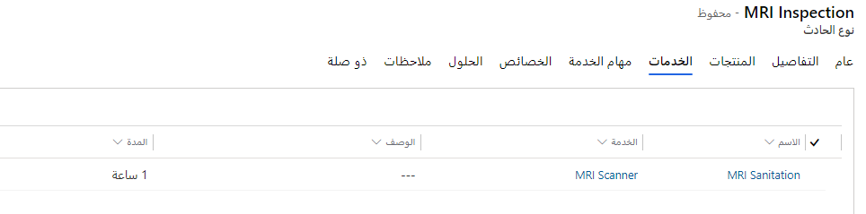
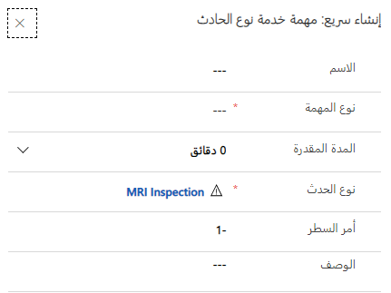

تضمن أنواع الحوادث أن جميع الفنيين الميدانيين يقومون بنفس الإجراءات لحل أوامر العمل. علاوة على ذلك، إذا تم اكتشاف إجراءات أفضل، فسيتم تحديث نوع الحدث وتنفيذه عبر المؤسسة بأكملها.

يمكنك إنشاء حدث جديد، أو يمكنك إنشاء حدث من أمر عمل حالي.

## إنشاء أحد أنواع الحوادث

يمكن للمؤسسات تحديد أنواع الحوادث اللازمة في تطبيق Field Service. لتحديد أنواع الحوادث، انتقل إلى **الإعدادات > أوامر العمل > أنواع الحوادث**.

بعد اكتمال إنشاء أحد أنواع الحوادث، سيتضمن المعلومات التالية في علامة التبويب **عام**:

- **الاسم** - يحدد اسم نوع الحدث.

- **الوصف** - يوفر تفاصيل إضافية حول نوع الحدث.

> [!div class="mx-imgBorder"]
> 

تحتوي علامة التبويب **التفاصيل** على المعلومات التالية:

- **نوع أمر العمل الافتراضي** - سيقوم نوع أمر العمل الذي تحدده في هذا الحقل بملء الحقل **نوع أمر العمل** في أمر العمل عندما يتم تحديد نوع الحدث هذا باعتباره نوع الحدث الأساسي. ستتم الكتابة فوق أنواع أوامر العمل التي تم إدخالها مسبقاً.

- **المدة المقدّرة** - تحدد مقدار الوقت المقدّر الذي يستغرقه نوع الحدث عادةً. يمكنك إدخال هذه المعلومات يدوياً أو سيتم احتسابها من مهام نوع الخدمة التي تمت إضافتها إلى "نوع الحدث".

> [!div class="mx-imgBorder"]
> 

ستملأ المدة المقدّرة مدة أمر العمل إذا تم تحديد نوع الحدث باعتباره نوع الحدث الأساسي لأمر العمل.

## منتجات نوع الحدث

عن طريق إنشاء أحد سجلات المنتجات لنوع الحدث، يمكنك إضافة منتجات إلى "نوع الحدث". لإضافة منتج نوع الحدث، حدد علامة التبويب **المنتج** ثم حدد **+ منتج نوع الحدث الجديد**.

> [!div class="mx-imgBorder"]
> 

حدد الخيارات في الحقول **المنتج** و **الوحدة** و **الكمية** ثم حدد **حفظ وإغلاق**.

> [!NOTE]
> يمكن فقط إضافة المنتجات ذات النوع خدمة ميدانية من **المخزون** أو **غير المخزون** كمنتجات.

يمكن تجاوز الكمية يدوياً في منشئ أمر العمل.

> [!div class="mx-imgBorder"]
> 

## خدمات نوع الحدث

عن طريق إنشاء أحد سجلات الخدمات لنوع الحدث، يمكنك إضافة خدمات إلى "نوع الحدث". لإضافة مهمة خدمة نوع الحدث، حدد علامة التبويب **الخدمات** ثم حدد **+ خدمة نوع حدث جديدة**.

يتمثل الاختلاف الوحيد بين منتجات نوع الحدث وخدماته في أنه بدلاً من الحقل **الكمية**، يحتوي على الحقل **المدة** ليمثل وقت الخدمة لأن أي خدمة تمثل العمالة وليس عنصراً فعلياً.

> [!NOTE]
> يمكن فقط إضافة العناصر ذات النوع خدمة ميدانية ضمن **الخدمة** كخدمات.

> [!div class="mx-imgBorder"]
> 

## مهام خدمات نوع الحدث

عن طريق إنشاء أحد سجلات مهام الخدمة لنوع الحدث، يمكنك إضافة مهام الخدمة إلى "نوع الحدث". لإضافة مهمة خدمة نوع الحدث، حدد علامة تبويب **مهام الخدمة** ثم حدد **+ مهمة خدمة نوع حدث جديد**.

> [!div class="mx-imgBorder"]
> 

حدد **نوع مهمة الخدمة**. سيتم ملء نوع المهمة في الحقل **المدة المقدرة**، إذا كان هذا النوع الذي تحدده له مدة. إذا لزم الأمر، يمكنك ضبط المدة لهذا النوع المحدد من الحوادث.

بعد الانتهاء من مهمتك، سيتم نسخ المعلومات من الحقل **الوصف** إلى مهمة خدمة نوع الحدث. حدد **حفظ وإغلاق**.

يمكنك استخدام الحقل **سطر الأمر** لفرز مهام الخدمة بحسب نوع الحدث وأي أمر عمل تمت إضافة "نوع الحدث" إليه. سيتحول الحقل **سطر الأمر** افتراضياً إلى *-1* وسيتم تعيينه تلقائياً عند الحفظ إلى الرقم التسلسلي التالي.
يمكنك تعيين "سطر الأمر" يدوياً.

بعد الحفظ، يمكنك تحرير الحقل **سطر الأمر** بحسب الحاجة لتغيير ترتيب مهام الخدمة، حيث يمثل *1* مهمة الخدمة التي ستظهر أولاً.

> [!div class="mx-imgBorder"]
> 

### المدة

يتم تجميع إجمالي الوقت لجميع مهام الخدمة إلى "نوع الحدث" وسيتم ملء الحقل **المدة المقدرة** في "أمر العمل".

> [!IMPORTANT]
> تمثل أنواع الحوادث الطريقة الوحيدة المبتكرة لتطبيق مدة على "أمر العمل".

## خصائص نوع الحدث

عن طريق إنشاء أحد سجلات الخصائص لنوع الحدث، يمكنك إضافة خصائص إلى "نوع الحدث". لإضافة إحدى خصائص نوع الحدث، حدد علامة التبويب **الخصائص** ثم حدد **+ خاصية نوع حدث جديدة**.

> [!div class="mx-imgBorder"]
> 

حدد إحدى الخصائص وبشكل اختياري، حدد تصنيفاً. حدد **حفظ وإغلاق**.

## إقران الحلول بأنواع الحوادث

يمكنك إقران الحلول بأحد أنواع الحوادث عن طريق إنشاء سجل حلول لنوع الحدث. لإضافة أحد حلول نوع الحدث، حدد علامة التبويب **الحلول** ثم حدد **+ حل نوع حدث جديد**.

حدد أحد الحلول ثم حدد **حفظ وإغلاق**.

> [!div class="mx-imgBorder"]
> 

يمكنك بدء استخدام نوع الحدث في أوامر العمل، بعد أن تُكمل ملء جميع العناصر في نوع الحدث.

## إنشاء أنواع الحدث من أحد أوامر العمل

من بين الطرق السريعة لإنشاء نوع حدث إنشاء نوع الحدث من أمر عمل حالي تم ملؤه.

حدد الزر **إنشاء نوع الحدث** في شريط الأوامر في أحد أوامر العمل لفتح مربع الحوار **إنشاء نوع الحدث من أمر العمل**، على النحو الموضّح في لقطة الشاشة التالية.

> [!div class="mx-imgBorder"]
> 

سيتم ملء المعلومات التالية:

- **الوصف** - يتم نسخه من الحقل **ملخص أمر العمل**.

- **نوع أمر العمل** - يتم نسخه من نوع أمر العمل.

- **المدة المقدّرة** - يتم نسخها من مدة مهام الخدمة المكتملة.

يتم تمكين التبديل بين الحقول **نسخ المهام** و **نسخ المنتجات** و **نسخ الخدمات** و **نسخ الخصائص** و **نسخ المقالات** بشكل تلقائي. قم بإيقاف تشغيل التبديل، إذا أظهرت السجلات أنك لا تريد نسخها من "أمر العمل".

تأكد من إدخال اسم لنوع الحدث. سيؤدي تحديد **إنشاء نوع الحدث** إلى إنشاء نوع الحدث مع ملء جميع المعلومات المحددة.
