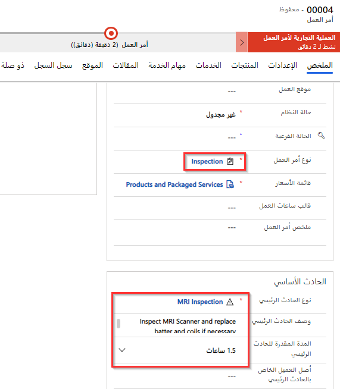
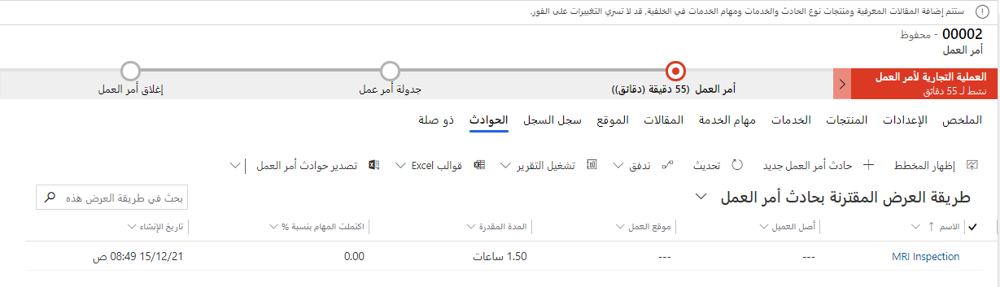
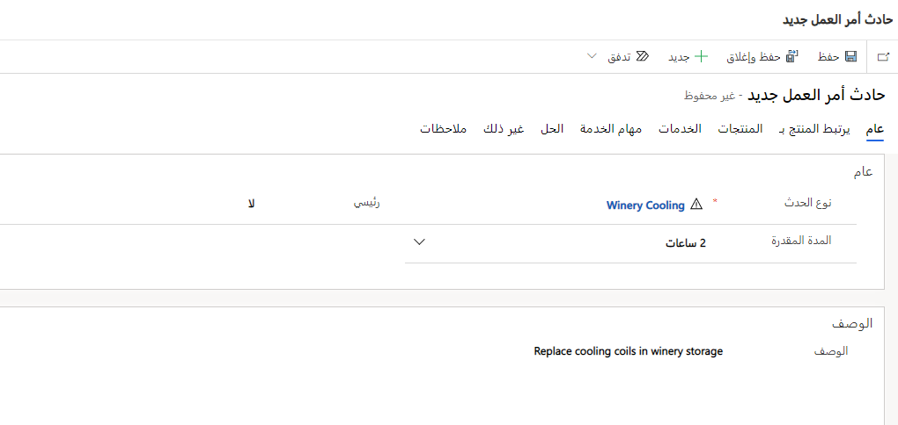

يمكنك استخدام نوع الحدث عن طريق إضافته إلى أمر عمل. من المنتجات والخدمات ومهام الخدمة والخصائص في نوع الحادث، سيقوم النظام بإنشاء منتجات وخدمات ومهام الخدمة والخصائص الخاصة بأمر العمل.

## إضافة نوع الحدث إلى أمر العمل

في البحث **نوع الحدث الرئيسي**، سيؤدي تحديد نوع الحادث إلى ملء الحقول التالية:

- نوع أمر العمل

- وصف الحادث الرئيسي

- المدة المقدرة للحادث الرئيسي

> [!div class="mx-imgBorder"]
> 

> [!NOTE]
> سيتم أيضاً ملء قائمة الأسعار في أمر العمل، إذا كانت قائمة الأسعار مرتبطة بنوع أمر العمل.

بعد قيامك بحفظ أمر العمل، سيتم إنشاء سجل حادث أمر العمل.

> [!div class="mx-imgBorder"]
> 

بعد ذلك بوقت قصير، ستتم إضافة منتجات وخدمات ومهام الخدمة والخصائص ذات الصلة بأمر العمل إلى أمر العمل.

> [!NOTE]
> لا يؤثر تغيير نوع الحدث على أوامر العمل الموجودة حيث تم بالفعل تطبيق نوع الحدث.

## أضف أنواع حوادث متعددة إلى أمر عمل

يمكن أن يكون لأمر العمل عدة حوادث. لإضافة نوع حادث آخر، حدد **ذي صلة > حوادث** ثم حدد **+ حادث أمر عمل جديد**.

> [!div class="mx-imgBorder"]
> 

ستؤدي إضافة حادثة أخرى إلى أمر عمل إلى إضافة مهام الخدمة والمنتجات والخدمات والخصائص إلى أمر العمل. ستكون مدة أمر العمل هي إجمالي كل مُدد الحوادث.

## اقتراحات نوع الحادث

يحتوي Microsoft Dynamics 365 Field Service على العديد من ميزات الذكاء الاصطناعي لمساعدة المسؤولين والمستخدمين، بما في ذلك ميزة لتحسين أنواع الحوادث من خلال تحليل أوامر العمل السابقة واقتراح التغييرات على أنواع الحوادث.

للحصول على مزيد من المعلومات، راجع [استخدام AI في Dynamics 365 Field Service](/training/modules/use-ai-field-service/?azure-portal=true).
