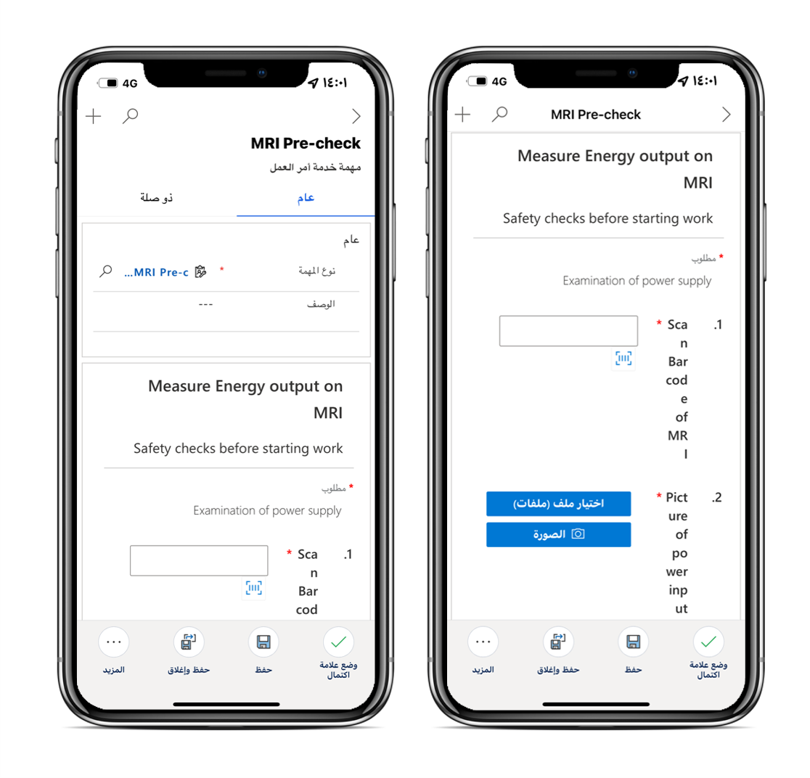

عمليات الفحص هي نماذج رقمية يستخدمها الفنيون للإجابة على قائمة الأسئلة بسرعة وسهولة كجزء من أمر العمل. يمكن أن تشمل قائمة الأسئلة بروتوكولات السلامة، واختبارات النجاح والفشل لأصل العميل، أو مقابلة مع أحد العملاء، أو عمليات تدقيق وتقييم أخرى يتم إجراؤها قبل أمر العمل أو أثناءه أو بعده.

يمكن للعاملين في الخطوط الأمامية الذين يستخدمون تطبيق الأجهزة المحمولة Microsoft Dynamics 365 Field Service إجراء فحوصات دون الحاجة إلى مغادرة التطبيق.

أثناء العمل في تطبيق الأجهزة المحمولة Field Service، يمكن للفني تحديد **مهمة خدمة أمر العمل** التي تتضمن الفحص ذي الصلة.
عندما يكمل الفني الفحص، يمكنه تحميل الملفات أو التقاط الصور أو تحميل الصور من ألبوم الكاميرا بالهاتف.
بالإضافة إلى ذلك، يمكنه إضافة تعليقات أثناء تحميل ملف أو صور.

> [!div class="mx-imgBorder"]
> 

توفر عمليات الفحص في Field Service أيضاً:

- **الدعم في وضع عدم الاتصال** - يمكن للعاملين في الخطوط الأمامية عرض وملء عمليات الفحص على هواتفهم المحمولة أو الأجهزة اللوحية بدون اتصال بالإنترنت. ستتم مزامنة الإجابات عند استعادة الاتصال (شبكة خلوية أو لاسلكية).

- **أصول العميل** - يمكن ربط عمليات الفحص بالأصول، مما يسمح للمستخدمين بعرض سجل جميع عمليات الفحص لقطعة معينة من المعدات.

- **إنشاء واستخدام مباشر** - لا تتطلب عمليات الفحص في Field Service مزيداً من التدريب للأشخاص لاستخدامها، وهي مصممة لتكون سهلة الاستخدام لمستخدمي الأعمال. على سبيل المثال، إذا كان بإمكانك إنشاء استطلاع باستخدام Microsoft Dynamics 365 Customer Voice، فيمكنك إنشاء عملية فحص.

باستخدام واجهة السحب والإفلات، تكون عمليات الفحص سهلة الإنشاء ويسهل على الفنيين تعبئتها مقارنة بالنماذج الورقية.
يتم تخزين إجابات الفحص في Microsoft Dataverse، مما يجعل من السهل على الفنيين الإبلاغ عن النتائج وملاءمة عمليات الفحص في العمليات التجارية التلقائية.
