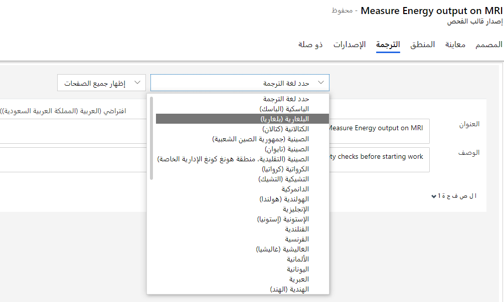

في Dynamics 365 Field Service، تُعد عمليات الفحص نماذج رقمية يمكن للفني استخدامها للإجابة على الأسئلة بسرعة وسهولة كجزء من أمر العمل.

مقارنة بأنواع حوادث أوامر العمل ومهام الخدمة، فإن لعمليات الفحص مزايا أخرى:

- **سهولة الإنشاء:** يمكن للمسؤولين إنشاء فحص بسرعة باستخدام واجهة السحب والإفلات دون الحاجة إلى إنشاء كيانات وحقول جديدة.

- **سهولة الملء** - يمكن للفنيين إدخال إجابات لكل سؤال فحص وحفظها في وقت واحد، بدلاً من الحاجة إلى فتح سجلات مهام خدمة أمر العمل المتعددة وإغلاقها.

- **أكثر مرونة وقوة** - تحتوي عمليات فحص Field Service على العديد من تنسيقات الأسئلة وخيارات التحقق من الصحة، مثل التحديد متعدد الخيارات والحقول الإلزامية والصور والمرفقات والمزيد.

عمليات الفحص سهلة الإنشاء والاستخدام وتتضمن الخطوات التالية:

1. يقوم المسؤول بإنشاء قالب فحص.

1. يقوم المسؤول بربط الفحص المنشور بنوع مهمة الخدمة.

1. يقوم المرسل بإضافة نوع مهمة الخدمة إلى أمر العمل.

1. يكمل الفني الفحص.

1. عرض نتائج الفحص.

## إنشاء قالب فحص

يمكنك إنشاء قوالب الفحص في تطبيق Field Service. لتحديد أنواع مهام الخدمة، انتقل إلى **الإعدادات > أوامر العمل > قوالب الفحص**.

حدد **+ جديد** لفتح نافذة **إصدار قالب الفحص الجديد**، كما هو موضح في لقطة الشاشة التالية.

> [!div class="mx-imgBorder"]
> 

أدخل المعلومات التالية لقالب جديد:

- أدخل اسماً للفحص

- الوصف‏‎

- عنوان الصفحة

- وصف الصفحة

بعد ذلك، يمكنك سحب أنواع الأسئلة من مربع الأدوات في الجزء الأيسر ثم إفلاتها في لوحة الفحص. تتوفر أنواع الأسئلة التالية:

- **مربع النص** - يسمح للفنيين بإدخال نص من لوحة المفاتيح الخاصة بهم للحصول على استجابة حرة. يمكنك تبديل نوع الإدخال من استجابة أحادية إلى متعددة. يمكنك أيضاً تعيين نوع الإدخال إلى **الرمز الشريطي** لتمكين المسح الضوئي باستخدام كاميرا الجهاز.

- **خانة الاختيار ومجموعة تبادلية وقائمة منسدلة** - تسمح هذه الخيارات للفنيين باختيار إجابة من الخيارات المحددة مسبقاً. وتتشابه أنواع الأسئلة الثلاثة هذه، باستثناء أن نوع سؤال **خانة الاختيار** متعدد التحديد، بينما تسمح **المجموعة التبادلية** و **القائمة المنسدلة** بإجابة واحدة. الفرق بين **المجموعة التبادلية** و **القائمة المنسدلة** هو فرق شكلي ويجب استخدامه استناداً إلى تجربة المستخدم المطلوبة.

- **البحث عن الكيان** - السماح للفنيين باختيار سجل Dynamics 365.
في واجهة مصمم الفحص، يجب على المسؤولين تحديد الكيان (جدول) والحقل (عمود) المراد عرضه. يمكنك أيضاً إضافة عوامل تصفية للحد من الصفوف التي يتم عرضها في البحث.

- **الرقم** - تقييد الإدخال إلى القيمة الرقمية أو إرجاع خطأ.
يمثل هذا النوع عادة قيمة قياس أو تصنيف رقمي.

- **التاريخ/الوقت** - يسمح للفنيين بإدخال التاريخ والوقت.

- **الملف** - يسمح للفنيين بتحميل ملف أو التقاط صورة أو اختيار صورة من شريط الكاميرا الخاصة بهم.

- **المصفوفة (الديناميكية**) - إضافة شبكة من الأسئلة. يمكنك إضافة مزيد من الصفوف ديناميكياً أثناء إجراء الفحص.

> [!NOTE]
> يمكنك إما السحب والإفلات أو النقر المزدوج على نوع السؤال لإضافة سؤال.

> [!div class="mx-imgBorder"]
> 

استخدم مفتاح التبديل **المطلوب** لجعل سؤال الفحص إلزامياً.
ومن خلال تحديد رمز **الترس**، يمكنك إضافة مزيد من التفاصيل لسؤال الفحص.

لمزيد من المعلومات، راجع [إضافة عمليات فحص لأوامر العمل في Dynamics 365 Field Service](/dynamics365/field-service/inspections?azure-portal=true).

حدد علامة التبويب **معاينة** لعرض التخطيط من منظور المستخدم.

> [!div class="mx-imgBorder"]
> 

يمكنك تغيير مظهر الفحص وسلوكه.

> [!div class="mx-imgBorder"]
> 

هناك خياران للتخطيط هما:

- **المريح** - يعرض مساحات الإجابة أسفل الأسئلة.

- **المضغوط** - يعرض مناطق الإجابة على يمين الأسئلة، كما هو موضح في لقطة الشاشة التالية.

> [!div class="mx-imgBorder"]
> 

## التفريع والمنطق

تتيح علامة تبويب **المنطق** في نموذج الفحص إمكانية إضافة قواعد للتحكم في تدفق الأسئلة الموجودة في الفحص.

> [!div class="mx-imgBorder"]
> 

## الترجمات

يمكنك إضافة تباينات اللغة لكل فحص. في الفحص، حدد علامة التبويب **ترجمة** الموجودة في النموذج، وحدد إحدى اللغات من القائمة المنسدلة، ثم قم بإضافة الترجمة لكل سؤال.

> [!div class="mx-imgBorder"]
> 

> [!NOTE]
> لعرض فحص بلغة مترجمة في تطبيق الأجهزة المحمولة Dynamics 365 Field Service، يجب عليك تمكين حزمة اللغة في البيئة الخاصة بك لكل لغة قمت بإضافة الترجمات إليها في الفحص.

## نشر

عند الانتهاء من إنشاء الفحص، حدد **نشر** في شريط الأوامر. وبعد أن يتم النشر، يكون قالب الفحص للقراءة فقط ولا يمكنك حذف قالب الفحص. ومع ذلك، يمكنك استخدام الزر **مراجعة** لتعديل القالب ثم إعادة نشره.

## الإصدارات

يمكنك نسخ عمليات الفحص وإنشاء إصدارات جديدة من عمليات الفحص. إذا كنت بحاجة إلى إجراء تغييرات على فحص منشور، حدد **مراجعة**، والتي ستقوم بإنشاء إصدار جديد من القالب في وضع **المسودة**.
عند الانتهاء من إجراء التغييرات، قم بنشر هذا الإصدار الجديد بحيث يتمكن الفنيون من رؤية هذا الإصدار الأخير من الفحص.

> [!div class="mx-imgBorder"]
> 
