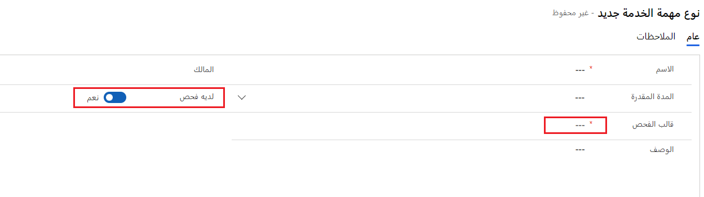
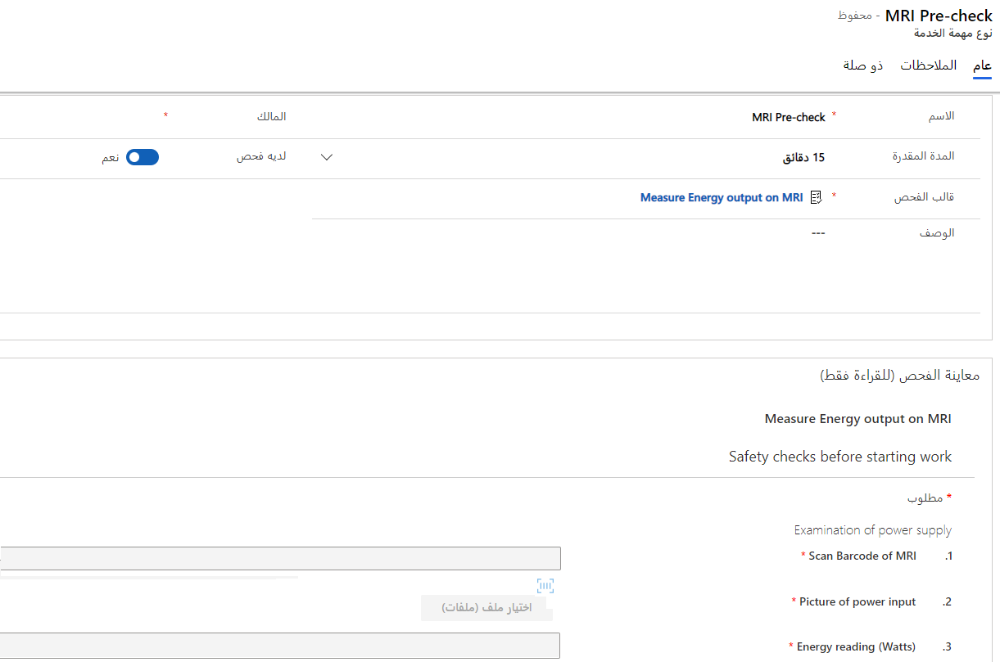
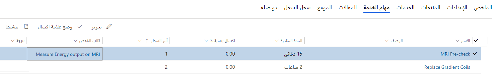
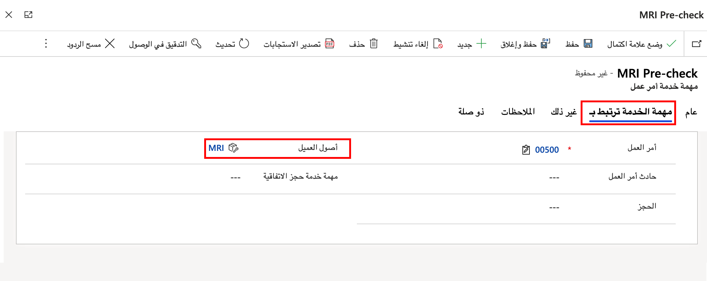

لا ترتبط عمليات الفحص مباشرة بأوامر العمل ولكنها مرتبطة بأنواع مهام الخدمة. تتم إضافة أنواع مهام الخدمة إلى أنواع الأحداث وأوامر العمل وهي الخطوات التي يقوم بها الفني لأمر عمل.

## إقران عمليات الفحص بنوع مهمة الخدمة

لتعديل نوع مهمة الخدمة، انتقل إلى **الإعدادات > أوامر العمل > ‏‫أنواع مهمة الخدمة**.
في النموذج، اضبط مفتاح التبديل **لديه عملية فحص** على **نعم** وسيتم عرض حقل البحث **قالب عملية الفحص**، كما هو موضح في الصورة التالية.

> [!div class="mx-imgBorder"]
> 

يمكنك تحديد قالب فحص منشور لمهمة نوع الخدمة وستتم معاينة الأسئلة في النموذج.

> [!div class="mx-imgBorder"]
> 

> [!NOTE] 
> بعد إقران مهمة نوع خدمة بنوع حدث أو أمر عمل، لا يمكنك تغيير قالب الفحص في مهمة نوع الخدمة.

## إضافة عمليات الفحص إلى نوع الحدث

بدلاً من إضافة فحص مباشرة إلى نوع الحدث، ستقوم بإنشاء سجل مهمة خدمة نوع الحدث. لإضافة مهمة خدمة نوع الحدث، حدد علامة تبويب **مهام الخدمة** ثم حدد **+ مهمة خدمة نوع حدث جديد**.

بعد ذلك، حدد نوع مهمة الخدمة المرتبطة بالفحص. عندما تقوم بتطبيق نوع الحدث على أمر عمل، تتم إضافة نوع مهمة الخدمة إلى أمر العمل مع الفحص المرتبط به.

## إضافة عمليات الفحص إلى أمر العمل

بدلاً من إضافة الفحص مباشرة إلى أمر عمل، ستقوم بتحديد علامة التبويب **مهام الخدمة** في أمر العمل ثم تحديد **+ مهمة خدمة أمر عمل جديد**.

في قائمة مهام الخدمة لأمر العمل، يتم تضمين قالب الفحص، كما هو موضح في لقطة الشاشة التالية.

> [!div class="mx-imgBorder"]
> 

## إقران عمليات الفحص بأصول العميل

في كثير من الأحيان، ستقوم مؤسسات الخدمة بإجراء العديد من عمليات الفحص على نفس معدات العميل. تُستخدم أصول العميل في Field Service لتمثيل معدات العميل. تحتاج إلى إنشاء سجل خدمة لأصول العميل، ويمكنك إقران فحص بأصل العميل.

لربط فحص بأصل عميل، قم بتعديل مهمة خدمة أمر العمل المرتبطة بالفحص ثم حدد علامة التبويب **مهمة الخدمة ترتبط بـ**.

> [!div class="mx-imgBorder"]
> 

في هذا النموذج، حدد أصل العميل. من خلال إقران أصل العميل، سوف تتأكد من أن الفني يمكنه عرض أصل العميل الذي يحتاج إلى الفحص. من أصل العميل، يمكن للفني عرض جميع سجلات الفحص ذات الصلة.

> [!NOTE]
> إذا قمت بربط نوع حدث أمر عمل بأصل عميل، فستكون مهام خدمة أمر العمل ذات الصلة مرتبطة بأصل العميل تلقائياً.

## فحص الأصول المتعددة في موقع العميل

إذا احتاج الفني إلى فحص العديد من أصول العميل في موقع العميل، فيمكنك التعامل مع هذا السيناريو بطريقتين:

- قم بإنشاء فحص واحد بأسئلة متعددة، واحد لكل أصل، ثم اربط الفحص الفردي بمهمة خدمة واحدة.

- قم بإنشاء مهام متعددة لخدمة أمر العمل، ولكل منها فحص واحد.

عند تحديد الأسلوب الذي يجب استخدامه، ضع في اعتبارك أنه يمكنك ربط مهام خدمة أمر العمل بأصول العميل لإنشاء سجلات الخدمة، والتي ستكون قابلة للعرض في سجل أصول العميل. بشكل أساسي، فإن إنشاء مهام خدمة متعددة، كل منها متعلق بأصل عميل مختلف، له ميزة مساعدتك في بناء سجل الخدمة. تتمثل ميزة استخدام مهمة خدمة واحدة مع أسئلة متعددة في أنه من الأسهل إضافتها إلى أمر عمل وملء أسرع.

## عمليات الفحص المرتجلة

في كثير من الأحيان، تحتاج المؤسسات إلى إجراء عمليات فحص مستقلة عن أوامر العمل. تتطلب الوظيفة القياسية في Field Service أمر عمل، ولكن يمكنك تمكين عمليات الفحص لإضافتها إلى أصول العميل مباشرةً في Field Service. لتمكين هذه الميزة، تحتاج إلى تخصيص العلاقة بين جداول الفحص وأصول العميل وإظهار العلاقة في تطبيق Field Service.

لمزيد من المعلومات، راجع [استخدم عمليات الفحص بدون أوامر العمل](/dynamics365/field-service/inspections-customer-assets?azure-portal=true).

بعد الانتهاء من هذا التخصيص، يمكن للفنيين إنشاء عمليات فحص جديدة من سجل أصول العميل.

## ‏‏أدوار الأمان

توفر أدوار الأمان هذه الوصول إلى عمليات الفحص على النحو التالي:

- **Field Service-المسؤولون** - إنشاء قوالب الفحص وإقرانها بأنواع مهام الخدمة.

- **Field Service-المرسلون** - إضافة مهام الخدمة مع عمليات الفحص لأوامر العمل.

- **Field Service-الموارد** - عرض أوامر العمل التي تم تعيينها إليها، جنباً إلى جنب مع مهام خدمة أمر العمل وعمليات الفحص ذات الصلة.
