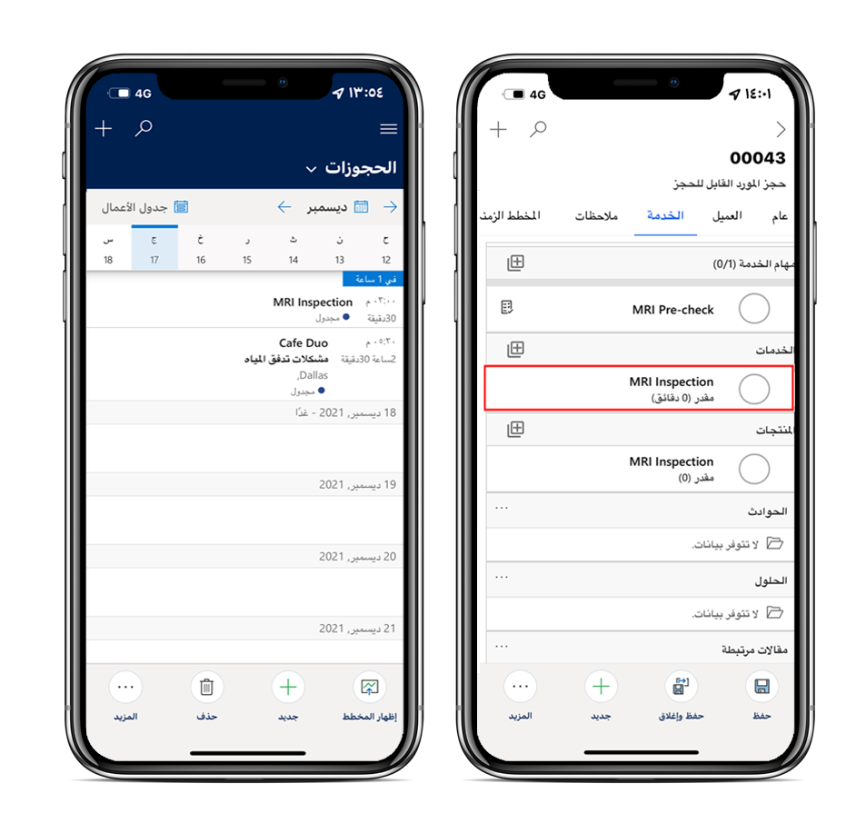
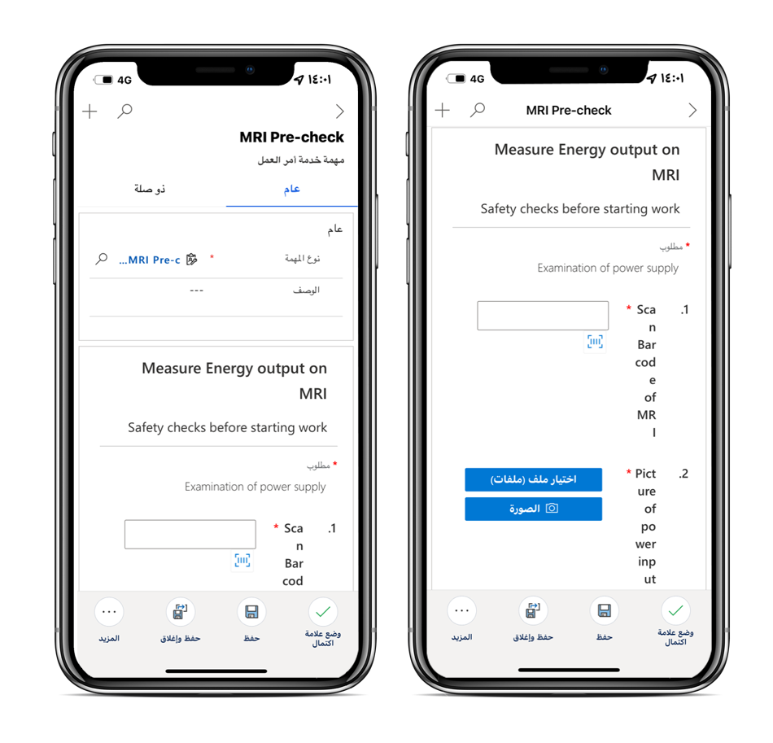
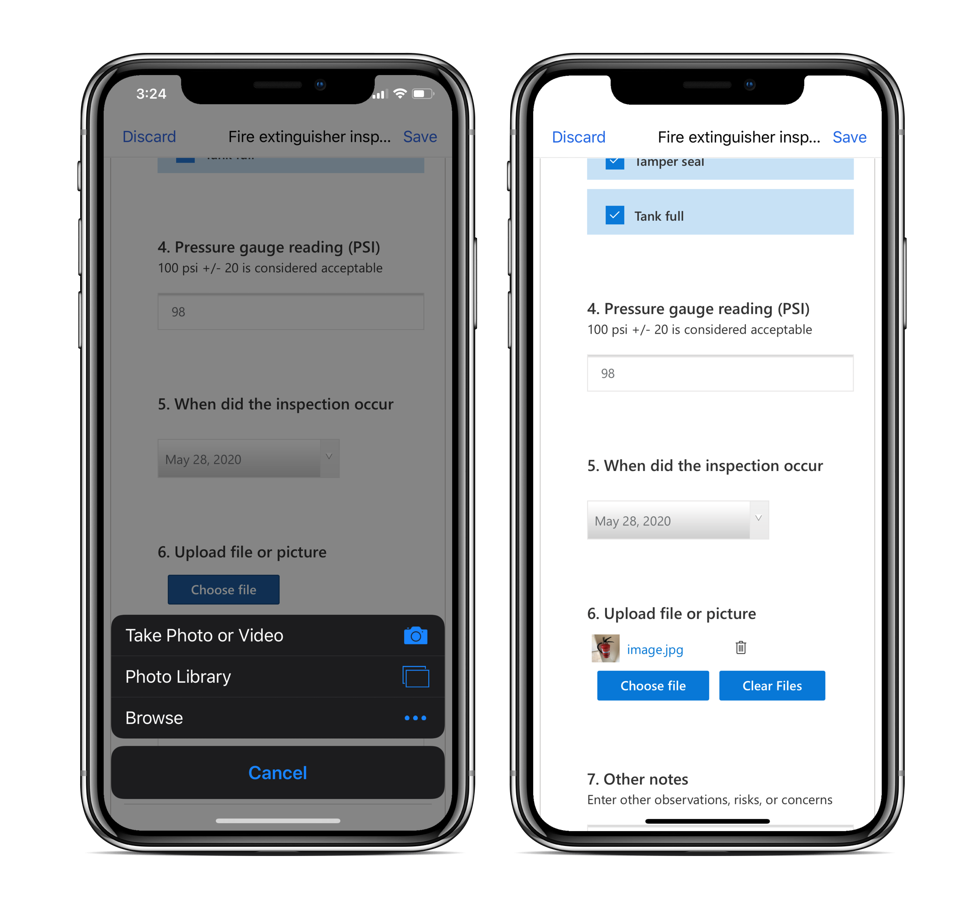
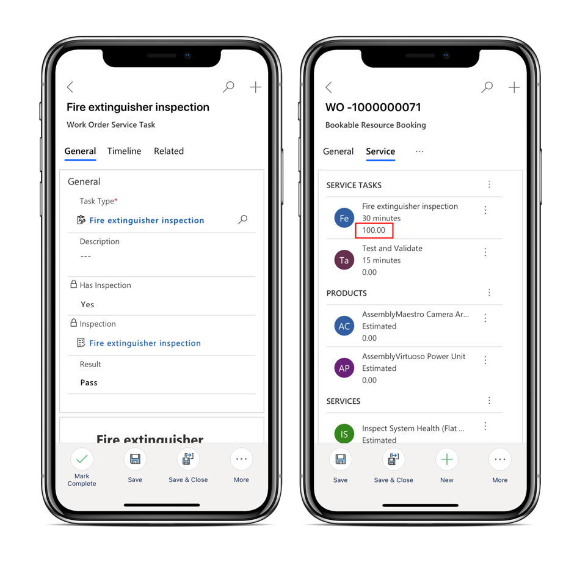
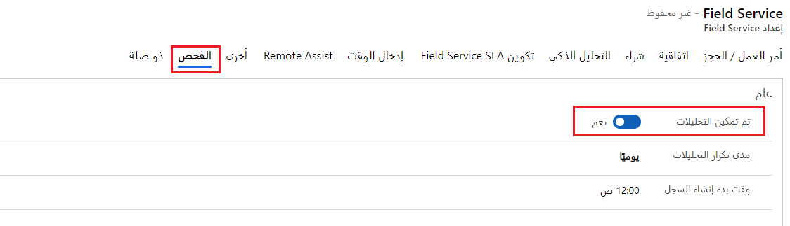
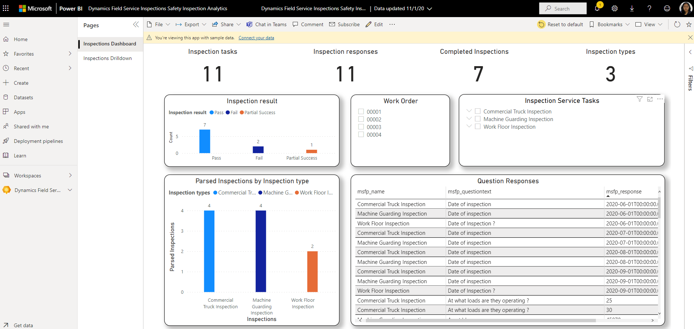

أثناء قيام الفني بالعمل، يمكنه تحديد مهمة خدمة أمر العمل التي تتضمن الفحص ذي الصلة. عند إكماله الفحص، يمكنه تحميل الملفات أو التقاط الصور أو تحميل الصور من ألبوم الكاميرا بالهاتف. بالإضافة إلى ذلك، يمكن للفني إضافة تعليقات أثناء تحميل ملف أو صور.

## عمليات الفحص في تطبيق الهاتف المحمول

يمكن للفنيين عرض عمليات الفحص واستكمالها على تطبيق الأجهزة المحمولة Field Service. لبدء عملية فحص، يمكن للفني تحديد مهمة خدمة أمر العمل التي تتضمن الفحص ذي الصلة.

> [!div class="mx-imgBorder"]
> 

سيتم عرض نموذج الفحص، حيث يمكن للفني إدخال الردود.

> [!div class="mx-imgBorder"]
> 

يمكن للفنيين تحميل الملفات أو التقاط الصور أو تحميل الصور من ألبوم الكاميرا بالهاتف. عند تحميل ملف أو صورة، يمكن للفني تحديد رمز التسمية التوضيحية لإضافة تعليق.

> [!div class="mx-imgBorder"]
> 

عند الانتهاء، يمكن للفني تحديد **وضع علامة مكتمل** أو تعيين الحقل **النسبة المئوية للإكمال** إلى 100.

> [!NOTE]
> إذا كان سؤال الفحص مطلوباً، فلن يتمكن الفني من وضع **علامة مكتمل** حتى يتم الرد عليه.

يمكن للفني إدخال **نتيجة** للإبلاغ عن الفحص الشامل باستخدام الخيارات التالية:

- نجاح

- فشل

- نجاح جزئي

- غير متوفر

> [!div class="mx-imgBorder"]
> 

بالإضافة إلى ذلك، يمكن للفني إدخال المدة الفعلية التي استغرقتها مهمة خدمة أمر العمل لإكمالها، والتي يمكنهم مقارنتها بالمدة المقدّرة.

## تحليل استجابات الفحص

في مهمة خدمة طلب العمل، يمكنك عرض الاستجابات التي تم تسجيلها في الفحص في تطبيق Field Service.

يتم تخزين الاستجابات التي تم رصدها أثناء عمليات الفحص في Microsoft Dataverse. يتم تخزين البيانات بتنسيق JSON، والذي لا يسمح بالتحليل.

يمكنك استخدام تدفقات سحابة Microsoft Power Automate لاستخراج استجابات JSON وملء الجداول في Dataverse. تقوم السحابة بتحليل بيانات الفحص واستخراجها وإضافة سجلات إلى جداول استطلاع Customer Voice: سؤال استطلاع Customer Voice، واستجابة استطلاع Customer Voice، وإجابة سؤال استطلاع Customer Voice.

تأكد من تمكين التحليلات لعمليات الفحص لتشغيل هذه التدفقات. لتمكين التحليلات، انتقل إلى **الإعدادات > عام > إعدادات الخدمة الميدانية**.
في علامة التبويب **الفحص**، قم بتعيين التبديل **تم تمكين التحليلات** إلى **نعم** ثم قم بتعيين وقت إنشاء سجلات الاستجابة.

> [!div class="mx-imgBorder"]
> 

لا يتم توفير تقارير أو لوحات معلومات جاهزة، وستحتاج إلى إنشاء تصوراتك الخاصة. نوصي باستخدام Microsoft Power BI.
تُظهر لقطة الشاشة التالية مثالاً على إحدى لوحات معلومات Power BI لعمليات الفحص.

> [!div class="mx-imgBorder"]
> 

لمزيد من المعلومات، راجع [تشغيل التقارير حول استجابات الاستطلاع.](/dynamics365/field-service/inspections-reporting?azure-portal=true).
