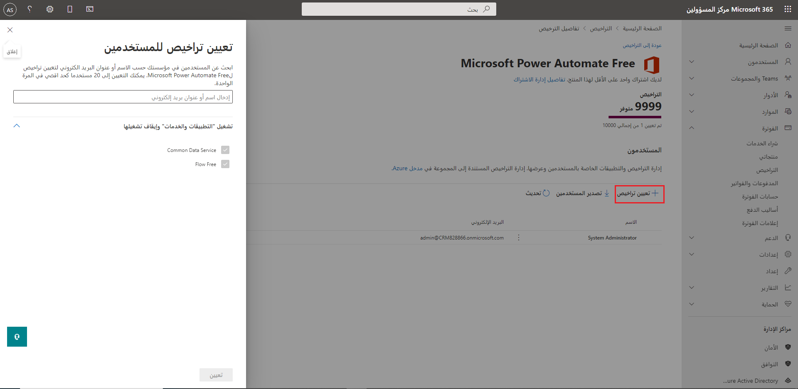
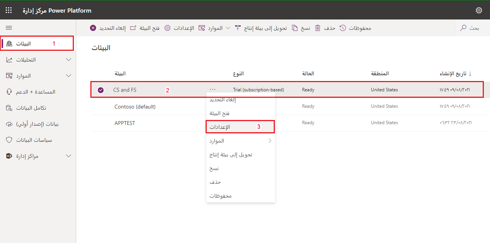
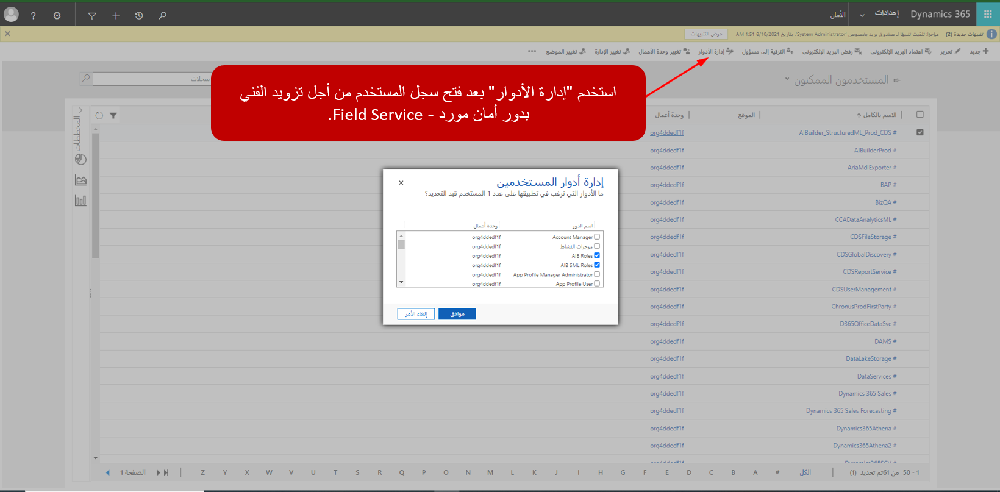
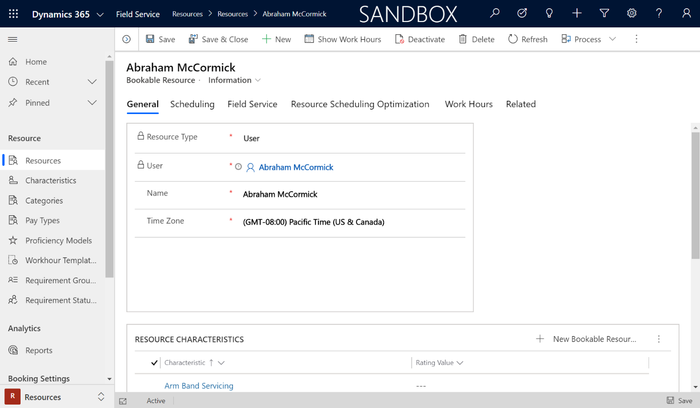
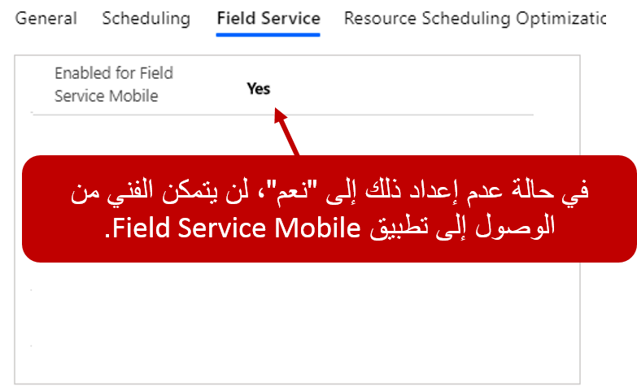
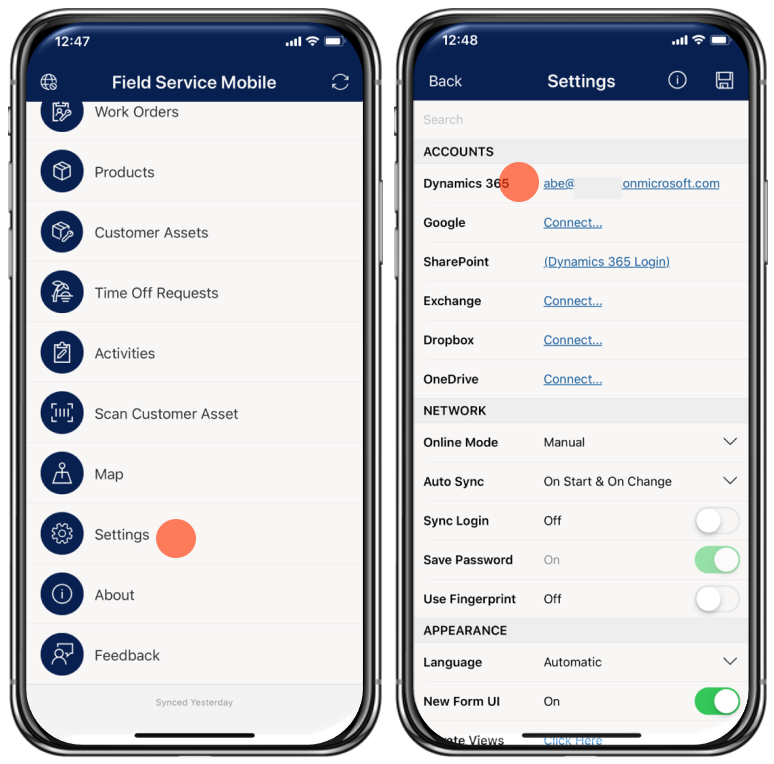
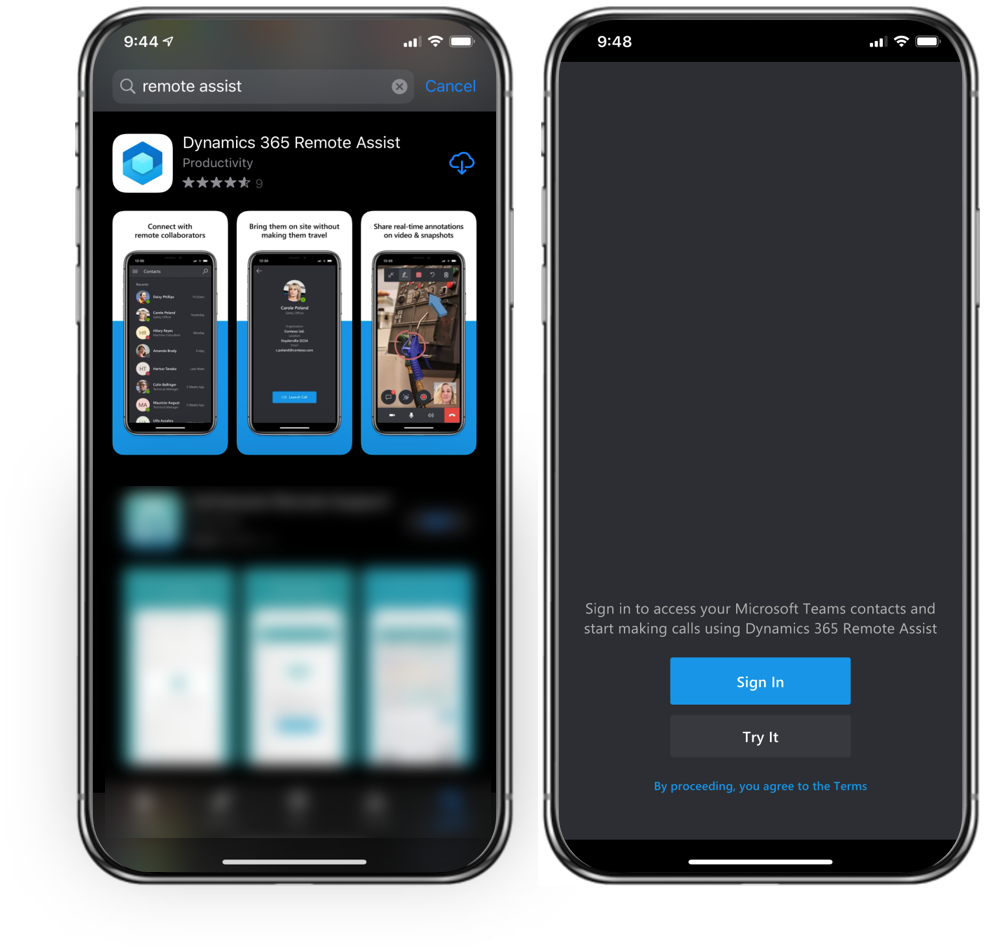
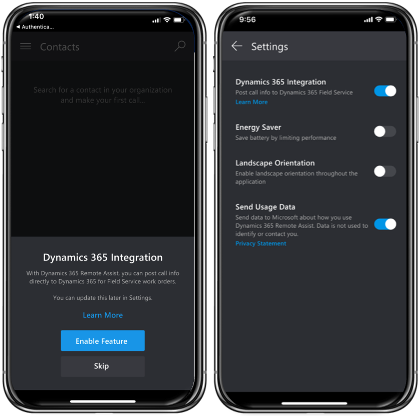
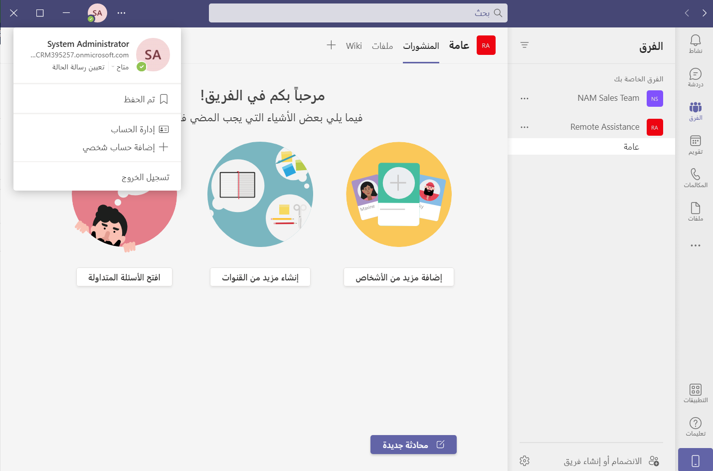

قبل أن يتمكن الفنيون والمتعاونون عن بُعد من حل أوامر عمل Dynamics 365 Field Service باستخدام Remote Assist، يحتاج الفني في الموقع إلى الوصول إلى كل من Field Service Mobile وRemote Assist. سيستخدم الفنيون (العاملون في الخطوط الأمامية) Field Service Mobile لعرض وإدارة أوامر العمل المخصصة. سيقومون باستخدام Remote Assist mobile لإجراء مكالمات مع المتعاونين عن بُعد. سيحتاج الخبراء المختصين الذين سيقومون بالتعاون مع الفنيين عن بُعد إلى الوصول إلى Microsoft Teams.    

لضمان إمكانية عمل الفني والمتعاون عن بُعد معاً، قم بإعداد المعلمات التالية:   

1. تعيين التراخيص الضرورية إلى الفنيين في الموقع والمتعاونين عن بُعد.
2. تأكد من وجود دور الأمان المناسب في الفني بالفعل في Dynamics 365.
3. حدد سجل موارد قابل للحجز للفني في الموقع في Dynamics 365. 
4. تأكد من تسجيل دخول الفني في الموقع إلى تطبيق Field Service Mobile. 
5. تأكد من تسجيل دخول الفني في الموقع إلى تطبيق Remote Assist للأجهزة المحمولة. 
6. تأكد من تسجيل المتعاونين عن بُعد الدخول على Microsoft Teams. 

## تعيين التراخيص

يمكن للمستخدمين الذين لديهم وصول إداري إلى المستأجر الذي يتم نشر Dynamics 365 عليه تعيين التراخيص الضرورية للمتعاونين والفنيين من خلال [مدخل مسؤول Microsoft](https://Admin.microsoft.com/?azure-portal=true). 

ستحتاج إلى تعيين كل من ترخيص Dynamics 365 Field Service وRemote Assist لكل فني في الموقع (عمال الخط الأمامي) الذي سيقوم بإكمال أوامر العمل وبدء مكالمات Remote Assist في الحقل يمكنك إكمال هذا التعيين من خلال الانتقال إلى **الاشتراكات** الموجودة ضمن مجموعة الفوترة. 

> [!div class="mx-imgBorder"]
> 

بالإضافة إلى تعيين تراخيص للفني في الموقع (عامل خط المواجهة)، ستحتاج أيضا إلى تعيين ترخيص Microsoft Teams لأي شخص سيعمل كمتعاون عن بُعد. هذه الخطوة ضرورية فقط إذا لم يتم تعيين ترخيص Teams للمستخدم مسبقاً من خلال اشتراك Microsoft 365، على سبيل المثال.    

لمزيد من المعلومات، راجع [تعيين تراخيص المستخدمين](/microsoft-365/admin/manage/assign-licenses-to-users/?azure-portal=true).  

ضمن القسم **البيئات**، حدد البيئة التي تم تثبيت Field Service فيها ثم حدد **الإعدادات**.

## تعيين أدوار الأمان

عندما يكون لدى فني (عامل خط المواجهة) الترخيص المناسب، سيحتاج إلى أن يكون له دور أمان معين له في بيئة Dynamics 365 التي سيتم الوصول إلى Field Service فيها. يضمن تعيين الدور هذا أن الفني سيكون قادراً على تنفيذ وتحديث أوامر العمل والوصول إلى تطبيق الجهاز المحمول وأداء المهام الضرورية الأخرى. يمكنك تحديد أدوار الأمان في [Microsoft Power Platformمركز الإدارة](Https://admin.powerplatform.microsoft.com).

يتضمن قسم **البيئات** البيئات المختلفة الموجودة لهذا المستأجر. حدد موقع البيئة حيث يتم نشر Field Service ثم قم بتحديد **الإعدادات**.

> [!div class="mx-imgBorder"]
> 

تتيح لك منطقة **الإعدادات** تعديل العناصر المختلفة للبيئة مثل تمكين الميزات وتكوين التكامل وتعديل وصول المستخدم. يمكنك الوصول إلى المستخدمين المرخصين في بيئة Dynamics 365 الخاصة بك عن طريق توسيع القسمين **المستخدمين والأذونات** ثم تحديد **المستخدمين**.  

بالنسبة لكل مستخدم سيتم تعريفه كفني في الموقع (عامل خط أمامي)، ستحتاج إلى إعطاءه دور أمان المورد - Field Service عن طريق تحديد **إدارة الأدوار** في سجل المستخدم. يضمن دور الأمان هذا أن الفني يمكنه الوصول إلى البيانات الضرورية وتنفيذ الإجراءات الضرورية على السجلات أثناء عملها في الحقل.  

> [!div class="mx-imgBorder"]
> 

للحصول على معلومات إضافية، راجع [تعريف أدوار الأمان للمستخدمين](/power-platform/admin/database-security#assign-security-roles-to-users-in-an-environment-that-has-a-common-data-service-database).

## إعداد الفنيين

يحتاج أي شخص سيقوم بتنفيذ العمل على أوامر عمل Dynamics 365 Field Service إلى أن يكون لديه سجل موارد قابل للحجز مقترن بحساب المستخدم الخاص به. يشير المورد القابل للحجز إلى أي مورد يمكن استخدامه في تسليم أمر العمل وإتمامه. قد يمثل سجل المورد هذا شخصاً أو قطعة معدات أو حتى أداة إنشاء. عندما تقوم بدمج Dynamics 365 Field Service وRemote Assist، يشير المورد القابل للحجز إلى الفني (عامل الخط الأمامي) الذي سيقوم بالوصول إلى أوامر العمل على تطبيق Field Service Mobile وبدء مكالمات Remote Assist من تطبيق Remote Assist على جهاز محمول.  

يتم إنشاء موارد قابلة للحجز في تطبيق جدولة الموارد 365 Dynamics المستندة إلى نموذج. نظراً لأنه سيتم ربط المورد القابل للحجز بمستخدم داخلي تم تعيين أدوار الترخيص والأمان الضرورية له بالفعل، ستحتاج إلى تعيين حقل **نوع المورد** إلى **المستخدم**.   

> [!div class="mx-imgBorder"]
> 

ولضمان قدرة الفني على تسجيل الدخول إلى تطبيق Field Service Mobile، سيحتاج سجل الموارد القابل للحجز إلى تعيين الحقل **تمكين لـ Field Service Mobile** إلى **نعم** في علامة التبويب **Field Service**. إذا لم يتم تعيين هذا الحقل إلى **نعم**، فلن يتمكن الفني من تسجيل الدخول إلى التطبيق. 

> [!div class="mx-imgBorder"]
> 

ستضمن هذه العملية الموجزة فقط أن الفني قادر على الوصول إلى تطبيق Field Service Mobile. يمكن أن تؤثر الإعدادات الإضافية الموجودة ضمن سجل مورد قابل للحجز في كيفية عمل الفني.  

لمزيد من المعلومات، راجع [إنشاء الموارد القابلة للحجز](/dynamics365/field-service/set-up-bookable-resources/?azure-portal=true). 

## تسجيل الدخول إلى تطبيق Field Service Mobile

أثناء العمل في الحقل، سيستخدم الفني في الموقع جميع أوامر العمل التي تم تعيينها لهم من خلال تطبيق Field Service Mobile. يمكن تحميل Field Service Mobile من متجر تطبيقات الجهاز الخاص به. 

> [!IMPORTANT]
> ستحتاج المؤسسات التي ستقوم بنشر تطبيق Field Service Mobile إلى الفنيين التابعين لها إلى تنفيذ مهام نشر إضافية لضمان تكوين التطبيق بشكل صحيح والوصول إليه من قِبل الفنيين. على الرغم من أن هذه المهام ليست هي الغرض الأساسي، يمكنك معرفة المزيد حول الإعداد والتكوين عن طريق تحديد الارتباطات التالية.

[إعداد Field Service Mobile على الأجهزة](/dynamics365/field-service/field-service-mobile-app-user-guide)

[نشر Field Service Mobile إلى بيئة Dynamics 365](/dynamics365/field-service/install-field-service#step-2-download-the-field-service-mobile-app-on-a-phone-or-tablet).

بعد نشر تطبيق Field Service Mobile وتكوينه على الجهاز المحمول الخاص بالفني، وتكوين سجل الموارد القابل للحجز بشكل صحيح، يمكنك تشغيل تطبيق الجهاز المحمول والتحقق من أنه يمكنك تسجيل الدخول بنجاح كمستخدم فني الحقل. 

> [!div class="mx-imgBorder"]
> 

لمزيد من المعلومات، راجع [نشر تطبيق Field Service Mobile](/dynamics365/field-service/field-service-mobile-app-user-guide/?azure-portal=true). 

## نشر Remote Assist على أجهزتك

لضمان قيام الفنيين بإجراء مكالمات باستخدام Remote Assist، ستحتاج إلى إعداد Remote Assist وتكوينها على جهاز HoloLens أو تطبيق الأجهزة المحمولة. بناءً على الجهاز الذي ستستخدمه، يمكنك الحصول على Remote Assist من خلال متجر التطبيقات المناسب. 

بالنسبة لأجهزة HoloLens وHoloLens 2، استخدم قائمة البدء للوصول إلى Microsoft Store. ابحث عن التطبيق Dynamics 365 Remote Assist وقم بتنزيله ثم قم بتشغيله.

على أجهزة Android وiOS، ابحث عن Dynamics 365 Remote Assist في متجر التطبيقات المناسب ثم قم بتنزيل التطبيق. تأكد من تسجيل الدخول إلى Remote Assist كنفس المستخدم الذي قمت بتسجيل الدخول إليه على Field Service Mobile.

> [!div class="mx-imgBorder"]
> 

بعد تسجيل الدخول، تأكد من تمكين تكامل Dynamics 365، الذي يمكنك إكماله خلال الإطار المنبثق. وبدلاً من ذلك، إذا لم يتم عرض الإطار المنبثق، انتقل إلى **الإعدادات**.

> [!div class="mx-imgBorder"]
> 

لمزيد من المعلومات المفصلة، راجع [إرشادات النشر](/dynamics365/mixed-reality/remote-assist/deploy-remote-assist?azure-portal=true#deploying-on-your-devices).

## إعداد مستخدم متعاون عن بُعد

سيتعين على أي مستخدم سيعمل كمتعاون عن بُعد تسجيل الدخول إلى Microsoft Teams حتى يتمكن من استلام الاتصالات من الفنيين الذين يعملون في الحقل. لا يحتاج المتعاونون إلى ترخيص Field Service أو Remote Assist؛ يحتاجون فقط إلى الحصول على ترخيص Microsoft Teams. لتلقي الاتصالات، سيحتاج المتعاونون إلى تسجيل الدخول إلى Microsoft Teams باستخدام إصدار سطح المكتب. لا يعمل إصدار الويب من Teams مع Remote Assist.

> [!div class="mx-imgBorder"]
> 

> 
> 
> 

> [!VIDEO https://www.microsoft.com/videoplayer/embed/RE4ymmt]

والآن بعد إعداد المستخدمين والتطبيقات بنجاح، ستكون جاهزاً لبدء العمل مع التطبيق.
