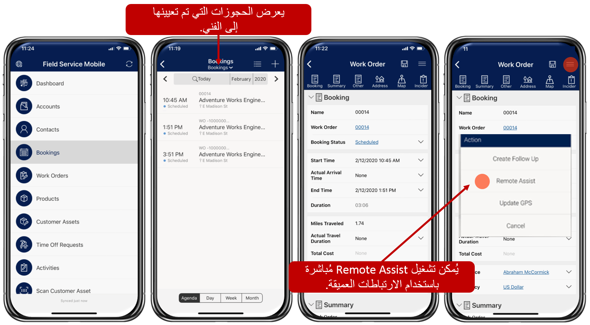

في Dynamics 365 Field Service، تُستخدم أوامر العمل لتحديد ما يجب أن يقوم به الفنيون أثناء تواجدهم في الموقع مع العملاء. على سبيل المثال، إذا تم إيفاد فني للعمل على جهاز تحكم رقمي بالكمبيوتر (CNC)، فإن أمر العمل سيحدد ما يحتاجون إلى إنجازه أثناء تواجدهم في الموقع، مثل ما إذا كانوا يقومون بإصلاح وتركيب وصيانة وقائية وما إلى ذلك.
بالإضافة إلى ذلك، يمكن أن يتضمن أمر العمل أي خدمات يقوم الفني بأدائها، والمنتجات المضمنة، وقائمة مهام الخدمة التي يجب تنفيذها. 

في الأقسام التالية، ستتصفح المهام التالية:

- إنشاء أمر عمل.
- جدولة أمر عمل.
- عرض أمر العمل على Field Service Mobile،
- ارتباط عميق بـ Remote Assist واتصل بأحد الخبراء من أمر عمل Field Service Mobile.

عندما تقوم المؤسسات بدمج Dynamics 365 Field Service مع Remote Assist، يمكن للفنيين تحديد زر في تطبيق Field Service Mobile يقوم بربط تطبيق Remote Assist ويفتحه تلقائياً للاتصال بخبير موضوع بعيد.  

## إنشاء أمر عمل

يتضمن Dynamics 365 Field Service حقل **جهة اتصال الدعم** والذي يمكن للفني استخدامه لتحديد خبير موصى به يمكن الاتصال به من خلال Remote Assist عندما يحتاج إلى مساعدة. على سبيل المثال، تُظهر الصورة التالية أنه تم تعيين Contoso Williamكجهة اتصال دعم لأمر العمل هذا. لن يقتصر الفني الذي يقوم بتنفيذ أمر العمل هذا على الاتصال بـ William فقط، بل سيكون بمقدوره الاتصال بأي شخص يمكنه تقديم المساعدة. من خلال تعيين William كجهة اتصال للدعم، يتم تزويد الفني بإرشادات البدء من خبير موصى به.

> [!div class="mx-imgBorder"]
> 

لمزيد من المعلومات، راجع [إنشاء أوامر العمل](/dynamics365/field-service/create-work-order/?azure-portal=true). 

## جدولة أمر عمل

بعد إنشاء أمر العمل، ستحتاج إلى جدولته مع الفني الذي سيعمل على الصنف. في Dynamics 365 Field Service، عندما تقوم بجدولة عنصر لشخص ما، فإنك تنشئ ما يسمى *بالحجز* لهذا الشخص. تمت جدولة الحجوزات لسجل مورد الفني القابل للحجز، والذي قمت بإنشائه مسبقاً.
في Field Service، يمكن جدولة أوامر العمل للفنيين بطرق متعددة، مثل يدوياً أو بمساعدة أو تلقائياً. في المثال التالي، تم استخدام Resource Scheduling Optimization لجدولة مورد قابل للحجز يسمى Abraham McCormick لإكمال أمر عمل.

> [!div class="mx-imgBorder"]
> 

لمزيد من المعلومات، راجع [جدولة أوامر العمل](/dynamics365/field-service/universal-resource-scheduling-for-field-service/?azure-portal=true). 

## الوصول إلى أوامر العمل على Field Service Mobile

بعد جدولة أمر عمل، سيتمكن الفني من الوصول إلى أمر العمل على تطبيق Field Service Mobile. يساعد تطبيق Field Service Mobile على ضمان وصول الفنيين إلى جميع المعلومات الضرورية التي يحتاجونها أثناء العمل على الأصناف في الحقل. من تطبيق Field Service Mobile، يمكن للفنيين عرض جدولهم الزمني واستعراض العملاء وأوامر العمل والحجوزات على الخريطة واستخدام معلومات GPS للوصول إلى مواقع العملاء، سواء كانوا سيعملون دون اتصال أو عبر الإنترنت.  

عندما يقوم الفني بتسجيل الدخول إلى Field Service Mobile، سيتم تزويده بالحجوزات المجدولة لذلك اليوم وسترى معلومات أمر العمل ذات الصلة.  

إذا تم إعداد الفني، وتم تثبيت Remote Assist على هواتفهم مع تمكين التكامل، فيمكن للفني تشغيل تطبيق Remote Assist للأجهزة المحمولة من أمر العمل باستخدام الارتباط العميق. عندما يصل الفني إلى قائمة الإجراءات، سيتم تزويدهم بخيار لفتح تطبيق Remote Assist، حيث يمكنهم إجراء مكالمات Remote Assist للحصول على المساعدة التي يحتاجون إليها.  

> [!div class="mx-imgBorder"]
> 

لمزيد من المعلومات، راجع [العمل مع Field Service Mobile](/dynamics365/field-service/field-service-mobile-overview/?azure-portal=true). 

> 

> [!VIDEO https://www.microsoft.com/videoplayer/embed/RE4yj5A]
