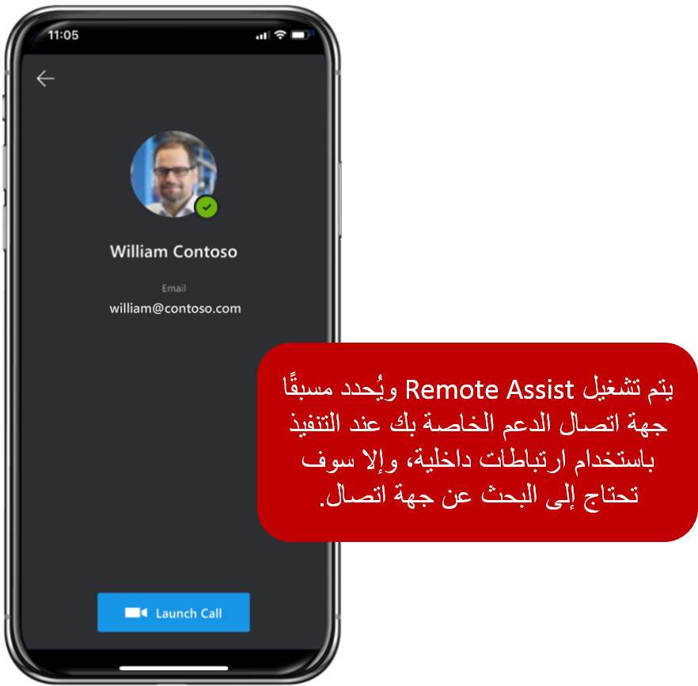

عندما يقوم الفني بتشغيل Remote Assist مباشرةً من Field Service Mobile باستخدام ارتباط عميق، سيتم تشغيل Remote Assist تلقائياً وسيتم تحديد الشخص الذي تم تحديده على أنه جهة اتصال الدعم في أمر عمل Field Service تلقائياً في التطبيق. إذا تعذر تشغيل Remote Assist مباشرةً، فسيتم نقل الفني إلى الشاشة القياسية حيث يمكنهم البحث عن خبير الموضوع الذي يريدون العمل معه.

> [!div class="mx-imgBorder"]
> 

بعد أن يبدأ الفني المكالمة، سيتلقى المتعاون عن بُعد المكالمة على Microsoft Teams، كما هو الحال مع أي مكالمة عادي من Teams قد يتلقاها.

> [!div class="mx-imgBorder"]
> 

لمزيد من المعلومات، راجع [إجراء المكالمات](/dynamics365/mixed-reality/remote-assist/mobile-app/making-calls/?azure-portal=true).

## التعليق التوضيحي على بيئتك

أثناء العمل مع Remote Assist، يمكن للفنيين استخدام جميع الميزات النموذجية التي يوفرها تطبيقهم. إحدى السمات الرئيسية هي التعليقات التوضيحية. تسمح التعليقات التوضيحية للفنيين والمتعاونين عن بُعد باستدعاء منطقة أو أصل بيئي مرئياً لفحصها أو معالجتها. نظراً لأن الفنيين يعرضون البيئة من خلال الكاميرا الخلفية الخاصة بهم، يمكن للفني والمتعاون عن بُعد إضافة التعليقات التوضيحية إلى ما يشاهدونه ويمكنهم مشاركته مع بعضهم البعض أثناء مكالمة فيديو. أثناء المكالمة، يسمح شريط أدوات التعليقات التوضيحية للفنيين بوضع الأسهم والرسومات في بيئتهم.

تتوفر عدة خيارات من شريط الأوامر، كما هو موضح في الصورة التالية. 

> [!div class="mx-imgBorder"]
> 

على سبيل المثال، في الصورة التالية، يستخدم الفني تعليقاً توضيحياً على شكل سهم لاستدعاء عنصر معين لديه سؤال حوله.

> [!div class="mx-imgBorder"]
> 

على غرار مستخدمي Remote Assist، يمتلك المتعاونون عن بُعد أيضاً شريط أدوات للتعليقات التوضيحية يسمح لهم بوضع الأسهم والرسومات في بيئتهم. يحتوي شريط الأدوات على نفس الأوامر المتوفرة لفني المساعدة عن بُعد. لبدء إضافة التعليقات التوضيحية، يجب على المتعاونين عن بُعد تحديد الزر **بدء التحرير**. عند بدء التحرير، يمكن للمتعاون إدخال إطار مجمّد حيث يمكنه إضافة تعليقات توضيحية إليه. عند انتهاء المتعاون، يمكنه تحديد **إيقاف التحرير** للعودة إلى بث الفيديو المباشر للفني، وعند هذه النقطة، ستظهر أي تعليقات توضيحية مضافة في بيئة الفني.

لمزيد من المعلومات، راجع وثائق [التعليقات التوضيحية](/dynamics365/mixed-reality/remote-assist/mobile-app/annotate-your-environment/?azure-portal=true). 

## مشاركة الملفات والمعلومات

يمكن أن تساعد مشاركة الملفات الفنيين في إجراء محادثات أكثر ثراءً مع المتعاونين عن بُعد وبالتالي حل المشكلات بسرعة. يمكن للفني والمتعاونين عن بُعد إرسال أي نوع ملف لبعضهم البعض. يمكن تحميل الملفات والصور من أجهزتهم المحلية أو ملفات OneDrive. سيحتاج الفنيون إلى التطبيق المقابل الذي يدعم نوع الملف ؛ قد تكون المعاينات داخل التطبيق متاحة، حسب نوع الملف وحجمه. على سبيل المثال، قد يكون من المفيد غالباً أن يكون لديك دليل إصلاح للعناصر التي تعمل عليها. يمكن للمتعاون عن بُعد تحميل إصدار PDF من الدليل الذي يمكن للفني رؤيته أثناء العمل في تطبيق Remote Assist. يمكن للفني حفظ دليل PDF في معرض الصور على هواتفهم حتى يتمكنوا من الرجوع إليه في وقت لاحق. بالنسبة لعملاء Field Service، يمكن ربط الملفات التي تمت مشاركتها أثناء مكالمة الهاتف المحمول الخاصة بـ Remote Assist بأمر العمل الخاص بك.

لمزيد من المعلومات، راجع [مشاركة الملفات](/dynamics365/mixed-reality/remote-assist/mobile-app/file-sharing/?azure-portal=true). 

## تسجيل المكالمات

في السيناريوهات التي يستخدم فيها الفني الزر **تسجيل** لتسجيل المكالمة، يمكنه استخدام تقدم تسجيل المكالمات. بعد إيقاف المكالمة، سيتلقى كلا المشاركين في المكالمة إشعاراً بأن تسجيل المكالمة سيكون متاحاً في Microsoft Stream. بعد تحميل تسجيل المكالمات إلى Microsoft Stream، يمكن لكل من المشاركين الوصول إليه من خلال الدردشة النصية لمكالمة الهاتف المحمول على Remote Assist، أو الدردشة النصية في Microsoft Teams، أو في مجلد فيديو Microsoft Stream. كما هو الحال مع حقل مشترك، يمكن ربط تسجيل المكالمات بأمر العمل الذي بدأ منه. 

لمزيد من المعلومات، راجع [إمكانات تسجيل المكالمات](/dynamics365/mixed-reality/remote-assist/mobile-app/call-recording/?azure-portal=true). 

## ترحيل تفاصيل المكالمة إلى الجدول الزمني لأمر العمل

بعد اكتمال مكالمة Remote Assist، يمكن توثيق المكالمة على المخطط الزمني لأمر العمل الذي نشأت منه المكالمة. في Dynamics 365، يتم استخدام المخطط الزمني للنشاط لتتبع جميع الاتصالات مع العميل أو جهة الاتصال من حيث صلتها بالسجل. على سبيل المثال، قد تتضمن الأنشطة رسائل البريد الإلكتروني أو المكالمات الهاتفية أو الملاحظات المتعلقة بسجل أمر العمل.

> [!div class="mx-imgBorder"]
> 

يعد امتلاك القدرة على توثيق مكالمة Remote Assist في أمر العمل أمراً مهماً لأنه يمكن أن يساعد المؤسسات على فهم أنواع المشكلات التي تتطلب عادةً مساعدة إضافية بشكل أفضل. يمكن أن تساعد هذه القدرة مؤسستك على بناء إستراتيجية للعمل على هذه العناصر وتحديد وبناء برامج التدريب لاستيعابها.

عندما يحصل الفني على التوجيه اللازم من المتعاون البعيد، يمكنه إنهاء المكالمة. سيُسأل الفني عما إذا كان يريد ترحيل المكالمة كنشاط في الجدول الزمني لأمر العمل. سيفتحون قائمة بالحجوزات المتاحة التي يمكن ترحيل المكالمة إليها. ستتطابق قائمة المعلومات المقدمة مع الحجوزات المعروضة في طريقة عرض **جدول الأعمال** من تطبيق Field Service Mobile.

بعد ترحيل المعلومات، ستنعكس التفاصيل كعنصر في المخطط الزمني لأمر العمل. ميزة أخرى لترحيل التفاصيل مرة أخرى إلى أمر العمل هي أنه يوفر القدرة على إضافة المزيد من السياق. إذا لزم الأمر، يمكن للفني أو المدير أو أي شخص آخر لديه حق الوصول إلى سجل أمر العمل فتح النشاط وإضافة المزيد من التفاصيل المتعلقة بأمر العمل. يمكن عرض هذه المعلومات بواسطة الأشخاص، مثل المرسلين، الذين سيتمكنون من الوصول إلى السجل.

> [!div class="mx-imgBorder"]
> 

> 
> 
> 

> [!VIDEO https://www.microsoft.com/videoplayer/embed/RE4ygBR]

