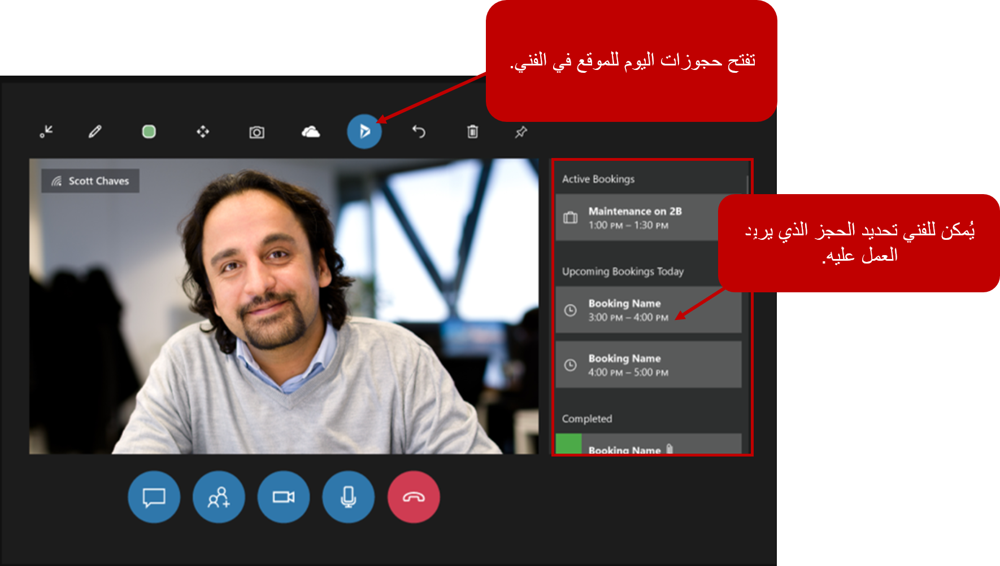

أثناء تزويد الفنيين بالقدرة على استخدام مكالمات Remote Assist وبدء تشغيلها، تساعد المكالمات من داخل تطبيق Field Service Mobile الفنيين على تلقي المساعدة التي يحتاجون إليها. ومع ذلك، فهي ليست تجربة بدون استخدام اليدين. من خلال تزويد الفنيين بالقدرة على استخدام Remote Assist على أجهزة HoloLens، أصبح لديهم الآن تجربة غامرة بدون استخدام اليدين فعلاً. على سبيل المثال، عندما يقوم المتعاونون عن بُعد بتدوين الملاحظات والتعليقات التوضيحية، مثل استدعاء تبديل جزء يحتاج إلى قلبه أو جزء يجب تعديله، تنعكس هذه الأصناف في مساحة الواقع المختلط التي يعمل فيها الفني. تضمن هذه الميزة أن يتمكن الفني من رؤية ما يشير إليه المتعاون البعيد وأنه يمكنه الوصول إلى الأدوات الضرورية أثناء العمل مع المتعاون.    

بالإضافة إلى ذلك، فإن تزويد الفنيين بسماعة رأس HoloLens يجعل المشاهدة والتفاعل مع Field Service أفضل.

أثناء عمل الفنيين في التطبيق، يمكنهم استخدام الرمز Dynamics 365 لتوفير الوصول إلى البيانات المتعلقة بـ Field Service. كما هو موضح في الصورة التالية، بينما يتعامل الفني مع خبير عن بُعد، فإنه يمكنهم الوصول إلى حجوزات اليوم. وبالتالي، يستطيع الفني أن يرى كيف يبدو اليوم أثناء الوصول في نفس الوقت إلى التفاصيل المتعلقة بحجز معين.

> [!div class="mx-imgBorder"]
> 

أثناء قيام الفني بالتصفح في الحجز، سيتمكن من الوصول إلى تفاصيل أمر العمل الإضافية مثل الحالة وجهة اتصال الدعم الموصى بها. تسمح هذه الميزة للفني بالانتقال إلى جهة الاتصال الموصى بها والبدء فيها، كل ذلك مع إبقاء أيديهم حرة لمواصلة العمل في مهمتهم.

> [!div class="mx-imgBorder"]
> 

أثناء إجراء المكالمة، يمكن للفنيين أخذ لقطات وإضافة التعليقات التوضيحية، أو قد يرغبون في التقاط الصور المتعلقة بالمشكلة. ومن المزايا الأخرى لاستخدام Remote Assist على HoloLens هي القدرة على إرفاق الصور بأمر العمل أثناء مكالمة Remote Assist حتى يتمكن حملة الأسهم في المستقبل من رؤية العمل أو المشكلة. يتم ترحيل هذه المعلومات مرة أخرى إلى حجز أمر العمل ويمكن الوصول إليها في تطبيق Field Service من خلال أي شخص لديه حق الوصول إلى الحجز.

> [!div class="mx-imgBorder"]
> 

يمكن للفنيين أيضاً تحديث حالات الحجز مباشرةً من داخل التطبيق، مثل الإشارة إلى أنهم يعملون على حجز أو وضع علامة مكتمل بعد الانتهاء من الحجز.

> [!div class="mx-imgBorder"]
> 

## قم بإعداد Field Service لـ HoloLens

لاستخدام تكامل Field Service بالإضافة إلى HoloLens ستحتاج إلى استخدام Field Service v8.2 أو إصدار أحدث. عند تشغيل التطبيق، يتم استخدام عرض **حجوزاتي لهذا اليوم** لتعبئة قائمة الحجوزات التي يتم عرضها على جهاز HoloLens. طريقة العرض هذه مطلوبة ويتم تضمينها في عمليات توزيع Field Service ولا يجب حذفها. قد ترغب في تعديل طريقة العرض لعكس العناصر المحددة التي تريد عرضها أو للتحقق من وجودها. يمكنك الوصول إلى العرض من خلال الانتقال إلى [Power Apps](https://make.powerapps.com/?azure-portal=true). 

عندما تكون في البيئة التي تريد العمل بها، يمكنك توسيع **البيانات** وتحديد موقع كيان **حجز المورد القابل للحجز** ثم تحديد **طرق العرض**.

> [!div class="mx-imgBorder"]
> 

> [!NOTE]
> إذا كنت لا ترى كيان **حجز المورد القابل للحجز** فقم بتغيير النوع من **افتراضي** إلى **الكل**. قم بفتح عرض **‏‫حجوزاتي لهذا اليوم**.

يمكن إنشاء أوامر العمل وجدولتها باستخدام نفس التقنيات المعتادة. تظهر الحجوزات فقط في جزء Dynamics 365 في Remote Assist عندما يتم تعيين حالة الحجز إلى **قيد التقدم** ويكون للمورد القابل للحجز سجل مستخدم يطابق مستخدم HoloLens. وبخلاف ذلك، لن يتم عرض الحجز على الجهاز.

> [!div class="mx-imgBorder"]
> 
