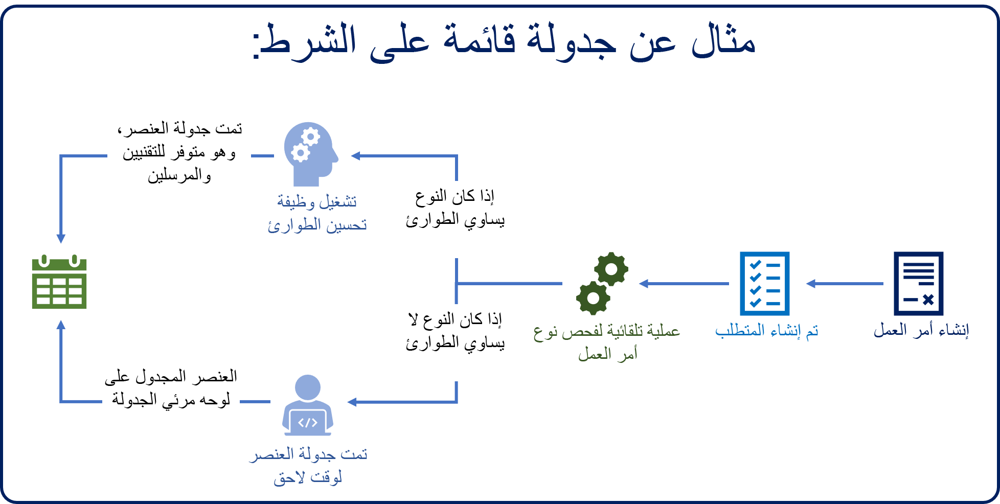

تعد إحدى الميزات الرئيسية لـ Resource Scheduling Optimization ‏(RSO) هي المرونة التي تتيح للمؤسسات تحديد وقت استخدام التطبيق وكيفية استخدامه. سيكون لكل مؤسسة تبحث عن نشر الحل أيضاً احتياجات مختلفة قليلاً لا تحدد ما يريد تحسينه، ولكن أيضاً متى وكيف يجب تشغيل الوظائف.

على سبيل المثال، قد يكون لدى المؤسسة وظائف RSO تعمل مرة واحدة في الأسبوع أو كل ليلة، وقد تعمل على تحسين الجداول الزمنية للعديد من الموارد في كل مرة. والخيار الآخر هو ان يقوم العميل بالاتصال وإلغاء الطلب. في هذا السيناريو، قد يؤثر الإلغاء في مورد واحد فقط، أو قد يؤدي إلى التأثير في عدة موارد. يمكن للمؤسسة استخدام Resource Scheduling Optimization بالعديد من الطرق المختلفة للمساعدة على تحسين الجدولة والموارد وذلك وفقاً لاحتياجاتها.

في حين أن المؤسسات لديها العديد من السيناريوهات المختلفة للاختيار من بينها عند استخدام RSO لتحسين الجدولة، فإن السيناريوهات الأكثر شيوعاً من RSO تستخدم عادةً لما يلي:

-   الجدولة الليلية

-   الجدولة خلال اليوم

-   الجدولة حسب الشروط

-   الإلغاء والتأخيرات

-   عمليات المحاكاة

### الجدولة الليلية

تُعد الجدولة الليلية هي أكثر طرق استخدام RSO لتحسين الجداول الزمنية. عادةً، تعمل مهمة تحسين الأداء مع كميات أكبر من البيانات. لهذا السبب، يكون من الفعال تحديد الجداول التي ستقوم بتشغيل وظائف RSO بعد ساعات العمل العادي. يمكن للمؤسسة إنشاء جدول زمني ليلي أو أسبوعي استناداً إلى ما تريد تحسينه. تحتوي كل مهمة مجدولة على نطاق سجل مرفق يحدد الموارد والمتطلبات و/أو الحجوزات لتحسينها. وعند تشغيل المهمة المجدولة، يقوم RSO بتحسين كافة العناصر الموجودة في النطاق.

على سبيل المثال، قد يكون لدى المؤسسة جدول أسبوعي يتم تشغيله مساء يوم الأحد. يتم تعيين الوظيفة لجدولة أي أصناف غير مجدولة تم تعيينها بأنها **جاهزة للإرسال** ولتحسين كافة الحجوزات المجدولة الحالية لموارد المستخدم الداخلية فقط.

في أمسيات الإثنين إلى الخميس، تعمل وظائف مختلفة، مما يحسن العناصر المجدولة حالياً. ستقوم الجدولة الليلية بجدولة الأصناف في منطقة واشنطن التي لها الحالة "جاهزة للإرسال" لكافة موارد واشنطن. قد يفيد هذا الأسلوب لأنه سيقوم بإعادة ضبط الجداول استناداً إلى تغييرات الجدولة التي قد تكون حدثت على مدار اليوم.

عندما يصل المرسلون في الصباح، يمكنهم عرض النتائج على لوحة الجدولة ومعرفة كيفية جدولة العناصر. إذا لاحظوا أي شيء يحتاج إلى تغيير، يمكنهم استخدام أدوات مثل لوحة الجدولة أو مساعد الجدولة أو RSO لضبط جداول الموارد المختلفة حسب الحاجة.

> [!VIDEO https://www.microsoft.com/videoplayer/embed/RE4kfoU]

### الجدولة خلال اليوم

على مدار اليوم، قد يكون لدى المؤسسة عناصر جديدة متعددة تأتي وتحتاج إلى جدولة. قد لا تتطلب بعض هذه العناصر جدولة فورية وقد تنتظر جدولتها حتى يتم تشغيل مهمة الجدولة الليلية في المساء. ومع ذلك، قد تحتاج إلى جدولة وظائف أخرى على الفور. في هذه الحالات، يمكن للمؤسسة اختيار إنشاء جداول خلال اليوم.

على عكس الجدولة الليلية التي يتم تشغيلها عادةً بعد ساعات العمل، يتم تشغيل الجدولة اليومية على مدار اليوم (مثل كل ساعة أو نصف ساعة) وعادةً ما تؤثر في مجموعة فرعية أصغر بكثير من البيانات مثل عناصر الأولوية العالية أو الطوارئ.

على سبيل المثال، لدى المؤسسة نهج لجدولة العناصر ذات الأولوية العالية على الفور لأنها مقترنة بالعملاء المتعاقدين أو حالات الطوارئ. تحظى أوامر العمل ذات الأولوية غير العالية بمرونة أكثر من ذلك بقليل.

في هذه الحالة، قد تحدد المؤسسة:

-   جدول زمني خلال اليوم يتم تشغيله كل 30 دقيقة على مدار اليوم وجدولة أي عناصر ذات أولوية عالية غير مجدولة.

-   جدول زمني ثانٍ خلال اليوم يتم تشغيله كل ساعتين وجدولة كافة العناصر الجديدة غير المجدولة.

-   وظيفة نهائية يتم تشغيلها عبر الغداء والتي تقوم بجدولة أي أصناف غير مجدولة حالياً وأداء بعض التحسينات الأساسية لبقية اليوم.

ومع تقدم اليوم، يمكن للمرسلين مشاهدة هذه العناصر الجديدة التي تمت جدولتها في لوحة الجدولة، ويمكنهم اختيار إجراء أي تعديلات يدوية إذا لزم الأمر.

### الجدولة حسب الشروط

على عكس الجدولة اليومية، حيث تقوم المؤسسة بإعداد جدول زمني محدد مسبقاً للوظائف لتشغيلها على مدار اليوم، توجد بعض السيناريوهات حيث لا تتمتع المؤسسة بالمرونة اللازمة لانتظار بدء مهمة مجدولة. في هذه السيناريوهات، قد تقوم إحدى المؤسسات بتشغيل مهمة تحسين الأداء استجابة لحدث معين، مثل إنشاء عنصر طوارئ.

على سبيل المثال، باستخدام تطبيق أتمتة سير العمل، مثل Power Automate، قد تقوم مؤسسة بتعريف إجراء تلقائي لتشغيل مهمة تحسين الأداء في أي وقت يتم فيه إنشاء عنصر تم وضع علامة عليه كعنصر طوارئ. كما سيتم أيضاً تعيين مهمة تحسين الأداء لتضمين المتطلبات التي تم وضع علامة عليها على أنها مهام الطوارئ.

من خلال تشغيل التشغيل الآلي بهذه الطريقة، سيقوم التطبيق بجدولة عنصر الطوارئ للفني الأنسب استناداً إلى المعايير المحددة في التطبيق.

### الإلغاء والتأخيرات

ومن السيناريوهات الشائعة الأخرى التي يمكن أن تؤثر في الجدولة الحالية والمستقبلية هو إلغاء العميل أو نوع من التأخير، مثل تأخير حركة المرور أو عندما تستغرق مهمة موجودة وقتاً أطول من المتوقع.
اعتماداً على السيناريو والموارد المعنية وطول التأخير (وهكذا)، يمكن أن تؤثر هذه العناصر في موارد متعددة. في هذه الحالة، يمكن للمؤسسة اختيار استخدام الجدولة المستندة إلى الشرط، أو تحديد جدول زمني خلال اليوم، أو التعامل مع التغيير يدوياً.

ومع ذلك، فغالباً ما تؤثر عمليات الإلغاء أو التأخير بشكل عام في مورد واحد. في هذه الحالات، يمكن أن يكون أسهل لاستخدام ميزة تحسين الموارد الفردية RSO لملء أية ثغرات وتحسين جدول المورد لبقية اليوم. يتيح تحسين المورد المفرد للمؤسسة تحديد مورد فردي وتشغيل مهمة تحسين استناداً إلى مورد فردي فقط.

على سبيل المثال، يتلقى المرسل مكالمة من عميل في الساعة 11:00 صباحاً. ومن المقرر أن يأتي فني يدعى إدغار إلى الموقع في الساعة 1:30 بعد الظهر للعمل على مسألة صيانة وقائية.
يشير العميل إلى أن الساعة 1:30 مساء لن تعمل بعد الآن وتحتاج إلى الإلغاء. إدغار لديه الآن فارق زمني في جدول أعماله خلال ذلك الوقت. مع تحسين الموارد المفردة، يمكن للمرسل تحديد إدغار ثم تحسين جدوله الزمني فقط لإطار زمني محدد أو لبقية اليوم، إذا لزم الأمر. سيتم نقل الحجوزات الحالية. ستؤثر العناصر فقط على إدغار، وليس على الفنيين الآخرين.

### تشغيل كمحاكاة

من المحتمل أن يكون لدى المؤسسة النموذجية العديد من وظائف التحسين المختلفة التي تم تعريفها لها. وكما ذكر سابقاً، سيتم بناء العديد من هذه الوظائف واستهدافها لحالات وسيناريوهات محددة. وكما يوحي الاسم، فإن الهدف من أي وظيفة في RSO هو أنه بعد تشغيل الوظيفة، ستحقق النتيجة نتيجة أكثر كفاءة مما كانت عليه قبل تطبيق الوظيفة.
ومع ذلك، اعتماداً على العوامل، قد توفر وظائف RSO المختلفة نتائج مختلفة. وقد تكون إحدى النتائج أكثر كفاءة من نتيجة أخرى، أو قد يكون السيناريو الحالي في بعض الحالات أكثر النتائج كفاءة.

لهذه الحالات، قد تجد المؤسسة أنه من المفيد تشغيل مهمة RSO كمحاكاة. سوف تظهر لك المحاكاة كيف ستبدو النتائج إذا تم تطبيق هذه المهمة. باستخدام البيانات التي يتم عرضها كجزء من المحاكاة، يمكن للمرسلين تقييم النتائج وتحديد ما إذا كانت هي في الواقع الخيار الأفضل.

إذا كانت النتائج التي تمت محاكاتها تعتبر بالفعل أفضل نتيجة، فيمكن تطبيقها على النتائج التي تمت محاكاتها مباشرة من داخل لوحة الجدولة.
تسمح هذه الطريقة للمرسلين بتحديد الخيارات التي ستعمل بشكل أفضل بالنسبة لهم.

