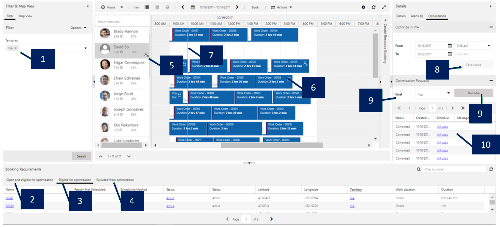
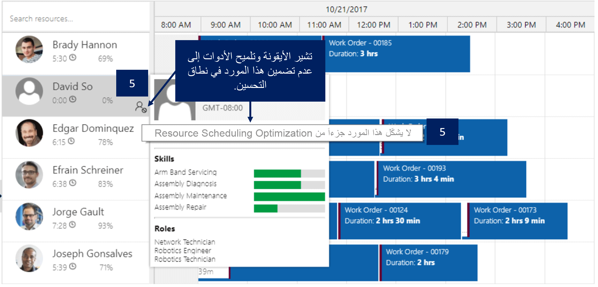
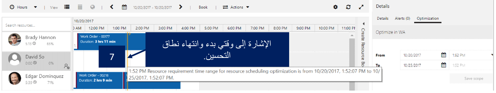
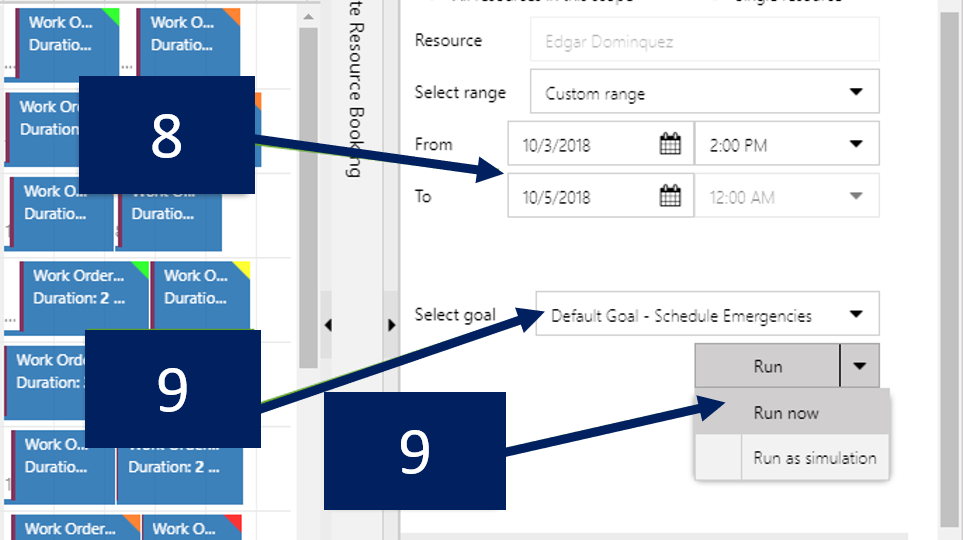

## استخدام لوحة الجدولة للمساعدة على تحسين الأداء

بعد أن تحدد المؤسسة أهدافها ونطاقاتها وجداولها، تحتاج إلى إدارة جدولتها وتنفيذها بشكل تلقائي. يمكن للمرسلين أو مديري الجدولة استخدام لوحة الجدولة للحصول على نظرة أعمق حول كيفية تحسين العناصر ومراجعة النتائج والعمل مع طلبات التحسين.

باستخدام تكامل لوحة الجدولة، يمكن للمؤسسات:

-   **فهم نطاقات التحسين على نحو أفضل** - يتوفر كل نطاق تحسين تم إنشاؤه من لوحة الجدولة. عند تحديد النطاق، يتم عرض أية موارد ومتطلبات وحجوزات ضمن النطاق على لوحة الجدولة.

-   **عرض نتائج التحسين بطريقة مرئية** - ومع تحسين النتائج، يتم عرضها في واجهة لوحة الجدولة المألوفة لتسهيل فهم المرسلين أو مديري الموارد للنتائج.

-   **تحليل طلبات تحسين الأداء الفاشلة** - معلومات تفصيلية حول طلبات التحسين، بما في ذلك تفاصيل حول الأصناف التي فشل تحسينها، والمتوفرة. ويمكن للمؤسسات التعرف على سبب فشل الأصناف المحددة وإجراء التعديلات حسب الحاجة.

-   **إنشاء جدول جديد تلقائياً** - يمكن إنشاء جداول جديدة وتشغيلها من خلال لوحة الجدولة حسب الحاجة.

تعرض الصورة التالية مثالاً لما تبدو عليه لوحة الجدولة عند استخدامها للاستفادة من وظائف التحسين.

يتم عرض الميزات التالية في لوحة الجدولة، كما هو موضح في الصورة: 

1.  تتطابق عوامل التصفية المحددة مسبقاً مع عوامل التصفية التي تم تعريفها للنطاق المستخدم حالياً.

2.  تعرض علامة التبويب **مفتوح ومؤهل للتحسين** كافة المتطلبات غير المجدولة المؤهلة التي تطابق تعريف النطاق ونطاق الطلب وإعداد حالة المتطلبات.

3.  تعرض علامة التبويب **مؤهل للتحسين** جميع المتطلبات غير المجدولة المؤهلة وأي حجوزات مؤهلة لإعادة تحسينها بحيث تتطابق مع تعريف النطاق ونطاق المتطلبات وإعداد حالة المتطلبات.

4.  تعرض علامة التبويب **مستبعد من التحسين** أي متطلبات أهلية أو حجوزات لا يتم تحسينها لأسباب معينة (مثل خط الطول/خط العرض غير الصالح).

5.  يشير الرمز وتراتب الأدوات المطابق في زاوية سجل اسم المورد إلى أن المورد ليس في نطاق التحسين.

    

6.  تشير الأداة ورمز القفل إلى أنه تم تأمين الحجز.

    

7.  تشير الخطوط الصفراء إلى وقت البدء والانتهاء لنطاق تحسين الأداء.

    

8.  ويطابق الحقلان **من** و **إلى** من التواريخ والأوقات نطاق الوقت الذي تم تحديده في نطاق التحسين.

    يمكن تعديل هذه النطاقات من هذه الشاشة، ويمكن حفظ أية تغييرات يتم إجراؤها مرة أخرى إلى النطاق الأصلي.

    > [!NOTE]
    > في حالة الإشارة إلى نفس النطاق بواسطة جداول تحسين متعددة، سيتم تطبيق التغيير على كافة هذه الجداول بنفس النطاق.

9.  بعد تحديد الهدف، يمكنك تشغيل طلبات التحسين حسب الطلب عن طريق تحديد الزر **التشغيل الآن**.

    

10. إظهار حالة طلب التحسين وتفاصيله.

    -   في حالة حدوث استثناء، يمكن فتح الطلب لعرض التفاصيل.

    -   يوفر هذا الخيار أيضاً تفاصيل الحجز والرسوم البيانية التحليلية التي توضح عدد ساعات وقت السفر مقابل عدد ساعات العمل المجدولة لهذا التشغيل.

يمكن أن يكون امتلاك القدرة على استخدام لوحة الجدولة مفيداً في السيناريوهات التي قد يحتاج فيها المرسل إلى تقييم ما يحدث للمساعدة على إملاء قرارات الجدولة.

على سبيل المثال، قد يقوم المرسل بفحص نطاق تحسين تم إنشاؤه للعمل مع العناصر والموارد في ولاية واشنطن. عندما يحدد المرسل نطاق واشنطن من لوحة الجدولة، يمكنه معرفة الموارد وسجلات المتطلبات والأصناف المجدولة حاليا ضمن النطاق. إذا أراد المرسل تعديل نطاق التاريخ للسجلات المتضمنة، فيمكنه إجراء هذه التغييرات مباشرة من لوحة الجدولة. إذا كان يجب أن تنعكس هذه التغييرات في النطاق الذي يتحرك إلى الأمام، يمكن حفظها مباشرة إلى النطاق من لوحة الجدولة.

إذا كان المرسل حالياً أكثر اهتماماً بزيادة الإنتاجية بدلاً من العثور على الفني الأكثر تأهيلاً، فيمكنه تحديد هدف التحسين الذي يجب استخدامه. إذا تم تعيين العناصر لتشغيلها كمحاكة، يمكن للمرسل محاكاة النتائج أولاً ثم تحديد أي منها سيكون أكثر فعالية قبل تطبيقها.

راجع [استخدام لوحة الجدولة لنتائج تحسين الأداء](/dynamics365/customer-engagement/field-service/rso-schedule-optimization#leveraging-the-schedule-board-to-review-optimization-results/?azure-portal=true). 

## عندما لا يتم تخصيص الموارد للحجوزات

عند تشغيل وظائف التحسين لأول مرة، قد تلاحظ أنه لم يتم تعيين بعض (أو كافة) الموارد للحجوزات. في حين أن العديد من الأسباب المختلفة لهذا التواجد موجودة، السبب المحتمل مرتبط بتكوين مورد. يمكن أن تؤدي الموارد التي تم تكوينها بشكل غير صحيح إلى مشكلات مثل عدم وجود المورد ضمن نطاق التحسين المحدد أو عدم وجود الإعدادات المناسبة المعرفة في سجل الموارد لضمان إمكانية تحسينها.

في هذه الحالة، الخطوة الأولى هي مراجعة نتائج التحسين من لوحة الجدولة ودراسة مهمة طلب التحسين المطابقة. يتيح لك هذا الإجراء فحص طريقة عرض المورد التي ستحدد الموارد التي كانت في النطاق حتى تتمكن من البدء في البحث عن أسباب عدم جدولة الحجوزات.

خذ بعين الاعتبار العناصر التالية المرتبطة بسجلات الموارد:

-   **المناطق** - تحديد ما إذا كانت الموارد تحتوي على مناطق موارد مرتبطة تتوافق مع مناطق المتطلبات.

-   **سمات المورد** - تحقق دائماً من تعيين حقل **تحسين الجدولة** إلى **نعم**. بالإضافة إلى ذلك، يجب مراعاة المعلمات التالية:   

    -   إذا كان لدى الموارد مجموعة مواقع البدء والانتهاء

    -   إذا كانت مواقع المورد تحتوي على ترميز جغرافي

        -   يتم الاحتفاظ بالرمز الجغرافي لعنوان الوحدة التنظيمية في الوحدة التنظيمية ذات الصلة

        -   يتم الاحتفاظ بالرمز الجغرافي لعنوان المورد على مستخدم المورد ذي الصلة، جهة الاتصال، وهكذا

-   **خصائص المورد** - تحديد ما إذا كان للمورد أي من الصفات المطلوبة ومستويات المهارة المطلوبة.

-   **ساعات عمل المورد** - تحقق مما إذا كانت ساعات عمل المورد مكونة وما إذا كانت متوفرة أثناء نطاق تحسين الأداء.

    -   إذا كانت هذه المكونات غير مكونة، فلا يزال من الممكن جدولتها.

    -   قد يتم تعيينها لكي لا تعمل في الأيام التي يتم تحسين أدائها وفقاً لنطاق التشغيل RSO.

    بالإضافة إلى ذلك، خذ بعين الاعتبار إذا كان المورد يحتوي على أية عناصر مثل طلبات المهلة التي تم إنشاؤها أو الموافقة عليها للفترة التي يتم تحسينها.

-   **حالة المورد** - تحقق مما إذا كانت حالة المورد معينة على **نشط**. وإذا لم يكن كذلك، فلن يتم تضمين المورد إلا إذا كان النطاق يبحث في الموارد النشطة.

-   **تفضيلات المورد** - بينما هذا السيناريو غير محتمل، تحقق مما إذا كانت تفضيلات الموارد ستقوم باستبعاد المورد من اعتبار كافة أوامر العمل ومتطلبات الموارد الممكنة الخاصة بها.

