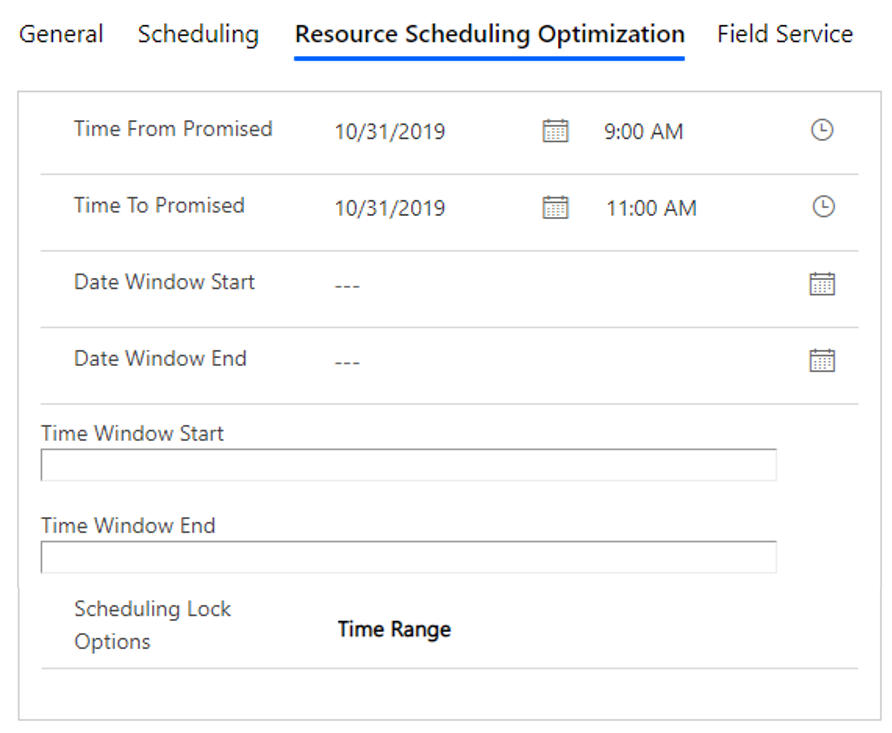
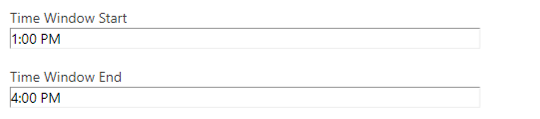
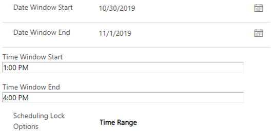
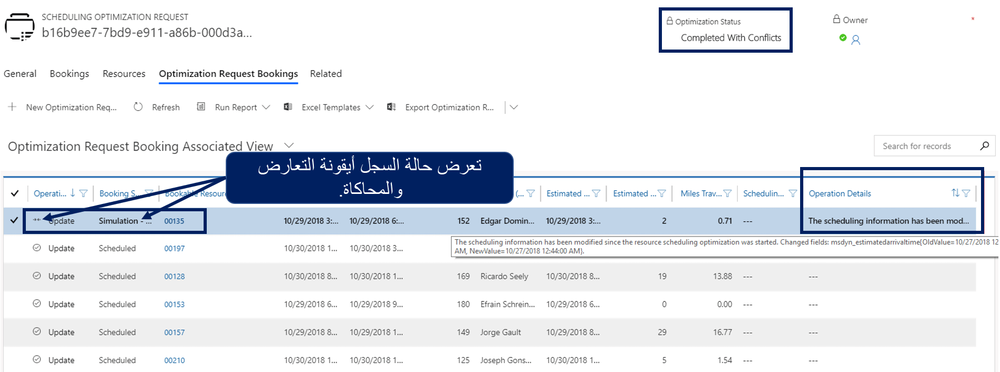
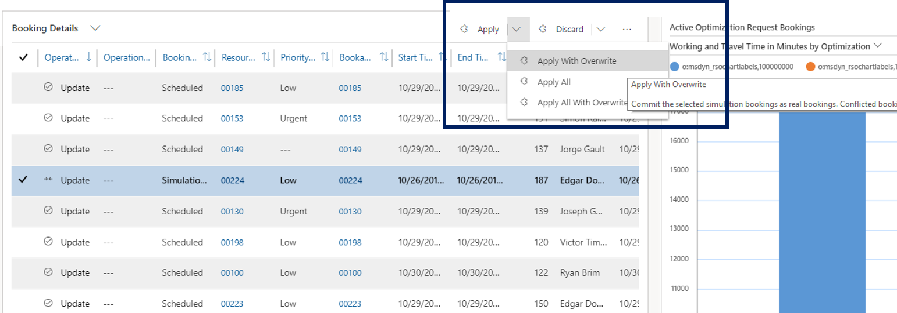
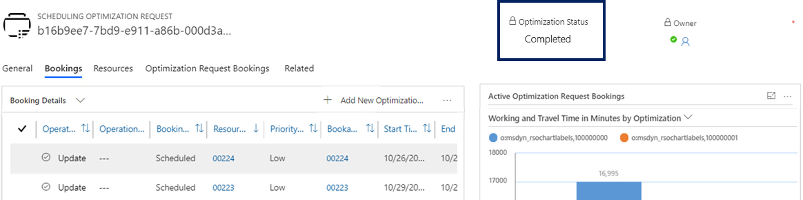

## العمل مع خيارات تأمين الحجز

في كثير من الأحيان، قد يكون للعملاء تفضيلات بشأن الوقت الذي يجب أن تتم فيه جدولة صنف ما، وقد يفضلون أيضاً مورداً معيناً. بعد جدولة هذا الصنف وإنشاء سجل حجز له، قد ترغب المؤسسات في التأكد من عدم تعديله عند تشغيل وظيفة التحسين. بدلاً من ذلك، ربما يتمتع العميل ببعض المرونة في الوقت الذي تمت جدولة الحجز له ولكن ليس المورد الذي تم تعيينه له.

عند تشغيل وظائف التحسين، تحتاج الوظيفة إلى معرفة ما إذا كان الحجز يتمتع بالمرونة التي يمكن نقلها أو ما إذا كان يلزم قفله لفترة زمنية أو مورد معين. يمكنك إكمال هذه المهمة من خلال تحديد خيارات تأمين الجدولة، والتي توجد في علامة التبويب **Resource Scheduling Optimization** في سجل الحجز.

الأنواع الأربعة لخيارات تأمين الجدولة التي يدعمها Resource Scheduling Optimization (RSO) هي:

-   **المورد** - عند تشغيل RSO، يمكن نقل الحجز إلى أوقات أخرى، ولكن يجب أن يظل الحجز معيناً إلى نفس المورد.

-   **الوقت** - يمكن لـ RSO تعيين الحجز لموارد أخرى، ولكن يجب أن يحافظ الحجز على نفس وقت الوصول المقدر.

-   **المورد والوقت** - لا يمكن لـ RSO نقل الحجوزات إلى أي مورد آخر أو في أي وقت آخر، ولكن يمكنه إجراء بعض التغييرات.

    -   ستحتفظ RSO بوقت الوصول المقدر والمورد المعين.

    -   قد يتم تغيير وقت بدء الحجز ومدة السفر المقدرة إذا حددت جدولة RSO حجزاً في موقع جديد قبل أن يكون هذا حجزاً مؤمناً.

-   **النطاق الزمني** - يمكن RSO نقل حجز باستخدام خيار التأمين هذا ضمن نطاقات زمنية معينة (تأكد من أن وقت الوصول المقدر يقع في هذا النطاق الزمني).

    كما أن RSO قادر على إعادة تعيين الحجوزات إلى موارد أخرى من خلال احترام هذا النطاق الزمني والحقول التالية المتعلقة بالوقت.

### خيار النطاق الزمني

معظم خيارات تأمين الجدولة يتم تقديمها مباشرةً. لا يمكن لـ RSO نقل الحجز إلى مورد أو وقت مختلف بناءً على الخيارات المحددة. يعد الخيار **النطاق الزمني** أكثر تعقيداً بعض الشيء.
عندما تختار استخدام نطاق زمني، ستنظر RSO في القيم التي تم تعيينها للحقول، مثل القيم الموجودة في الحقول **وقت بدء التعهد**، **وقت انتهاء التعهد**، **بداية إطار التاريخ**، **نهاية إطار التاريخ**، **‏‫بداية الإطار الزمني**، **‫نهاية الإطار الزمني** لتحديد كيفية نقل الحجز.

تبحث الأقسام التالية عن كثب في كيفية عمل هذا السيناريو استناداً إلى مجموعات مختلفة من القيم التي تم تعيينها لحقول مختلفة.

### بداية إطار التاريخ و‏‫نهاية إطار التاريخ

عندما تحتوي الحقول **‏‫بداية إطار التاريخ** وكذلك **‏‫نهاية إطار التاريخ**، سيحاول RSO إعادة فتح الحجز خلال نطاق الموعد هذا. يشير هذا التكرار لـ RSO إلى أنه يجب أن يهتم بجدولة الحجز في التواريخ المحددة وأن الوقت من اليوم غير مهم. يمكن تعيين الحجز إلى مورد آخر إذا حدث خلال النطاق الزمني المحدد.

على سبيل المثال، إذا كان كلا الحقلين  **‏‫بداية إطار التاريخ‬** وكذلك  **‎‏نهاية إطار التاريخ** يتم تعيينهما بتاريخ **11/1/2019**، فإن RSO يعرف إعادة فتح هذا الحجز لأي مورد في أي وقت في 11/1/2019.

### ‫بداية الإطار الزمني‬ و‏‫نهاية الإطار الزمني‬

عندما تحتوي الحقول **‏‫بداية الإطار الزمني** وكذلك **‏‫نهاية الإطار الزمني**، سيحاول RSO إعادة فتح الحجز خلال ذلك إطار زمني. يشير هذا الموقف إلى RSO أنه يجب أن يكون أكثر اهتماماً بجدولة الحجز خلال النافذة الزمنية التي تم تحديدها وأن اليوم الذي تم فيه الحجز غير مهم. يمكن تعيين الحجز إلى مورد آخر إذا حدث خلال النطاق الزمني المحدد.

على سبيل المثال، إذا تم تعيين الحقل **‏‫بداية الإطار الزمني‬** إلى **1:00 م**، وتم تعيين الحقل **نهاية الإطار الزمني** إلى **4:00 م**،سيقوم RSO بإعادة فتح توقيت هذا الحجز لأي مورد ومكان في أي يوم إذا كان وقت البدء المقدر للحجز يقع في وقت ما بين 1:00 م و4:00 م.

### بداية/نهاية إطار التاريخ وبداية/نهاية الإطار الزمني

في وحدات السيناريو عندما يتم تحديد كافة حقول **بداية إطار التاريخ** وكذلك **نهاية إطار التاريخ** و **بداية الإطار الزمني** و **نهاية الإطار الزمني**، سيعيد RSO فتح الحجز في كل من البيانات الخاصة بالتاريخ والوقت المحددة. مثل السيناريوهات المذكورة سابقاً، يمكن تعيين الحجز لمورد آخر إذا كان ضمن إطارات البيانات والوقت.

على سبيل المثال، افترض أنه تم تعيين الحقل **‏‫بداية إطار التاريخ‬** إلى **10/30/2019**، فإنه يتم تعيين الحقل **نهاية إطار التاريخ** إلى **11/1/2019** ، ويتم تعيين الحقل **بداية الإطار الزمني** إلى **1:00 م** ، ويتم تعيين الحقل **نهاية الإطار الزمني** إلى **4:00 م**. في هذا السيناريو، يمكن لـ RSO إعادة فتح هذا الحجز لأي مورد ثم جدولته ليتم إجراؤه في 10/30/2019 أو 10/31/2019 أو 11/1/2019. سيقع وقت البدء المقدر للحجز في مكان ما بين 1:00 مساءً و4:00 مساءً في أي يوم تم تعيينه له.

### وقت بدء التعهد‬ ووقت انتهاء التعهد‬

عندما يحتوي حقلا **وقت بدء التعهد** وكذلك **وقت انتهاء التعهد** على البيانات، فهذا يشير إلى أن إطار التاريخ والوقت المحددين تم تعهدهما للعميل. يعني هذا المؤشر عادةً أن العميل لديه تاريخ ووقت محددان يريدان ظهور الصنف فيهما.

على سبيل المثال، إذا تم تعيين الحقل **وقت بدء التعهد** على **10/31/2019 في 9:00 ص** والحقل **وقت انتهاء التعهد** على **10/31/2019 في 11:00 ص**، ستحتاج إذن إلى جدولة RSO للحجز بين الساعة 9:00 صباحًا و11:00 صباحًا في 10/31/2019 ويجب أن يكون ضمن هذا التاريخ المحدد والنطاق الزمني المحدد.

تحدث سيناريوهات معينة عند الحقلين **وقت بدء التعهد** وكذلك **وقت انتهاء التعهد** ويتم تحديد الحقول **بداية إطار التاريخ** وكذلك **نهاية إطار التاريخ**.
اعتماداً على القيم المحددة، يمكن أن يؤدي هذا السيناريو إلى حدوث تعارض. في هذه السيناريوهات، سيستخدم RSO الحقلين **‏‫وقت بدء التعهد‬** وكذلك **وقت انتهاء التعهد** أولاً. بعد ذلك، سيستخدم حقلاً واحداً أو مجموعة من الحقول الأخرى لجدولة الصنف.

> [!IMPORTANT]
> عندما تعمل مع نطاقات زمنية، ستضمن RSO أن وقت الوصول المقدر يقع في الإطار الذي تم تحديده مسبقاً. لا يضمن أن يقع وقت انتهاء الحجز ضمن الإطار الزمني. 

> [!VIDEO https://www.microsoft.com/videoplayer/embed/RE4ksp8]

راجع [خيار تأمين الحجز](/dynamics365/customer-engagement/field-service/rso-schedule-optimization#understanding-the-booking-lock-option/?azure-portal=true) لمزيد من المعلومات. 

## التعامل مع تعارضات الحجز وحلها

اعتماداً على الاحتياجات المحددة للمؤسسة، يمكن تشغيل وظائف التحسين في نقاط مختلفة خلال أي يوم معين. يمكن تعيين وظائف التحسين للعمل كل ساعة أو في فترات زمنية محددة. من حين لآخر، يتم تشغيل وظائف التحسين استناداً إلى الأحداث التي تحدث مثل الإلغاء أو إنشاء صنف. في الوقت نفسه، قد يقوم المرسلون والفنيون والأعضاء الآخرون في المنظمة بتحرير الحجوزات أو المتطلبات الفردية. يمكن أن يتسبب هذا الموقف في حدوث تعارضات.
ستنشأ التعارضات عندما يتم تحرير مورد ذي صلة أو متطلب أو حجز أثناء التحسين. يجب ألا يكون أعضاء المؤسسة قادرين على تحديد هذه المؤسسة فحسب، بل يجب عليهم أيضاً حلها لضمان أن يتمكن الجميع من مواصلة العمل على الأصناف.

يوفر حل Resource Scheduling Optimization القدرة على فهم هذه التعارضات وخيارات حلها. عند مواجهة طلب تحسين، ستظهر حالة الوظيفة **مكتمل مع التعارضات**. (في الإصدارات السابقة من التطبيق، ستظهر الحالة بالشكل فشل).

عند فتح "طلب التحسين"، يمكن مراجعة حجوزات طلب التحسين الفردي عن طريق تحديد **مرتبط** ثم تحديد **حجوزات طلبات التحسين**. من عرض **حجوزات طلبات التحسين**، يمكنك مشاهدة كافة الحجوزات التي كانت موجودة في النطاق. ستتمتع الحجوزات التي أدت إلى التعارض بحالة محاكاة وأيقونة متضاربة. يتم التعامل مع الحجز المتعارض على أنه محاكاة، ويمكنك تحديد ما إذا كنت تريد متابعة النتيجة المحسّنة أو متابعة الصنف الذي تم تعديله يدوياً.

أيضاً، سيوفر عمود تفاصيل العملية تفاصيل إضافية حول السجل مثل البيانات المحددة التي تم تعديلها أثناء التحسين.

لحل التعارض، يجب السماح لطلب التحسين بمعرفة الخيار الذي سيتم استخدامه. يمكن إكمال هذه المهمة عن طريق تحديد الحجوزات بحالة المحاكاة ثم اختيار أي من الخيارات التالية:

-   **تطبيق مع الاستبدال** - يتيح حجز المحاكاة للسجلات المحددة كحجوزات حقيقية. سيتم الكتابة فوق أي حجوزات متضاربة.

-   **تجاهل** - إزالة حجز المحاكاة، ويفضل تعديلات الحجز اليدوية التي تم إجراؤها بواسطة المرسل أو الفني الميداني.

بعد حل كل صنف من الأصناف المتعارضة إما عن طريق تحديد **تطبيق مع الاستبدال** أو **التجاهل**، فإن حالة التحسين ستكون التغيير إلى مكتمل.

> [!VIDEO https://www.microsoft.com/videoplayer/embed/RE4kuSO]

راجع [حل تعارضات الحجز](/dynamics365/customer-engagement/field-service/rso-handling-resolving-booking-conflicts) لمزيد من المعلومات.
