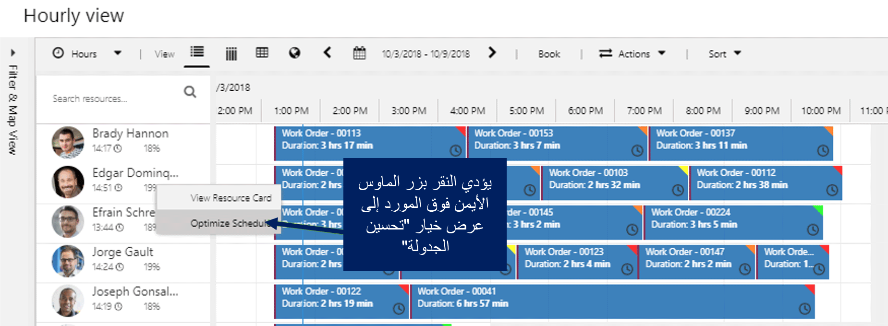
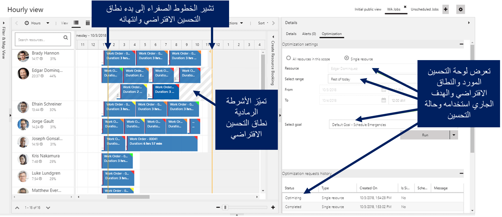
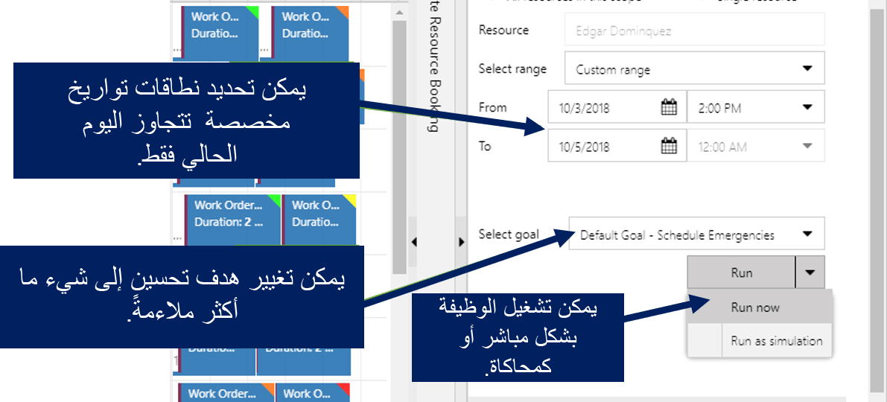
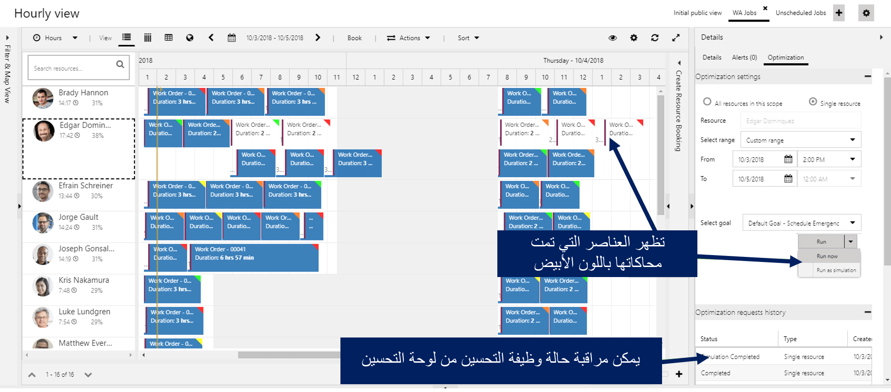

توفر ميزة تحسين مورد واحد الخاصة بـ Resource Scheduling Optimization طريقة سريعة وبسيطة لإعادة فتح الجدول الزمني لمورد محدد من لوحة الجدولة. يمكن إكمال هذه المهمة لضمان استمرار المورد في الحصول على الجدول الزمني والمسار الأمثل بعد حدوث تغييرات الجدول أو الإلغاءات أثناء اليوم.

على سبيل المثال، قد يكون لأحد الموارد حجوزات متداخلة بعد تعيين أمر عمل طارئ أو بعد وصوله متأخراً بسبب حركة المرور خلال اليوم. يجب تعديل هذه الحجوزات للتأكد من أن الفني قادر على إكمال العمل اللازم حسب الحاجة.

قبل تعديل جدول الموارد باستخدام جدولة مورد واحد، يجب أن يحتوي سجل المورد القابل للحجز لهذا المستخدم على مجموعة خيارات **تحسين الجدولة** على **نعم**. بالإضافة إلى ذلك، تستخدم جدولة مورد واحد هدف تحسين المورد الافتراضي للمؤسسة. عند نشر RSO، يتم إنشاء هدف افتراضي للمؤسسة. يمكن العثور على الهدف الافتراضي وتغييره، إذا رغبت في ذلك، فعليك الانتقال إلى **Resource Scheduling Optimization > أهداف التحسين**.

لن يؤدي تحسين مورد واحد إلا إلى إعادة فتح الحجوزات الحالية؛ ولن يتم إنشاء حجوزات جديدة. بالإضافة إلى ذلك، يمكن تطبيقه وإعادة فتح الحجوزات التي تم حجزها في الأصل يدوياً أو عن طريق البحث عن الموارد المتاحة وأي حجوزات تم إنشاؤها من المتطلبات غير المحددة للموقع.

### استخدام تحسين مورد واحد من لوحة الجدولة

هناك طريقتان لاستخدام ميزة تحسين مورد واحد من لوحة الجدولة هما:

-   **بنقرة واحدة على الإعدادات الافتراضية** - قم بتحسين الجداول الخاصة بمورد واحد بنقرة واحدة باستخدام الهدف الافتراضي بنطاق زمني معين لنهاية اليوم الحالي. يمكن تنفيذ هذه المهمة من أي طريقة عرض للوحة الجدولة.

-   **خيارات متقدمة مع عمليات التحرير** - قم بتحسين الجداول الزمنية الخاصة بمورد واحد مع خيار تحرير الهدف والنطاق الزمني وخيار التشغيل كمحاكاة وتطبيق النتائج أو تجاهلها.
    هذا الخيار يمكن فقط من عرض لوحة الجدولة المرتبطة بنطاق تحسين الأداء الخاص بك.

### نقرة واحدة على الإعدادات الافتراضية

يمكن أن يكون استخدام خيار **نقرة واحدة** الذي يستخدم هدف التحسين الافتراضي للمؤسسة مفيداً عندما تحتاج إلى تحسين جدولة الموارد بسرعة من النقطة الحالية إلى نهاية اليوم.

على سبيل المثال، قد يكون هدف التحسين الافتراضي للمؤسسة هو زيادة الإنتاجية مع تقليل السفر. وكلما تحرك أحد الفنيين خلال اليوم،فقد ينتهي به الأمر إلى قضاء وقت أطول من الموعد المخصص في الأصل. ونتيجة لذلك، يكون لدى الفني بعض التداخل في الحجوزات الحالية. في هذه الحالة، قد يكون استخدام **نقرة واحدة** مثالياً لأنه سيظهر في الحجوزات الموجودة ويعيد الترتيب حسب الحاجة لإصلاح التداخل في الجدولة.

لبدء تحسين أداء مورد واحد من لوحة الجدولة، انقر بزر الماوس الأيمن على اسم المورد ثم حدد **تحسين الجدولة** لبدء تحسين مورد محدد.

كما هو موضح في الصورة التالية، تشير الخطوط الصفراء إلى نطاق التحسين الافتراضي، وهو في هذا المثال، من الآن وحتى نهاية اليوم (12:00 صباحاً). بالإضافة إلى ذلك، يحدد القناع الرمادي أيضاً نطاق التحسين الافتراضي، من الآن وحتى نهاية اليوم (12:00 صباحاً). تظهر لوحة التحسين المورد المحدد حالياً والنطاق الافتراضي لتحسين الأداء والهدف الافتراضي وحالة طلب تحسين الأداء.

### التحسين المتقدم مع عمليات التحرير

في الحالات التي ترغب فيها في الحصول على مزيد من التحكم في كيفية تحسين مورد واحد، يمكنك ضبط إعدادات الوظيفة من علامة التبويب **تحسين الأداء** الخاصة بجزء التفاصيل. عند تثبيت RSO، تتم إضافة علامة تبويب **تحسين الأداء** تلقائياً إلى جزء التفاصيل بلوحة الجدولة. يمكن استخدام علامة التبويب لتعديل الإعدادات وضبطها لتحسين الموارد الفردية أو مجموعات الموارد.

عند القيام بتحديد مورد فردي وفتح علامة التبويب، يمكنك تحديد مورد واحد وستتمكن بعد ذلك من ضبط جدول الموارد الذي قمت بتحديده. من هنا، يمكنك تخصيص نطاق التحسين لأي تاريخ/وقت أو تغيير هدف التحسين حسب الحاجة.

على سبيل المثال، عندما يواجه أي من الفنيين تأخيرات وأثناء تأجيل المشاريع، قد تواجه سيناريو حيث يتم الحجز خارج ساعات العمل العادي. وقد يكون من الأفضل أن تقوم بنقل المهمة إلى اليوم التالي. في هذه الحالة، يمكن تعيين النطاق إلى نطاق مخصص يتضمن بقية اليوم وحتى اليوم التالي.

وقد يكون من المنطقي أيضاً استخدام هدف تحسين أداء مختلف بدلاً من الهدف الافتراضي للمؤسسة. وقد يسمح هذا النهج للمؤسسة بوضع مزيد من الأهمية على بعض العوامل مثل احترام أوقات العناصر المجدولة حالياً. في هذه الحالات، يمكن للمؤسسة تحديد هدف تحسين مختلف يكون أكثر تماشياً مع التوقعات.

على سبيل المثال، قد يكون لبعض الحجوزات التي تمت جدولة الفني الخاص بها على نوافذ زمنية محددة تم التعهد بها بالفعل. من خلال تحديد الهدف الذي يعطي أولوية أكبر للحجوزات المؤمّنة، يمكن للمؤسسة التأكد من ملء جداول الفنيين دون نقل هذه العناصر من الأوقات التي تعهدت بها سابقاً.

عندما يتم تكوين هدف بحيث يتم تشغيله كمحاكاة، فإن جداول التحسين تقوم بمحاكاة الحجوزات. سيتم عرض هذه الحجوزات التي تمت محاكاتها في لوحة الجدولة باللون الأبيض. يمكن للمستخدمين القيام باختيار تطبيق نتائج المحاكاة أو تجاهلها. لن تظهر الحجوزات التي تمت محاكاتها على خريطة بمسارات؛ ولكن، سيتم عرضها بعد تطبيقها.

أثناء تشغيل المهام، ستقوم شبكة **محفوظات طلبات تحسين الأداء** بعرض حالة المهام الحالية والسابقة. يمكن فتح هذه الأصناف لعرض مزيد من التفاصيل الخاصة بالوظيفة.

> [!VIDEO https://www.microsoft.com/videoplayer/embed/RE4kfoV]

راجع [كيفية استخدام تحسين مورد واحد](/dynamics365/customer-engagement/field-service/single-resource-optimization) لمزيد من المعلومات.

