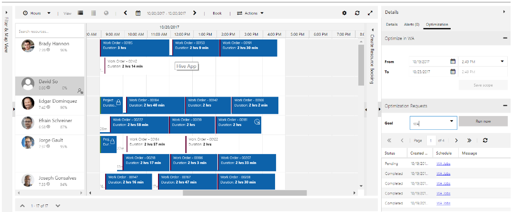

عندما تبدأ إحدى المؤسسات في استخدام Resource Scheduling Optimization (RSO)، فقد لا تدرك النتائج المرجوة المتوقعة عند تشغيل مهمة تحسين الأداء. تختلف الأسباب التي قد تجعلك لا ترى النتائج المطلوبة، مثل المهمة التي يتم تحريرها أثناء تشغيل مهمة التحسين، أو عدم العثور على السجلات المناسبة للتحسين.

في معظم الحالات، غالباً ما ترقى الأسباب إلى مشكلات التكوين. قد تمثل هذه المشكلات الموارد التي تم تكوينها بشكل غير صحيح مما يؤدي إلى عدم تضمينها في أحد النطاقات أو عدم توفرها للتحسين. وبدلاً من ذلك، قد تكون المشكلة هي أن المتطلبات والحجوزات لا تعكس الحالات أو التواريخ الصحيحة التي من شأنها ضمان تضمين الموارد في مهمة التحسين.

بينما يختلف كل سيناريو عن الآخر، توضح الأقسام التالية بعض المشكلات الأكثر شيوعاً التي قد تواجهها عند البدء باستخدام RSO.

### إلغاء جدول طويل الأمد أو جدول محظور

إذا كان الجدول قيد التشغيل لفترة طويلة ويبدو أنه عالق أو محظور، فيمكنك استخدام زر **إعادة تعيين Resource Scheduling Optimization** لمسح الوظيفة المحظورة وإعادة تعيين الجداول على حالة جيدة.

***فشل طلب التحسين مع ظهور الرسالة "فشل النظام في تعديل بعض الحجوزات."***

يمكن العثور على هذه الرسالة لعدة أسباب؛ ومع ذلك، سترى هذه الرسالة في الغالب للسيناريوهات التالية:

-   إذا تم تحديث عملية الحجز يدوياً أثناء تشغيل وظيفة RSO على نفس الحجز، فلن يقوم RSO بالكتابة فوق التغييرات وسيؤدي إلى فشل الطلب.

-   إذا كان لديك سير عمل/مكون إضافي يقوم بتحديث نفس الحجوزات أثناء تشغيل RSO، فلن يقوم RSO بالكتابة فوق التغييرات التي قام بها منطق النظام الآخر لديك وسيؤدي إلى فشل الطلب.

-   إذا كان لديك العديد من جداول RSO التي تشترك في نفس الموارد وتعمل في نفس الوقت، فقد تعرض RSO هذه الرسالة. لفهم الموقف واستكشاف الأخطاء وإصلاحها بشكل أفضل، يجب مراعاة الاقتراحات التالية:

    -   قم بالتمرير عبر شبكة حجز طلب التحسين وافحص عمود تفاصيل العملية لكل متطلب فردي وحجز.

    -   حدد ما إذا كان لديك جداول متعددة تشترك في نفس الموارد والمتطلبات والحجوزات التي يتم تشغيلها في نفس الوقت.  

    -   إذا كان لديك جدول واحد فقط، فتحقق مما إذا كان أي مستخدم آخر أو سير عمل آخر يحاول تحديث حجز أثناء التشغيل.

***فشل طلب التحسين مع ظهور الرسالة، "يجب أن يكون وقت بدء النافذة الزمنية أقل من وقت الانتهاء أو مساوياً له."***

وتشير هذه الرسالة إلى أنه تم تضمين بعض بيانات الحجز غير الصالحة في نطاق التحسين. على سبيل المثال، يمكن للمستخدم الاستعلام عن كيان الحجز لمعرفة ما إذا كان أية سجلات حجز لها مدة سفر مقدرة غير صالحة.

يمكنك تحديد التعبيرات التالية لطريقة العرض المستخدمة:

-   *مدة السفر المقدرة > وقت انتهاء الحجز - وقت بدء الحجز*

-   *المدة المقدرة للسفر> مدة الحجز*

### لم يتم جدولة أصناف المتطلبات

تتنوع الأسباب لماذا قد لا يتم حجز المتطلبات. أولاً، راجع نتائج التحسين من لوحة الجدولة والمطابقة **طلب التحسين > عرض الحجز** للبحث عن أسباب عدم جدولتها.

ومن إحدى الطرق التي يمكنك التحقق من صحتها بسرعة هي تحديد أحد متطلبات الموارد التي لن يتم جدولتها ثم استخدام مساعد الجدولة لمعرفة ما إذا كان سيعثر على نتائج أم لا. على الرغم من أن مساعد الجدولة وRSO غير متطابقين، إلا أنهما يقومان بالتقييم بناءً على معايير مماثلة. في حالة عثور مساعد الجدولة على النتائج، فسيقوم RSO بذلك أيضاً بشكل عام. إذا لم يتمكن مساعد الجدولة من العثور على أي نتائج، فمن المحتمل ألا يتمكن RSO من ذلك أيضاً. ومع ذلك، تحدث بعض السيناريوهات حيث قد يعثر مساعد الجدولة على نتائج ولن يتمكن RSO من القيام بها:

-   إذا تم العثور على مواردك كتطابقات محتملة، فلا يتم ضبط **تحسين الجدولة** على **نعم** (مما يعني أن RSO لن يأخذها بعين الاعتبار).

-   إذا كانت نوافذ التاريخ الخاصة بك موجودة في المتطلب خارج نطاق تشغيل RSO الخاص بك.

-   إذا كانت المنطقة الخاصة بك للمتطلبات لا تتطابق مع منطقة الموارد.

يمكن أن تساعدك التفاصيل التالية في تحليل المشكلة بشكل أكبر:

-   **طريقة الجدولة** - تحقق لمعرفة ما إذا تم تعيين **طريقة الجدولة** الخاصة بالمتطلبات على **تحسين**. تم تعيين هذا الحقل على **‏‫عدم التحسين** بطريقة افتراضية. ستحتاج إما إلى تعيينه يدوياً أو تكوين إعداد **تحسين بيانات التعريف لأمر العمل**.

-   **المناطق** - لا يعتمد نطاق RSO بالضرورة على المنطقة، ولكن لا يزال تشغيل RSO هو المنطقة المطابقة بين المتطلب والمورد:

    -   إذا تم تعيين أحد المتطلبات إلى منطقة ما، فيجب أيضاً تعيين المورد إلى تلك المنطقة حتى تتم جدولة المتطلب.

    -   إذا لم يتم تعيين أحد المتطلبات إلى قطاع جغرافي ما، فإن الموارد التي لا تنتمي إلى أي قطاع جغرافي هي المؤهلة فقط لهذا المتطلب.

-   **‏‫الخصائص‬** - قم بتحديد ما إذا كانت المتطلبات تتطلب خاصية يمتلكها أي من مواردك، ثم اسأل نفسك الأسئلة التالية:

    -   هل يتوفر لهذه الموارد ساعات عمل متاحة تشكل جزءاً من نطاق التشغيل؟

    -   وبناءً على هذه الموارد، هل هناك وظائف أخرى كان من المقرر/ينبغي جدولتها أولاً استناداً إلى أهداف التشغيل الخاصة بك؟

-   **‏‫الموارد المقيدة** - حدد ما إذا كان المتطلب مستبعداً من التعيين إلى مورد لأنه تم وضع علامة على المورد كمقيد. هذا الفحص قابل للتطبيق فقط إذا تم تمكين **الموارد المقيدة** .

-   **التاريخ/معلمات الوقت** - اسأل نفسك الأسئلة التالية للمساعدة في تحديد المشكلة:

    -   هل تحتوي المتطلبات الخاصة بك على نافذة **تاريخ بدء الصلاحية** وكذلك **تاريخ انتهاء الصلاحية** التي تقع داخل نطاق التشغيل الأمثل؟

    -   هل تشتمل المتطلبات الخاصة بك على نافذة **‏‫وقت بدء التعهد‬** وكذلك **وقت انتهاء التعهد** التي تقع داخل النطاق؟

    -   هل أي من حقول التاريخ الخاصة تقوم بإنشاء سيناريو غير ممكن؟ على سبيل المثال:

        -   يكون **تاريخ بدء الصلاحية** الخاص بك بعد **وقت انتهاء التعهد**.

        -   يكون **تاريخ انتهاء الصلاحية** قبل **وقت بدء التعهد**.

-   **القدرة الإنتاجية** - تحقق من أن لديك القدرة الكافية لالتقاط جميع الأعمال في النطاق الخاص بك.

    -   إذا لم يكن الأمر كذلك، فتحقق مما إذا كان هناك سبب وجيه لعدم تحديد هذا المطلب بناءً على أهدافك مقارنة بالمتطلبات الأخرى المحتملة.

    -   حدد ما إذا كان لديك قدرة إنتاجية كافية بناءً على الخصائص المطلوبة وتفضيلات الموارد ضمن نطاق التشغيل (مع كافة العوامل المساهمة الأخرى).

-   **‏‫الموقع الجغرافي** - إذا تم تعيين **موقع العمل** للمتطلبات المحددة على **في الموقع**، يجب أن يكون لمتطلبات الموارد خط عرض وخط طول صالحين.

    بالإضافة إلى ذلك، تحقق لمعرفة ما إذا كان لدى المورد الوقت للوصول إلى الوظيفة ومنها.

-   **المدة** - تحقق لمعرفة ما إذا كانت مدة متطلبات المورد أكبر من الصفر (0)، وما إذا كانت المدة المستوفاة تساوي الصفر (0).

    تحقق أيضاً مما إذا كان للمتطلب مدة تتلاءم مع تحول المورد. لا يدعم RSO حالياً تقسيم أحد المتطلبات إلى حجوزات متعددة.

-   **الحالة** - تحقق مما إذا كانت حالة متطلبات المورد تم تعيينها على **نشط**.

-   **الحجوزات ذات الصلة** - حدد ما إذا كان للمتطلب بالفعل سجل حجز ذي صلة. وإذا كان الأمر كذلك، فقم بالتأكيد على ما إذا كان لسجل الحجز المرتبط حالة حجز ذات صلة باستخدام حقل **‏‫طريقة الجدولة‬** بقيمة أخرى غير **تجاهل**.

-   **تحسين مستوى جهد المحرك** - قد تحتاج متطلبات التحسين الأكبر مزيداً من الوقت للتحسين. ضع في اعتبارك زيادة مستوى جهد المحرك لمنحه مزيداً من الوقت للعثور على مهمة مناسبة.

### تتم إزالة بعض الحجوزات السابقة

قد يتم نقل حجز سابق إذا كانت حالة الحجز الخاصة به تشير إلى أنه يجب تحسينه وإذا تم تضمين هذا الحجز في عرض الحجز لنطاق التحسين. وبالتالي، قد يظهر (بشكل خاص في سيناريو الاختبار حيث لم يتم إكمال العمل بالفعل) الذي يتم إعادة جدولة جميع الحجوزات السابقة إذا لم يقم أحد بتغيير الحجز إلى حالة حجز من شأنها أن تمنع نقل السجل.

تتضمن بعض الطرق التي يمكنك من خلالها منع RSO من نقل الحجوزات السابقة ما يلي:

-   حدد حالة الحجز الخاصة بـ "لا تقم بالنقل".

-   قم بإزالة الحجز من عرض الحجز.

-   تأمين الحجز لفترة زمنية أو نطاق زمني في الماضي.

-   قم بتعيين تاريخ التعهد من/إلى أو التاريخ من/إلى أثناء تمكين قيد النافذة الزمنية.

## العديد من الحجوزات في حالة محاكاة

إذا حدث أي استثناء أو خطأ عندما يكون جدول التحسين قيد التشغيل، فقد ترى بعض التداخل على لوحة الجدولة نظراً لأن بعض الحجوزات تم إنشاؤها أو تحديثها من التشغيل الأخير، بينما فشل حذف عمليات الحجز الأخرى من التشغيل السابق بسبب حدوث استثناء. لتجنب هذا السيناريو، يتم إجراء عملية التحسين تلقائياً وفي صورة معاملات من خلال تقديم حالة **المحاكاة** . 

وأثناء عملية التحسين، تظهر الآن عمليات الإنشاء والتحديث والحذف. جميع الحجوزات الجديدة والمراد تحديثها والتي سيتم حذفها موجودة في منطقة انطلاق **المحاكاة** . وفي حالة اكتمال طلب التحسين بالكامل وتصحيحه، فسيتم عكس حجوزات المحاكاة هذه في الحجوزات الحقيقية. قبل اكتمال طلب التحسين، يمكنك رؤية بعض حجوزات حالة المحاكاة (الشفافة) تنتقل خلال لوحة الجدولة حتى اكتمال التشغيل. بعد ذلك، سيتم عكس جميع حجوزات المحاكاة في الحجوزات الحقيقية (أزرق خالص). في حالة حدوث استثناء وفشل طلب التحسين، ستظل حجوزات المحاكاة هذه في حالة المحاكاة لأغراض استكشاف الأخطاء وإصلاحها ما لم تقم بحذفها يدوياً.
وإلا، فستقوم وظيفة النظام بحذفها تلقائياً كل أسبوعين.

](../media/simulation-staging-area.png#lightbox)

يمكنك إخفاء حجوزات المحاكاة عن طريق تغيير إعدادات لوحة الجدولة. حدد رمز الترس أعلى اليسار وحدد الخيار **‏‫إخفاء الملغى** .
