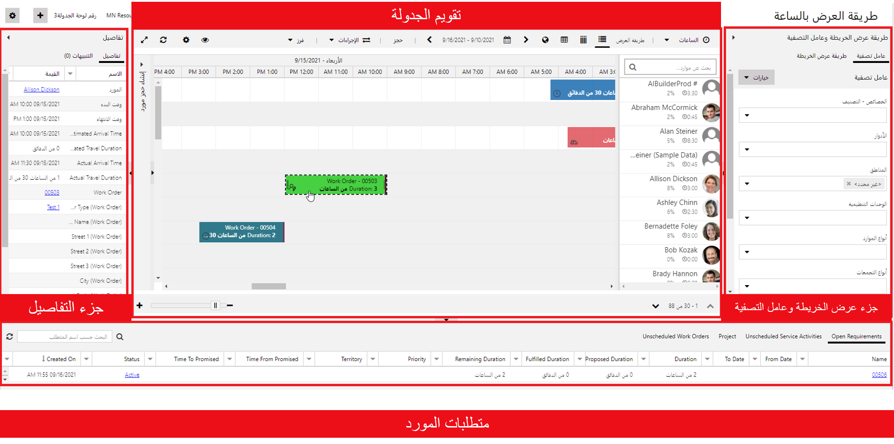
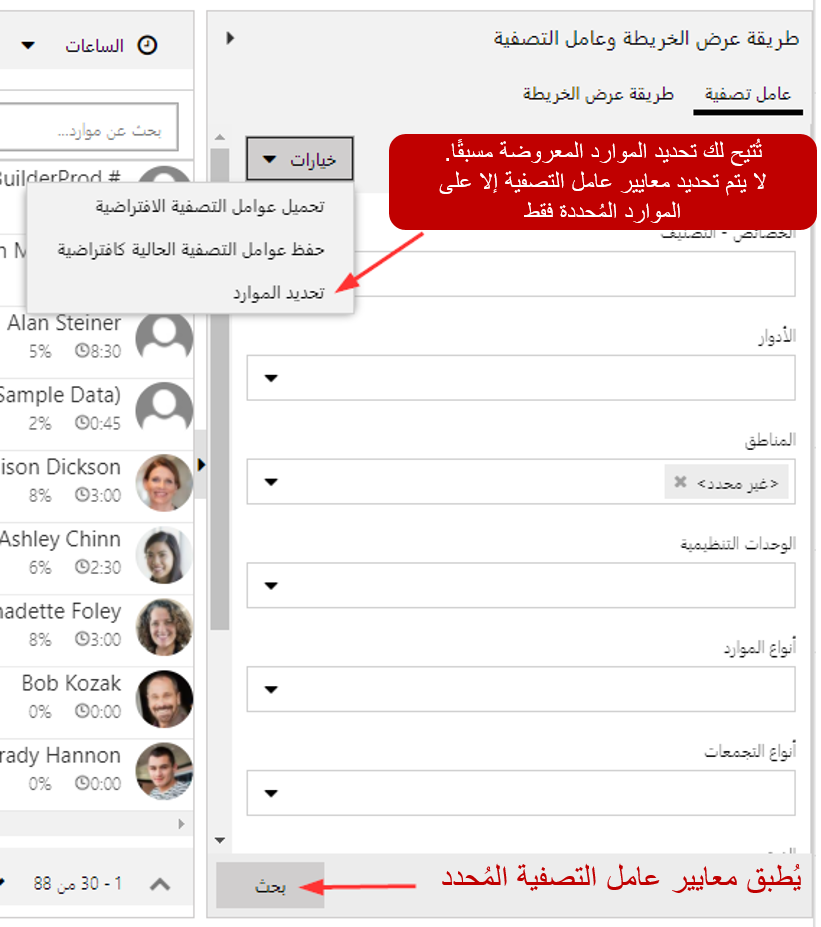
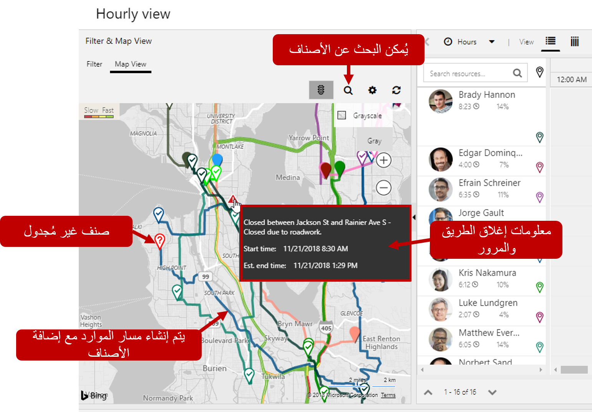
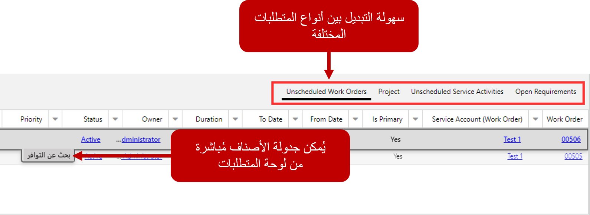

عادة ما يحتاج المرسلون في المؤسسات إلى الكثير من المعلومات التي تحت تصرفهم. اعتماداً على حجم المؤسسة، يمكن للمرسل جدولة ما بين عشرين إلى مئات من الموارد المحتملة. لضمان حصولهم على الجميع في المكان الذي يحتاجون إليه، وحصول جميع العملاء على الخدمة المطلوبة، يجب عليهم فهم أشياء مثل:

-   ما المجدول حالياً؟
-   ما الذي يجب جدولته؟
-   من المتاح؟
-   كيف تبدو حركة المرور؟

تساعد لوحة الجدولة في تزويد المرسلين بهذه المعلومات. من لوحة الجدولة، يمكنهم بسهولة رؤية جميع العناصر غير المجدولة حالياً، وتوافر جميع الموارد (الأشخاص، والمرافق، والمعدات). يمكن جدولة العناصر مباشرةً من اللوحة. توفر لوحة الجدولة مكونات متعددة يمكن الاستفادة منها لجدولة العناصر. يوجد أدناه نظرة عامة سريعة على اللوحات والمكونات الأكثر استخداماً.

> [!div class="mx-imgBorder"]
> 

-   **متطلبات الموارد:** توفير قائمة بالمتطلبات النشطة التي يجب جدولتها.
-   **لوحة التصفية والخريطة‬:** توفير الوصول إلى المرشحات التفاعلية والخرائط التي يمكن الاستفادة منها للمساعدة في الجدولة.
-   **التفاصيل:** توفير تفاصيل إضافية للعنصر المحدد حالياً.
-   **جدولة التقويم:** عرض قائمة بالموارد والعناصر المجدولة حالياً. يمكن استخدامها لجدولة عناصر جديدة، وكذلك التفاعل مع العناصر المجدولة الحالية.

لتسهيل قيام المرسلين بجدولة العناصر، يمكن طي متطلبات الموارد والتفاصيل ولوحات التصفية والخريطة وتوسيعها حسب الضرورة.

## لوحة الجدولة

عندما تدخل لوحة الجدولة لأول مرة، يمكنك رؤية اللوحة معروضة. تعرض لوحة الجدولة جميع الموارد المتاحة لجدولتها في التطبيق. أثناء جدولة عناصر الموارد، سيتم عرض إجمالي الوقت المجدول لها والنسبة المئوية المجدولة على المورد. تستند النسبة المئوية المجدولة إلى سعة الموارد ونطاق التاريخ المستخدم على اللوحة. أثناء التمرير فوق أحد الموارد، يمكنك النقر بزر الماوس الأيمن فوقه لعرض بطاقة الموارد الخاصة به. تعرض بطاقة الموارد معلومات محددة حول المورد مثل المهارات التي يمتلكونها وأدوارهم. يتم تزويدك أيضاً بخيارات اتصال متعددة للتفاعل مع المورد.

يسهّل شريط أدوات لوحات الجدولة عرض المعلومات بناءً على احتياجات محددة والتفاعل مع اللوحة للقيام بأشياء مثل الحصول على الاتجاهات وحجز مورد وفرز العناصر على اللوحة. تصف القائمة أدناه الخيارات المتاحة من شريط أدوات اللوحة.

-   **وضع العرض:** تحديد المقياس الذي سيتم استخدامه عند تقديم جداول الموارد على السبورة. هناك أربعة خيارات للاختيار من بينها: الساعات والأيام والأسابيع والشهور.
-   **طريقة العرض:** تحديد كيف سيتم عرض الموارد على اللوحة. هناك أربعة خيارات للاختيار من بينها: أفقي، وعمودي، وقائمة، وخريطة.
-   **التواريخ:** السماح لك بتحديد التاريخ (التواريخ) المحددة التي سيتم عرضها على السبورة.
-   **الحجز:** السماح لك بإنشاء حجز لمورد معين.
-   **الإجراءات:** توفير قائمة بالإجراءات التي يمكن تنفيذها على العناصر الموجودة على لوحة الجدولة. تتضمن هذه الإجراءات:
    -   **الحصول على اتجاهات القيادة:** السماح لك بالحصول على الاتجاهات من موقع إلى آخر. يمكن مشاركة الاتجاهات مع مورد بعدة طرق.
    -   **نقل الحجز إلى يوم مختلف:** السماح لك بنقل الحجز إلى يوم مختلف. على سبيل المثال، إذا كان أحد الموارد يتأخر في يوم معين، فيمكن نقل هذه الحجوزات إلى الغد.
    -   **طباعة لوحة الجدولة‬:** السماح لك بطباعة لوحة الجدولة بالكامل أو عناصر محددة فقط.
    -   **إنشاء تنبيه حجز:** السماح لك بإنشاء تنبيه يتم تقديمه إلى المرسل في قسم التنبيهات باللوحة. يمكن استخدام التنبيهات لتوصيل معلومات مهمة أو فريدة إلى المرسل. على سبيل المثال، قد تستخدم تنبيه حجز إذا تعطلت إحدى المعدات ولا يجب جدولتها.
-   **الفرز:** السماح لك بتحديد كيفية فرز العناصر الموجودة على اللوحة. بشكل افتراضي، يمكن فرزها حسب الاسم أو قيمة التصنيف.

> [!VIDEO <https://www.microsoft.com/videoplayer/embed/RE2KoUK>]

## التعامل مع طريقة عرض عامل التصفية

يمكن الوصول إلى طريقة عرض عامل التصفية عن طريق توسيع عامل التصفية وطريقة عرض الخريطة. يتيح عامل التصفية للمرسلين تصفية الموارد المحددة المعروضة على اللوحة، بناءً على المعايير المحددة داخل عامل التصفية. يوفر عامل التصفية الخيارات التالية:

-   **تحديد معايير التصفية:** بشكل افتراضي، يمكن تصفية الموارد المعروضة حسب الخصائص والأدوار والأقاليم والوحدات التنظيمية ونوع المورد ونوع التجمع والفرق ووحدات الأعمال.
    *(يمكن إضافة معايير تصفية إضافية من خلال تخصيصات عامل التصفية.)*
-   **تعديل طريقة فرز الموارد:** بشكل افتراضي، يتم عرض الموارد التي تم إرجاعها بترتيب أبجدي. إذا رغبت في ذلك، يمكن فرزها حسب الاسم أو قيمة التصنيف.

على سبيل المثال، إذا كنت تقوم بتصفية الموارد حسب الخصائص، فقد ترغب في فرز اللوحة لعرض الموارد ذات الكفاءة الأعلى أولاً. *(يمكن استخدام خيارات فرز إضافية من خلال تخصيصات عامل التصفية.)*

-   **عوامل التصفية الافتراضية:** يمكن تحديد عامل تصفية افتراضي سيتم تحميله عند تحميل علامة تبويب لوحة الجدولة. يمكن إعادة تطبيقها في أي وقت.
-   **تحديد الموارد:** باستخدام موارد التحديد، يمكنك تحديد الموارد التي تريد عرضها في علامة تبويب لوحة الجدولة. بمجرد تحديد هذه الموارد، يمكن تطبيق عوامل التصفية على تلك الموارد فقط.

بعد تحديد معايير التصفية، سيقوم زر البحث بتصفية الموارد المعروضة بناءً على المعايير المقدمة.

> [!div class="mx-imgBorder"]
> 

## التعامل مع الخريطة التفاعلية

عند التبديل إلى عرض الخريطة، ستتمكن من رؤية عناصر الجدولة ذات الصلة والتفاعل معها مثل الوحدات التنظيمية والموارد والعناصر المجدولة والعناصر غير المجدولة. أثناء قيامك بتكبير مناطق معينة، ستتمكن من رؤية معلومات إضافية ذات صلة مثل حركة المرور ومعلومات المسار. يمكن استخدام هذه البيانات لاتخاذ قرارات جدولة إضافية.

### ميزات الخريطة

-   **تتوفر أنواع خرائط متعددة:** توفر عروض الخرائط المختلفة منظورات مختلفة. هناك 4 أنواع يمكن استخدامها، الطريق، والهوائي، وعين الطائر، والشارع الجانبي. يتم عرض الخريطة افتراضياً بتدرج الرمادي.
-   **إظهار حركة المرور:** إظهار معلومات حركة المرور الحالية للمساعدة في جدولة العناصر. تظهر حركة المرور تباطؤ العناصر وإغلاق الطرق.
-   **عرض المتطلبات المفتوحة:** يتم وضع دبابيس للعناصر غير المجدولة على الخريطة. يمكن جدولة المتطلبات مباشرةً من الخريطة نفسها.
-   **مسارات الموارد:** أثناء جدولة الموارد للعناصر، سيتم عرض مسارها. نظراً لضرورة جدولة المتطلبات الإضافية، يمكن للمرسلين عرض الأشخاص الذين من المحتمل أن يكونوا بالفعل في المنطقة وجدولتهم حسب الحاجة.
-   **موقع المورد الخارجي:** عندما تستخدم الموارد تطبيق الأجهزة المحمولة، يمكن عرض موقعها الحالي على الخريطة لمعرفة مكان المورد.

> [!div class="mx-imgBorder"]
> 

### لوحة المتطلبات

تسمح المتطلبات للمرسل بمشاهدة قائمة بمتطلبات الموارد النشطة حالياً والتي تحتاج إلى جدولتها. سيتم عرض المتطلبات لأي سجل تم تمكينه لـ URS وله متطلبات نشطة تفي بالشروط المحددة في علامات تبويب اللوحة. سيعرض سجل المتطلبات أي تفضيلات تم تحديدها للعنصر مثل الأولوية ونطاقات التاريخ المورد المفضل وما إلى ذلك. تشمل علامات التبويب المتاحة اعتماداً على الحلول المثبتة ما يلي:

-   **المتطلبات المفتوحة:** عرض قائمة بجميع سجلات المتطلبات النشطة ذات الصلة بأي كيان ممكّن لـ URS.
-   **أوامر العمل غير المجدولة:** عرض قائمة بجميع سجلات المتطلبات النشطة المتعلقة بأوامر العمل غير المجدولة. *(تمت إضافته عند تثبيت Field Service)*
-   **المشاريع:** عرض قائمة بجميع سجلات المتطلبات النشطة المتعلقة بعناصر المشروع غير المجدولة. *(تمت إضافته عند تثبيت Project Service Automation)*

يمكن إضافة علامات تبويب إضافية حسب الحاجة. على سبيل المثال، يمكنك تحديد علامة تبويب تعرض فقط متطلبات الموارد النشطة لأوامر العمل غير المجدولة عند وصول الأجزاء الضرورية.

يمكن جدولة أصناف لوحة المتطلبات عن طريق سحبها أو النقر فوق الزر "البحث عن التوفر".

> [!div class="mx-imgBorder"]
> 

### جزء التفاصيل

سيوفر جزء "التفاصيل" معلومات إضافية حول الصنف المحدد. على سبيل المثال، إذا تم تحديد أحد المتطلبات، فسيعرض قسم التفاصيل معلومات حول المتطلبات. إذا تم تحديد حجز، فسيتم عرض معلومات حول الحجز. جزء التفاصيل هو أيضاً المكان الذي سيتم فيه عرض أي تنبيهات للحجز تم تحديدها.

> [!div class="mx-imgBorder"]
> 
