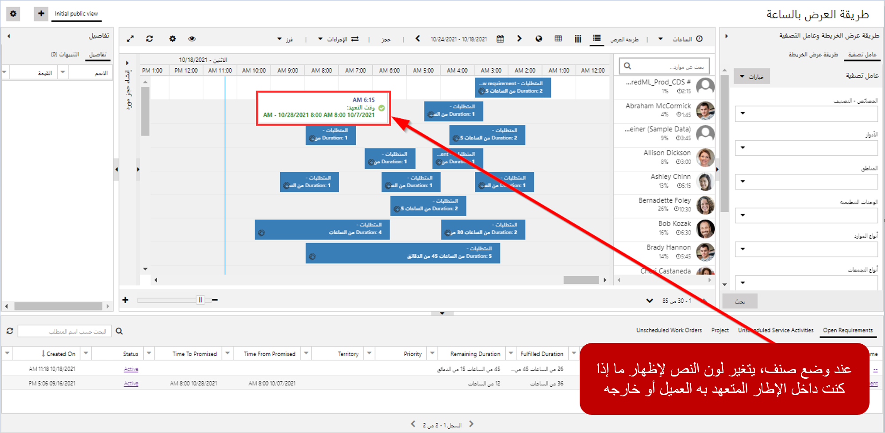
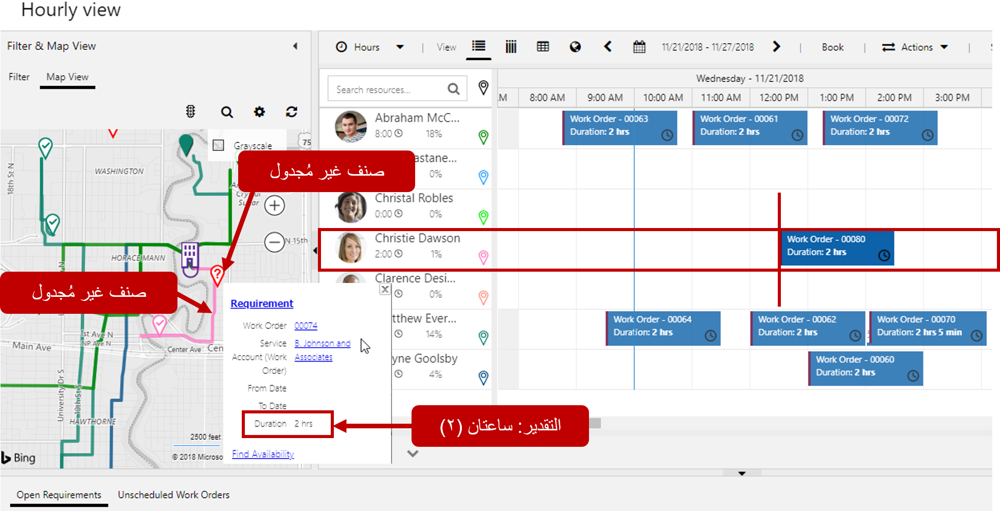
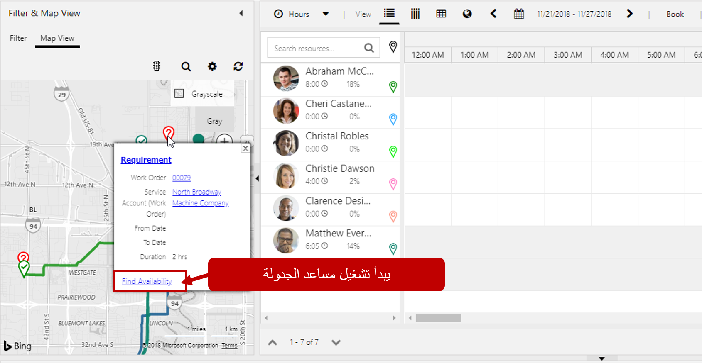
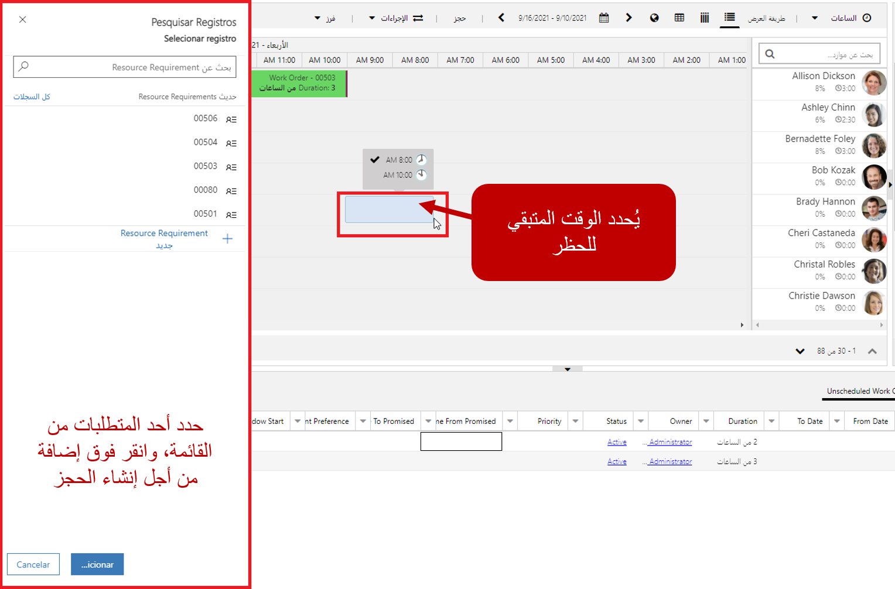
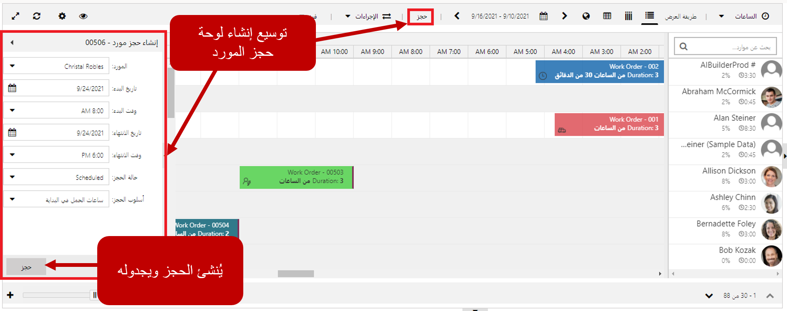
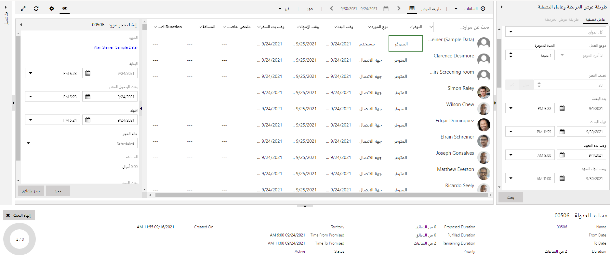

يمكن أن تحدث أشياء كثيرة على مدار اليوم تؤثر في الجدولة. عند حدوث هذه التغييرات أو الأصناف، يجب أن يكون المرسل قادراً على إجراء تغييرات الجدول في أسرع وقت ممكن. قد تتضمن أمثلة الأشياء التي يمكن أن تؤثر في الجدولة ما يلي:

-   أمر عمل طارئ تم إنشاؤه ويحتاج إلى شخص ما ليتم جدولته الآن.
-   قيام العميل بالإلغاء أو الحاجة إلى إعادة الجدولة.
-   مورد يستدعي المرض ويحتاج إلى إيجاد بديل.
-   حادث وقع على طريق سريع معين.

يمكن لكل صنف من هذه الأصناف تقديم مجموعة التحديات الخاصة به للمرسلين. يحتاج المرسلون إلى أدوات متعددة تحت تصرفهم لتلبية تلك الاحتياجات. تسهل لوحة الجدولة على المرسلين الجدولة في هذه السيناريوهات المختلفة من خلال توفير طرق متعددة لجدولة أحد الأصناف. يمكن أن تتراوح هذه الوظائف من وظيفة السحب والإفلات البسيطة لجدولة صنف ما، إلى البحث عن مورد بديل يمكن أن يتولى المسؤولية عن شخص لم يعد متاحاً.

هناك أربع طرق شائعة الاستخدام لجدولة الأصناف باستخدام لوحة الجدولة. هذه الطرق هي:

-   باستخدام لوحة المتطلبات
-   استخدام عرض الخريطة
-   إنشاء كتل زمنية في التقويم
-   استخدام لوحة إنشاء حجز المورد

توفر بعض الطرق المضمنة في لوحة المتطلبات وعرض الخريطة خيارات متعددة تُستخدم لجدولة الأصناف باستخدام تلك الطريقة.

>[!VIDEO https://www.microsoft.com/videoplayer/embed/RE2KjKy]

دعنا نفحص الطرق المختلفة التي يمكن بها جدولة الأصناف باستخدام لوحة الجدولة.

## الجدولة من لوحة المتطلبات

تعرض لوحة المتطلبات قائمة بجميع متطلبات الموارد النشطة حالياً والتي تحتاج إلى جدولتها. سيتضمن كل متطلب أصناف مثل المدة المطلوبة والأولوية والنوافذ الزمنية الموعودة. يمكن جدولة الأصناف من لوحة المتطلبات بطريقتين:

-   **السحب والإفلات:** اسحب الصنف من لوحة المتطلبات إلى لوحة الجدولة.

-   **البحث عن التوفر:** يستخدم مساعد الجدولة للعثور على الموارد وجدولة صنف.

### السحب والإفلات

يعد خيار السحب والإفلات أبسط طريقة لجدولة شيء ما على لوحة الجدولة. يحدد المرسل العنصر الذي يريد جدولته ويسحبه لأعلى على اللوحة. بمجرد العثور على المورد الذي يريدون جدولته للعنصر، يقومون بإسقاط العنصر في الفترة الزمنية المطلوبة، ويقوم التطبيق بإنشاء الحجز، ووضعه على اللوحة.

عند استخدام السحب والإفلات، من المهم ملاحظة أنه افتراضياً لا يتم منعك من جدولة صنف لمورد ما.

على سبيل المثال، لنفترض أن العميل قد تلقى وعداً بإطار زمني من 9:00 صباحاً إلى 11:00 صباحاً. عندما تسحب المتطلبات إلى لوحة الجدولة، إذا كنت خارج الإطار الموعود، سيتغير لون النص إلى اللون الأحمر. بمجرد أن تكون في الإطار الموعود، سيتغير النص إلى اللون الأخضر. على الرغم من أن لون النص يتغير، لا يتم منعك من الجدولة خارج الإطار. يمكن للمؤسسات التي ترغب في منع جدولة صنف ما إذا لم يتم استيفاء متطلبات معينة، القيام بذلك باستخدام ما يسمى بقواعد الحجز.

#### بحث عن التوافر

بينما يعد السحب والإفلات طريقة سريعة للجدولة، إلا أنه لا يأخذ في الاعتبار أي مهارات أو مناطق أو أصناف أخرى محددة مسبقاً تم توضيحها في المتطلب. للمساعدة على النظر في أي أصناف محددة مطلوبة، يمكن للمرسلين استخدام ميزة البحث عن التوفر. عندما يحدد المرسل أحد المتطلبات في اللوحة، يمكنه تحديد البحث عن التوفر في السجل، وسيفتح مساعد الجدولة.

سيتم عرض أي موارد متاحة تفي بالمعايير المحددة في متطلبات المورد. سيتم عرض المعايير التي تم استخدامها لتصفية الطلب في عرض عامل التصفية. إذا كنت بحاجة إلى توسيع النتائج التي تم إرجاعها، فيمكن تعديل المعايير حسب الحاجة لهذا الطلب المحدد.

بالنسبة للموارد التي يتم إرجاعها بواسطة المساعد، سيتم عرض مجموعات من الوقت بناءً على توفرها وستتضمن تقديرات وقت السفر بناءً على الموقع الحالي للمورد. يمكن للمرسل تحديد أي وقت داخل تلك الكتلة لجدولة المورد للصنف. بمجرد تحديد الوقت، يتم عرض شاشة حجز الموارد حيث يمكن تعديل التفاصيل. بمجرد أن تكون جاهزاً لحجز الصنف، حدد الزر حجز أو الحجز والخروج لإنشاء الحجز.

### الجدولة باستخدام عامل تصفية عرض الخريطة

عند استخدام عرض الخريطة من لوحة عرض عامل التصفية والخريطة، فإنه يوفر العديد من الأدوات التي يمكن أن تكون مفيدة للمرسل لاستخدامها. تتمثل إحدى المزايا الرئيسية للخريطة في القدرة على رؤية الأصناف التي تحتاج إلى جدولتها بصرياً، مقارنة بموقع المورد والأصناف الأخرى التي تتم جدولتها. على سبيل المثال، إذا كان من المقرر أن تعمل كريستي على تذكرة في جزء معين من المدينة في الساعة 2:00 ظهراً، فيمكننا تحديد أي أصناف غير مجدولة في تلك المنطقة، وتعيينها لها للقيام بها في طريقها إلى موعدها الساعة 2:00 مساءً.

عندما يستخدم المرسلون عرض الخريطة، فإن طريقة جدولة الأصناف المتاحة تشبه ما كان متاحاً من لوحة المتطلبات، ولكن مع اختلاف رئيسي واحد. يمكن للمرسلين تصور من يجب تعيين الصنف إليه باستخدام الخريطة.

لا تزال الأصناف متوفرة لتتم جدولتها باستخدام:

-   **السحب والإفلات:** اسحب الصنف من لوحة الخريطة إلى لوحة الجدولة.
-   **البحث عن التوفر:** يستخدم مساعد الجدولة للعثور على الموارد وجدولة صنف.

#### السحب والإفلات

دعونا نرى كيف يمكن للخريطة أن تعزز تجربة السحب والإفلات. تمثل الصورة أدناه ما قد يراه المرسل عند استخدام عرض الخريطة:

نلاحظ من الصورة الحقائق التالية:

-   لدى Christie أمر عمل مجدول اليوم الساعة 12:30.
    -   وتوضح الخريطة أكثر المسارات احتمالاً لـ Christie.
-   يوجد أمر عمل غير مجدول يقع في مسار Christie.
    -   يتم تقدير الصنف أن يستمر إلى ساعتين.
    -   كريستي لديها ساعتان مجانيتان اليوم قبل موعدها 12:30.

في هذه الحالة، يمكننا بسهولة سحب دبوس المطلب على الخريطة ووضعه في خانة زمنية متاحة لـ Christie. بمجرد أن تتم جدولة لكريستي، سيتغير المسار على الخريطة لإظهار الصنف المجدول حديثاً.

#### بحث عن التوافر

هناك خيار آخر لاستخدام البحث عن التوفر. يتمثل الاختلاف في توفر البحث باستخدام الخريطة، في أنه يمكن الوصول إليه عن طريق تمرير مؤشر الماوس فوق الدبوس في الجدول مباشرةً. بمجرد تحديد البحث عن التوفر، سيتم نقلك إلى شاشة مساعد الجدولة نفسها التي ذكرناها سابقاً.

### حجز الوقت لمورد

عندما ترى أن أحد الموارد لديه فترة زمنية مفتوحة، يمكنك السحب لتحديد مقدار الوقت الذي تريد ملؤه للمورد في التقويم. على سبيل المثال، يمكنك سحب ساعتين من 1:00 مساءً إلى 3:00 لـ Wayne. سيتم تزويدك بقائمة أوامر العمل التي يمكن جدولتها لذلك الوقت. بعد تحديد الصنف الذي تريده، سيتم إنشاء حجز ووضعه في التقويم.

### استخدام لوحة إنشاء حجز المورد

يتم استخدام لوحة إنشاء حجز المورد عندما تقوم بإشراك مساعد الجدولة باستخدام ميزة البحث عن التوفر. يمكن أن يوفر أيضاً طريقة رائعة لجدولة الأصناف مباشرةً من لوحة الجدولة.

يمكن الوصول إلى لوحة إنشاء حجز مورد إما عن طريق توسيع اللوحة أو النقر على زر الكتاب على شريط أدوات لوحة الجدولة. بمجرد عرض اللوحة، ستحتاج إلى تحديد سجل المتطلبات، وسيتم ملء اللوحة بالمعلومات التالية:

-   **المورد:** يحدد المورد الذي سيتم تخصيص هذا الحجز له.
-   **تاريخ البدء:** تاريخ بدء الحجز. (الإعداد الافتراضي إلى اليوم)
-   **وقت البدء:** وقت بدء الحجز. (الافتراضيات حتى 8:00 صباحاً)
-   **تاريخ الانتهاء:** تاريخ انتهاء الحجز. (الإعداد الافتراضي إلى اليوم)
-   **وقت الانتهاء:** وقت انتهاء الحجز. (الافتراضيات حتى 8:00 صباحاً)
-   **حالة الحجز:** حالة لتعيينها للحجز.
-   **طريقة الحجز:** تحدد كيفية تخصيص الساعات.

ستحتاج إلى توفير المورد المحدد الذي تريد إنشاء الحجز له. ستحتاج أيضاً إلى تعديل معلومات البداية والنهاية. بمجرد أن يصبح جاهزاً للحجز، يمكنك تحديد زر الحجز لإنشاء الحجز وعرضه على لوحة الجدولة.

### الجدولة مباشرة من أمر العمل

قد ترغب أحياناً في جدولة صنف ما دون الدخول في لوحة الجدولة. قد تجد أنه من السهل جدولة الصنف مباشرةً من أمر العمل. يمكن أيضاً بدء مساعد الجدولة الذي استخدمناه سابقاً مباشرةً من أمر العمل بالنقر على زر الحجز.

>[!VIDEO https://www.microsoft.com/videoplayer/embed/RE2KrsZ]

عند تحميل مساعدة الجدولة، ستُظهر الموارد المحتملة التي يمكن جدولتها. يمكن إرجاع مورد واحد عدة مرات حسب توفره خلال الفترة المحددة في عامل التصفية. كما تم ذكره سابقاً مع مساعد الجدولة، يمكن تعديل معايير عامل التصفية المستخدمة لتوسيع أو تقليل عدد النتائج التي تم إرجاعها.

**مهم:** هناك عدة أسباب لعدم عرض الأصناف في "مساعد الجدولة". قد تحتاج إلى التحقق من القيم الموجودة في السجلات للتأكد من إمكانية إرجاعها بواسطة المساعد. الأشياء الأكثر شيوعاً التي يجب التحقق منها أولاً هي:

-   **لا توجد موارد تفي بالسمات المحددة:** راجع معايير عامل التصفية التي يتم استخدامها. تأكد من أن لديك الموارد التي تلبي هذه المتطلبات. يمكنك إزالة المعايير لمعرفة ما إذا تم إرجاع النتائج. إذا كنت لا تزال لا ترى النتائج، فقد تكون مشكلة في العنوان.
-   **مواقع البدء والانتهاء المرتبطة بالموارد:** إذا تعذر تحديد موقع العنوان المرتبط بالمورد، فلن يتم إرجاع المورد. يتم تحديد مواقع بداية المورد ونهايته في سجل المورد، ويمكن تعيينهما إما على عنوان المورد أو عنوان الوحدة التنظيمية أو الموقع الحيادي.
    -   **عنوان المورد**: إذا تم استخدام عنوان المورد، فتأكد من أن لديك معلومات عنوان صالحة (خطوط الطول والعرض) للعنوان المستخدم بناءً على نوع المورد.
        -   **نوع المورد = الحساب** عنوان سجل الحساب المرتبط بالمورد.
        -   **نوع المورد = جهة اتصال** عنوان سجل جهة الاتصال المرتبط بالمورد.
        -   **نوع المورد = المستخدم:** العنوان المقترن بحساب Microsoft 365 الخاص بالمستخدم.
    -   **عنوان وحده المؤسسة:** إذا كانت الوحدة التنظيمية قيد الاستخدام، فتأكد من احتوائها على قيم صالحة لخط الطول وخط العرض.
