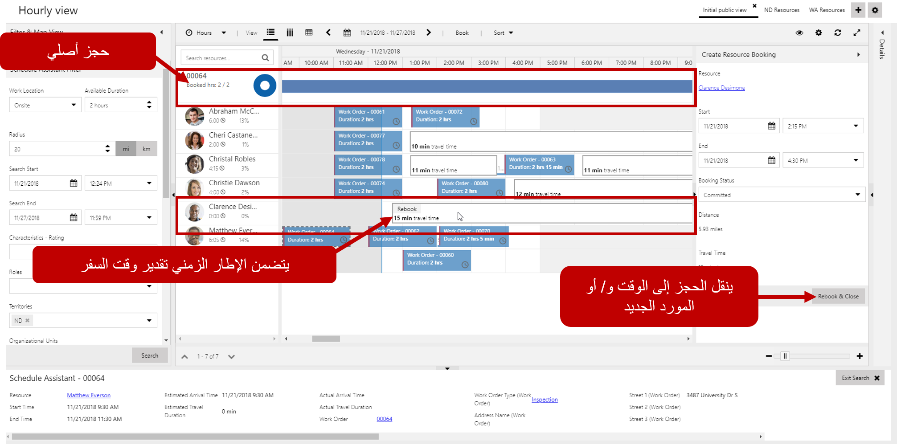
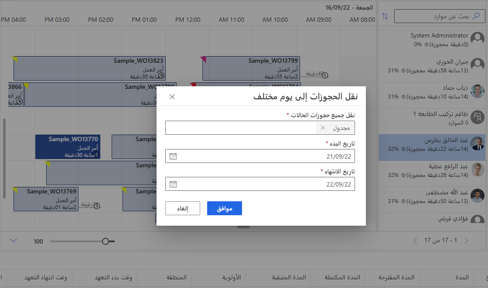

في نقطة معينة، سيحدث شيء ما ينتج عنه إعادة جدولة أحد العناصر، أو استبدال مورد. قد يحدث هذا إذا كان العميل يعاني من تعارض مفاجئ، أو اتصل أحد الفنيين بالمرضى، أو إذا كانت هناك تقنية متخلفة بسبب العناصر التي تستغرق وقتاً أطول من المعتاد.

توفر لوحة الجدولة طرقاً متعددة يمكن للمرسلين من خلالها إعادة جدولة العناصر أو استبدال موارد مختلفة. اعتماداً على ما تحتاجه بالتحديد، يمكن للمرسلين القيام بما يلي:

-   **إعادة الحجز**
-   **استبدال المورد**
-   **نقل العناصر إلى يوم مختلف**

## إعادة حجز العناصر

توفر إعادة الحجز القدرة على نقل الحجز إلى وقت أو يوم مختلف، بالإضافة إلى تخصيصه لمورد مختلف. يمكن إعادة حجز العنصر عن طريق النقر بزر الماوس الأيمن على الحجز الذي تريد العمل معه واختيار إعادة الحجز.

يتم عرض الحجز الأصلي في أعلى نوافذ مساعد الجدولة. يمكن توسيعه لعرض معلومات حول الحجز الأصلي، مثل المورد المجدول حالياً للعمل على العنصر والوقت المجدول له. سيتم اقتراح كافة الموارد المتاحة التي تطابق المعايير المطلوبة لإجراء الحجز. يمكنك حتى الاطلاع على الوقت المقدر للسفر بناءً على موقع العناصر المجدولة لإجراء العمل فيه.

بمجرد قيامك بتحديد موقع المورد والوقت الذي تريد إعادة جدولة له، يمكنك النقر على الوقت الذي تريده من الكتلة واستخدام جزء إنشاء الموارد لإكمال المعلومات الضرورية. بمجرد النقر على إعادة الحجز والإغلاق، ستتم إعادة حجز العنصر للمورد والوقت المحددين.

## استبدال الموارد

يختلف استبدال الموارد عن إعادة الحجز لأنك لا تقوم بنقل الحجز إلى وقت مختلف. إنك ببساطة تقوم باستبدال المورد الأصلي المرتبط بالحجز بمورد مختلف. بمجرد تحديد حجز المورد الذي تريد البحث عن بديل له، يمكنك النقر بزر الماوس الأيمن فوق الصنف والتمرير فوق **المورد البديل**.

عندما تقوم باستبدال أحد الموارد، سيكون لديك خياران متاحان لاستبدال الموارد:

-   **استبدال مورد محدد:** إذا كنت تعرف المورد المحدد الذي ترغب في استبداله، فيمكنك تحديد ذلك المورد والنقر على **استبدال**. سيتم استبدال المورد المحدد بالمورد الأصلي.
-   **البحث عن مورد لاستبداله:** إذا لم تكن متأكداً من المورد الذي يجب استخدامه، فيمكنك تحديد **البحث عن بديل** وسيتم فتح مساعد الجدولة لتقديم اقتراحات بشأن الموارد المتاحة في ذلك الوقت. بمجرد تحديد المورد الذي تريد استبداله، يمكنك تحديد بديل، وسيتم إعادة تعيين الحجز إلى المورد الجديد.

## نقل الحجوزات إلى يوم مختلف

قد تحتاج أحياناً إلى نقل حجوزات متعددة من يوم إلى آخر. قد يحدث هذا عندما يتم إنشاء الحجز مسبقاً، وبسبب تغييرات الجدول، لم يعد بإمكانك تنفيذها في تلك الأيام.

يتم نقل الحجز عن طريق تحديد نقل الحجز إلى يوم مختلف من قائمة **الإجراءات** أعلى لوحة الجدولة. عندما تقوم بنقل حجوزات متعددة إلى يوم مختلف، يجب تحديد المعلومات التالية:

-   **تاريخ المصدر:** يحدد التاريخ الذي تمت جدولة الحجوزات له حالياً.
-   **تاريخ الوجهة:** يحدد التاريخ الذي ترغب في نقل الحجوزات إليه.
-   **حالات الحجز:** تحدد حالة الحجز التي سيتم استخدامها لتحديد الحجوزات التي سيتم نقلها. على سبيل المثال، أنت تريد فقط نقل العناصر التي تمت جدولتها. يجب أن تظل العناصر قيد التنفيذ أو المكتملة أو السفر في التاريخ الذي تمت فيه.

يجب تحديد حالة حجز واحدة على الأقل قبل أن تتمكن من نقل العنصر. بمجرد تحديد موافق، سيتم نقل كافة الحجوزات الموجودة في ذلك التاريخ بحالة الحجز هذه.

