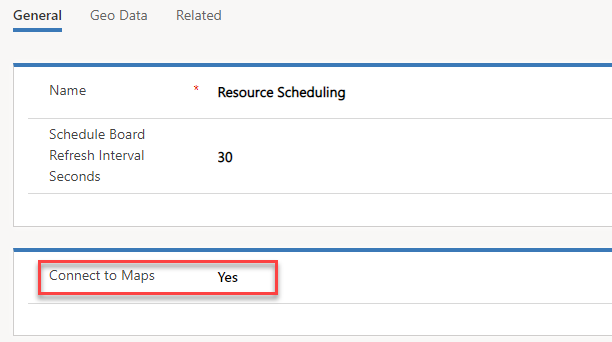
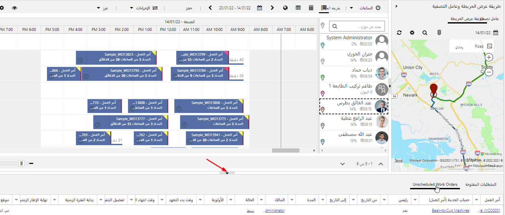

يقوم Universal Resource Scheduling بتمكين المؤسسة من جدولة أي شيء قد يكون مطلوباً لخدمة عملائهم بشكل أفضل. قد يتضمن ذلك أصناف مثل أوامر العمل في Dynamics 365 for Field Service. الغرض من هذا التدريب العملي هو توفير مقدمة لك إلى جدولة العناصر باستخدام Universal Resource Scheduling.

## الأهداف التعليمية

في نهاية هذه التمارين، ستتمكن من إنجاز المهام التالية:

- إنشاء مورد

- جدولة عنصر

تعمل التمارين والتدريبات العملية في هذه الوحدة النمطية بشكل أفضل إذا توفرت لديك عينة بيانات للعمل معها. إذا لم تتضمن بيئتك عينه بيانات، فراجع صفحة [تثبيت عينة بيانات لتطبيق Field Service](https://docs.microsoft.com/dynamics365/project-operations/psa/install-sample-data-3-x/?azure-portal=true).

## قم بتمكين خرائط Bing لاستخدامها مع Resource Scheduling

لضمان قدرتك على الاستفادة الكاملة من إمكانات الجدولة والتعيين المتاحة مع Universal Resource Scheduling، تأكد من تكوينه لاستخدام موفر تعيين. تُعد خرائط Bing موفر الخرائط الافتراضي، ولكن يمكن تمكين موفرين إضافيين. نحن سنستخدم خرائط Bing.

1. في مستعرض الويب، انتقل إلى [https://home.dynamics.com](https://home.dynamics.com/?azure-portal=true). من قائمة التطبيقات المتوفرة، حدد **Resource Scheduling**.

1. باستخدام التنقل علي اليمين، حدد منطقة **جدولة الموارد** في أسفل الشاشة. من القائمة التي تظهر، حدد **الإعدادات**.

1. ضمن مجموعة **الجدولة**، حدد **إدارة‏‎**.

1. في Dynamics 365، حدد السهم الموجود إلى جانب النص **Dynamics 365** وحدد **Universal Resource Scheduling**.

1. حدد أيقونة **مخطط الموقع** لتوسيع **التنقل**. من القائمة التي تظهر، حدد **إدارة**.

1. حدد **معلمات الجدولة**.

1. حدد موقع حقل **الاتصال بالخرائط**، وقم بتعيينه إلى **نعم**.

1. حدد الزر **حفظ وإغلاق** على الإعدادات.

## إنشاء مورد قابل للحجز

قبل أن تتمكن من البدء في جدولة العناصر وتعيينها لموارد محددة في مؤسستك، تحتاج أولاً إلى إنشاء موارد قابلة للحجز في التطبيق. يمكن أن يكون المورد القابل للحجز مستخدماً داخلياً أو جهة اتصال خارجية أو حساباً أو قطعة من المعدات. عند تحديد مورد قابل للحجز، يمكنك أيضاً تقديم تفاصيل مثل المهارات التي يمتلكونها، وأين يبدأون يومهم وينتهون به وما إلى ذلك.

في هذه المهمة الأولى، سننشئ سجل مورد قابل للحجز لحساب المستخدم الخاص بك.

1. في مستعرض الويب، انتقل إلى [https://home.dynamics.com](https://home.dynamics.com/?azure-portal).  من قائمة التطبيقات المتوفرة، حدد **Resource Scheduling**.

1. باستخدام التنقل علي اليمين، حدد منطقة **جدولة الموارد** في أسفل الشاشة.  من القائمة التي تظهر، حدد **الإعدادات**.

1. في منطقة التنقل، حدد **الموارد**.

1. على شريط الأوامر، حدد الزر **جديد**.

1. قم بتكوين المورد على النحو التالي:

    - **نوع المورد**: مستخدم

    - **المستخدم**: سجل ‏‎المستخدم *الخاص بك*

    - **حقل المنطقة الزمنية**: اترك القيمة الافتراضية في هذا الحقل.

1. حدد علامة التبويب **جدولة**، وقم بالتكوين على النحو التالي:

    - **الوحدة التنظيمية**: سياتل

    - **موقع البدء**: عنوان الوحدة التنظيمية

    - **موقع الانتهاء**: عنوان الوحدة التنظيمية

1. حدد علامة التبويب **خدمة ميدانية**، وقم بالتكوين على النحو التالي:

    - **المعدل بالساعة**:‏ 175

1. على شريط الأوامر، حدد الزر **حفظ** لحفظ المورد القابل للحجز واتركه مفتوحاً.

1. حدد علامة التبويب **عام**.

1. حدد موقع الشبكة الفرعية **خصائص**، وحدد **إضافة خاصية مورد جديد قابل للحجز**.

1. قم بالتكوين على النحو التالي:

    - **الخصائص**: الوصول إلى المبنى 12

    - **قيمة التقييم**: ممتاز

    - يمكن إضافة المزيد من الخصائص للمورد إذا كان لديه مهارات متعددة.

1. حدد الزر **حفظ وإغلاق** على سجل الخاصية.

1. حدد الزر **حفظ وإغلاق** على سجل المورد القابل للحجز.

## إنشاء أمر عمل جديد باستخدام نوع الحدث

يحتوي Dynamics 365 for Field Service على كيان أمر العمل الذي تم تمكينه للاستخدام مع ميزة جدولة الموارد. في هذه المهمة، سنقوم بإنشاء أمر عمل جديد يمكننا جدولته باستخدام التطبيق.

1. في القسم العلوي الأيمن من الشاشة، حدد النص **جدولة الموارد** إلى جانب النص **Dynamics 365**.

1. في شاشة التطبيقات، حدد **Field Service**.

1. باستخدام التنقل علي اليمين، حدد **أوامر العمل**.

1. على شريط الأوامر، حدد الزر **جديد**.

1. قم بتكوين أمر العمل على النحو التالي:

    - **حساب الخدمة**:‏ Adventure Works (عينة)

    - **نوع أمر العمل**: تثبيت أو استبدال

    - **‏‫خاضع للضريبة**: لا

    - **نوع الحدث الرئيسي**: استبدال القطعة المكسورة.

1. حدد علامة التبويب **إعدادات**، وقم بتكوين الإعدادات كما يلي:

    - **الأولوية**: متوسطة

    - **منطقة الخدمة**: واشنطن‏‎

    - **وقت بدء التعهد**: اليوم في 1:00 مساءً

    - **وقت انتهاء التعهد**: اليوم في 3:00 مساءً

1. حدد الزر **حفظ وإغلاق** في أمر العمل.

## جدولة أمر العمل باستخدام لوحة الجدولة

يوفر تطبيق Field Service عناصر متعددة يمكنك استخدامها للمساعدة في جدولة الموارد لعناصر معينة. المكونان الأساسيان المستخدمان هما لوحة الجدولة ومساعد الجدولة. تسمح لك لوحة الجدولة بجدولة العناصر يدوياً، ويقدم مساعد الجدولة اقتراحات حول الموارد بالاستناد إلى الموقع والمهارات والتوافر. في هذه المهمة، سنقوم بمراجعة كيفية استخدام لوحة الجدولة لجدولة العناصر على مستوى عالٍ.

1. باستخدام التنقل علي اليمين، حدد **لوحة الجدولة**.

1. توفر لوحة الجدولة خيارات متعددة يمكنك استخدامها لجدولة العناصر، مثل طريقة عرض الخريطة وعامل التصفية.

1. قم بتوسيع جزء **متطلبات الحجز** الموجود أسفل الشاشة.

    > [!div class="mx-imgBorder"]
    > 

1. حدد **أوامر العمل غير المجدولة**.

1. حدد موقع أمر عمل **Adventure Works (عينة)** الذي أنشأته في مهمة سابقة وحدده. اسحبه إلى أليسون ديكسون على لوحة الجدولة. لاحظ أن النص يظهر باللون الأحمر حتى تعثر على وقت يقع ضمن النافذة الزمنية الموعودة.

1. حرر زر الماوس، ويتم وضع العنصر على لوحة الجدولة.

    > [!div class="mx-imgBorder"]
    > 

1. حدد موقع وحدد أمر العمل الخاص بـ **Fourth Coffee (عينة)** ضمن **أوامر العمل غير المجدولة.** حدد **بحث عن التوافر**.

    > [!div class="mx-imgBorder"]
    > 

1. يحلل Dynamics 365 المتطلبات الضرورية لهذا العنصر ويأخذ في الاعتبار عناصر أخرى مثل المهارات المطلوبة وأمر العمل ومواقع الموارد وتوافر الموارد لإنشاء قائمة بالموارد المقترحة التي يمكنها العمل على هذا العنصر.

    > [!div class="mx-imgBorder"]
    > 

1. عند تمرير مؤشر الماوس فوق كتلة الوقت المتوفر للمورد **Van Amundson**، تظهر الأيقونة **حجز**. حدد الأيقونة **حجز** لجدولة Van لأمر العمل.

1. حدد أيقونة **إنهاء البحث** للعودة إلى لوحة الجدولة.

## العمل مع طريقة عرض الخريطة‬

هناك طريقة أخرى لجدولة العناصر وهي استخدام طريقة عرض الخريطة على لوحة الجدولة. عندما تحدد طريقة عرض الخريطة، يتم ترميز الموارد بالألوان. وتظهر أية عناصر غير مجدولة على الخريطة مع علامة استفهام. يمكنك جدولة هذه العناصر عن طريق سحبها إلى المورد الذي تريد تعيينها إليه.

عندما تبدأ عملية تعيين العناصر إلى الموارد، تتغير العناصر إلى لون المورد المحدد. بالإضافة إلى ذلك، تبدأ الخريطة رسم مسار للمورد بالاستناد إلى موقع أوامر العمل المعينة له.

يمكن وضع عناصر أخرى على الخريطة مثل حركة المرور وخرائط الطرق للمساعدة على الجدولة.

1. في لوحة الجدولة، حدد **طريقة عرض الخريطة**.

1. لمشاهدة حركة المرور، حدد **عرض حركة المرور**.

1. حدد موقع عنصر غير مجدول على الخريطة. اسحب العنصر إلى فترة زمنية مفتوحة في جدول Allison Dickson مباشرةً قبل أمر العمل الذي قمت بجدولته لها في وقت سابق.

## إعادة جدولة العناصر

في أحيان كثيرة، يحدث شيء ما يتطلب منك إعادة تعيين عنصر ما إلى مورد آخر أو إعادة حجزه في يوم ووقت مختلفين.

1. في لوحة الجدولة، حدد علامة تبويب **عامل التصفية** في طريقة عرض **الخريطة وعامل التصفية**.

1. في عنصر تحكم عامل التصفية **المناطق**، حدد **واشنطن**. تأكد من ترك جميع عوامل التصفية الأخرى فارغة وحدد الزر **بحث**.

1. حدد موقع أمر العمل **المروحة لا تعمل** المعين إلى Joseph Gonsalves.

1. انقر بزر الماوس الأيمن فوق أمر العمل، ومن القائمة التي تظهر، حدد **إعادة الحجز**.

1. يفتح مساعد الجدولة. سيتم تقديم عدد من الموارد المتوفرة لك يتراوح عددها من أربعة إلى سبعة موارد.

1. حدد كتلة التوافر للمورد Efrain Schreiner. في شاشة إنشاء حجز المورد، اقبل الإعدادات الافتراضية وحدد **إعادة الحجز وإغلاق**.

1. حدد موقع أمر العمل **فشل تمهيد القرص الثابت** المعين للمورد Joseph Gonsalves.

1. انقر بزر الماوس الأيمن فوق أمر العمل، ومن القائمة التي تظهر حدد **استبدال المورد**، ثم حدد ‏‫‏‏**بحث عن بديل**.

1. يفتح **مساعد الجدولة**. سيتم تقديم مورد واحد أو موردين لك.

1. قم بتمرير مؤشر الماوس فوق كتلة التوافر التي تظهر للمورد Simon Raley. حدد **استبدال**.

1. يُعاد تعيين الحجز من Joseph إلى Simon.
