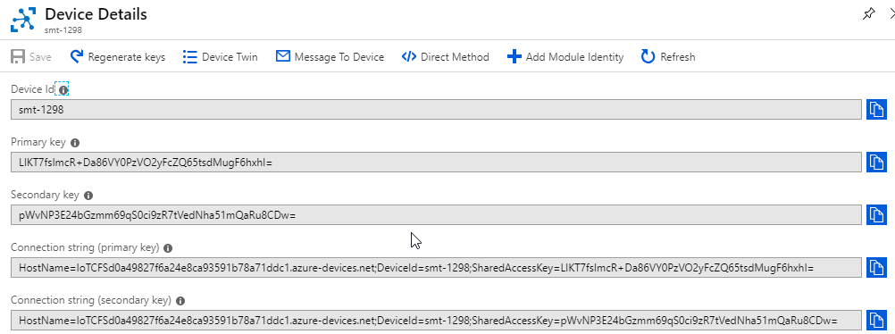
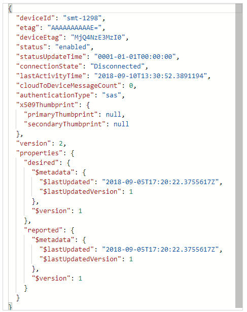
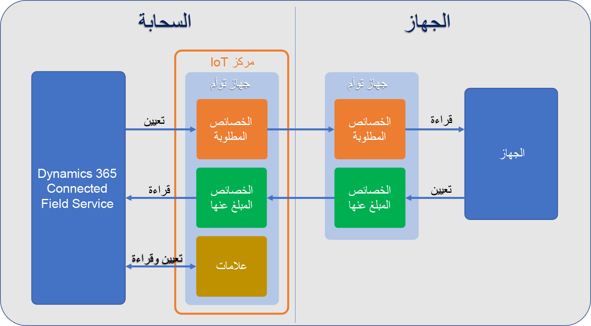
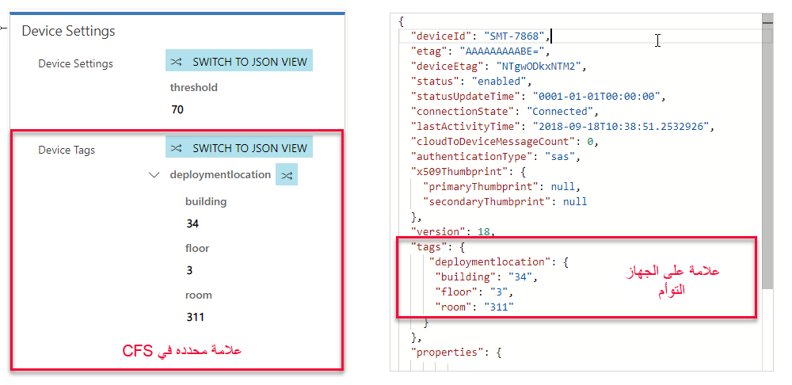
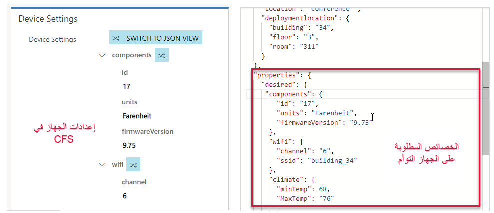
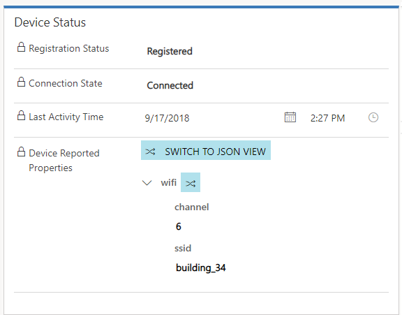
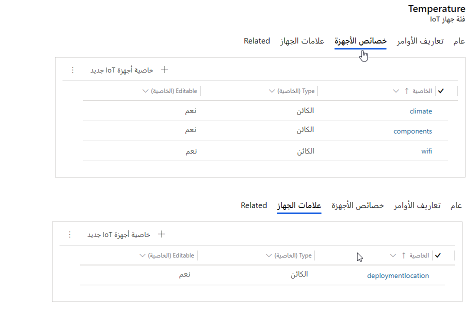
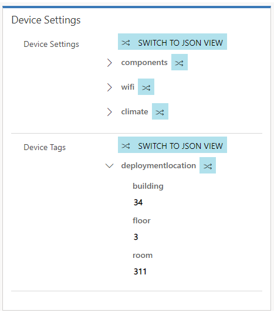

عند تسجيل أصل عميل أو جهاز IoT من Connected Field Service ‏(CFS) مع IoT Hub، يتم إنشاء سجل جهاز IoT المطابق في IoT Hub.  سيتم تمرير معرّف الجهاز المحدد في سجل "أصل العميل" إلى جهاز IoT.  كما سيحتوي جهاز IoT على عناصر مثل المفاتيح وسلاسل الاتصال التي يتم استخدامها لتوصيل جهاز فعلي بجهاز IoT في لوحة الوصل.   

بالإضافة إلى ذلك، يوجد Device Twin متوافق في IoT Hub.  Device Twin هو مستند JSON مرتبط بجهاز معين يتم استخدامه لمزامنة معلومات الحالة بين الجهاز وIoT hub.  في حالة Connected Field Service، قد يكون أصل عميل تم تسجيله في IoT Hub.  يحتفظ الجهاز المماثل ببيانات التعريف وبيانات التكوين للجهاز، بالإضافة إلى تمثيل سحابي افتراضي للأجهزة الفعلية.   

> [!VIDEO https://www.microsoft.com/videoplayer/embed/RE2DQPs]

يمكنك أدناه الاطلاع على مقتطف لما يبدو عليه مستند Device Twin JSON. 

من جانب Dynamics 365، يقوم حل Connected Field Service بالاستفادة من الأجهزة المماثلة لتخزين المعلومات المتعلقة بالجهاز بطريقتين أساسيتين - مزامنة حالات الجهاز وخصائصه.  يوفر كلاهما معلومات مثل الإبلاغ عن حالات التشغيل مثل حالة الجهاز ونبض القلب لسرعة الاتصال واهتزاز الجهاز وما إلى ذلك.  توفر هذه المعلومات إمكانية الاطلاع على حالات الجهاز وخصائصه على لوحة معلومات الرسومات.  

> [!VIDEO https://www.microsoft.com/videoplayer/embed/RE2DQPq]
> 
على سبيل المثال: قد يكون لديك خزان احتجاز يخزن النفايات الزائدة من عملية التصفية قبل التخلص منها.  يمكن رصد قدرة الخزان من خلال IoT Hub ثم تمثيلها على لوحة المعلومات في Dynamics 365.   بمجرد وصول قدرة الخزان إلى حد معين، يتم إرسال تنبيه إلى المستخدمين المعينين لإجراء المتابعة. 

**مزامنة علامات الجهاز:** السماح بتجميع الأجهزة لتسهيل عملية البحث. يتم إنشاء العلامات في Connected Field Service والتي تم تحويلها إلى JSON والتي يتم فهمها من قِبل الجهاز. 

على سبيل المثال: يمكن تجميع أصول العميل التي تحتاج إلى إصلاح مماثل باستخدام علامة. 

يحتوي مستند JSON للجهاز المماثل على ثلاثة مكونات أساسية تستخدم ليس فقط لالتقاط المعلومات ذات الصلة فقط بالجهاز، ولكن للمساعدة على التعامل مع الجهاز.   

هذه المكونات الثلاثة هي: 
- العلامات 
- الخصائص المطلوبة 
- الخصائص المبلغ عنها 

تظهر الصورة أدناه بمستوى عالٍ كيفية استخدام هذه المكونات. 

 
**العلامات:** لا تتصل العلامة بالجهاز الفعلي، بل يمكن تعيينها وقراءتها بواسطة تطبيق خلفي (في هذه الحالة Connected Field Service) كطريقة لتجميع الأجهزة أو تنظيمها معاً.  يمكن تعريف علامات الجهاز مباشرةً على سجل جهاز IoT في Connected Field Service.   

 >[!Note]
 > سيتم تغطية إعداد وتحديد الخصائص والعلامات بمزيد من التفصيل في وحدة تعريف الخاصية.     

على سبيل المثال: يمكنك استخدام العلامات لتحديد الموقع المحدد لجهاز IoT.  إذا تم نقل الجهاز من موقع إلى آخر، يمكننا تحديث الموقع في Connected Field Service، وسيتم تحديث العلامة وفقاً لذلك.   

 
**الخصائص المطلوبة:** تعمل الخصائص المطلوبة جنباً إلى جنب مع الخصائص المبلغ عنها.  سيتم تعيين الخصائص المطلوبة من قِبل Connected Field Service ويمكن للجهاز قراءتها وكذلك تلقي إعلامات التغييرات عليها.  مثل العلامات، يمكن تعريف الخصائص المطلوبة مباشرةً على سجل جهاز IoT في Connected Field Service.   

على سبيل المثال: بما أن الجهاز موجود في المبنى 34 وفي الطابق 3، فإننا نعلم أن الجهاز يجب أن يكون على شبكة المبنى 34 وأن ينقل على القناة 6.
يمكننا تعيين تلك الخصائص المطلوبة لهذا الجهاز على سجل الجهاز في Dynamics 365. 
  

 
**الخصائص المبلغ عنها:** تعمل الخصائص المبلغ عنها جنباً إلى جنب مع الخصائص المطلوبة.  سيتم تعيين الخصائص المبلغ عنها بواسطة الجهاز ويمكن لـ Connected Field Service قراءتها والاستعلام عنها.  بعكس العلامات والخصائص المطلوبة، لا يتم تحديد الخصائص المبلغ عنها في Connected Field Service.  يمكن استردادها عند سحب بيانات الجهاز إلى التطبيق.   

على سبيل المثال: بعد تعيين شبكة Wi-Fi وخصائص قناة الإرسال على جهاز، يمكننا سحب بيانات الجهاز (يدوياً أو وفقاً لجدول زمني) وسيتم عرض الخصائص الحالية المبلغ عنها في Connected Field Service.  يمكن استخدام هذا لتحديد الخطوات التالية في التطبيق.   
 
يجعل حل Connected field service من السهل تعريف علامات الجهاز والخصائص المطلوبة من خلال تعريفات الخصائص وفئات الأجهزة.  

 
 
**فئات الأجهزة:** تسهل فئات الأجهزة تجميع الأجهزة معاً استناداً إلى القواسم المشتركة.  يمكنك إنشاء فئة جهاز لنوع معين من الأجهزة (على سبيل المثال، درجة الحرارة) التي يتم توزيعها.  عند إنشاء فئة جهاز في Connected Field Service، يمكنك تعريف خصائص الجهاز وعلامات الجهاز المحددة ذات الصلة بفئة الأجهزة.  

 
عند إنشاء جهاز IoT يستخدم الفئة في Connected Field Service، سيتم تلقائياً إضافة الخصائص والعلامات إلى الجهاز.  يمكنك بعد ذلك تعيين تلك العناصر مباشرةً من الجهاز الموجود في CFS.  

