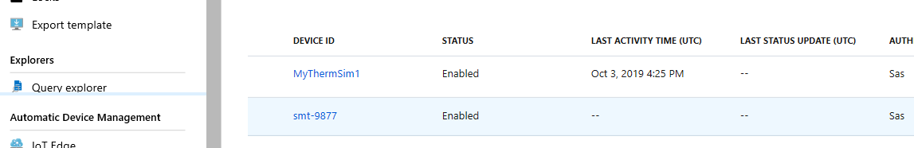

## <a name="lab-overview"></a>نظرة عامة على المعمل

يوفر حل Connected Field Service من Dynamics 365 القدرة على تسجيل كل من أجهزة IoT المحاكية والمادية مع Azure IoT Hub أو IoT Central واستخدام الجهاز المزدوج، ونقل المعلومات مرة أخرى إلى حل Connected Field Service. 

الغرض من هذا المعمل العملي هو تقديم كيفية تسجيل الأجهزة المحاكاة والمادية مع Azure IoT Hub وربطها بأصول العميل في Connected Field Service.

### <a name="scenario"></a>السيناريو

أنت تعمل في شركة تبيع الأجهزة المنزلية الذكية وتقوم بصيانتها. ونظراً لأن العديد من الأجهزة التي تقوم بخدمتها هي أجهزة ذكية، يمكن التقاط المعلومات من هذه الأجهزة عن بعد للمساعدة في خدمة تلك المعدات. لدى مؤسستك العديد من السيناريوهات والعمليات المحددة التي يستخدمونها أثناء خدمة المعدات. ويمكن أن تختلف هذه العمليات بناء على عدة عوامل تتضمن:

-   نوع الجهاز الذي يحتاج للخدمة

-   تم اكتشاف خطورة المشكلة

-   عمر الجهاز

-   موقع الجهاز

-   توفر الموارد للعمل على جهاز معين.

تمثل العناصر المذكورة أعلاه جزءاً صغيراً فقط من العوامل التي تستخدمها مؤسستك لتحديد عملية خدمة المعدات.

يتمثل المكون الأساسي الأول في شركتك التي تنتقل إلى حل IoT المتصل في تسجيل الأجهزة باستخدام Azure IoT hub (المحاكى والمادي) وربطها بأصل العميل المقابل في Connected Field Service.

## <a name="exercise-1-register-and-work-with-a-simulated-device"></a>التدريب 1: التسجيل والعمل مع جهاز محاكي 

### <a name="task-1-register-a-simulated-device"></a>المهمة 1: تسجيل جهاز محاكي

1.  انتقل إلى [Power Apps](https://make.powerapps.com/?azure-portal=true) وتأكد من أنك في البيئة الصحيحة التي بها تم تكوين خدمة Connected Field Service.

1.  حدد **التطبيقات**، وانقر لفتح تطبيق **Connected Field Service**.

1.  حدد **أصول العميل** وانقر فوق + **جديد**.

1.  أدخل **ثيرموستات ذكية** **للاسم**، وحدد **Adventure Works** **للحساب** ثم انقر فوق **حفظ**. انتظر حتى يتم تحميل الأقسام الأخرى بعد حفظ التفاصيل.

1.  حدد موقع حقل **معرف الجهاز** ، وأدخل **‎smt-9876** وقم **بالحفظ**.

1.  في شريط الأوامر،**، انقر فوق **تسجيل الأجهزة**.

1.  انقر فوق **موافق**.

1.  في مستعرض الويب، حدد علامة تبويب جديدة وانتقل إلى [مدخل Azure](https://portal.azure.com/?azure-portal=true) (قم بتسجيل الدخول إلى Azure إذا تمت مطالبتك ذلك. أنت بحاجة إلى اشتراك Azure المرتبط بالحساب الذي تستخدمه).

1.  حدد **مجموعات الموارد**.

1. افتح **IoT Hub** الذي تستخدمه مع تثبيت **Connected Field Service**.

1. انقر فوق **أجهزة IoT**. ستظهر جميع الأجهزة المسجلة حالياً مع IoT hub.

    

1. حدد الجهاز **smt-9876** لفتحه. *(لاحظ معرف الجهاز والمفتاحين الأساسي والثانوي وسلاسل الاتصال الأساسي والثانوي. يمكن أن تكون هذه مفيدة عندما تعمل مع الأجهزة المادية.)*

1. انقر فوق **Device Twin**.

    *سيؤدي هذا إلى عرض مستند JSON لـ device twin لهذا الجهاز.*

    

1. على IoT Hub الخاص بك، حدد وافتح مصدر **SimulatorIoTCFSXXX** من نوع **خدمة التطبيق.**

1. انقر فوق **عنوان URL الخاص بالمحاكي** لفتح محاكي الثرموستات. *(يجب أن يفتح المحاكي في علامة تبويب جديدة)*

    

1. انقر فوق **اتصال** في المحاكي.

1. قم بالتبديل مرة أخرى إلى اشتراك **Azure**، ثم أغلق شاشة "خدمه تطبيق المحاكي" وقم بالرجوع إلى كافة طرق عرض مجموعة الموارد.

1. افتح مورد **IoT Hub**.

    

1. قم بتمييز **اسم مركز IoT** وقم **بنسخه**.

1. قم بالرجوع إلى شاشة المحاكي وقم بلصق **اسم مركز IoT** في حقل **المضيف**.

1. قم بالرجوع إلى اشتراك Azure، وحدد **سياسات الوصول المشتركة**.

1. قم بفتح سياسة **iothubowner** **وقم** بنسخ **المفتاح الأساسي**.

    

1. قم بالتبديل مرة أخرى إلى شاشة المحاكي وقم بلصق **المفتاح الأساسي** في الحقل **الأساسي**.

1. انقر فوق الزر **Connect**. *(المحاكي الخاص بك متصل الآن بـ Azure IoT Hub)*

1. انقر فوق الزر **تحديث** لضمان توفر كافة الأجهزة المسجلة.

1. من القائمة المنسدلة **تحديد جهاز**، حدد الجهاز **smt-9876**. *(يجب أن تظهر نقطة خضراء بجوار الزر "تحديث"، وبعد بضع ثوانٍ يجب أن تبدأ في إرسال المعلومات.)*

1. على **منزلق درجه الحرارة**، قم بتعيينه إلى **75** **درجة‏‎** وانتظر حتى يتم تسجيل حالة درجة الحرارة في نافذة **الرسائل المرسلة**.

1. قم بالرجوع إلى علامة تبويب المتصفح التي تم تحميل **Connected Field Service** بها.

1. حدد **تنبيهات IoT.**

1. تحقق من إنشاء تنبيه. (مثال: **درجة حرارة 75 تجاوزت حد‏ 70 لتنبيه**.)

    

من هنا، يمكننا البدء في التفاعل مع الجهاز باستخدام الأوامر. سوف ندرس هذا بمزيد من التفصيل في الوحدة 6.

### <a name="task-2-modify-device-rules-to-change-to-celsius"></a>المهمة 2: تعديل قواعد الجهاز لتغييرها إلى درجة مئوية 

1.  في مستعرض الويب الخاص بك، حدد **علامة التبويب** التي تحتوي على مدخل Azure الخاص بك.

1.  حدد وافتح **حساب التخزين.**

1.  قم بالتمرير لأسفل وتحت **خدمة Blob**، انقر فوق **الحاويات**.

1.  انقر فوق **devicerules‎**.

1.  انقر فوق المجلد **2016-05-30**.

1.  افتح المجلد **22-40**.

1.  **انقر بزر الماوس الأيمن** على الملف **devicerules.json** وحدد **عرض/تحرير blob.**

1.  حدد موقع خاصية **درجة الحرارة** وقم بتغيير القيمة من **70**
    **إلى 21.11111** *(هذا ما ستكون درجة الحرارة 70 درجة مئوية)*

    

1.  انقر فوق **حفظ**.

1. أوقف وابدأ وظيفة Azure Stream Analytics مرة أخرى لتعكس أحدث قيمة.

    1.  انتقل إلى مدخل Azure وافتح مجموعة الموارد.

    1.  حدد المورد من النوع **وظائف Stream Analytics** وافتحه.

    1.  أوقف المورد وانتظر حتى يتوقف.

    1.  ابدأ المورد. انتظر حتى يتم تشغيل الحالة.

1. قم بالرجوع إلى **المحاكي** الخاص بك وتأكد من تحديد **smt-9876**.

1. غيّر القيمة إلى شيء يزيد عن **21.11111** وانتظر حتى يتم تسجيل القراءة.

1. ارجع إلى **Dynamics 365 Connected Field Service** وتحقق من إنشاء سجل **تنبيه**.

### <a name="task-3-modify-device-rules-back-to-fahrenheit"></a>المهمة 3: تعديل قواعد الجهاز مرة أخرى إلى فهرنهايت. 

> [!IMPORTANT]
> ستستخدم الوحدة 6 في هذه الوحدة جهاز محاكاة للتفاعل مع Connected Field Service. لن تعمل التغييرات لجعلها مئوية مع هذا التدريب. من المهم أن تقوم في Blob بتعديل درجة الحرارة مرة أخرى إلى 70 للتأكد من أن المحاكي سيسجل فهرنهايت ويعمل وفقاً لذلك. لا تنس إيقاف وبدء وظيفة Stream Analytics بمجرد تحديث الملف مرة أخرى. هذا يضمن أن الدفق يشير إلى أحدث قيمة للحد الفاصل.

## <a name="exercise-2-register-a-physical-device-optional"></a>التدريب 2: تسجيل جهاز مادي (اختياري) 

يتكون كل تدريب من سيناريو وأهداف تعليمية، ويصف السيناريو الغرض من التدريبات، بينما يتم سرد الأهداف ولها نقاط.

### <a name="scenario"></a>السيناريو

في هذا التدريب الاختياري، ستحتاج إلى جهاز مادي. هناك العديد من الخيارات المتاحة. في هذا التدريب، ستتعرف على إعداد MXChip IoT DevKit. MXChip IoT DevKit (المعروف أيضًا باسم DevKit) عبارة عن مجموعة أجهزة IoT الكل في واحد. يمكنك استخدام هذه الشريحة لتطوير حلول IoT ونمذجتها الأولية التي تستفيد من خدمات Microsoft Azure.

وهو يشتمل على لوحة تطوير متوافقة مع Arduino مع أجهزة طرفية وأجهزة استشعار غنية، وحزمة لوحة مفتوحة المصدر، وكتالوج مشاريع متزايدة.

إذا لم يكن لديك MXChip IoT DevKit، فيمكنك زيارة [أدوات مطور Azure IoT](https://aka.ms/iot-devkit/?azure-portal=true) والنقر على **للحصول علي مجموعة الأدوات**.

### <a name="task-1-create-and-register-a-customer-asset-and-an-iot-device"></a>المهمة 1: إنشاء وتسجيل أصل عميل وجهاز IoT. 

1.  انتقل إلى تطبيق Connected Field Service، وحدد **أصول العميل**، ثم انقر فوق **+ جديد.**

1.  أدخل **MXChip** **للاسم**، وحدد **Adventure Works** **للحساب** ثم انقر فوق **حفظ**.

1.  حدد موقع حقل **معرف الجهاز** ، وأدخل **‎AZ3166** وقم **بالحفظ**.

1.  انقر فوق **تسجيل الأجهزة**.

1.  انقر فوق **موافق**.

1.  في مستعرض الويب، حدد علامة تبويب جديدة وانتقل إلى [مدخل Azure](https://Portal.Azure.com/?azure-portal=true) (قم بتسجيل الدخول إلى Azure إذا تمت مطالبتك ذلك. أنت بحاجة إلى اشتراك Azure المرتبط بالحساب الذي تستخدمه).

1.  حدد **مجموعات الموارد**.

1.  افتح **IoT Hub** الذي تستخدمه مع تثبيت **Connected Field Service**.

1.  انقر فوق **أجهزة IoT**. ستظهر جميع الأجهزة المسجلة حالياً مع IoT hub.

1. حدد الجهاز **AZ3166** لفتحه.

1. حدد موقع سلسلة الاتصال الأساسية للجهاز وانسخها إلى تطبيق مثل Notepad. (سيتم استخدامه لاحقاً.)

    

### <a name="task-2-register-a-physical-device"></a>المهمة 2: تسجيل جهاز مادي

#### <a name="flash-the-devices-firmware"></a>فلاش البرامج الثابتة للأجهزة

1.  قم بتنزيل أحدث البرامج الثابتة IoT Central Microsoftسابقة الإنشاء لـ MXChip من صفحة الإصدارات على [GitHub ](https://github.com/Azure/iot-central-firmware/releases/?azure-portal=true). 

1.  حدد AZ3166-IoT-Central-x.x.x.bin.

1.  حفظ الملف محلياً.

1.  قم بتوصيل جهاز DevKit بجهاز التطوير باستخدام كبل USB.

1.  في Windows، يتم فتح نافذة مستكشف الملفات على محرك أقراص تم تعيينه للتخزين على جهاز DevKit. على سبيل المثال، قد يُطلق على محرك الأقراص اسم AZ3166 (E:).

1.  اسحب ملف AZ3166-IoT-Central-X.X.X.bin إلى نافذة محرك الأقراص.

1.  عند اكتمال النسخ، سيتم إعادة تشغيل الجهاز باستخدام البرنامج الثابت الجديد.

#### <a name="configure-wi-fi"></a>تكوين Wi-Fi

بعد إعادة تشغيل الجهاز، تحتاج إلى تكوين شبكة Wi-Fi على الجهاز.

1.  اضغط باستمرار على الزر **ب**، اضغط وحرر الزر **إعادة تعيين**، ثم قم بتحرير الزر **ب**.

1.  يدخل DevKit في وضع AP لتكوين Wi-Fi. تعرض الشاشة معرف مجموعة الخدمات (SSID) لجهاز DevKit وعنوان IP لمدخل التكوين:

    

    إذا بدأ Wi-Fi SSID الخاص بك بـ AZ وليس AZ3166 بعد تطبيق البرنامج الثابت، فأنت بحاجة إلى اتباع الخطوات التالية للتأكد من تطبيق البرنامج الثابت بشكل صحيح.

    **ضار - لم يتم تطبيق البرامج الثابتة بشكل صحيح**    
    

    **جيد - تم تطبيق البرامج الثابتة بشكل صحيح**
    
  

    > [!IMPORTANT]
    > ما عليك سوى القيام بالخطوات أدناه، إذا كانت شاشة جهازك تشبه الصورة الموجودة على اليسار. إذا بدت مثل الصورة الموجودة على اليمين، فهذا يعني أن جهازك جاهز لتهيئة Wi-Fi.
    
    1. *انقر فوق إعادة تعيين في AZ3166*.
    2. *اضغط باستمرار على الزر A + B وستتم إعادة تعيين AZ3166*.
    3. *اضغط على إعادة التعيين*.
    4. *إزالة من مصدر الطاقة*.
    5. *وضع AZ3166 في نمط AP*.
    6. *إذا كان SSID هو AZ3166\_XXXXXX، فسيتم تطبيق البرنامج الثابت بشكل صحيح*.
    7. *إذا كان SSID لا يزال يعرض AZ-XXXXXXXXXX، فيرجى الرجوع إلى [مجموعة مطوري Azure IoT](https://microsoft.github.io/azure-iot-developer-kit/docs/use-configuration-mode/?azure-portal=true) واستخدام SSH لتحديث سلسلة اتصال IoT Hub.*

1.  على جهاز آخر يدعم Wi-Fi (مثل الكمبيوتر أو الهاتف المحمول)، اتصل بـ DevKit SSID (مثل AZ3166_SRSCAQ).

    1.  اترك كلمة المرور فارغة.

1.  افتح مستعرض ويب على جهاز متصل وانتقل إلى: **http://192.168.0.1/start**.

1.  حدد شبكة Wi-Fi التي تريد الانضمام إليها وأدخل بيانات اعتماد Wi-Fi.

1.  احصل على **رمز رقم المعرّف الشخصي (PIN)** من الجهاز وأدخله في حقل **رمز رقم المعرّف الشخصي (PIN) للجهاز**.

1.  في **مفتاح الجهاز الأساسي/الثانوي،** الصق سلسلة الاتصال التي نسختها إلى المفكرة مسبقاً.

1.  حدد جميع خيارات القياس عن بعد.

1.  انقر فوق **تكوين الجهاز**.

1. أعد تعيين‏‎ الجهاز باستخدام زر **إعادة تعيين**.

1. تم تكوين جهازك المادي الآن للاتصال بـ Azure IoT Hub.

1. انتقل مرة أخرى إلى **مدخل Azure**، وانقر فوق **مجموعات الموارد**، وحدد مجموعة الموارد التي تحتوي على كل مكونات Connected Field Service.

1. من داخل قائمة المكونات، قم بالفرز على عمود النوع. *انقر فوقه مرتين بحيث يتم فرزها تنازلياً وتكون وظيفة Stream Analytics في الأعلى*.

1. انقر فوق الزر الإيقاف لتعطيل الوظيفة. هذا يسمح لنا بتعديل الاستعلام.

1. انقر فوق **نعم**. سيستغرق الأمر بضع دقائق للتوقف.

1. في قسم الاستعلام، حدد **تحرير الاستعلام**.

1. لا يتضمن هذا الاستعلام المعلومات الضرورية للجهاز الذي نعمل معه، لذلك سنقوم باستبداله. قم بتمييز جميع المعلومات في نافذة الاستعلام واضغط على مفتاح [DELETE] في لوحة المفاتيح.

1. يجب أن يكون الاستعلام الآن فارغاً.

1. بعد ذلك، الصق الكود أدناه في النافذة.

    ```tsql
    WITH AlertData AS 
    (
    -- Web Simulator Devices
    SELECT
         Stream.DeviceID,
         'Temperature' AS ReadingType,
         Stream.Temperature AS Reading,
         Stream.EventToken AS EventToken,
         Ref.Temperature AS Threshold,
         Ref.TemperatureRuleOutput AS RuleOutput,
         Stream.EventEnqueuedUtcTime AS [time]
    FROM IoTStream Stream
    JOIN DeviceRulesBlob Ref ON Ref.DeviceType = 'Thermostat'
    WHERE
         Stream.EventToken IS NOT NULL AND Stream.Temperature > Ref.Temperature 
    
    UNION
    
    -- MX Chip
    SELECT
         GetMetadataPropertyValue(Stream, '[IoTHUB].[ConnectionDeviceId]') as DeviceID,
         'Temperature' AS ReadingType,
         Stream.temp AS Reading,
         GetMetadataPropertyValue (Stream, 'EventId') as EventToken,
         Ref.Temperature AS Threshold,
         Ref.TemperatureRuleOutput AS RuleOutput,
         Stream.EventEnqueuedUtcTime AS [time]
    FROM IoTStream Stream 
    JOIN DeviceRulesBlob Ref ON Ref.DeviceType = 'Thermostat'
    WHERE
         Stream.temp IS NOT NULL AND Stream.temp > Ref.Temperature
    )
    -- Insert data into the "Alerts" Service Bus Queue 
    SELECT data.DeviceId,
        data.ReadingType,
        data.Reading,
        data.EventToken,
        data.Threshold,
        data.RuleOutput,
        data.Time
    INTO AlertsQueue
    FROM AlertData data
    WHERE LAG(data.DeviceID) OVER (PARTITION BY data.DeviceId, data.Reading, data.ReadingType LIMIT DURATION(minute, 1)) IS NULL
    ```

1. انقر فوق الزر **استعلام** في نافذة الاستعلام.

1. أغلق نافذة الاستعلام. سيعيدك هذا إلى خصائص وظيفة **‎Stream Analytics**.

1. على طول الجزء العلوي، انقر فوق الزر **ابدأ**.

1. حدد **الآن** وانقر فوق **أبدا**.

1. ستستغرق المهمة دقيقة أو دقيقتين للبدء. بمجرد بدء تشغيله، سيظهر أسفل منطقة الإخطارات.

### <a name="task-3-modify-device-alert-settings-and-stream-analytics-to-use-the-simulator"></a>المهمة 3: تعديل إعدادات تنبيه الجهاز وstream analytics لاستخدام المحاكي

> [!IMPORTANT]
> ستستخدم الوحدة 6 في هذه الوحدة جهاز محاكاة للتفاعل مع Connected Field Service. التغييرات التي أجريناها على إعدادات تنبيه الجهاز ولن تعمل Stream Analytics مع هذا التدريب. من المهم أن تقوم بتعديل هذه الإعدادات إلى قيمها الأصلية.

1.  انتقل مرة أخرى إلى **مدخل Azure**، وانقر فوق **مجموعات الموارد**، وحدد مجموعة الموارد التي تحتوي على كل مكونات Connected Field Service.

1.  من داخل قائمة المكونات، قم بالفرز على عمود النوع. انقر فوقه مرتين بحيث يتم فرزها تنازلياً وتكون وظيفة Stream Analytics في الأعلى.

1.  انقر فوق الزر الإيقاف لتعطيل الوظيفة. هذا يسمح لنا بتعديل الاستعلام. يمكن أن يستغرق الأمر عدة دقائق للتوقف. بمجرد إيقافه، سيظهر أسفل منطقة الإخطارات.

1.  في قسم الاستعلام، حدد تحرير الاستعلام.

1.  بعد ذلك، الصق الكود أدناه في النافذة.

    ```tsql
    WITH AlertData AS 
    (
    -- Web Simulator Devices
    SELECT
         Stream.DeviceID,
         'Temperature' AS ReadingType,
         Stream.Temperature AS Reading,
         Stream.EventToken AS EventToken,
         Ref.Temperature AS Threshold,
         Ref.TemperatureRuleOutput AS RuleOutput,
         Stream.EventEnqueuedUtcTime AS [time]
    FROM IoTStream Stream
    JOIN DeviceRulesBlob Ref ON Ref.DeviceType = 'Thermostat'
    WHERE
         Ref.Temperature IS NOT NULL AND Stream.Temperature > Ref.Temperature 
    
    )
    
    SELECT data.DeviceId,
        data.ReadingType,
        data.Reading,
        data.EventToken,
        data.Threshold,
        data.RuleOutput,
        data.Time
    INTO AlertsQueue
    FROM AlertData data
    WHERE LAG(data.DeviceID) OVER (PARTITION BY data.DeviceId, data.Reading, data.ReadingType LIMIT DURATION(minute, 1)) IS NULL
    ```

1.  انقر فوق الزر **حفظ** في نافذة الاستعلام.

1.  أغلق نافذة الاستعلام. سيعيدك هذا إلى خصائص وظيفة **‎Stream Analytics**.

1.  على طول الجزء العلوي، انقر فوق الزر **ابدأ**.

1.  حدد **الآن** وانقر فوق **أبدا**.

1. ستستغرق المهمة دقيقة أو دقيقتين للبدء. بمجرد بدء تشغيله، سيظهر أسفل منطقة الإخطارات.
