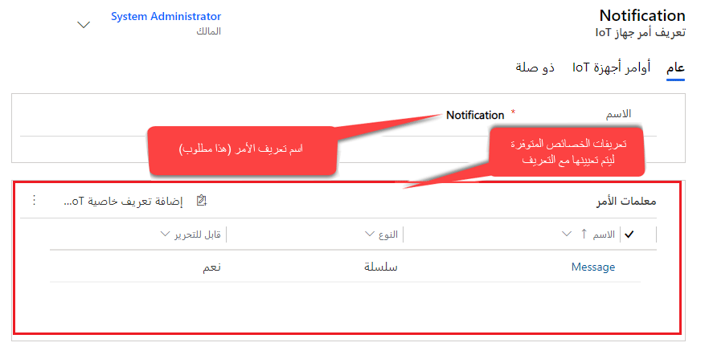
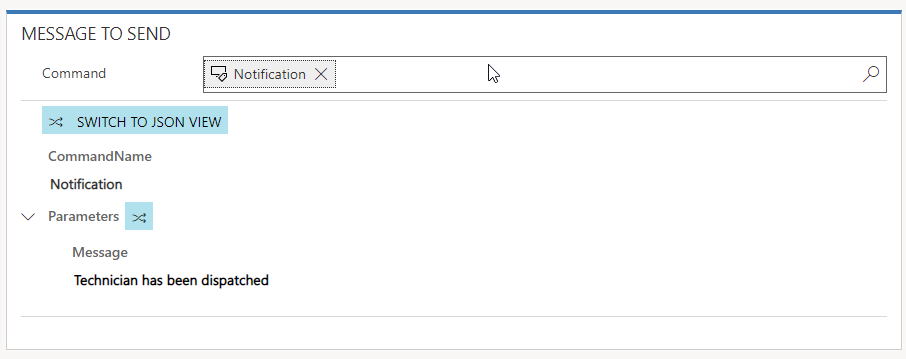
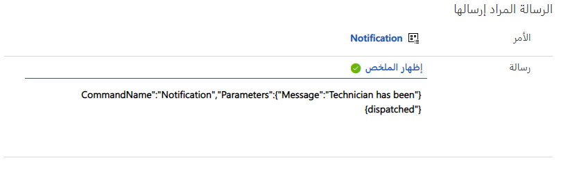

في كثير من الأحيان، سيكون لديك العديد من أجهزة IoT التي تقوم بنفس الشيء أو لديها خصائص مشابهة تم الإبلاغ عنها وربما تحتاج إلى التفاعل معها. في حين أن تنبيه IoT الذي يتم إنشاؤه سيكون خاصاً بأحد الأجهزة، فقد يكون هناك العديد من الخصائص المشتركة بين الأجهزة التي تحتاج إلى التفاعل معها. سيقوم كل أمر تقوم بإنشائه لإرساله إلى جهاز بتحديد أي من هذه الخصائص المختلفة التي يتم استخدامها لهذا الجهاز المحدد.

> [!VIDEO https://www.microsoft.com/videoplayer/embed/RE2EbBw]  

## <a name="sending-messages"></a>إرسال رسائل

على سبيل المثال، لنفترض أننا نريد إرسال رسالة مرة أخرى إلى جهاز يقوم بعرض رسالة تسمح للجهاز (أو الشاشة الموجودة على الجهاز) بمعرفة أننا قمنا بإرسال فني لحل المشكلة. في كل مرة نريد فيها الاتصال بهذا إلى جهاز، يمكننا إنشاء أمر في Connected Field Service يتضمن رسالة JSON التالية:

```
{"CommandName":"Notification","Parameters":{"Message":"Technician has been dispatched"}}
```

في المثال أعلاه، هناك ثلاثة مكونات محددة يتم إرسالها إلى الجهاز كجزء من الرسالة.

-   **CommandName:** يمثل هذا اسم الأمر الذي يتم تعيينه على الجهاز.

    *(على سبيل المثال، في الأمر أعلاه، اسم الأمر هو "الإخطار")*

-   **المعلمات:** يستخدم للإعلان عن الخصائص المعينة التي يتم التفاعل معها كجزء من الأمر. ستتضمن كافة الخصائص التي يقوم الأمر بالتفاعل معها.

    *(على سبيل المثال، في الأمر أعلاه، كل ما يتبع المعلمات (في هذه الحالة، تمثل "الرسالة" الخصائص التي يتم التفاعل معها كجزء من هذا الأمر)*

-   **الخاصية:** الخاصية المحددة التي سيتم التفاعل معها والقيمة التي يجب دفعها إلى الخاصية. يتم تعريف الخصائص عادةً على أنها أزواج الاسم/القيمة.

    *(على سبيل المثال، تمثل "رسالة" خاصية الرسالة التي يمكن استخدامها لإرسال رسالة إلى الجهاز. "تم إرسال الفني" هي القيمة الفعلية التي يتم تمريرها إلى خاصية الرسالة.)*

في حين أن لديك القدرة على تحديد JSON يدوياً لكل أمر، فعليك الإرسال باستخدام التنسيق المحدد أعلاه. الحقيقة هي أن ذلك قد يؤدي إلى الاضطرار إلى تحديد العديد من الأوامر المختلفة التي تقوم بتنفيذ الشيء نفسه في الأساس. قد يساعد **تعريف الأوامر** في هذه العملية. تعريف الأوامر هو في الأساس غلاف تضمين يحدد مسبقاً "اسم الأمر" و"المعلمات" التي تريد استخدامها في أمر ما. من خلال التحديد المسبق للمعلمات المحددة التي سيتم استخدامها في أمر معين، يمكن للمستخدمين و/أو التشغيل التلقائي القيام فقط بتعديل قيم الخصائص التي تحتاج إلى التعديل على أساس ما يحاول الأمر الذي يتم إرساله القيام به. عند إنشاء أمر، يقوم المستخدم/العملية ببساطة بتحديد تعريف الأوامر الذي يريد استخدامه.

## <a name="notification"></a>الإخطار

تمثل الصورة أدناه تعريف أمر يسمى **"الإخطار"** والذي سيقوم بإنشاء JSON مماثل من المثال الأصلي تلقائياً.



يمكن ربط كل تعريف أمر تم تعريفه بواحد أو أكثر من "تعريفات الخاصية". يمثل تعريف الخاصية معلمة خاصة يتم استخدامها كجزء من الأمر. سيتم ملء أي معلمات تم تحديدها لتعريف الأوامر تلقائياً بالقيم الافتراضية التي تم تحديدها لتعريف الخاصية المحددة الذي يتم استخدامه. يمكن استخدام هذه القيم المعرفة مسبقاً كما هي أو يمكن الكتابة فوقها في وقت إنشاء الأمر الفعلي. للمساعدة في التصنيف والتوزيع، يمكن أيضاً ربط تعريف الأوامر بفئات أجهزة متعددة.

> [!NOTE]
> تعاريف الخاصية خارج نطاق هذه الوحدة وسيتم مناقشتها بمزيد من التفاصيل في الوحدة التالية.

توضح الصورة أدناه الشكل الذي ستبدو عليه الرسالة في أمر ما إذا استخدمنا تعريف الأوامر **"إخطار"** الموضح أعلاه لتعريف الرسالة. يتم عرض الرسالة في نافذة تصميم تخبرنا أن **CommandName** عبارة عن "**إخطار**" والمعلمات التي نرسلها عبارة عن خاصية **"الرسالة"** *(يتم تعريفها من خلال تعريف الخاصية)* والرسالة هي **"تم إرسال فني"**.
هذا هو النص الافتراضي المحدد في تعريف خاصية الرسالة).
يمكن معالجة قيمة نص الرسالة في نافذة التصميم لتمثيل أي نص نرغب في تمريره في الرسالة.



تحتوي نافذة تصميم الرسالة أيضاً على تبديل يسمح لنا بالتبديل بين عرض مصمم الرسائل وأمر JSON الفعلي الذي سيتم إرساله كجزء من الرسالة. إذا نظرنا إلى الرسالة أدناه، فيمكننا معرفة أن JSON يطابق مثال "الإخطار" الذي تم عرضه في بداية هذه الوحدة.



لا تعمل تعريفات الأوامر فقط على تسهيل عملية إنشاء أوامر لإرسالها إلى الأجهزة، ولكن نظراً لتعريفات الخصائص، فمن الأسهل استخدام الأتمتة مثل سير العمل بالإضافة إلى Power Automate لتحديد ومعالجة القيم المحددة التي تريد تمريرها في أمر ما.

في الوحدة التالية، سنقوم بفحص تعريفات الخصائص بشكل أكثر تفصيلاً ومناقشة الخيارات المختلفة المتاحة عند إنشائها لتوفير مزيد من المرونة عند استخدامها في الأوامر وتعريفات الأوامر.
