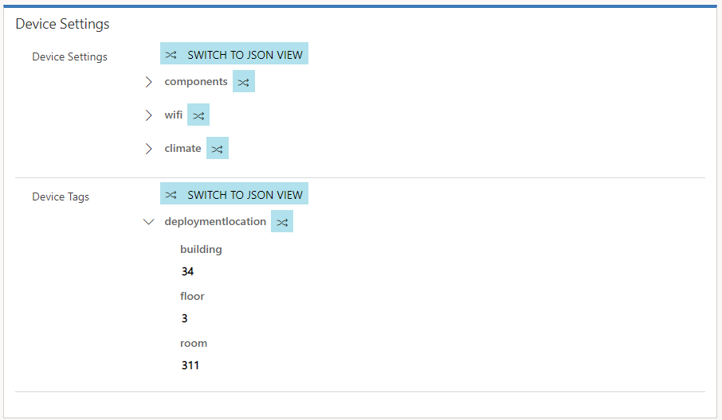
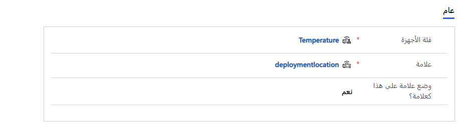
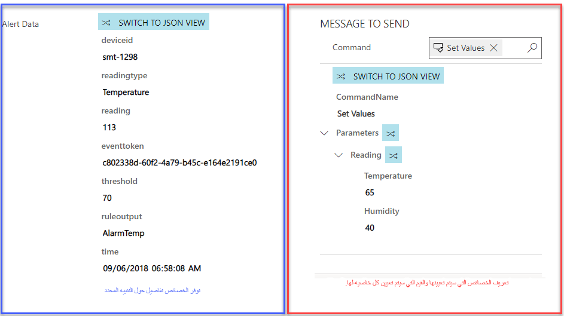
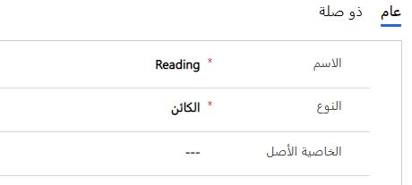
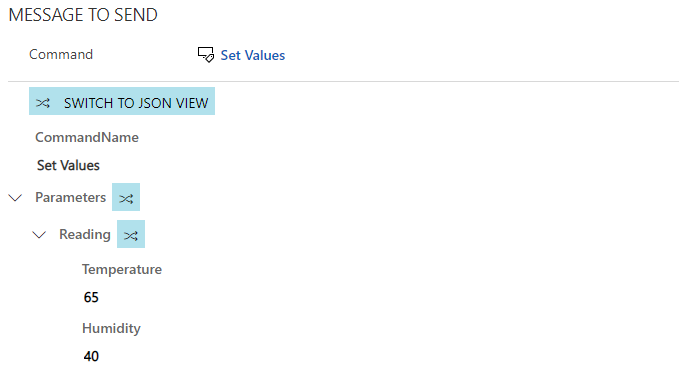
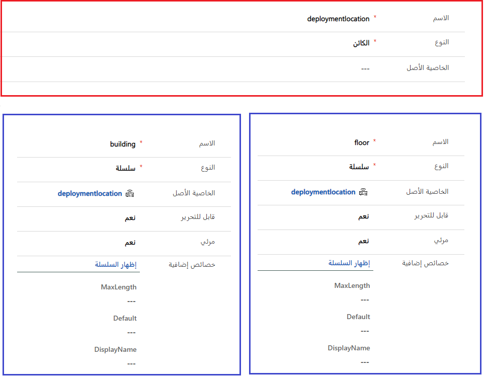

تعريفات الخاصية تجعل من السهل تعريف خصائص محددة مقترنة بأجهزة IoT. هناك ناحيتان أساسيتان يمكن الاستفادة فيهما من تعريفات الخاصية.

> [!VIDEO https://www.microsoft.com/videoplayer/embed/RE2EbBv]

-   المساعدة في المزامنة والتواصل مع الأجهزة المتماثلة

-   تنظيم مجتمع الخصائص في تعريفات الأوامر.

**يحتوي تعريف الخاصية على المعلومات التالية:**

-   **الاسم:** اسم الخاصية المحددة. في المثال أعلاه، سيتم تعيين الرسالة كاسم، لأن هذه هي الخاصية التي نريد تعريفها.

-   **النوع:** تحديد نوع الخاصية. لديك ستة أنواع مختلفة للاختيار من بينها.

| النوع           | الوصف                                                                                                                                                                                                                                                                    |
|----------------|--------------------------------------------------------------------------------------------------------------------------------------------------------------------------------------------------------------------------------------------------------------------------------|
| السلسلة         | تستخدم عندما تكون القيمة التي تريد تمريرها إلى خاصية هي قيمة تستند إلى نص. تتضمن الخصائص الإضافية: الحد الأقصى للطول والقيمة الافتراضية. مثال: قد تستخدم خاصية الرسالة نوع السلسلة لأن محتويات الرسالة ستكون نصية.                                   |
| التاريخ والوقت  | يستخدم عندما تكون القيمة المراد تمريرها إلى خاصية قائمة على التاريخ و/أو الوقت.  الخصائص الإضافية تشمل: الحد الأدنى والحد الأقصى للقيم.                                                                                                                                               |
| قيمة منطقية        | تستخدم عندما تريد تمرير إحدى القيمتين المحتملتين إلى الخاصية.  تتضمن الخصائص الإضافية: اسم العرض للقيمة الصحيحة واسم العرض للقيمة الخاطئة واسم العرض للقيمة الافتراضية.                                                                                                         |
| رقم صحيح   | يستخدم عندما تريد تمرير رقم صحيح إلى الخاصية. تتضمن الخصائص الإضافية: الحد الأدنى والحد الأقصى والقيمة الافتراضية.                                                                                                                                                 |
| رقم عشري | يستخدم عندما تريد تمرير رقم عشري إلى الخاصية. تتضمن الخصائص الإضافية: الحد الأدنى والحد الأقصى والقيمة الافتراضية بالإضافة إلى الدقة العشرية.                                                                                                                   |
| الكائن         | يستخدم عندما يكون العنصر الذي تريد تمريره كائناً.  مثال: قد تحتوي خاصية القراءة على خاصية درجة الحرارة والرطوبة.  من خلال تعيين خاصية القراءة إلى نوع الكائن، ستتمكن من تحديد الخصائص الفرعية المحددة لها.  (تعرف على المزيد عن ذلك لاحقاً) |

-   **الخاصية الأصل:** تقوم بتحديد أن الخاصية هي خاصية تابعة لخاصية أخرى.

-   **قابل للتحرير:** يقوم بتحديد هل ستكون الخاصية قابلة للتحرير عند استخدامها في تعريف أمر ما.

-   **مرئي:** يحدد ما إذا كانت هذه الخاصية مخفية والتي لا يجب عرضها في تعريف الأوامر.

-   **الخصائص الإضافية:** العناصر الإضافية الخاصة بنوع الخاصية التي يمكن تعريفها. على سبيل المثال: سيتم استخدام سلسلة نصية افتراضية مع خاصية الرسائل. (ستختلف الخصائص الإضافية حسب النوع الذي تم اختياره.)

### <a name="using-property-definitions-with-device-twins"></a>استخدام تعريفات الخصائص مع الأجهزة المتماثلة

لنفترض أنك تريد استخدام علامات الجهاز لتحديد الموقع المحدد لجهاز IoT. وعادةً ما تكون الأجهزة الخاصة بك في مبنى وفي طابق معين. يمكن استخدام تعريف الخاصية لتعريف العلامة. عند إضافة هذه العلامة إلى فئة الأجهزة، سيتم ملؤها تلقائياً على أي جهاز ينتمي إلى تلك الفئة.



عند إضافة تعريف الخاصية إلى فئة الأجهزة، يمكنك تحديدها كعلامة أو لا. إذا قمت بتمييزها على أنها علامة، فستظهر كعلامة جهاز على الجهاز. إذا حددت عدم تمييزها كعلامة، فستظهر كإعداد للجهاز.



### <a name="using-properties-definitions-in-command-definitions"></a>استخدام تعريفات الخصائص في تعريفات الأوامر

عندما تنظر إلى البيانات التي يتم إرسالها كجزء من تنبيه IoT أو عندما تقوم بإرسال أمر بعيد إلى أحد الأجهزة، سترى عدة خصائص مقترنة ببيانات التنبيه أو الرسالة المراد إرسالها. وتمثل الخصائص زوج الاسم/القيمة الذي يعرض أو يوفر المعلمات ذات الصلة بالحدث.

على سبيل المثال:

-   قد يتضمن تنبيه جهاز IoT المرتبط بدرجة الحرارة معرف الجهاز أو نوع القراءة أو القراءة الفعلية أو القراءة أو الحد الأدنى الذي تم تجاوزه.

-   قد يتضمن الأمر الذي ترسله مرة أخرى إلى IoT الرسالة المراد إرسالها، أو القيمة المحددة التي تريد تعيين خاصية لها.

توضح الصورة أدناه كيفية عرض الخصائص لكلا الأمرين اللذين تم إرسالهما إلى الجهاز *(الصورة اليسرى)* وتنبيهات IoT *(الصورة اليمنى)*.



كما ذكر في الوحدة السابقة، يمكن استخدام تعريفات الأوامر لإنشاء الأوامر المعرفة مسبقاً التي تحتوي على المعلمات المحددة التي تريد العمل معها. ويتم ذلك عن طريق إنشاء تعريفات الخاصية وإقران تعريفات هذه الخاصية بتعريفات أوامر محددة. يحدد تعريف الخاصية تفاصيل محددة حول الخاصية التي يتم تمريرها إلى الأمر.

لنلقِ نظرة على الأمر الموجود أدناه على سبيل المثال:

```xml
{"CommandName":"Notification","Parameters":{"Message":"Technician has been dispatched"}}
```

المعلمات هي الخصائص المحددة التي نريد تضمينها في الأمر. تقوم الخاصية "رسالة" بإعلامنا أننا نريد إرسال رسالة إلى الجهاز، ويكون النص هو الرسالة التي نريد تضمينها في الرسالة. تعد خاصية الرسالة أعلاه مثالاً جيداً على الأماكن التي يمكن استخدام تعريفات الخاصية فيها.

### <a name="working-with-parent-properties"></a>العمل مع خصائص الأصل

في كثير من الأحيان، سيكون للخاصية خصائص فرعية متعددة والتي تشكل تعريف الخاصية بالكامل. في هذه الحالة، يمكنك استخدام الخصائص الأصل لربط خاصية بخصائص فرعية متعددة.

لنلقِ نظرة على المثال الموجود أدناه:

```xml
{"CommandName":"Set Values","Parameters":{"Reading":{"Temperature":"30","Humidity":"30"}}}
```

في هذا المثال، تعتبر القراءة الخاصية الأصل لدرجة الحرارة والرطوبة. سنقوم بتعيين أنواع القراءة على الكائن. وهذا يحدد أن خاصية القراءة يجب اعتبارها كائناً، وقد تحتوي على خصائص أخرى تشكل القيمة الإجمالية.



سيكون لكل من تعريفات خاصية "درجة الحرارة" و"الرطوبة" تعريف خاصية "القراءة" الذي تم تعيينه كخاصية أصل. عندما نقوم بإنشاء تعريف أمر يحتاج إلى الاستفادة من خاصية القراءة، فإننا نحتاج فقط إلى تضمين مرجع لتعريف خاصية القراءة.
ونظراً لأن القراءة تحتوي على نوع من الكائنات، ولكل من درجة الحرارة والرطوبة قراءات كخاصية أصل، فإن هذا يضمن أنه عند استخدام خاصية القراءة، سيتم أيضاً تضمين خصائص درجة الحرارة والرطوبة.

توضح الصورة أدناه الشكل الذي ستبدو عليه رسالة الأمر عند استخدام تعريف أمر يتضمن تعريف خاصية القراءة.



ويمكنك أن ترى أنه يتم تضمين خاصية القراءة ضمن المعلمات. تحتوي خاصية القراءة على خصائص درجة الحرارة والرطوبة المضمنة مع القيم الأولية التي تم ملؤها بناءً على القيم الافتراضية المحددة. يمكن معالجة هذه القيم الفردية حسب الحاجة عند إنشاء الأمر.

قد تنطبق نفس عملية التفكير هذه إذا كنت تستخدم تعريف الخاصية لملء علامة الجهاز أو إعدادات الجهاز.

لنلقِ نظرة على مثال علامة الجهاز المحتملة أدناه:

```xml
{"deploymentlocation":{"building":"34","floor":"3"}}
```

هنا، سيتم اعتبار موقع النشر خاصية أصل للمبنى والطابق. سنقوم بتعيين نوع موقع النشر إلى كائن، وسيكون لكل من "المبنى" و"الطابق" موقع النشر المحدد على أنه الأصل.


