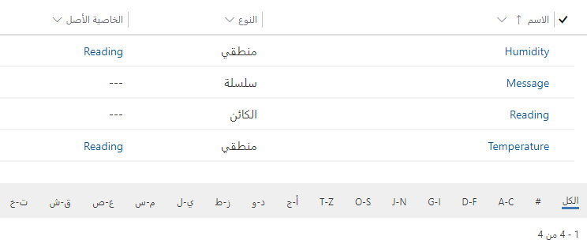
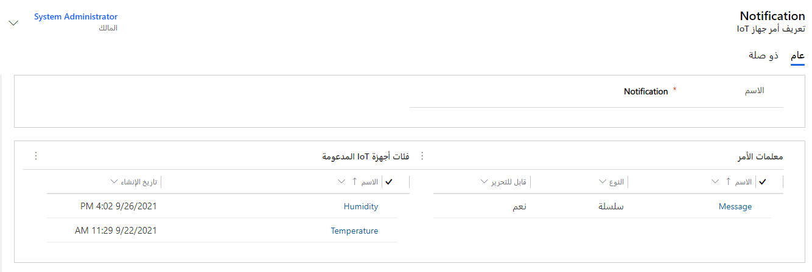
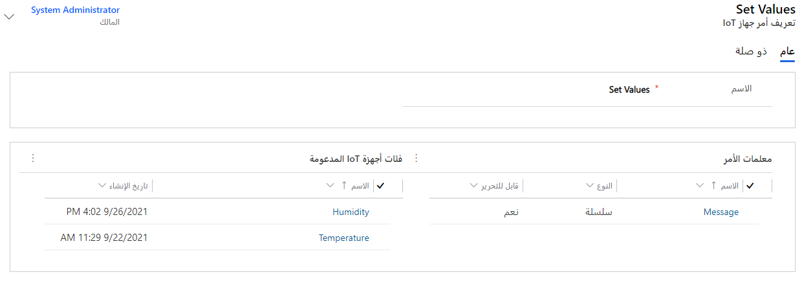
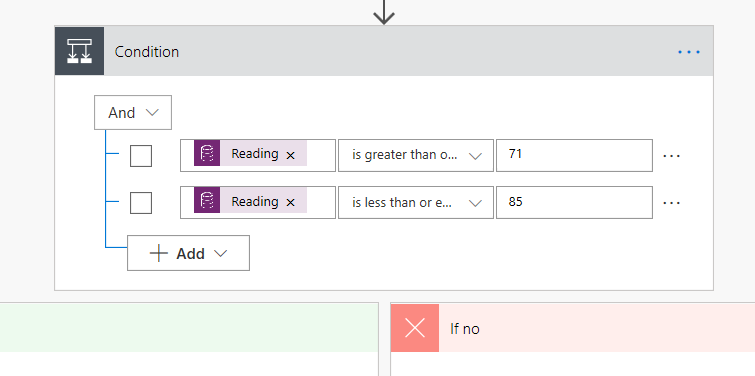
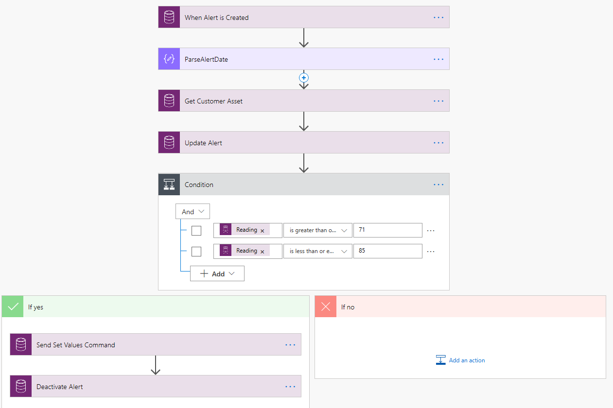

## <a name="lab-overview"></a>نظرة عامة على المعمل

يوفر حل Connected Field Service من Dynamics 365 القدرة على مراقبة الأجهزة الممكّنة لـ IoT عن بُعد لتعقب وقت التشغيل وإحصائيات الجهاز والحالات الشاذة والمزيد. بعد أن يتصل جهاز IoT بشيء خارج عن المألوف أو استثناء، يتم إرسال هذه المعلومات إلى Connected Field Service كتنبيه. بمجرد التقاط التنبيه، يمكن إدارة أجهزة IoT عن بعد والتفاعل معها باستخدام أوامر جهاز IoT من داخل Dynamics 365. للمساعدة على بعض المرونة، يمكن ملء البيانات التي تمت تعبئتها في هذه الأوامر بسهولة باستخدام تعريفات الأوامر والخصائص. 

الغرض من هذه المشاركة العملية هو تعريفك بإنشاء وتعريف تعريفات الأوامر والخصائص في Connected Field Service.
بالإضافة إلى ذلك، سوف نوضح كيف يمكنك أتمتة عملية إرسال الأوامر باستخدام وظيفة Dynamics 365.

### <a name="scenario"></a>السيناريو

أنت تعمل في شركة سباكة وتدفئة تقوم ببيع الأجهزة المنزلية الذكية وخدمتها. ونظراً لأن العديد من الأجهزة التي تقوم بخدمتها هي أجهزة ذكية، يمكن التقاط المعلومات من هذه الأجهزة عن بعد للمساعدة في خدمة تلك المعدات. لدى مؤسستك العديد من السيناريوهات المحددة التي تتضمن العمليات التي سيتم استخدامها أثناء خدمة المعدات. ويمكن أن تختلف هذه العمليات بناء على عدة عوامل تتضمن:

-   نوع الجهاز الذي يحتاج للخدمة

-   تم اكتشاف خطورة المشكلة

-   عمر الجهاز

-   موقع الجهاز

-   توفر الموارد للعمل على جهاز معين

تمثل العناصر المذكورة أعلاه جزءاً صغيراً فقط من العوامل التي تستخدمها مؤسستك لتحديد عملية خدمة المعدات.

مؤخراً، لقد قمت بتثبيت العديد من أجهزة الثرموستات الذكية.
كانت هذه الأجهزة مفيدة في القدرة على تعقب قراءات درجة الحرارة والرطوبة في المناطق عندما يكون من المهم الحفاظ على درجة حرارة ورطوبة ثابتة. نظراً لتوفر مزيد من المعلومات، فقد أجبرت على إنشاء عمليات جديدة للتعامل مع المشكلات التي أبلغت عنها هذه الأجهزة وحلها.
المجال الأول الذي ترغب في التركيز عليه هو أتمتة العملية المستخدمة في المشكلات المتعلقة بدرجة الحرارة.

تتطلع مؤسستك إلى تنفيذ العملية التالية:

-   إذا اكتشف الجهاز قراءة درجة حرارة تزيد عن 70 درجة، فيجب أن يظهر تنبيه في بيئة Connect Field Service الخاصة بك.

-   إذا كانت قراءة درجة الحرارة بين 70 درجة و85 درجة، فيجب إرسال أمر لإعادة ضبط الجهاز عن بعد لمعرفة ما إذا كانت المشكلة تحل نفسها.

ترغب مؤسستك في التسهيل قدر الإمكان على الفنيين لإنشاء الأوامر وتعديل المعلمات. إنهم يرغبون في تحديد بعض الأوامر والخصائص المشتركة لأجهزة الثرموستات الذكية هذه مسبقاً.

***الأمران المطلوب تحديدهما مسبقاً هما:***

-   **الإخطار:**
```json
{"CommandName":"Notification","Parameters":{"Message":"Technician has been dispatched"}}
```

-   **تعيين قيم** 
```json
{"CommandName":"Set Values","Parameters":{"Reading":{"Temperature":"30","Humidity":"30"}}}
```

## <a name="exercise-1-define-command-and-property-definitions"></a>التدريب 1: تحديد تعريفات الأوامر والخاصية 

### <a name="task-1-create-device-categories"></a>المهمة 1: إنشاء فئات الأجهزة 

1.  انتقل إلى [Power Apps](https://make.powerapps.com/?azure-portal=true) وتأكد من أنك في البيئة الصحيحة التي بها تم تكوين خدمة Connected Field Service.

1.  حدد التطبيقات وانقر لفتح تطبيق **Connected Field Service**.

1.  التبديل إلى منطقة **الإعدادات** الخاصة بخريطة الموقع.

1.  حدد **فئات الأجهزة** وانقر فوق **+ جديد**.

1.  أدخل **درجة الحرارة** **للاسم** وانقر فوق **حفظ**.

1.  انقر فوق **+ جديد** مرة أخرى.

1.  أدخل **الرطوبة** **للاسم** وانقر فوق **حفظ**.

### <a name="task-2-create-property-definitions"></a>المهمة 2: إنشاء تعريفات الخاصية 

1.  حدد **تعريفات الخاصية** من خريطة الموقع وانقر فوق **+ جديد.**

1.  قم بتكوين تعريف الخاصية الخاصة بك كما يلي:

    -   **الاسم:** رسالة

    -   **النوع:** سلسلة

    -   **قابل للتحرير:** نعم

    -   **مرئي:** نعم

    -   **خصائص إضافية:**

        -   **افتراضي:** تم إرسال فني.

1.  **احفظ** **و** **إقفال** **رسالة** تعريف الخاصية.

1.  انقر فوق الزر **+ جديد**.

1.  قم بتكوين تعريف الخاصية الخاصة بك كما يلي:

    -   **اسم الخطوة:** *قراءة*

    -   **النوع:** كائن

1.  **احفظ** **و** **إقفال** تعريف خاصية القراءة.

1.  انقر فوق الزر **+ جديد**.

1.  قم بتكوين تعريف الخاصية الخاصة بك كما يلي:

    -   **الاسم:** درجة الحرارة

    -   **النوع:** عدد صحيح

    -   **الخاصية الأصلية:** قراءة

    -   **قابل للتحرير:** نعم

    -   **مرئي:** نعم

    -   **خصائص إضافية:**

        -   **MinValue:** 1

        -   **MaxValue:** 120

        -   **افتراضية:** 65

1.  **احفظ** **و** **إغلاق** تعريف خاصية **درجة الحرارة**.

1. انقر فوق **+ جديد** مرة أخرى.

1. قم بتكوين تعريف الخاصية الخاصة بك كما يلي:

    -   **الاسم:** الرطوبة

    -   **النوع:** عدد صحيح

    -   **الخاصية الأصلية:** قراءة

    -   **قابل للتحرير:** نعم

    -   **مرئي:** نعم

    -   **خصائص إضافية:**

        -   **MinValue:** 1

        -   **MaxValue:** 100

        -   **افتراضية:** 40

1. **احفظ** **و** **إقفال** تعريف خاصية **الرطوبة**.

13. يجب أن تشبه تعريفات الخواص المكتملة الصورة أدناه:

    

### <a name="task-3-create-command-definitions"></a>المهمة 3: إنشاء تعريفات الأوامر

1.  حدد **تعريفات الأوامر** وانقر فوق **+ جديد**.

1.  قم بتكوين تعريف الأوامر الخاصة بك كما يلي:

    1.  **الاسم:** الإخطار

1.  احفظ تعريف أمر **الإخطار** واتركه مفتوحاً. سيؤدي هذا أيضاً إلى تمكين الشبكة الفرعية لتعريف الخاصية.

1.  انقر فوق **إضافة فئة أجهزة IoT الموجودة**.

1.  في سجلات البحث، حدد فئتي درجة الحرارة والرطوبة.

1.  انقر فوق **إضافة**.

1.  انقر فوق **إضافة تعريف خاصية IoT الموجودة**.

1.  حدد **الرسالة** وانقر فوق **إضافة**.

1.  يجب أن يشبه تعريف الأوامر **الإخطار** المكتمل الصورة أدناه:

    

1. انقر فوق الزر **+ جديد**.

1. قم بتكوين تعريف الأوامر الخاصة بك كما يلي:

    -   **الاسم:** تعيين القيم

1. احفظ تعريف أمر **تعيين القيم** واتركه مفتوحاً.

1. انقر فوق **إضافة فئة أجهزة IoT الموجودة**.

1. في سجلات البحث، حدد فئتي **درجة الحرارة** و **الرطوبة**.

1. انقر فوق **إضافة**.

1. انقر فوق **إضافة تعريف خاصية IoT الموجودة**.

1. حدد **قراءة** وانقر فوق **إضافة**.

1. يجب أن يشبه تعريف الأوامر **تعيين القيم** المكتمل الصورة أدناه:

    

## <a name="exercise-2-using-definitions-to-populate-commands"></a>التدريب 2: استخدام التعريفات لتعبئة الأوامر 

### <a name="task-1-attach-to-simulator-optional"></a>المهمة 1: إرفاق إلى المحاكي *(اختياري)* 

> [!NOTE]
> إذا كان المحاكي مفتوحاً بالفعل من التدريب الخاص بالوحدة 3، فيمكنك التخطي مباشرة إلى المهمة 2. وإلا، اتبع الخطوات التالية لإرفاقها بالمحاكي.

1.  في مستعرض الويب الخاص بك، حدد علامة تبويب جديدة وانتقل إلى [مدخل Azure](https://portal.azure.com/?azure-portal=true). قم بتسجيل الدخول إلى Azure إذا طلب منك ذلك. أنت بحاجة إلى اشتراك Azure المرتبط بالحساب الذي تستخدمه.

1.  حدد **مجموعات الموارد**.

1.  افتح مجموعة الموارد التي تستخدمها مع **Connected Field Service** وحدد **المحاكي**.

1.  انقر فوق **عنوان URL الخاص بالمحاكي** لفتح محاكي الثرموستات. يجب أن يفتح المحاكي في علامة تبويب جديدة.

1.  انقر فوق **اتصال** في المحاكي.

1.  قم بالرجوع إلى اشتراك **Azure** وأغلق شاشة خدمة تطبيق المحاكي.

1.  افتح **IoT Hub**.

1.  قم بتمييز **اسم مركز IoT** وقم **بنسخه**.

1.  قم بالرجوع إلى شاشة المحاكي وقم بلصق **اسم مركز IoT** في حقل **المضيف**.

1. قم بالرجوع إلى اشتراك Azure، وحدد **سياسات الوصول المشتركة**.

1. قم بفتح سياسة **iothubowner** **وقم** بنسخ **المفتاح الأساسي**.

1. قم بالتبديل مرة أخرى إلى شاشة المحاكي وقم بلصق **المفتاح الأساسي** في الحقل **الأساسي**.

1. انقر فوق الزر **Connect**. المحاكي متصل وجاهز للاستخدام.

### <a name="task-2-use-simulator-to-generate-and-interact-with-alerts"></a>المهمة 2: استخدام المحاكي لإنشاء التنبيهات والتفاعل معها 

1.  أثناء فتح المحاكي، انقر فوق الزر **تحديث** للتأكد من توفر جميع الأجهزة المسجلة.

1.  من القائمة المنسدلة **تحديد الجهاز** قم بتحديد الجهاز **smt-9876**. يجب أن تظهر نقطة خضراء بجوار الزر "تحديث"، وبعد بضع ثوانٍ يجب أن تبدأ في إرسال المعلومات.

1.  على **منزلق درجه الحرارة**، قم بتعيينه إلى **75** **درجة** وانتظر حتى يتم تسجيل حالة درجة الحرارة في نافذة **الرسائل المرسلة**.

1.  قم بالرجوع إلى علامة تبويب المتصفح التي تم تحميل **Connected Field Service** بها.

1.  قم بالرجوع إلى منطقة خريطة الموقع **Connected Field Service**.

1. حدد **تنبيهات IoT**.

1. قم بفتح **درجة الحرارة 75 تجاوزت التي تجاوزت حد 70 تنبيه**.

1. في **‏‫شريط الأوامر**، انقر فوق **‏‫إرسال أمر‬**.

1. انقر فوق **خيارات متقدمة**.

1. قم بإدخال **تعيين قيم الجهاز** إلى **الاسم**.

1. ضمن **الرسائل المراد إرسالها**، انقر في حقل البحث بجوار  **الأمر**، وحدد أمر **تعيين القيم**.

1. يجب أن يتم عرض الرسالة مع *درجة الحرارة* وأيضاً *الرطوبة* المحددة مسبقاً.

    1.  قم بتغيير **درجة الحرارة** إلى **60**

    1.  قم بتغيير **الرطوبة** إلى **35**

1. في **شريط الأوامر**، انقر فوق الزر **‏‫إرسال وإغلاق**.

1. قم بالتبديل مره أخرى إلى المحاكي، بعد فتره قصيرة، حيث يجب أن يتم تعيين قيم الجهاز على القيم المحددة في الرسالة. ووفقاً لسرعات الإنترنت وعوامل أخرى، قد يستغرق حدوث ذلك عدة دقائق.

1. قم بتعيين درجة حرارة الجهاز على **86** درجة وانتظر حتى يتم التسجيل في نافذة الرسائل المرسلة.

1. قم بالرجوع إلى علامة تبويب المتصفح التي تم تحميل **Connected Field Service** بها.

1. حدد **تنبيهات IoT**.

1. قم بفتح **درجة الحرارة 86 تجاوزت حد 70 تنبيهاً**.

1. في **‏‫شريط الأوامر**، انقر فوق **‏‫إرسال أمر‬**.

1. انقر فوق **خيارات متقدمة**.

1. قم بإدخال **فني الإرسال** من أجل الاسم.

1. ضمن **الرسائل المراد إرسالها**، انقر في حقل البحث بجوار  **الأمر**، وحدد أمر **تعيين القيم**.

1. يجب أن تظهر الرسالة مع تحديد خاصية *الرسالة* مسبقاً.

1. في شريط **الأوامر** انقر فوق الزر **إرسال وإغلاق**.

1. قم بالرجوع مرة أخرى إلى المحاكي، بعد الفترة القصيرة التي يجب أن تظهر فيها رسالة في الرسائل المستلمة تفيد بأن قد تم إرسال فني. ووفقاً لسرعات الإنترنت وعوامل أخرى، قد يستغرق حدوث ذلك عدة دقائق.

1. إذا قمت بالتحقق من حالة "تنبيه IOT" في بيئة Connected Field Service، فيجب التغيير الآن إلى "إرسال الأمر - قيد التقدم".

## <a name="exercise-3-automate-sending-of-commands"></a>التدريب 3: أتمتة إرسال الأوامر 

### <a name="task-1-create-a-new-iot-alert-process-solution"></a>المهمة 1: قم بإنشاء حل جديد لعملية تنبيه IoT

1.  انتقل إلى [Power Apps](https://make.powerapps.com/?azure-portal=true) وتأكد من أنك في البيئة الصحيحة.

1.  حدد **الحلول** وانقر فوق **حل جديد**.

1.  قم بتسمية حل **عمليات تنبيه IoT**.

1.  انقر فوق القائمة المنسدلة **للناشر** وحدد **+ الناشر**.

1.  قم بتكوين **الناشر** على النحو.

    1.  **اسم العرض:** دورة Connected Field Service
    
    1.  **البادئة:** cfs

1.  انقر فوق **حفظ وإغلاق**.

1.  انقر فوق القائمة المنسدلة **للناشر** وحدد الناشر الذي أنشأته.

1.  في حقل الإصدار، أدخل **1.0.0.0**. وانقر فوق **إنشاء**.

1.  انقر لفتح حل **إجراء تنبيه IoT** الذي قمت بإنشائه.

1. انقر فوق **إضافة موجود** وحدد **الكيان**.

1. حدد **تنبيهIoT** وانقر فوق **التالي**.

1. لا تقم بتضمين المكونات المطلوبة. انقر فوق **إضافة** مرة أخرى.

### <a name="task-2-customize-the-iot-alert-entity"></a>المهمة 2: تخصيص كيان تنبيه IoT 

1.  انقر لفتح حل **إجراء تنبيه IoT**.

1.  انقر لفتح كيان **تنبيه IoT**.

1.  حدد علامة تبويب **الحقول** وانقر فوق **+ إضافة حقل**.

1.  توفير المعلومات المذكورة أدناه:

    1. **اسم العرض:** قراءة

    1. **نوع البيانات:** عدد صحيح

    1. **الحد الأدنى للقيمة:** 0

    1. **الحد الأقصى للقيمة:** 250

1.  انقر فوق **تم**.

1.  انقر فوق **+ إضافة حقل** مرة أخرى.

1.  قم بتكوين الحقل الجديد على النحو التالي:

    1.  **اسم العرض:** عميل

    1.  **نوع البيانات:** بحث

    1.  **نوع السجل المستهدف:** حساب

1.  انقر فوق **تم**.

1.  انقر فوق **حفظ كيان.**

1. حدد **الحلول** وانقر فوق **نشر جميع التخصيصات**.

### <a name="task-3-copy-set-values-command-message"></a>المهمة 3: نسخ مجموعة قيم رسالة الأمر

1.  انتقل إلى [Power Apps](https://make.powerapps.com/?azure-portal=true) وتأكد من أنك في البيئة الصحيحة.

1.  حدد **التطبيقات** وافتح تطبيق **Connected Field Service**.

1.  حدد **الأوامر** وانقر فوق **+ جديد**.

1.  قم بالتمرير لأسفل إلى قسم **الرسائل المراد إرسالها** وقم بتحديد **تعيين القيم** **للأمر**.

1.  انقر فوق **التبديل إلى** **طريقة عرض JSON**.

1.  انسخ **JSON** واحفظه في المفكرة.

1.  أغلق تطبيق Connected Field Service دون حفظ سجل الأمر.

### <a name="task-4-create-a-flow-to-populate-values"></a>المهمة 4: إنشاء سير عمل لتعبئة القيم 

1.  انتقل إلى [Power Apps](https://make.powerapps.com/?azure-portal=true) وتأكد من أنك في البيئة الصحيحة.

1.  حدد **حلولاً** ثم انقر لفتح حل **سير إجراء تنبيه IoT**.

1.  انقر فوق **+ جديد** وحدد **سير عمل**. سيقوم هذا بفتح نافذة جديدة.

1.  إعادة تسمية سير عمل **تعبئة حقول التنبيه وتعيين القيم**.

1.  ابحث عن **Microsoft Dataverse** وقم بتحديد Common **Data Service (البيئة الحالية)**. تأكد من أنك قمت بتحديد واحدة مع "البيئة الحالية".

1.  حدد **عندما يتم إنشاء سجل أو تحديثه أو حذفه**.

1.  حدد **إنشاء** **لحالة التشغيل** **وتنبيهات IoT** **لكيان** وحدد **مؤسسة** **للنطاق**.

1.  انقر فوق الزر **القائمة** وحدد **إعادة تسمية**.

1.  إعادة التسمية **عند إنشاء التنبيه** وانقر فوق **+ خطوة جديدة**.

1. ابحث عن **التحليل** وحدد **تحليل Json.**

1. انقر فوق حقل **المحتوى** وحدد **بيانات التنبيه** من جزء  **المحتوى الديناميكي**.

1. قم بلصق مخطط JSON أدناه في حقل **المخطط**.

    ```json
    {
        "type": "object",
        "properties": {
            "deviceid": {
                "type": "string"
            },
            "readingtype": {
                "type": "string"
            },
            "reading": {
                "type": "integer"
            },
            "eventtoken": {
                "type": "string"
            },
            "threshold": {
                "type": "integer"
            },
            "ruleoutput": {
                "type": "string"
            },
            "time": {
                "type": "string"
            }
        }
    }
    ```

1. أعد تسمية خطوة **ParseAlertDate** وانقر فوق **+ خطوة جديدة**.

1. ابحث عن **الحصول على سجل** وحدد **احصل على سجل (البيئة الحالية).** تأكد من أنك قمت بتحديد واحدة مع "البيئة الحالية".

1. أعد تسمية خطوة **الحصول على أصل العميل**.

1. حدد **أصول العميل** **لاسم الكيان**.

1. انقر فوق حقل **معرف الصنف** وحدد **أصل العميل (القيمة)** من جزء **المحتوى** **الديناميكي**.

1. انقر فوق **+ خطوة جديدة**.

1. ابحث عن **تحديث السجل** وحدد **تحديث سجل (البيئة الحالية)**. تأكد من أنك قمت بتحديد واحدة مع "البيئة الحالية".

1. قم بإعادة تسمية **تحديث تنبيه الخطوة**.

1. حدد **تنبيهات IoT** **لاسم الكيان** وانقر فوق حقل **معرف السجل** وحدد **تنبيهات ‎IoT** من جزء **المحتوى الديناميكي**.

1. انقر فوق **عرض الخيارات المتقدمة**.

1. انقر فوق حقل **(حساب) العميل** ونوع **حسابات()**.

1. ضع مؤشر الماوس بين **(** و **)** وحدد **الحساب (القيمة)** من المحتوى الديناميكي.

1. انقر فوق حقل **قراءة** وحدد **قراءة** من خطوة **Json** في المحتوى الديناميكي.

1. إخفاء **الخيارات المتقدمة**.

1. انقر فوق **+ خطوة جديدة**.

1. حدد **شرط**.

1. انقر فوق حقل **حدد القيمة** وحدد **القراءة** من خطوة  **تحديث التنبيه**.

1. حدد **أكبر من أو يساوي**.

1. أدخل **71** من أجل **القيمة** وانقر فوق **+ إضافة** وحدد **إضافة صف**.

1. انقر فوق حقل **حدد القيمة** وحدد **القراءة‏‎** من خطوة  **تنبيه التحديث** في المحتوى الديناميكي.

1. حدد **أقل من أو يساوي**.

1. أدخل **85** **للقيمة**.

1. يجب أن تبدو حالتك الآن مثل الصورة أدناه.

    

1. انتقل إلى الفرع **نعم** وانقر فوق **إضافة إجراء**.


1. ابحث عن **إنشاء سجل جديد** وحدد **إنشاء تسجيل جديد (البيئة الحالية)**. تأكد من أنك قمت بتحديد واحدة مع "البيئة الحالية".

1. قم بإعادة تسمية خطوة **أمر إرسال قيم المجموعة**.

1. حدد **أوامر جهاز IoT** **لاسم الكيان** وانقر فوق حقل  **الاسم** وحدد **الوصف** من إجراء **عند إنشاء التنبيه** في المحتوى الديناميكي.

1. قم بإضافة **تعيين قيم الجهاز** إلى **الاسم** وانقر فوق **إظهار الخيارات المتقدمة**.

1. انقر فوق حقل **أصل العميل** ونوع  **msdyn_customerassets()**.

1. ضع مؤشر الماوس بين **(** وكذلك **)** وحدد **أصول العميل (القيمة)** من **عند إجراء إنشاء التنبيه** في المحتوى الديناميكي.

1. انقر فوق حقل **جهاز** ونوع **msdyn_iotdevices()**.

1. ضع مؤشر الماوس بين **(** وكذلك **)** وحدد **الجهاز (قيمة)** من إجراء **عند إنشاء تنبيه** في المحتوى الديناميكي.

1. انقر فوق حقل **التنبيه الأصل** ونوع **msdyn_iotalerts()**.

1. ضع المؤشر بين **(** و **)** وحدد **تنبيه IoT** من إجراء **تحديث التنبيه** في المحتوى الديناميكي.

1. حدد حقل **معرف الجهاز** وحدد **معرف الجهاز** من إجراء  **عند إنشاء تنبيه** في جزء **المحتوى الديناميكي**.

1. قم بلصق **JSON** الذي قمت بنسخه من الأمر **تعيين القيم** في حقل  **الرسالة**.

    ```json
    {"CommandName":"Set Values","Parameters":{"Reading":{"Temperature":65,"Humidity":40}}}
    ```

1. انقر فوق **إخفاء الخيارات المتقدمة**.

1. انقر فوق **إضافة إجراء**.

1. ابحث عن **تحديث السجل** وحدد **تحديث سجل (البيئة الحالية)** تأكد من أنك قمت بتحديد المجموعة الموجودة في "البيئة الحالية".

1. قم بإعادة تسمية خطوة **تنبيه إلغاء التنشيط**.

1. حدد **تنبيهات IoT** **لاسم الكيان**.

1. انقر فوق حقل **سجل المعرف** وحدد **تنبيه IoT** من إجراء **تحديث التنبيه** في جزء **المحتوى الديناميكي**.

1. انقر فوق **عرض الخيارات المتقدمة**.

1. قم بتعيين **الحالة** على **غير نشط** **وإخفاء الخيارات المتقدمة**.

1. يجب أن يبدو سير العمل الخاص بك الآن مثل الصورة أدناه.

    

1. انقر فوق **حفظ**.

### <a name="task-5-test-the-process"></a>المهمة 5: اختبار العملية

1.  قم بالرجوع إلى علامة تبويب متصفح الويب التي تحتوي على المحاكي الخاص بك. في حالة عدم الاتصال، الرجاء اتباع نفس العملية للفتح والمحاكاة وإنشاء اتصال بـ IoT Hub.

1.  قم بتعيين **درجة الحرارة** على **80 درجة** وانتظر حتى يتم التسجيل في نافذة **الرسائل المرسلة**.

    نظراً لأن درجة الحرارة كانت بين 71 و85 درجة، فسيتم إرسال أمر إلى الجهاز لتعيين القيم على الجهاز. قد يستغرق الأمر عدة دقائق حتى يتم إرسال أمر إعادة التشغيل إلى الجهاز.

1.  قم بالرجوع إلى علامة تبويب المتصفح التي تم تحميل **Connected Field Service** بها.

1.  حدد **تنبيهات IoT.**

1.  قم بتبديل العرض إلى **تنبيهات IoT غير النشطة**.

1.  قم بفتح **درجة الحرارة 80 تجاوزت حد 70 تنبيه**.

1.  حدد علامة التبويب **الأوامر**. يجب أن ترى الأمر الذي تم إرساله إلى الجهاز.
