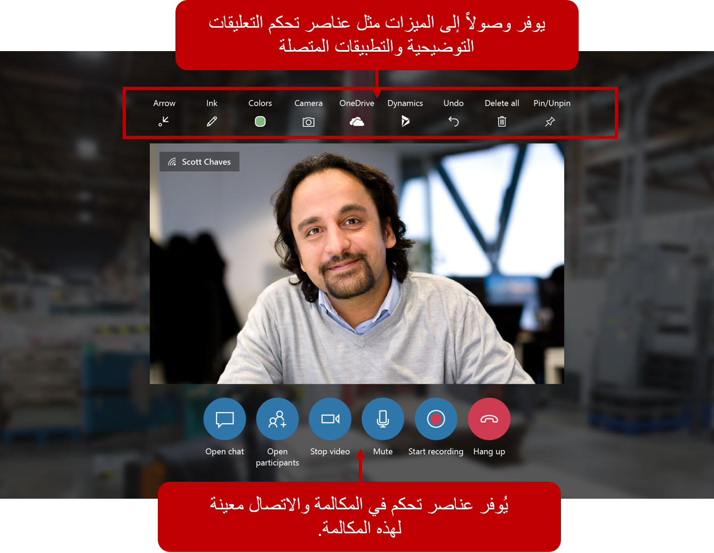

توفر أوجه التقدم في الحقيقة المختلطة المؤسسات مع أداه أخرى لتقديم خدمة عملاء أفضل. بفضل استخدام الواقع المختلط، يمكن للمؤسسات توفير دعم تفاعلي أكثر دقة وتدريب أكثر ثراء وتجارب مبيعات مخصصة للعملاء.

> [!VIDEO https://www.microsoft.com/videoplayer/embed/RE4xwnI]

## الواقع المختلط 

الواقع المختلط هو نتيجة لمزج العالم المادي مع العالم الرقمي. وهو يمثل التطور التالي في التفاعل البشري والحاسوبي والبيئي ويفتح الاحتمالات التي كانت، قبل الآن، تقتصر على الخيال البشري.

## المصطلحات والمفاهيم 

يحدد القسم التالي المفاهيم والمصطلحات الهامة المرتبطة بتقنية الواقع المختلط. 

### مصطلحات الواقع المختلط

المصطلحات والمفاهيم الأساسية التي تحدد الواقع المختلط هي: 

- [الواقع المختلط هو طيف](/windows/mixed-reality/mixed-reality/?azure-portal=true#the-mixed-reality-spectrum) - يمزج الواقع المختلط العالم المادي مع العالم الرقمي. يرسخ الواقع المختلط فعلياً الصور الثلاثية الأبعاد والبيانات والنصوص وغيرها من المعلومات الرقمية على العالم المادي، مما يتيح لك التفاعل مع هذه الصور المجسمة.

- [الصور المجسمة](/windows/mixed-reality/hologram/?azure-portal=true)HoloLens عرض الصور المجسمة 1 و2، وهي عناصر مصنوعة من الضوء والصوت التي تظهر في العالم من حولك كما لو كانت كائنات حقيقية، مثل السهم الأخضر الذي يظهر في الصورة السابقة. تستجيب الصور المجسمة لنظراتك وإيماءاتك وأوامرك الصوتية ويمكن أن تتفاعل مع أسطح العالم الحقيقي من حولك. مع الصور المجسمة، يمكنك إنشاء كائنات رقمية تشكل جزءاً من عالمك.

- [الإرساء المكاني](/windows/mixed-reality/spatial-anchors/?azure-portal=true) - عندما يقوم فني أو متعاون عن بُعد بإنشاء رسومات أو إضافة أسهم، يتم تثبيت هذه التعليقات التوضيحية في العالم المادي وتبقى في مكانها أثناء تنقل Remote Assist.

- تقدم **HoloLens 2** - HoloLens 2 تجربة الواقع المختلط الأكثر راحة والغامرة المتاحة مع الحلول الرائدة في الصناعة التي تقدم قيمة في دقائق، وكلها معززة بموثوقية وأمان وقابلية التوسع في الخدمات السحابية وخدمات الذكاء الاصطناعي من Microsoft. لمعرفة المزيد حول HoloLens 2، انتقل إلى [HoloLens 2 المواصفات الفنية والميزات](https://www.microsoft.com/hololens/hardware/?azure-portal=true). بالمقارنة مع HoloLens1، فإن HoloLens 2 يقدم تجربة غامرة ومريحة وغريزية.

تعرّف على المزيد حول [المفاهيم الأساسية](/windows/mixed-reality/core-concepts-landingpage/?azure-portal=true) في تقنية الواقع المختلط من خلال تحديد الارتباط.

ولعل *التعليقات التوضيحية* هي المثال الأكثر شيوعاً لتقنية الواقع المختلط في Remote Assist، تسمي أيضاً *الرسومات*، وهي عبارة عن نوع من الصور المجسمة. في الصورة التالية، يستخدم الشخص Remote Assist على هاتف يعمل بنظام Android ويكون السهم الأخضر هو *تعليق توضيحي للواقع المختلط*.

إنّ الجهاز الموجود أمام الهاتف موجود في العالم الفعلي، والسهم الأخضر موجود في العالم الرقمي، ويقوم الواقع المختلط بإحضارهما معاً. ومع ذلك، فإن السهم الأخضر هو أكثر من مجرد صورة على الشاشة لأنه قد تم *ربطه* بمسافة ثلاثية الأبعاد، سيبقي كما هو في حالة قيام المستخدم بنقل الهاتف أو عند الخروج. يتم إنجاز هذه الميزة مع تقنية الواقع المختلط التي خرائط المنطقة 3D حول الهاتف المحمول أو سماعة HoloLens.

*الإرساء المكاني* يجعل الواقع المختلط أكثر فعالية من *الواقع المعزز* أو *الواقع الافتراضي*. لا يقوم الواقع المعزز بصياغة المساحة الثلاثية الأبعاد المحيطة، مما يعني أن السهم الأخضر يختفي إذا قام المستخدم بنقل هاتفه. يُعد الواقع الافتراضي تجربة غامرة، وهذا يعني أن المستخدم لن يكون قادراً على رؤية الجهاز المادي المحيط به (فكر في سماعات الواقع الافتراضي، حيث لا يمكن للمستخدم رؤية أي شيء آخر غير ما يتم عرضه في شاشة سماعة الرأس).

لا تهدف هذه الوحدة النمطية إلى جعلك خبيراّ في الواقع المختلط ولكن لتسليط الضوء على هذه المصطلحات الرئيسية لمساعدتك على فهم أفضل للواقع المختلط ومفاهيم المساعدة عن بُعد التي سيتم الرجوع إليها خلال باقي الوحدة النمطية. 

### مصطلحات Remote Assist

المصطلحات والمفاهيم الأساسية التي تحدد Remote Assist هي:

- **فني/عامل في الخطوط الأمامية**: يشير الفني إلى الشخص الذي يقوم بأداء بعض أنواع العمل لأحد العملاء. على سبيل المثال، يقوم فني بتثبيت أو إصلاح أو فحص أو استكشاف الأخطاء وإصلاحها، وسيستخدم Remote Assist على HoloLens أو الجهاز المحمول لمشاركة ما يشاهده حتى يتمكن من تلقي المساعدة عن بُعد لإصلاح المشكلة.

- **خبير متعاون عن بُعد**: يشير المتعاون عن بُعد إلى الشخص الذي لديه معرفة أو لديه إمكانية الوصول إلى المعرفة ويمكنه مساعدة الفني في حل مشكلة ما. يستخدم هذا الشخص Microsoft Teams على جهاز كمبيوتر أو جهاز محمول لمعرفة ما يراه الفني ثم يوفر إرشادات سياقية.

- **مجال الرؤية (FOV)**: يمثل هذا المفهوم الجزء من وجهة نظر الفني الذي يتم التقاطه باستخدام هواتفهم أو كاميرا HoloLens التي يتم مشاركتها مع المتعاون عن بُعد. كلما زاد مجال رؤية الجهاز، زادت الصور المجسمة التي يمكنك رؤيتها في وقت واحد.

- **التعليق التوضيحي**: نوع من الصور ثلاثية الأبعاد التي يمكن للفنيين والمتعاونين عن بُعد *رسمها* في مساحة افتراضية ثلاثية الأبعاد تساعدهم على رؤية المشكلة بشكل أكثر وضوحاً.

- **الاتصال**: عندما يحتاج فني إلى المساعدة ويريد مشاركة حقول العرض الخاصة بهم لاستلام إرشادات سياقية، سيقوم بإجراء *اتصال مساعدة عن بُعد* إلى خبير المتعاون عن بُعد. يستخدم الفني تطبيق Remote Assist على الهاتف أو HoloLens، ويستخدم المتعاون عن بُعد Microsoft Teams على الهاتف أو جهاز الكمبيوتر الخاص بهم.

- **الجهاز المحمول**: هاتف محمول أو جهاز لوحي (مثل iPhone أو Samsung Galaxy) يتصل بالإنترنت من خلال شبكة لاسلكية أو خلوية.

الآن بعد أن أصبح لديك فهم أساسي للواقع المختلط ومفاهيمه الرئيسية، يمكنك التعرف على الكيفية التي يساعد بها Dynamics 365 Remote Assist على تمكين الفنيين من التعاون بشكل أكثر كفاءة من خلال مساعدتهم على العمل معاً من مواقع مختلفة.

## أسباب Remote Assist

عندما تكون المعلومات غير متاحة للأشخاص الذين يحتاجون إليها، فان الوقت والمال ورضا العميل تتأثر بالسلب.

إذا حاول فني استكشاف أخطاء جهاز ولم يعرف كيفية حل المشكلة، سيتعين عليه الاتصال بشخص آخر أو مراسلته للحصول على تعليمات، أو مطالبة شخص آخر بالانضمام إليه في الموقع للنظر في المشكلة، أو سيضطر إلى العودة بعد يوم آخر من إجراء المزيد من الأبحاث.

تتسبب هذه السيناريوهات في مشاكل بسبب:

- يُعد وصف الأمور التي تحدث عبر الهاتف والمراسلة صعباً ومضيعة للوقت.

- كما أن سفر شخص آخر إلى موقعك يُعد أيضاً تكلفة من حيث الوقت والمال.

- والعودة في يوم آخر مكلفة وتستغرق وقتاً طويلاً، وإذا كانت المشكلة حرجة، يمكن أن تسبب استياء شديد للعملاء.

تسمح ميزة Remote Assist للأشخاص الموجودين في الموقع الذين يؤدون أعمالاً بمشاركة مجال الرؤية والتعاون مع الأشخاص في مواقع أخرى. بالمقارنة مع برامج محادثة الفيديو، مثل Microsoft Teams أو FaceTime، فإن Remote Assist يتمتع بفوائد إضافية من الصور المجسمة للواقع المختلط للتعاون *في السياق* والاتصالات بالتطبيقات والعمليات التجارية Dynamics 365.
خذ بعين الاعتبار Remote Assist كمشاركة فيديو عالية الجودة مع تقنية الواقع المختلط للمؤسسة.

### مزايا Remote Assist

تتلخص مزايا استخدام Remote Assist في:

- **معرفة خبراء النطاق**: تمكين المتعاونين عن بُعد من مشاركة معارفهم بشكل فعال من أي مكان في العالم.

- **حل المشاكل في الوقت الحقيقي**: يمكن للفنيين مشاركة عرضهم في الوقت الفعلي مع الخبراء في المواقع النائية للحصول على المساعدة التي يحتاجونها. تقلل هذه الميزة من وقت السفر والتكلفة وتعمل على تحسين احتمالية إصلاح إحدى المشكلات أثناء الزيارة الأولى (المُشار إليها وتقاس باسم *معدل الإصلاح الأول*).

  

- **تفحص الموقع عن بُعد** يمكن للمفتشين عن بُعد تقييم جودة المنتج دون الانتقال إلى الموقع.

  

- **توصيل تعليمات مفصلة ومعقدة بصرياً**: بدلاً من توصيل التعليمات من خلال مكالمة صوتية، يمكن للعاملين في الموقع والمتعاونين عن بُعد استخدام الرسومات والأسهم للإشارة إلى أجزاء محددة من جهاز أو أصل. يتم ربط هذه التعليقات التوضيحية في مساحة Remote Assist الخاصة بالمستخدم.

- **عرض المعلومات الهامة**: يمكن للفنيين والمفتشين سحب معلومات أمر العمل من Dynamics 365 Field Service واستدعاء المورد المعين لدعمهم. وعلاوة على ذلك، لم يُعد الفنيون والمفتشون بحاجة إلى حمل أدلة ورقية لإجراء إصلاحها أو تفتيشها. إذا كان الفني يستخدم Remote Assist على HoloLens، يمكن للمتعاونين عن بُعد إدراج الصور المرجعية، التخطيطات، وغيرها من المعلومات المفيدة على المساحة المادية للفني حتى يتمكنوا من الرجوع إلى التخطيطي أثناء العمل التنبيه واليدين مجاناً على HoloLens. إذا كان الفني يستخدم Remote Assist على الهاتف المحمول، فيمكن للمتعاونين عن بُعد مشاركة الصور المرجعية والخطط والمعلومات المفيدة الأخرى على أجهزتهم المحمولة.

  

- **التنقل عبر Remote Assist على جهاز HoloLens باستخدام الصوت**: توفر Remote Assist على HoloLens تجربة تتسم بالحرية من خلال دعم [أوامر الصوت بهذه اللغات](/dynamics365/mixed-reality/remote-assist/faq-hololens?azure-portal=true#what-languages-are-voice-commands-and-speech-recognition-available-for) لكافة الميزات، حتى في بيئة عالية الصناعية.

- **تقديم خدمة مميزة لعملائك**: عند بيع المنتج، يمكنك تضمين اشتراك Remote Assist الذي يمكن للعميل استخدامه لتلقي المساعدة من المتخصصين في المنتجات أو وكلاء دعم العملاء.
