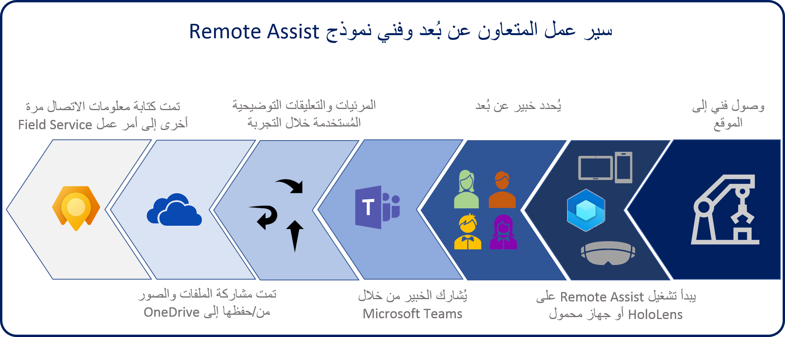

تتضمن مكالمات ‏‫Remote Assist‬ شخصين على الأقل: المتعاونين في الموقع والمتعاونين عن بُعد.

## عامل الخط الأمامي

عامل الخط الأمامي هو الشخص الذي يستخدم تطبيق Remote Assist ويعمل عادةً في المهن التالية:

-   **فني**: الشخص الذي يتم إرساله لإصلاح عنصر معين مثل الأجهزة وآلات التصنيع الكبيرة وغسيل السيارات الآلي وما إلى ذلك.

-   **المتفحص أو المراجع**: الأشخاص الذين قد تشتمل مسؤولياتهم على عمليات فحص المنتجات أو تدقيق الموقع.

يمكن للعاملين في الخطوط الأمامية الذين لديهم ترخيص Remote Assist الوصول إلى التطبيق على أنواع الأجهزة التالية:

-   **سماعات HoloLens** HoloLens أو HoloLens 2 التي تقوم بتشغيل تحديث Windows 10 أبريل 2018.

-   **iOS**: أجهزة الهاتف أو الأجهزة اللوحية التي تعمل بنظامي iOS وARKit.

-   **Android**: أجهزة الهاتف أو الأجهزة اللوحية التي هي قيد التشغيل Android.

يمكنك الحصول على ترخيص Remote Assist عن طريق الحصول على نسخة تجريبية مجانية من Remote Assist وMicrosoft Teams ومن خلال شراء ترخيص Remote Assist. عند شراء ترخيص Remote Assist، يتم تضمين ترخيص Microsoft Teams اللازم أيضًا.

## المتعاون عن بُعد

المتعاونون عن بُعد هم خبراء متخصصون يساعدون العامل في الموقع على حل المشكلة. يستخدم هذا الشخص Microsoft Teams على جهاز كمبيوتر أو جهاز محمول لمعرفة ما يراه الفني ثم يوفر إرشادات في السياق.

لا يتطلب المتعاونون عن بُعد ترخيص Remote Assist. ونظراً لأنهم يقدمون الدعم عبر Microsoft Teams، فإن المتعاونين عن بُعد سوف يحتاجون فقط إلى ترخيص Teams صالح. قد يتضمن الحصول على الترخيص الحصول على ترخيص تجريبي مجاني لبدء تشغيلها أو شراء ترخيص أو استخدام ترخيص تم الحصول عليه كجزء من اشتراك منتج Microsoft آخر.

مكالمات Remote Assist بين مستخدم Teams ومستخدم Remote Assist. يتعذر على الفني الذي يستخدم Remote Assist الاتصال بمستخدمي Remote Assist الآخرين.

## حالات استخدام Remote Assist

يملك ‬‏‫الواقع المختلط حالات استخدام في العديد من الصناعات مثل التصنيع وإدارة المرافق والإنشاء. يمكن تحجيم ميزات Remote Assist وتكييفها في أي سيناريو حيث يساعد مشاركة ما يراه شخص واحد في التعاون وحل المشكلات.
تُعد حالات استخدام الفحص الخاصة بالأمان وضمان الجودة وتثبيت الأجهزة واستكشاف مشكلات استكشاف الأخطاء وإصلاحها قابلة للتطبيق بشكل خاص.

### نموذج سير عمل

المثال التالي هو نموذج سير عمل للفنيين والمتعاونين عن بُعد.

1.  يصل فني إلى الموقع لإصلاح جهاز ولكنه يواجه جهازاً معقداً لا يألفه. يقوم الفني بوضعه على HoloLens 2 ويقوم بتسجيل الدخول باستخدام فحص iris، ويقوم بتشغيل Remote Assist. (بدلا من ذلك، يمكنهم تشغيل Remote Assist من أجهزتهم المحمولة.)

2.  نظرا لأن شركة الفني قد مكنت تكامل Field Service، يقوم الفني بتحديد حجز ويقوم بعرض المتعاون عن بEعد الموصى به، والذي لديه خبرة أكبر في هذا الجهاز.

3.  ينضم متعاون عن بُعد إلى مكالمة الواقع المختلط على سطح مكتب Microsoft Teams ويري ما يراه الفني. وتقوم ببدء تسجيل المكالمة بحيث يتمكن الفني من استخدامها كمرجع مستقبلي.

4.  يقوم المتعاون عن بُعد تعليمات شفهية. عندما يريدون الإشارة إلى جزء معين من الجهاز، يوجه المتعاون سهماً إلى شاشة الكمبيوتر الخاصة بهم. يظهر السهم فوراً في مساحة HoloLens الخاصة بالمستخدم ويظل مرتبطاً بهذا الجزء من الجهاز، حتى عند انتقال الفني. عندما يريد المتعاون الإشارة إلى الكابل الذي يجب على الفني إعادة ربطه ، فإنهم يرسمون على طول الكابل. يظهر الخط على الفور في مساحة HoloLens الخاصة بالمستخدم. ثم يضيف المتعاون الرسومات والأسهم على شاشة الكمبيوتر الخاص به. تظهر هذه الرسومات والأسهم في مساحة الفني وتظل راسية على الكابل، حتى عندما يتجول الفني.

5.  يقوم المتعاون عن بُعد بعد ذلك بمشاركة تخطيطات من OneDrive، وتظهر في مساحة الفني. يمكن للمتعاون أيضاً فتح فيديو تدريب على سطح المكتب الخاص به ومشاركة الشاشة مع الفني.

6.  عندما يقوم الفني بإصلاح الجهاز بنجاح، فإنه يأخذ لقطة شاشة من الجهاز الذي تم إصلاحه، ويقوم بحفظها على OneDrive. يشكر الفني المتعاون عن بًعد للمساعدة ومن ثم ينهي المكالمة. يتم ترحيل اللقطات والملفات التي تتم مشاركتها أثناء المكالمة إلى أمر العمل الخاص بـ Field Service لمدير الفني لمراجعتها، ويتم حفظ التسجيل عبر الإنترنت. يشترك الفني في التسجيل مع الزملاء بحيث يمكنهم معرفة كيفية قيام الفني والمتعاون عن بُعد بإصلاح الجهاز.

والآن بعد أن تكون لديك الفرصة لفهم أدوار المستخدمين والخبرات المختلفة، يمكنك التعرف على الخبرات المختلفة لـ Remote Assist استناداً إلى الجهاز الذي يتم استخدامه.
