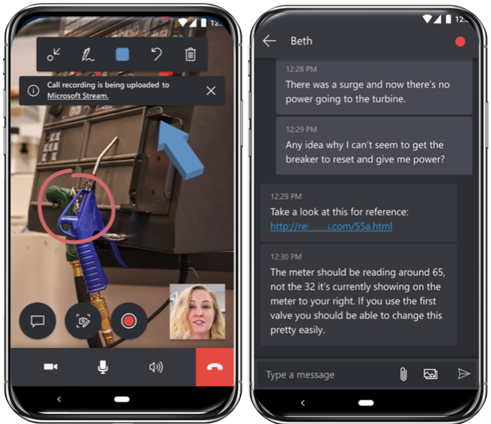
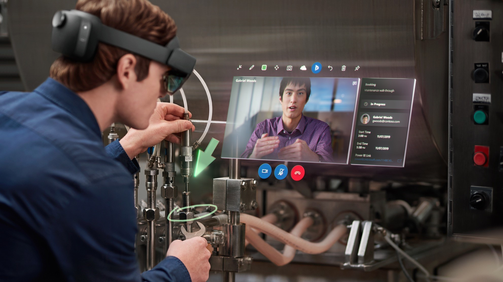
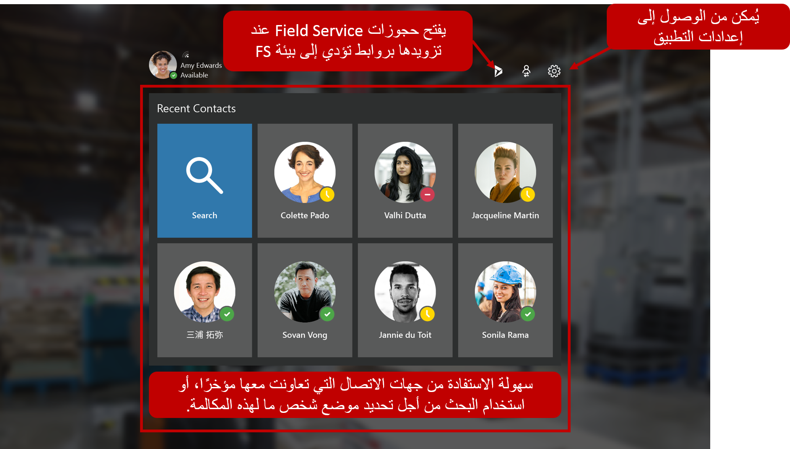
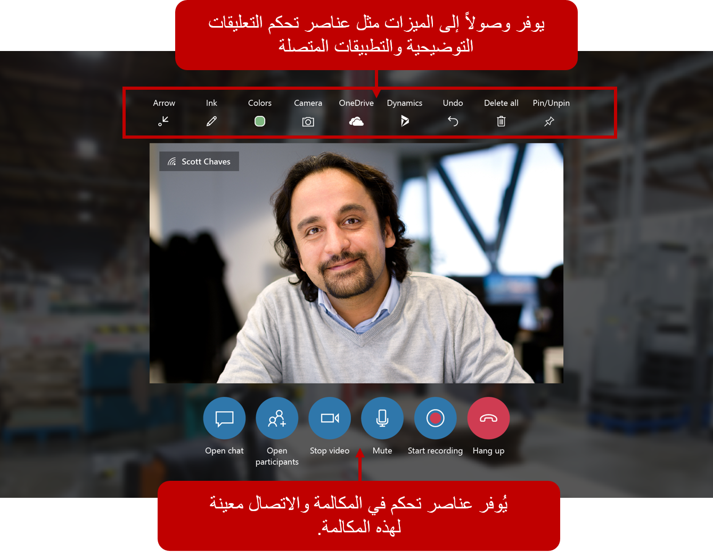

يمكن استخدام Remote Assist على كل من الجهازين HoloLens وHoloLens 2 ويمكن دعمها على الهواتف المحمولة والأجهزة اللوحية. التجربة الإجمالية لإجراء مكالمات الواقع المختلط وتبادل المعرفة متشابهة؛ ومع ذلك، توجد بعض المزايا والاختلافات بناءً على كل نظام أساسي.

بغض النظر عن الجهاز، يمكن لمستخدمي Remote Assist:

-   الاتصال بالمتعاونين عن بعد.

-   رسم تعليقات توضيحية للواقع المختلط.

-   إرسال رسائل وصور من خلال المحادثة.

-   مشاركة الملفات واستلامها مع المتعاونين عن بعد.

-   تسجيل المكالمة.

-   أخذ لقطات والتعليق عليها.

-   ترحيل سجلات المكالمات وغيرها من التفاصيل لأوامر عمل Field Service.

## استخدام Remote Assist على الأجهزة المحمولة

توفر القدرة على استخدام Remote Assist علي جهاز المحمول الحالي سهولة الوصول الفعلي والألفة وإمكانية استخدام Remote Assist مع تطبيق آخر قيد التشغيل بالفعل على جهازك.

### مزايا الأجهزة المحمولة

تتضمن مزايا استخدام Remote Assist على الجهاز المحمول ما يلي:

-   **استخدام الأجهزة الموجودة** - نظراً لأن Remote Assist يمكن الوصول إليها في أجهزة iOS وAndroid، يمكن للمؤسسات استخدام الهواتف الشخصية أو التي تم توفيرها بالشركة الفنية التي تمتلكها الفنية. شراء أجهزة إضافية للتجربة ليس ضرورياً.

-   **وصول مادي أسهل** - تعد الأجهزة المحمولة أصغر حجمًا وأسهل في المناورة من جهاز HoloLens، مما يساعد على تسهيل عمل الفنيين بشكل أكثر إحكاماً وأكثر دقة في المساحات الضيقة.
    يمكن للفنيين التقاط لقطات واستخدام ميزات أخرى في المساحات التي ربما لم يتمكنوا من الوصول إليها أثناء استخدام جهاز HoloLens.

-   **الإلمام بالجهاز** - نظرًا لأنه من المحتمل أن يستخدم الفنيون أجهزتهم يومياً، فإنهم على دراية بكيفية التقاط الصور والتنقل في التطبيقات والمزيد.

-   **سياق التطبيق** - من المحتمل أن يتم تشغيل Remote Assist على نفس الجهاز المحمول مثل التطبيقات الأخرى، مثل Field Service Mobile أو Microsoft Outlook. وكنتيجة لذلك، يمكن تشغيل Remote Assist في سياق التطبيقات الأخرى وكجزء من مهام سير عمل الشركة. على سبيل المثال، يمكنك تشغيل Remote Assist من تطبيق Field Service Mobile ثم تحديث معلومات الملاحظة من المكالمة.

لمزيد من المعلومات حول Remote Assist Mobile، راجع [نظرة عامة على الهاتف المحمول Remote Assist](/dynamics365/mixed-reality/remote-assist/mobile-app/remote-assist-mobile-overview).

## استخدام Remote Assist مع HoloLens

في حين أن أجهزة HoloLens المادية لها تكاليف إضافية، فإن إصدار HoloLens يوفر العديد من المزايا مقارنة بإصدار الهاتف المحمول.

### مزايا HoloLens

مزايا استخدام جهاز HoloLens عبر جهاز محمول هي:

-   **بدون استخدام اليدين** - عند العمل على جهاز HoloLens، يتمتع الفنيون بتجربة عدم استخدام اليدين. على سبيل المثال، أثناء العمل على قطعة من المعدات في مصنع تصنيع، يمكن للفني بدء التطبيق. أثناء التواجد في التطبيق، يمكن للفني استخدام إيماءات HoloLens المألوفة مثل اللمس والنظرة والصنابير الهوائية للتنقل عبر التطبيق والوصول إلى الميزات الضرورية التي يحتاجون إليها، مثل التعامل مع متعاون عن بُعد.

-   **تجربة شاملة** - مع أجهزة HoloLens، سيتمكن الفنيون من الانغماس في مساحة العمل. تتيح لهم هذه القدرة الوصول إلى الأدوات الضرورية التي يحتاجونها للعمل على الصنف. على سبيل المثال، بينما يقوم المتعاونون عن بُعد بتدوين الملاحظات والتعليقات التوضيحية، مثل استدعاء مفتاح جزء يحتاج إلى قلب أو جزء يجب تعديله، تنعكس هذه الأصناف في مساحة الواقع المختلط التي يعمل فيها الفني.
    تضمن هذه الإمكانية أن الفني قادر على رؤية ما يشير إليه المتعاون البعيد وأنه يمكنه الوصول إلى الأدوات الضرورية أثناء العمل معهم.

-   **الاتصال الجماعي** - عند العمل مع أجهزة HoloLens، يمكن لفني واحد في الموقع العمل مع العديد من المتعاونين عن بُعد. يمكن أن تكون هذه الميزة مفيدة في السيناريوهات الأكثر تعقيداً حيث يعمل الفنيون العديد من الأصناف.

عند تشغيل Remote Assist لأول مرة، سيتم تقديم جهات الاتصال الخاصة بك مؤخراً. تمثل جهات الاتصال هذه الأشخاص الذين تعاونت معهم مؤخراً في حل المشكلات. بالنسبة للمؤسسات التي تستخدم Field Service، يمكنك الوصول إلى حجوزات Field Service عن طريق تحديد أيقونة Dynamics 365 في الزاوية العلوية اليمنى.

بعد أن تبدأ مكالمة، سترى بطاقة فيديو. يتم عرض جميع الأدوات التي يمكن استخدامها على طول الجزء العلوي والسفلي لبطاقة الفيديو. يمكنك استخدام درج المشارك لعرض الصور الرمزية لجميع المشاركين في المكالمة. يمكن لمستخدمي Remote Assist HoloLens إجراء أو الانضمام إلى مكالمة فردية أو مكالمة جماعية أو اجتماع تمت جدولته من Teams أو Outlook.

لمزيد من المعلومات حول استخدام Remote Assist على أجهزة HoloLens وHoloLens 2، راجع [نظرة عامة حول HoloLens](/dynamics365/mixed-reality/remote-assist/overview-hololens).

يوفر الجدول التالي مقارنة كاملة للاختلافات بين Remote Assist في HoloLens و Remote Assist على الأجهزة المحمولة. 

| الميزة                                                                                                                     | متاح عند استخدام Remote Assist في HoloLens | متوفر عند استخدام Remote Assist mobile |
|-----------------------------------------------------------------------------------------------------------------------------|-------------------------------------------------------|--------------------------------------------------|
| الانضمام إلى مكالمة فردية                                                                                       | نعم                                                   | نعم                                              |
| الانضمام إلى مكالمة جماعية مخصصة                                                                                                   | نعم                                                   | نعم                                               |
| الانضمام إلى اجتماع                                                                                                              | نعم                                                   | نعم                                               |
| التحكم في الفيديو الصادر والصوت الصادر والصوت الوارد                                                           | نعم                                                   | نعم                                              |
| أخذ لقطة ثابتة                                                                                                       | نعم                                                   | نعم                                              |
| التعليق التوضيحي للقطة ثابتة باستخدام الأسهم والحبر                                                                         | نعم                                                    | نعم                                              |
| يمكن للمتعاون عن بُعد إضافة تعليقات توضيحية ثلاثية الأبعاد في بيئة مستخدم Remote Assist                                       | نعم                                                   | نعم                                              |
| إرسال رسالة نصية                                                                                                         | نعم                                                   | نعم                                              |
| مشاركة الملفات من OneDrive أو الجهاز                                                                                  | نعم                                                   | نعم                                              |
| إجراء تسجيل المكالمات السحابية                                                                                      | نعم                                                   | نعم                                              |
| مشاركة الشاشة (عرض شاشة Teams PC)                                                                                  | نعم                                                   | لا                                               |
| التكامل مع Field Service                                                                                    | نعم                                                   | نعم                                              |
| تحديث حجز Field Service                                                                                                | نعم                                                   | نعم                                               |
| مكالمة لمرة واحدة                                                                                                               | نعم                                                   | نعم                                               |
| نشر سجلات المكالمات والملفات واللقطات تلقائياً من مكالمة Remote Assist إلى أمر عمل Field Service | نعم                                                   | نعم (في حاله الحفظ إلى المحادثة)                        |

الآن بعد أن تعرفت على الأجهزة المختلفة، يمكنك استكشاف التجربة الشاملة لإجراء مكالمة باستخدام Remote Assist.
