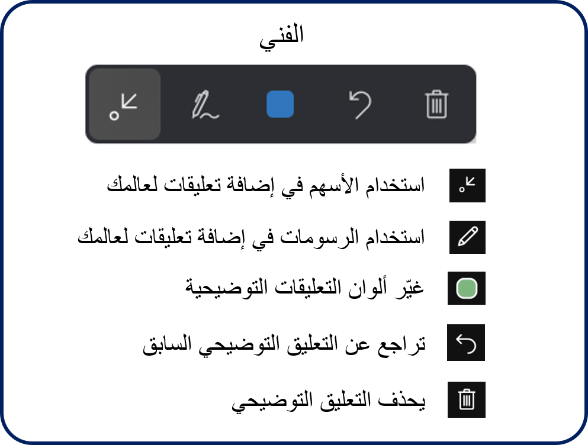
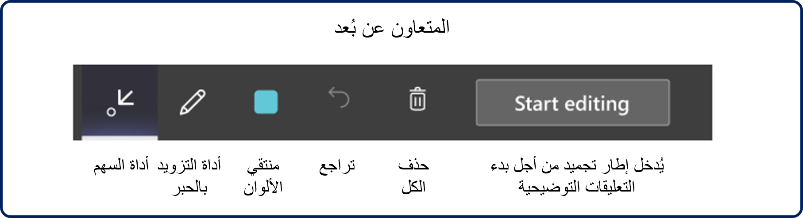
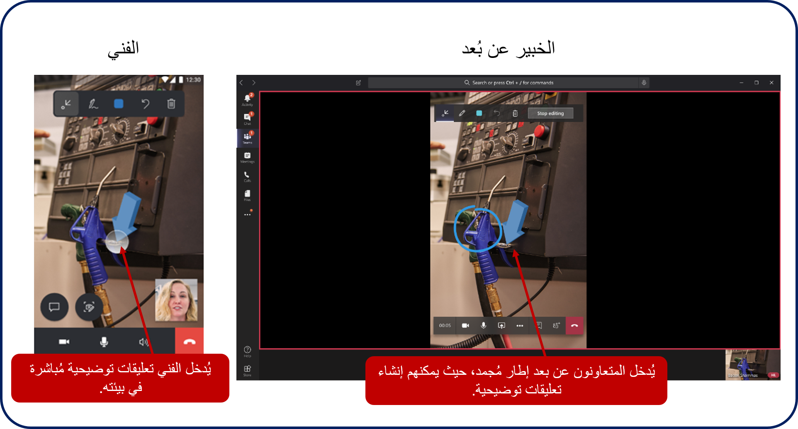
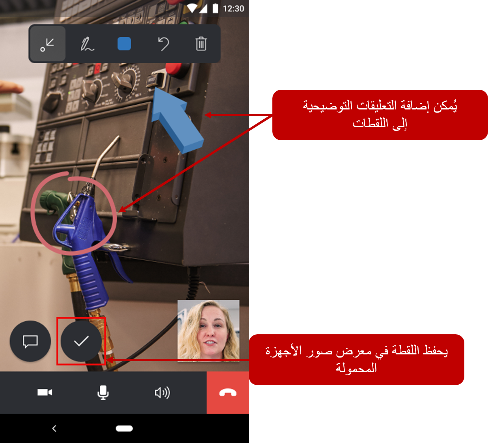
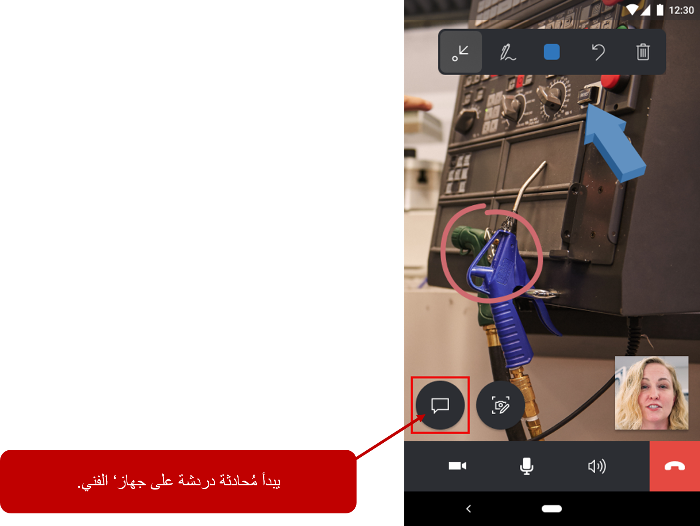
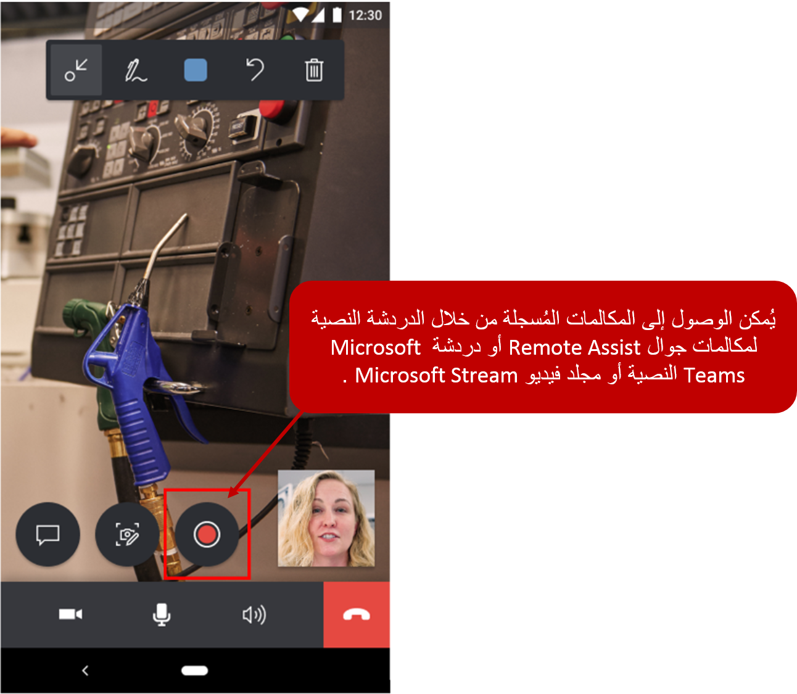

يقدم Remote Assist للفنيين والمتعاونين عن بُعد العديد من الأدوات التي تساعدهم على العمل معاً لحل مشكلة ما عندما يكون كل شخص في موقع مختلف. تتمثل القدرة الرئيسية في مشاركة الفيديو مع التعليقات التوضيحية للواقع المختلط، ولكن يجد الأشخاص أيضاً قيمة كبيرة في مشاركة الملفات وإرسال الرسائل وتسجيل المكالمات.

## الشروع في العمل

عندما يصادف أحد الفنيين أو المفتشين أو المدققين في الحقل سيناريو يحتاجون إلى تلقي المساعدة بشأنه، فسيقومون بتشغيل تطبيق Remote Assist. ونظراً لأن تطبيق الأجهزة المحمولة سيقوم باستخدام كاميرا جهاز المحمول، فستحتاج إلى السماح للتطبيق بالوصول إليها. وفي التطبيق، يتضمن تطبيق للأجهزة المحمولة Remote Assist برنامجاً تعليمياً إرشادياً داخل التطبيق لمساعدة الفنيين على بدء استخدام التطبيق. يمكن الوصول إلى البرنامج التعليمي من خلال تحديد **جرّبه** في شاشة تسجيل الدخول إلى Remote Assist.

يوضح هذا البرنامج التعليمي للفنيين كيفية:

-   تعيين البيئة الخاصة بهم لتتبع الأسطح بشكل أفضل.

-   وضع التعليقات التوضيحية ومعالجتها، مثل السهم وأداة الحبر.

> [!IMPORTANT]
> يعد تعيين بيئة أمراً مهماً لضمان عرض التعليقات التوضيحية والأجزاء التفاعلية الأخرى بشكل صحيح.

خذ بعين الاعتبار الأساليب التالية لتحسين تجربة التتبع:

-   تعيين منطقه البيئة الخاصة بك عند بداية مكالمة فيديو.

-   تجنب تحركات الكاميرا السريعة.

-   تجنب تصغير التطبيق وإعادة فتحه بشكلٍ متكرر في حالة وجود التعليقات التوضيحية.

تشمل القيود التي قد تعيق الفهم الدقيق للأسطح أو تسهل فقدان التعقب ما يلي:

-   أسطح مستوية بدون نسيج، مثل مكتب أبيض.

-   البيئات ذات الإضاءة الخافتة أو الإضاءة الساطعة.

-   الأسطح الشفافة أو العاكسة مثل الزجاج.

-   الأسطح الديناميكية أو المتحركة.

لمزيد من المعلومات حول استخدام البرنامج التعليمي، راجع [البرنامج التعليمي للهاتف المحمول](/dynamics365/mixed-reality/remote-assist/mobile-app/mobile-tutorial).

## إجراء مكالمات

عندما يحتاج الفني إلى المساعدة، سيقوم ببدء مكالمة فيديو مع المتعاونين عن بُعد الذين سيقومون بالمشاركة معهم على أجهزة الكمبيوتر أو الأجهزة المحمولة الخاصة بهم من خلال Microsoft Teams. يمكن إجراء المكالمات مع المتعاونين عن بُعد الموجودين داخل شركة الفني أو خارجها. يمكن فقط لمستخدم Remote Assist mobile (الفني) بدء إجراء مكالمة صادرة إلى مستخدم Teams لسطح المكتب (متعاون عن بعد) أو مستخدم Teams المحمول (متعاون عن بعد).

بعد أن يقوم الفني بتسجيل الدخول إلى Remote Assist mobile على جهاز iOS أو Android حيث يمكن البحث عن المتعاون الذي يريدون العمل معه وتحديده. عند تحديد هذا الخيار، سيتلقى المتعاون عن بُعد المكالمة Microsoft Teams وسيتم نقله إلى موجز الفيديو المباشر الخاص بالفني.

لمزيد من المعلومات حول إجراء المكالمات، راجع [إجراء المكالمات](/dynamics365/mixed-reality/remote-assist/mobile-app/making-calls).

## الرسم أو إضافة تعليق (الفني)

تسمح الرسومات أو التعليقات التوضيحية أو الصور المجسمة للفنيين والمتعاونين عن بُعد الاتصال بمنطقة أو أصل بيئي بصرياً لفحصه أو معالجته. نظراً لأن الفنيين يعرضون البيئة من خلال الكاميرا الخلفية الخاصة بهم، يمكن للفني والمتعاون عن بُعد إضافة تعليقات توضيحية إلى ما يشاهدونه ثم مشاركته مع بعضهم البعض أثناء مكالمة فيديو.

أثناء المكالمة، يسمح شريط أدوات التعليقات التوضيحية للفنيين بوضع الأسهم والرسومات في بيئتهم. تتوفر العديد من الأوامر في شريط الأوامر. تعرض الصورة التالية الخيارات المتاحة.

تسمح أيقونة **حذف الكل** للفنيين بإزالة جميع التعليقات التوضيحية التي وضعوها في بيئتهم (لا يمكنهم إزالة التعليقات التوضيحية للخبير). 

نظراً لوضع التعليقات التوضيحية في البيئة الخاصة الفني، سيرى الخبير الذي تتعاون معه التعليقات التوضيحية الخاصة بك في الوقت الفعلي على Microsoft Teams.

## الرسم أو إضافة تعليق (المتعاون عن بُعد)

وكما هو الحال مع مستخدمي Remote Assist، يمتلك المتعاونون عن بُعد أيضاً شريط أدوات للتعليقات التوضيحية يسمح لهم بوضع الأسهم والرسومات في بيئتهم.
يحتوي شريط الأدوات على نفس الأوامر المتوفرة لفني المساعدة عن بُعد.

لبدء إضافة التعليقات التوضيحية، يجب على المتعاونين عن بُعد تحديد الزر **بدء التحرير**. عند البدء، يمكنهم إدخال إطار مجمد حيث يمكنهم إضافة تعليقات توضيحية عليه. عند الانتهاء، يمكن للمتعاون تحديد **إيقاف التحرير** للعودة إلى موجز الفيديو المباشر للفني. وفي هذه المرحلة، ستظهر أية تعليقات توضيحية مضافة في بيئة الفني.

لمزيد من المعلومات حول التعليقات التوضيحية، راجع [إضافة تعليق للبيئة](/dynamics365/mixed-reality/remote-assist/mobile-app/annotate-your-environment).

## اللقطات

يمكن أن تكون القدرة على أخذ لقطة من البيئة أمراً بالغ الأهمية في المواقف التي قد تساعد فيها الصورة الثابتة على توصيل ما يبحث عنه الفني بشكل أفضل. بعد أخذ لقطة، يمكن إضافة التعليقات التوضيحية للتأكيد على عناصر محددة في اللقطة. يمكن استخدام هذه اللقطات لاحقاً للرجوع إليها أو للتحقق من صحة العمل.

لأخذ لقطة أثناء إجراء مكالمة هاتفية مع Remote Assist، حدد أيقونة **اللقطة** لالتقاط صورة. تتم مشاركة اللقطة على شاشة الخبير في Microsoft Teams. يمكن للفني والخبير إضافة التعليقات التوضيحية إلى اللقطة؛ ومع ذلك يمكن أخذ اللقطات مع التعليقات التوضيحية أو بدونها. وكما ذكرنا سابقاً، يجب على المتعاونون عن بُعد تحديد زر **بدء التحرير** لإضافة التعليقات التوضيحية إلى اللقطة. بعد أن ينتهي كل من الفني والخبير من التعليق التوضيحي على اللقطة، يمكن للفني تحديد علامة الاختيار لحفظ اللقطة في معرض الصور الخاص بأجهزتهم المحمولة. سيتم بعد ذلك مطالبة الفني بحفظ اللقطة في معرض الصور الخاص بالجهاز المحمول أو تجاهلها.

بعد أن يترك الفني اللقطة، يتم إعادتها إلى مكالمة الفيديو المباشرة، حيث يمكنهم مواصلة العمل أو أخذ مزيد من اللقطات.
لن تظهر التعليقات التوضيحية التي تمت إضافتها إلى لقطة ثنائية الأبعاد في بيئة الفني.

في نهاية المكالمة، يمكن للفني الآن الانتقال إلى معرض صور الأجهزة المحمولة وعرض اللقطات. وبعد ذلك، يمكن للفني مشاركتها مع الآخرين أو تضمينها في أمر العمل Field Service الخاص بهم.

لمزيد من المعلومات حول استخدام اللقطات، راجع [إضافة تعليقات توضيحية إلى اللقطات](/dynamics365/mixed-reality/remote-assist/mobile-app/annotate-snapshot).

## سيناريوهات النطاق الترددي المنخفض

في السيناريوهات التي يجد فيها الفنيون أنفسهم في أرضيات المصنع أو في المواقع البعيدة ذات الاتصال السيئ بالشبكة، سيوفر لهم Remote Assist mobile القدرة على مناقشة المشكلات وتشخيصها وحلها مع الخبراء عن بُعد.

يتم تحديد اتصال الشبكة الضعيف من خلال الحالات التالية:

-   عرض النطاق الترددي بين 150 كيلوبت في الثانية و1.5 ميغابت في الثانية

-   يكون زمن الانتقال أعلى من 1,000 مللي ثانية

-   فقدان الحزمة أعلى من 10 في المائة

يكتشف Remote Assist mobile تلقائياً ما إذا كان الفني يعاني من ظروف شبكة سيئة أم لا. إذا كان الأمر كذلك، يكون الفني مطالباً بمشاركة اللقطات مع الخبير البعيد للتعاون بدلاً من إرسال موجز فيديو مباشر. ونتيجة لذلك، يمكن للخبير عرض وإضافة تعليقات توضيحية للصور ذات الجودة الأفضل بدلاً من عرض موجز فيديو منخفض الجودة.

ويصف السيناريو التالي الموقف الذي يواجه فيه الفني اتصالاً ضعيفاً بالشبكة. في هذا السيناريو، يكون الفني هو العامل الميداني، بينما يكون الخبير البعيد في مكان آخر.

بعد أن يبدأ الفني مكالمة فيديو مع خبير عن بُعد، يكتشف Remote Assist mobile تلقائياً ما إذا كان الفني يعاني من ظروف شبكة سيئة. إذا تم الكشف عن ظروف سيئة، تتم مطالبة الفني باستخدام أداة اللقطة لمشاركة الصور مع الخبير. يمكن للفني والخبير التعليق في وقت واحد على اللقطة. بعد مشاركة لقطة، يمكن للفني حفظها في معرض صور جهاز المحمول أو تجاهلها.

لمزيد من المعلومات حول العمل في سيناريوهات النطاق الترددي المنخفض، راجع [الاتصال الضعيف بالشبكة](/dynamics365/mixed-reality/remote-assist/mobile-app/poor-network-connectivity).

### إرسال رسائل الدردشة 

أثناء إجراء مكالمة هاتفية على Remote Assist، يمكن للفنيين إرسال رسائل دردشة إلى الخبراء من خلال الدردشة النصية. يمكنك بدء هذه العملية بتحديد رمز **محادثة النص** . أثناء وجودك في المحادثة النصية، يمكن للفنيين إرسال رسائل نصية واستلامها من الخبراء في Microsoft Teams. نظراً لأن الفني يقوم بإجراء محادثة، فلن يكون الفيديو المباشر الخاص بـ Remote Assist mobile متاحاً له.

لمزيد من المعلومات حول استخدام الدردشات في مكالمات Remote Assist، راجع [إرسال رسائل المحادثة](/dynamics365/mixed-reality/remote-assist/mobile-app/send-chat-messages).

### مشاركة الملفات

في كثير من الأحيان، قد يجد الفنيون أنهم بحاجة إلى مشاركة العناصر مثل المستندات مع المتعاونين. يمكن أن تساعد هذه الميزة عن طريق إضافة مزيد من السياق والمعلومات، مثل الوسائل المرئية أو التخطيطات، إلى بيئة الفني. يمكن أن تساعد مشاركة الملفات الفنيين في إجراء محادثات أكثر ثراءً مع المتعاونين عن بُعد وبالتالي حل المشكلات بسرعة.

يمكن للفنيين والمتعاونين عن بُعد إرسال أي نوع من أنواع الملفات لبعضهم البعض. يمكن تحميل الملفات والصور من أجهزتهم المحلية أو من OneDrive. يمكن الوصول إلى الملفات المشتركة في حسابك على [OneDrive](https://onedrive.live.com/about/signin/)  في المجلد **ملفات > RemoteAssistMobile**. بعد فتح ملف أو صورة، سيتم تنزيلها إلى مجلد **التنزيلات**.
سيحتاج الفنيون إلى التطبيق المقابل الذي يدعم نوع الملف ؛ قد تكون المعاينات داخل التطبيق متاحة، حسب نوع الملف وحجمه.
بالنسبة لعملاء Field Service، يمكن ربط الملفات التي تمت مشاركتها أثناء مكالمة الهاتف المحمول الخاصة بـ Remote Assist بأمر العمل الخاص بك.

لمزيد من المعلومات حول مشاركة الملفات، راجع [مشاركة الملفات](/dynamics365/mixed-reality/remote-assist/mobile-app/file-sharing).

## تسجيل المكالمات

بالنسبة للعديد من الشركات، من المهم الاحتفاظ بسجل للحوادث المختلفة على أساس يومي. غالباً ما يتم الاحتفاظ بهذه السجلات من خلال المسارات الورقية أو الضمانات المستندة إلى النصوص. من خلال التقاط وتتبع جلسات الفيديو الخاصة بـ Remote Assist، يمكن لمديري العمليات والفنيين ومتخذي القرار في مجال الأعمال استخدام تسجيلات المكالمات من أجل:

-   مراجع لمتابعة العمل.  

-   التحقق من اكتمال عملية الصيانة والإصلاح بشكل صحيح.
    
-   مواد التدريب للعاملين.
   
يتوفر تسجيل المكالمات فقط للمكالمات الفردية بين مستخدم Remote Assist ومستخدم سطح المكتب في Teams، وليس مستخدم Teams للأجهزة المحمولة. يمكن للمستخدم Remote Assist فقط بدء تسجيل المكالمات وإيقافه. بعد انتهاء تسجيل المكالمة، يتم تحميلها تلقائياً إلى Microsoft Stream. بعد تحميل التسجيل، يمكن لكافة المشاركين في الاتصال الوصول إليه من خلال Remote Assist mobile أو محادثة Microsoft Teams النصية. يمكن لمستخدم Remote Assist mobile الذي بدأ تسجيل المكالمات، رؤيته أيضاً في [Microsoft Stream مجلد مقاطع الفيديو](https://web.microsoftstream.com/studio/videos).

يقوم الفني بتحديد زر **تسجيل** لبدء تسجيل المكالمة. أثناء المكالمة، يمكن للفني أن يرى أن تسجيل المكالمات قيد التقدم، كما هو موضح في مؤشر تسجيل المكالمات في الدردشة النصية. يمكن إيقاف تسجيل المكالمة في أي وقت عن طريق تحديد زر **إيقاف** . بعد إيقاف المكالمة، سيتلقى كلا المشاركين في المكالمة إشعاراً بأن تسجيل المكالمة سيكون متاحاً في Microsoft Stream. يمكن تجاهل الإخطار في أي وقت. بعد تحميل تسجيل المكالمات إلى Microsoft Stream، يمكن لكل من المشاركين الوصول إليه من خلال الدردشة النصية لمكالمة الهاتف المحمول على Remote Assist، أو الدردشة النصية في Microsoft Teams، أو في مجلد فيديو Microsoft Stream.

لمزيد من المعلومات حول إمكانات تسجيل مكالمات Remote Assist، راجع [تسجيل المكالمات](/dynamics365/mixed-reality/remote-assist/mobile-app/call-recording).

## ملاحظات مهمة أخرى

في الوقت الحالي، لا يتم دعم السيناريوهات التالية عند استخدام Remote Assist mobile:

-   الانضمام إلى اجتماعات Teams

-   إجراء مكالمات إلى Teams المستندة إلى المستعرض

-   المشاركة في مكالمات مع ثلاثة مشاركين أو أكثر

-   المشاركة في خدمة Remote Assist mobile لمكالمات Remote Assist mobile

-   المشاركة في خدمة Remote Assist mobile لـ Remote Assist mobile على مكالمات HoloLens

-   إذا لم يكن تطبيق Remote Assist للأجهزة المحمولة مفتوحاً، فلن يتلقى الفني إخطارات المكالمات الواردة من سطح مكتب Teams أو الهاتف المحمول

يوضح الفيديو التالي كيف تبدو مكالمة Remote Assist. 

> [!VIDEO https://www.microsoft.com/videoplayer/embed/RE4xiOX]
