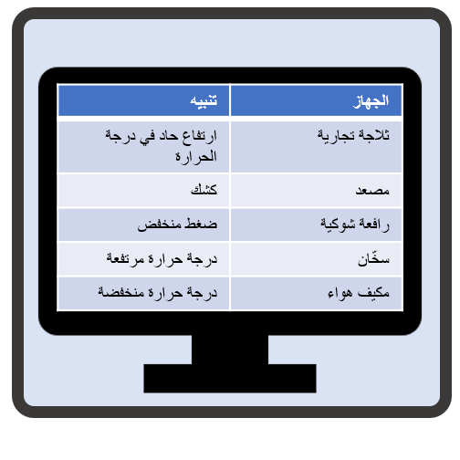

ومن خلال المزيد من الأجهزة المتصلة، يتوفر مقدار كبير من بيانات تتبع الاستخدام للمؤسسات لالتقاطها وتحليلها والعمل عليها.  يجمع حل Connected Field Service من Microsoft لـ Dynamics 365 بين المراقبة والصيانة الوقائية وIoT لاستبدال نموذج خدمة إصلاح الكسر التقليدي بنموذج خدمة أكثر استباقية لا يفشل أبداً. يمكن للمؤسسة التقاط كافة المعلومات التي يتم إرسالها من الأجهزة التي تدعم IoT وتحويل تلك المعلومات إلى عناصر قابلة للتنفيذ يمكن تنفيذها مباشرةً من مثيل Dynamics 365.  

  

يمكن تسجيل أصول العملاء مثل الأجهزة أو المعدات أو أجهزة الاستشعار أو أي جهاز ممكن ل IoT باستخدام Azure IoT Hub أو في IoT Central مباشرةً من داخل Dynamics 365 أو تطبيق Field Service Mobile. يمكن تجميع الأصول التي تحتوي على أدوات استشعار متعددة وتسجيلها في وقت واحد لتبسيط عملية النشر. على سبيل المثال، قد تكون الثلاجة مجهزة بمستشعرات متعددة. قد تحتوي على مستشعر درجة الحرارة الذي يراقب درجة الحرارة الإجمالية للوحدة، ولكنها قد تحتوي أيضاً على مستشعرات رطوبة متعددة تراقب مستويات رطوبة محددة في مناطق محددة. قد تحتوي حتى على مستشعر الحركة الذي يراقب عدد المرات التي يتم فيها فتح باب الوحدة.       

بمجرد تسجيل أحد الأصول (مثل الثلاجة المذكورة أعلاه) المزودة بجهاز استشعار كجهاز إنترنت وتوصيله بالإنترنت، سيبدأ بإرسال معلومات مثل قراءات درجة الحرارة إلى مركز إنترنت المعلومات Azure أو إلى IoT Central. عند اكتشاف ارتفاع أو انخفاض في درجة الحرارة، يظهر تنبيه للجهاز في Dynamics 365. استناداً إلى الشروط المحددة في التنبيه (النوع والشدة وما إلى ذلك)، يمكن أن يؤدي إلى عملية تلقائية تساعد على معالجة التنبيه وحله. على سبيل المثال، في حالة فشل وحدة الضاغط في أحد الأجهزة، قد تقوم مؤسستك بتحديد إرسال فني بأسرع وقت ممكن. يمكن إنشاء أمر عمل تلقائياً، ويمكن إضافة الضاغط المحدد اللازم لحل المشكلة إلى أمر العمل كجزء ضروري.    

 

في بعض الأحيان عندما يتم تشغيل تنبيه قد لا يتطلب مساعدة في الموقع. قد تتفاعل مع الجهاز عن بُعد عن طريق إرسال الأوامر مباشرةً إلى الجهاز من داخل Dynamics 365. على سبيل المثال، إذا تم الكشف عن زيادة في درجة الحرارة، فقد يتم توجيهها إلى قائمة انتظار معينة حيث قد يرسل الفني أمراً عن بُعد إلى الجهاز لإجراء تحديث للبرامج الثابتة.  

     
 
يمكن تجميع الأجهزة في فئات لتسهيل تعريف خصائص معينة فريدة من نوعها لتلك الأنواع من الأجهزة. يتم تخزين كل تنبيه يتم تشغيله أو الأمر البعيد الذي يتم إرساله إلى جهاز مباشرةً في Dynamics 365، بحيث يمكنك بسهولة عرض محفوظات ما حدث وما هي الإجراءات التي تم اتخاذها على تلك الأجهزة. نظرا لأن السجلات مخزنة في Dynamics 365، يمكنك بسهولة إنشاء تدفقات عمليات الأعمال التي يمكن استخدامها للمساعدة على استكشاف الأخطاء وإصلاحها، أو المساعدة على إرسال الأوامر عن بُعد، أو توجيه العناصر إلى قوائم الانتظار، أو حتى إنشاء أوامر عمل. يمكن توفير جميع المعلومات التي تم التقاطها للفنيين من داخل تطبيق الجوال عند إرسالها، لذلك لديهم تاريخ كامل متاح لهم عند وصولهم إلى موقع العميل.      

ونحن نعمل من خلال ما تبقى من هذه الوحدة، وسوف ندرس كل من الخطوات المعنية بمزيدٍ من التفصيل.  

<!--note from editor: The URL is visible - is that what you want?--> 

الارتباط المرجعي: استخدام Connected Field Service للمراقبة عن بُعد ومعدات عملاء الخدمة  
[https://www.youtube.com/watch?v=Kb5LSac2Dy4&feature=youtu.be&spfreload=1](https://www.youtube.com/watch?v=Kb5LSac2Dy4&feature=youtu.be&spfreload=1")
