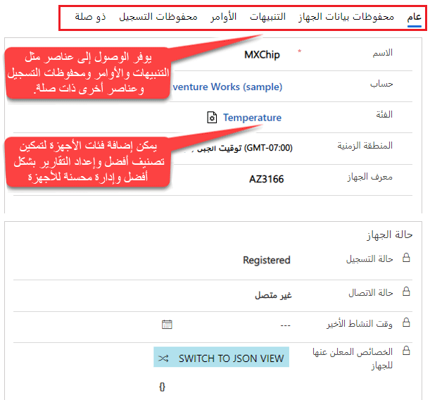
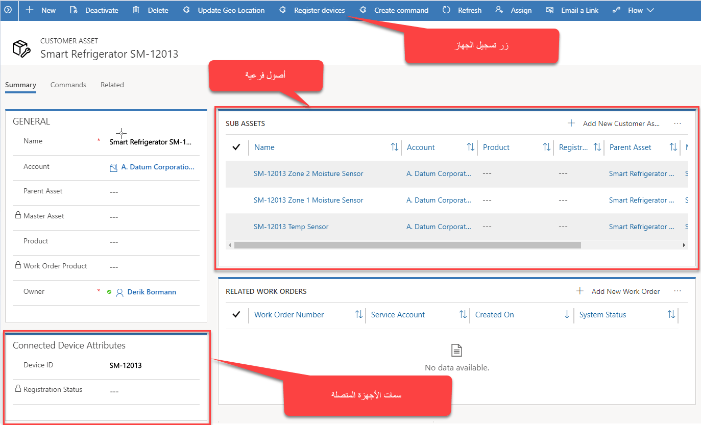
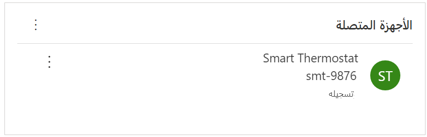
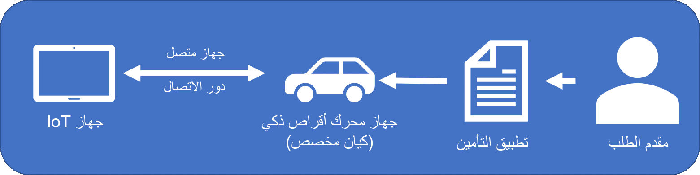

قبل أن يتم استهلاك بيانات الجهاز وتتبع الاستخدام بواسطة Dynamics 365 Connected Field Service، يجب أولا تسجيل الجهاز باستخدام Azure IoT Hub أو IoT Central كجهاز IoT. عند تثبيت Connected Field Service، تتم إضافة كيان جديد في مؤسسة Dynamics 365 باسم جهاز IoT. بمجرد تسجيل جهاز مع Azure IoT Hub أو IoT central (إما مباشرةً في Azure أو من Dynamics 365 أو أي وسيلة أخرى)، يتم إنشاء سجل جهاز IoT المطابق تلقائياً في Dynamics 365.   

   

من داخل سجل الجهاز، يمكنك الاطلاع على أي معلومات ذات صلة بالجهاز. ويتضمن ذلك التنبيهات والتسجيل وحالة الاتصال وسجل التسجيل والمزيد. 

عندما ترغب في تتبع جزء معين من معدات العملاء في موقع خاص بالعميل في Field Service، فإنك تقوم بإنشاء سجل أصل للعميل. نظراً لأن العديد من أصول العملاء غالباً ما تكون أجهزة ممكنة لـ IoT، يمكن أيضاً تسجيل أصول العملاء كأجهزة IoT. عندما يتم إنشاء أصل العميل في Dynamics 365، يحتوي سجل الأصل على قسم سمات جهاز متصل. يقوم هذا القسم بتخزين معرّف الجهاز وحالة التسجيل للجهاز المتصل. يمكن تسجيل أصل العميل كجهاز مباشرةً من سجل أصل العميل في Dynamics 365. ويكون الاستثناء عند العمل مع تطبيق الأجهزة المحمولة. 
 
> [!IMPORTANT] 
> لا يمكنك ربط أصل بجهاز باستخدام تطبيق Field Service Mobile.   

   

كما هو مذكور في الوحدة السابقة، هناك العديد من الحالات التي قد يكون فيها أصل عميل ممكن لـ IoT مزوداً بأجهزة استشعار متعددة IoT مقترنة به. في هذه الحالات، يمكن أن يكون لكل من أجهزة استشعار IoT هذه أصل عميل تم إنشاؤه لهم مرفق بسجل الأصول الرئيسية.   

تستخدم Connected Field Service وظائف اتصال Dynamics 365 وأدوار الاتصال لربط سجلات أصول العميل مع سجلات أجهزة IoT. يوجد دور اتصال يسمى **جهاز IoT متصل**. عندما يتم تسجيل أصل العميل كجهاز IoT، يتم إنشاء الاتصال تلقائياً باستخدام هذا الدور.     

  

لا يسهل هذا الأمر إدارة الأجهزة التي تدعم IoT فحسب، بل يعني أيضاً من وجهة نظر القابلية للتوسعة، أنه يمكنك استخدام نفس دور اتصال جهاز IoT المتصل لربط وإدارة كيانات أخرى كأجهزة IoT من داخل Dynamics 365. على سبيل المثال، قد ترغب الشركة التي تبيع وثائق التأمين في قياس أنماط السائق (مثل معدلات السرعة ومتوسط الأميال المدفوعة والتسارع والتباطؤ) قبل إصدار وثائق التأمين لضمان تطابق السعر المعروض حقاً مع أسلوب القيادة الخاص بها. عندما يتقدم عميل بطلب للحصول على بوليصة تأمين جديدة ويتم منحه جهازاً، يمكن تسجيل الجهاز وربطه بتطبيق تأمين العميل المحتمل.
  
   

في بعض الأوقات، قد لا يتم تسجيل الجهاز. قد يحدث خطأ تسجيل لأسباب عديدة. السبب الأكثر شيوعاً هو عندما لا يكون Dynamics 365 متصلاً بـ Azure أو إذا كان Azure غير متصل. عند حدوث ذلك، سيكون هناك خطأ في حقل "حالة التسجيل" الخاص بسجل الأصول. بالنسبة للأصول التي تحتوي على العديد من الأجهزة، تظهر حالة الجهاز رسالة الخطأ لكل جهاز.

في الوحدة التالية، سوف نقوم باستكشاف كيفية استخدام Connected Field Service للتفاعل مع الأجهزة.

