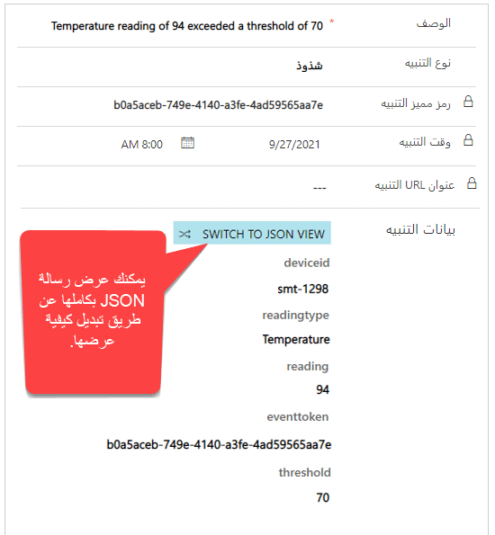
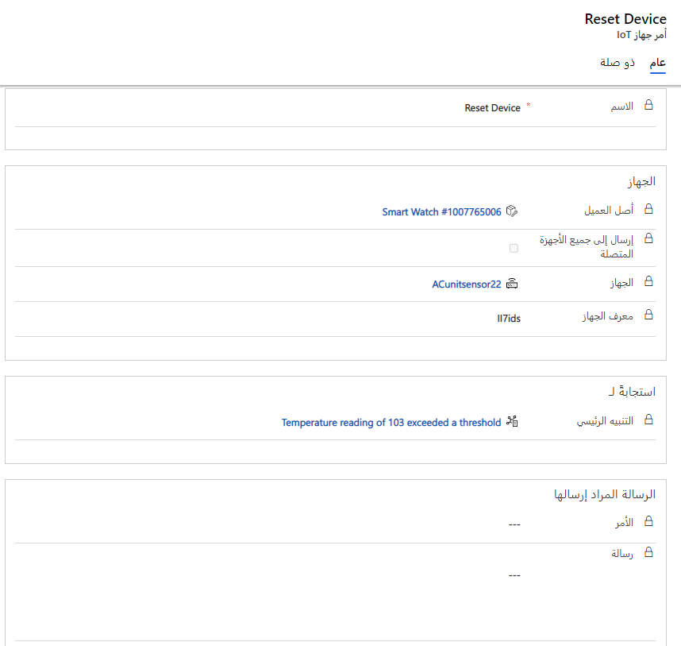

بمجرد تسجيل أصول العملاء الممكّنة لـ IoT مع Azure IoT Hub أو IoT Central، سيتم تسجيل القراءات من الأجهزة بناءً على التكوين. من داخل Azure IoT Hub أو IoT Central، يمكنك تحديد كيف ومتى تريد تشغيل تنبيه يمكن إرساله مرة أخرى إلى Dynamics 365. على سبيل المثال، لنفترض أن لديك منظم حرارة يدعم IoT. سيرسل الجهاز باستمرار قراءات درجة الحرارة إلى مركز IoT. بمجرد اكتشاف قراءة درجة الحرارة خارج العتبة المحددة، سيتم إنشاء سجل تنبيه IoT في Dynamics 365. 

يحتوي حل Dynamics 365 Connected Field Service على العديد من أنواع السجلات التي يمكن استخدامها للمساعدة في إرسال الأوامر مرة أخرى إلى الجهاز. 
 
يحدد الجدول التالي بعض أنواع السجلات الرئيسية المستخدمة.  

<!--note from editor: In the Command line below, are JSON commands passing "to" or "from" the device?-->

| **نوع التسجيل** | **الاستخدام** |
| :-------------- | :--- |
| **فئة الأجهزة** | السماح بتجميع أجهزة IoT حسب فئة معينة. يمكن استخدام فئات الأجهزة مع تعريفات الأوامر لتسهيل إدارة الجهاز. |
| **الأمر** | يستخدم للتفاعل عن بعد مع جهاز IoT المتصل عن طريق تمرير أوامر JSON إلى الجهاز. |
| **تعريف الأوامر** | تُستخدم لتحديد الأوامر مسبقاً لتبسيط إرسالها إلى الأجهزة. عند إنشاء أمر، يمكن تحديد تعريف الأوامر، وسيتم ملء أي خصائص محددة. |
| **تعريف الخاصية** | يُستخدم لتحديد خصائص معينة يمكن تمريرها كجزء من تعريف الأوامر. |

عند تثبيت حل Connected Field Service وتكوينه، يكون لديك خيار إعداد مخطط Power BI. يتطلب ذلك إضافة قاعدة بيانات SQL إلى مركز IoT الخاص بك، ثم توصيلها بقالب Power BI الذي سيساعد في نشر قراءات الجهاز إلى مخطط في Dynamics 365. إذا حددت تكوين Power BI، فبمجرد تسجيل الجهاز، ستتمكن من عرض القراءات التي أرسلها الجهاز مباشرةً في سجل أصول العميل. بشكل افتراضي، يمكنك مشاهدة آخر 20 قراءة، ولكن يمكنك تغيير الإعدادات الافتراضية في التقرير باستخدام Power BI Desktop. 
 
بمجرد استلام التنبيه، سوف يحتوي على جميع المعلومات ذات الصلة بتنبيه الجهاز. ستأخذ بيانات التنبيه بيانات JSON التي تم إنشاؤها بواسطة التنبيه وتعرضها في التطبيق. يمكن الاستفادة من هذه المعلومات عند تحديد الإجراء التالي الذي يجب اتخاذه.  

   

في كثير من الأحيان، قد تتمكن من حل المشكلة عن بُعد ببساطة عن طريق إعادة تعيين أو إرسال أمر مرة أخرى إلى الجهاز. يمكن تنفيذ الأمر من سجل أصول العميل أو تنبيه أو آلياً باستخدام مهام سير العمل.  

   

يتكون الأمر من JSON الذي يتم إرساله مرة أخرى إلى الجهاز. يحتوي الأمر على معلمات يمر عبرها إلى الجهاز. للمساعدة في تمرير الأوامر مرة أخرى إلى الأجهزة، يمكن استخدام تعريفات الأوامر وتعريفات الخصائص لجعل إنشاء الأوامر أسهل وأكثر مرونة. تتم مناقشة تعريفات الأوامر والممتلكات بمزيد من التفصيل في دورة أخرى.  
