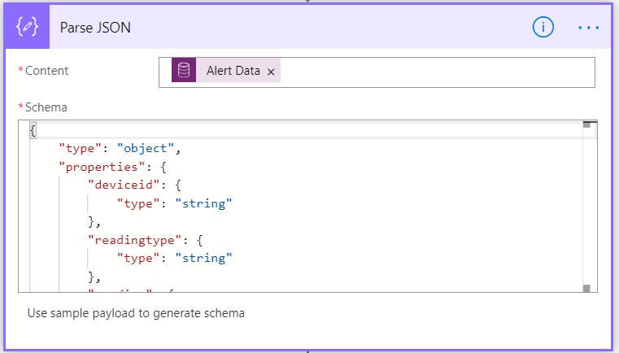
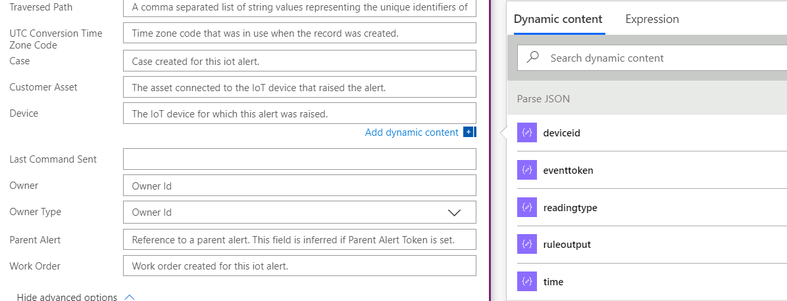

بعد إنشاء تنبيه IoT في CFS، تحتاج إلى تحديد مسار عملك التالي. يحتوي سجل تنبيه IoT نفسه على عدة أجزاء من المعلومات بما في ذلك نوع التنبيه والوقت ومعرف الجهاز وبيانات التنبيه. يتكون حقل بيانات التنبيه من بيانات JSON التي تحتوي على التفاصيل المحددة حول الحدث. قد تختلف البيانات المضمنة وفقاً للجهاز. ستحدد المعلومات الموجودة في حقل بيانات التنبيه بشكل عام الخطوة التالية المحددة التي يجب اتخاذها. عند البدء في إنشاء أتمتة حول الخطوات التالية، من المهم أن تفهم الأدوات والمعلومات المتوفرة وكيف تتيح لك هذه الأدوات تحقيق هدفك.

تتمثل إحدى طرق تبسيط التعامل مع التنبيهات في تحديد كيفية تجميعها معاً أثناء تشغيل التنبيهات. بشكل افتراضي، يتم تجميع التنبيهات المتشابهة بناءً على الجهاز الذي أطلق التنبيه. ومع ذلك، قد تكون هناك أوقات يكون فيها من المنطقي إضافة طبقة تجميع إضافية. على سبيل المثال، قد تختار إحدى المؤسسات تجميع التنبيهات حسب البيانات ذات الصلة مثل فئة الأجهزة أو الحساب أو أصول العميل.

هذه الإعدادات متاحة من **الإعدادات** - **الإعدادات IoT** -
**قواعد تجميع التنبيهات**. يمكن تحديد تجميعات التنبيهات بناءً على تنبيه IoT أو الجهاز ذي الصلة أو أصول العميل ذات الصلة.

## <a name="working-with-alert-data"></a>العمل مع بيانات التنبيه

‏‫خارج الإطار التقليدي، يحتوي حل Connected Field Service على العديد من الإجراءات ومهام سير العمل التي يمكن الاستفادة منها للمساعدة في أتمتة العناصر مثل إنشاء الأجهزة وتسجيلها ونشر البيانات ذات الصلة في السجلات.

تتضمن بعض الإجراءات الرئيسية المتعلقة بتنبيهات IoT ما يلي:

| اسم العرض                         | الوصف                                            |
|--------------------------------------|--------------------------------------------------------|
| قيمة الحقل المستندة إلى JSON - الحصول على رقم  | قراءة الخاصية الرقمية في كائن JSON المحدد. |
| قيمة الحقل المستندة إلى JSON - الحصول على سلسلة  | قراءة خاصية السلسلة في كائن JSON المحدد.  |
| قيمة الحقل المستندة إلى JSON - الحصول على القيمة المنطقية | قراءة خاصية القيمة المنطقية في كائن JSON المحدد. |

البيانات الموجودة في حقل بيانات التنبيه بتنسيق JSON. يمثل النص أدناه مثالاً لما سيتم تمريره إلى حقل بيانات التنبيه عند رفع تنبيه IoT.

```json
{"deviceid":"smt-1298","readingtype":"Temperature","reading":113,"eventtoken":"c802338d-60f2-4a79-b45c-e164e2191ce0","threshold":70,"ruleoutput":"AlarmTemp","time":"2018-09-06T15:58:08.964Z"}
```

بشكل عام، لا يمكنك استخدام محتويات حقل بيانات التنبيه مباشرةً لأنك قد تبحث عن استعلام بناءً على إحدى الخصائص، وليس جميعها. يجب عليك أولاً تحليل المعلمات ذات الصلة التي تريد العمل معها، حتى تتمكن من استخدامها لدفع الاستعلام وتوجيه الخطوات التالية.

إذا أردنا تحليل سلسلة JSON أعلاه، يمكننا أن نرى أنها تنقل ما يلي:

| المعلمة   | القيمة‬                                |
|-------------|--------------------------------------|
| ‏‫معرف الجهاز    | Smt-1298                             |
| readingtype | درجة الحرارة                          |
| قراءة     | 113                                  |
| eventtoken  | c802338d-60f2-4a79-b45c-e164e2191ce0 |
| الحد   | 70                                   |
| ruleoutput  | AlarmTemp                            |
| الوقت        | 09/06/2018 06:58:08 صباحاً               |

للمساعدة على تحليل المعلمة المحددة التي قد تحتاجها من سلسلة JSON، يمكنك الاستفادة من أحد إجراءات **قيمة الحقل المستندة إلى JSON**.

تحتوي إجراءات قيمة الحقل المستندة إلى JSON على المعلمات التالية:

| المعلمة          | النوع   | الوصف                                                            |
|--------------------|--------|------------------------------------------------------------------------|
| JSON               | الإدخال  | كائن JSON المراد فحصه.  (في هذه الحالة، حقل بيانات التنبيه)       |
| PropertyPath       | الإدخال  | اسم الخاصية أو مسار القيمة إلى جاهز.  (هذا مميِّز لحالة الأحرف) |
| DefaultReturnValue | الإدخال  | القيمة الافتراضية التي يتم إرجاعها إذا لم يتم العثور علي الخاصية المحددة.            |
| الاستجابة           | الإخراج | قيمة الاستجابة للخاصية المحددة.                         |

بناءً على إجراء قيمة الحقل المستند إلى JSON، يمكنك تحديد معلمة الإخراج قد تكون سلسلة نصية (سلسلة) أو قيمة رقمية (رقم) أو قيمة منطقية (منطقي‬‏‫).

**علي سبيل المثال:** إذا استخدمت إجراء **قيمة الحقل المستندة إلى JSON - الحصول على الرقم** لاستخراج القراءة قيمة سلسلة JSON لبيانات التنبيه أدناه:

```json
{"deviceid":"smt-1298","readingtype":"Temperature","reading":113,"eventtoken":"c802338d-60f2-4a79-b45c-e164e2191ce0","threshold":70,"ruleoutput":"AlarmTemp","time":"2018-09-06T15:58:08.964Z"}
```

قد يبدو مثل الجدول أدناه:

| المعلمة          | القيمة‬                                      |
|--------------------|--------------------------------------------|
| JSON               | بيانات التنبيه (اسم الحقل)                    |
| PropertyPath       | قراءة                                    |
| DefaultReturnValue | 70 (يمثل الحد المؤقت الحالي) |
| القيمة‬              | 113                                        |

تمثل القيمة القيمة التي يتم إرجاعها بواسطة الإجراء، والتي ستكون في هذه الحالة 113 نظراً لأن هذه هي القيمة المرتبطة بخاصية "القراءة". السبب في أننا نستخدم إجراء إحضار الرقم، هو أنه يمكننا تمرير القيمة إلى حقل رقمي ثم الاستفادة من خيارات الاستعلام الرقمية على القيمة لتحديد ما يجب فعله بالصنف.

## <a name="practical-application"></a>تطبيق عملي

الآن، نظرة على التطبيق العملي لهذا المفهوم.

لنفترض أن لدينا منظم حرارة ذكي مسجل كجهاز IoT. إذا تجاوزت قراءة التنبيه 70 درجة، فسيتم إنشاء تنبيه IoT في CFS.

-   إذا كانت قراءة الجهاز بين 70 درجة و85 درجة، اجعل Connected Field Service ترسل أمراً تلقائياً إلى الجهاز لإعادة تشغيله.

-   إذا كانت قراءة الجهاز أكبر من 85 درجة، تتطلب أن يقوم الفني ببعض استكشاف الأخطاء وإصلاحها يدوياً.

يمكننا تحقيق ذلك من خلال إنشاء سير عمل يقوم بما يلي:

-   يقوم Firsts بتنفيذ إجراء **قيمة الحقل المستندة إلى JSON - الحصول على الرقم** لالتقاط قيمة خاصية قراءة.

-   بعد ذلك يكتب قيمة الإخراج التي تم إرجاعها إلى حقل مخصص في سجل تنبيه IoT، على سبيل المثال، قراءة الجهاز.

-   يمكن تشغيل سير عمل آخر عند تحديث حقل "قراءة الجهاز"، يقوم بما يلي:

    -   إذا كان حقل قراءة الجهاز بين 70 و85: فسيتم إنشاء أمر مرتبط بتنبيه IoT الذي يرسل أمر إعادة تعيين إلى الجهاز.

    -   إذا كان حقل "قراءة الجهاز" أكبر من 85 درجة، فإن سير العمل مكتمل بحالة "نجاح".

## <a name="using-power-automate"></a>استخدام Power Automate

يمكن الاستفادة من هذا المفهوم نفسه باستخدام Power Automate. بدلاً من الاستفادة من الإجراءات المخصصة لقيمة الحقل المستندة إلى JSON، يمكننا استخدام إجراء تحليل JSON في التدفق. عند تشغيل إجراء تحليل JSON، سيتم تحليل JSON من حقل بيانات التنبيه إلى خصائص فردية. يجب تحديد المخطط حتى يعرف الأمر كيفية تحليل البيانات. يمكن استخدام حمولات عينة من تنبيه IoT لإنشاء المخطط.

في الصورة أدناه، استخدمنا نفس سلسلة JSON التي تم تضمينها في تنبيه IoT لإنشاء المخطط:

```json
{"deviceid":"nest1234","readingtype":"Temperature","reading":80,"eventtoken":"cfd5e690-ee88-4ca8-a75d-3b86ac61295c","threshold":70,"ruleoutput":"AlarmTemp","time":"2019-10-19T16:42:26.457Z"}
```

يمكنك أن ترى أنه أنشأ خصائص متعددة تمثل كل صنف تم تمريره في JSON مثل معرف الجهاز وreadingtype والقراءة وما إلى ذلك.



بمجرد تحليل البيانات، يمكن استخدامها لملء الحقول الأخرى في تنبيه IoT تماماً كما فعلنا مع سير العمل. يمكن الآن استخدام كل خاصية كمحتوى ديناميكي في أي خطوة مستقبلية في التدفق.



إذا أردنا إعادة النظر في مثال منظم الحرارة الذكي الخاص بنا من قبل، فيمكننا تحقيق نفس النتيجة من خلال إنشاء تدفق Power Automate بحيث يقوم بما يلي:

-   يتم تنفيذ التدفق لأول مرة عند إنشاء سجل تنبيه IoT جديد.

-   يتم تنفيذ إجراء تحليل JSON لتحليل JSON إلى خصائص فردية.

-   بعد ذلك، يقوم التدفق بتحديث سجل تنبيه IoT بقيمة إخراج إحدى الخصائص التي تم إرجاعها. على سبيل المثال، يتم استخدام خاصية القراءة لتحديث حقل قراءة الجهاز.

-   يمكن تشغيل تدفق آخر عند تحديث حقل قراءة الجهاز الذي يقوم بما يلي:

    -   إذا كان حقل قراءة الجهاز بين 70 و85: فسيتم إنشاء أمر مرتبط بتنبيه IoT الذي يرسل أمر إعادة تعيين إلى الجهاز.

    -   إذا كان حقل "قراءة الجهاز" أكبر من 85 درجة، فإن سير العمل مكتمل بحالة "نجاح".
