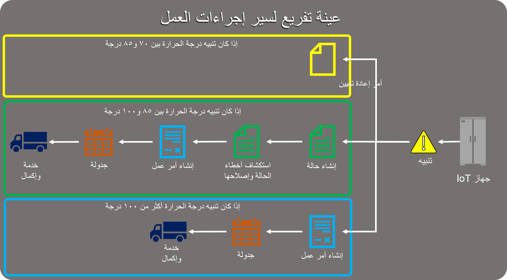
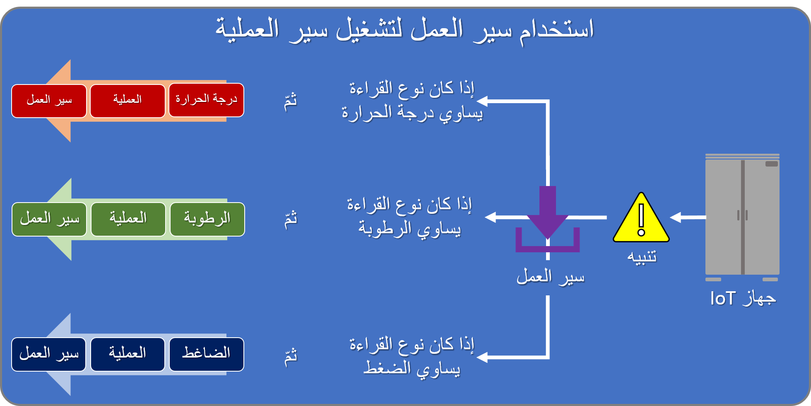

والآن بعد أن بدأت رسمياً في جمع البيانات واكتشاف العيوب واستخراج البيانات ذات الصلة لأجهزة IoT الخاصة بنا، فإن الخطوة الأخيرة هي تحديد ما يجب القيام به معها وتقديم إرشادات للمستخدمين عند العمل مع هذه الأجهزة. قبل البدء في تحديد العمليات، من المهم فهم ما هي النتيجة المرجوة التي تحاول تحقيقها وتحديد المطلوب للوصول إلى هذه النقطة.  

تعرض الصورة التالية مثالاً على سير إجراءات العمل الذي يتفرع بناءً على قيمة القراءة المتوفرة في تنبيه درجة الحرارة.  

   

ويرتبط سير إجراءات العمل بكيان التنبيه IoT ويستخدم القيمة الموجودة في حقل قراءة الجهاز.  

**واستناداً إلى هذه القيمة، يمكننا:**

- إرسال أمر إعادة التعيين مباشرة إلى الجهاز إذا كانت القراءة المؤقتة بين 70 درجة و85 درجة.
- فرع في عملية الدقة القياسية التي تقوم أولاً بإنشاء الحالة، ثم تقوم بإنشاء أمر عمل، وإرسال أمر العمل، وأخيراً فإن الفني يقوم بمعالجة أمر العمل عندما تكون قراءة درجة الحرارة بين 86 و100 درجة.
- قم بتخطي مراحل الحالة تماماً وانتقل مباشرةً إلى مرحلة إنشاء أمر العمل إذا كانت قراءة درجة الحرارة أعلى من 100 درجة.

ومن خلال الاستفادة من أتمتة سير العمل مع سير إجراءات العمل، يمكن اتخاذ هذا المفهوم خطوة أخرى إلى الأمام، وبدلاً من ذلك يمكن تنفيذ سير إجراءات عمل مختلفة بناءً على التنبيه.   
   
على سبيل المثال: لنفترض أنك قمت بإنشاء سير إجراءات الأعمال التالية لكيان تنبيه IoT.
  
- سير عمل عملية تنبيه درجة الحرارة
- سير عمل عملية تنبيه الرطوبة
- سير عمل عملية تنبيه ضاغط الهواء

عند إنشاء تنبيه، يمكننا تنفيذ سير عمل يستخدم قيمة الحقل المستندة إلى JSON - إجراء الحصول على سلسلة لالتقاط خاصية "readingtype" من JSON الذي تم تمريره إلى حقل بيانات التنبيه. يمكن لسير العمل عندئذ ملء حقل مخصص يسمى نوع القراءة في سجل التنبيه.  

نظراً لأن لدينا القدرة على التفاعل مع سير إجراءات العمل باستخدام سير العمل، سيكون من الممكن تصميم سير عمل من شأنه القيتم بتنفيذ سير إجراءات العمل المناسب استناداً إلى القيمة الموجودة في حقل نوع القراءة.

   

بالإضافة إلى ذلك، يمكنك تنفيذ مهام سير العمل عند الدخول إلى مرحلة معينة لسير إجراءات العمل أو الخروج منها. قد يكون هذا مفيداً عند التفكير في إرسال الأوامر أو تسجيل الجهاز بناءً على الأصناف التي تم التقاطها في السجلات التي تتعامل معها. وخارج الإطار التقليدي، تقوم Connected Field Service بالإجراءات التالية: 

| **اسم العرض** | **الوصف** |
| :-------------- | :--- |
| **IoT - تسجيل كيان العميل** | تسجيل أي كيان مخصص قد يكون قد قام بالفعل بتوصيل أجهزة IoT أو لا. يقوم هذا الإجراء باستدعاء IoT - تسجيل إجراء الجهاز. |
| **IoT - تسجيل الأجهزة** | يقوم بنشر التسجيل لجهاز IoT. |
| **IoT – تنبيهات حظر IoT** | يربط التنبيهات المتكررة المحتملة بتنبيه أصلي موجود.  |

من خلال إنشاء مهام سير العمل التي تستدعي هذه الإجراءات، يمكنك بعد ذلك إقران مهام سير العمل هذه إما بإدخال مرحلة معينة أو إنهائها في سير إجراءات العمل. على سبيل المثال، قد يكون لديك سير إجراءات عمل مرتبط بكيان مخصص سيتم الاستفادة منه أيضاً كجهاز IoT. من خلال إنشاء سير عمل يقوم باستدعاء إجراء IoT - إجراء تسجيل كيان العميل وتعيينه للتشغيل عند الخروج من مرحلة معينة، يمكنك حينها تقييم أصناف معينة في السجل وجعل سير إجراءات العمل يقوم بتسجيل الجهاز تلقائياً إذا تم استيفاء شروط معينة.  

بغض النظر عن كيفية التخطيط لأتمتة المستخدمين وتوجيههم من خلال عمليات محددة، فمن المهم أن تتذكر أن كل عملية تقوم بتصميمها يجب أن:

- أن يكون لديك بداية محددة. *(مثال: يتم تشغيل التنبيه)*
- يكون لديك نهاية محددة. *(مثال: أمر عمل يتم إغلاقه)*
- الحصول على إجراء قابل للتكرار بمراحل وخطوات محددة. *(مثال: تنبيه – الحالة – أمر العمل -تقديم الخدمة)*
- خذ بعين الاعتبار المتغيرات التي قد تؤثر في سير إجراء العملية. *(مثال: انقطاع مقابل تحذير)*

  
