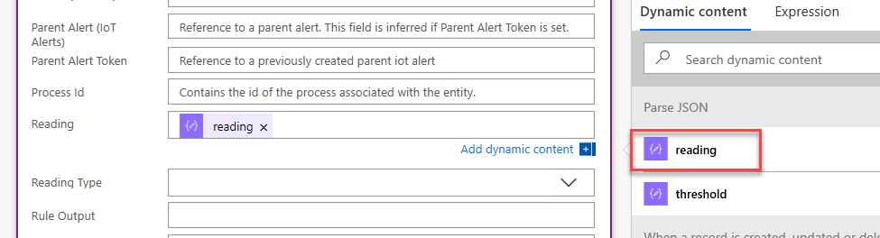
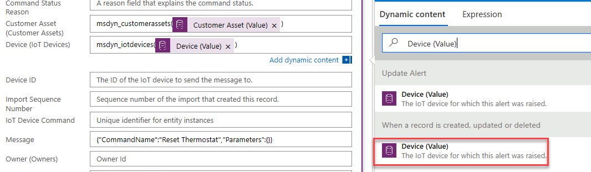
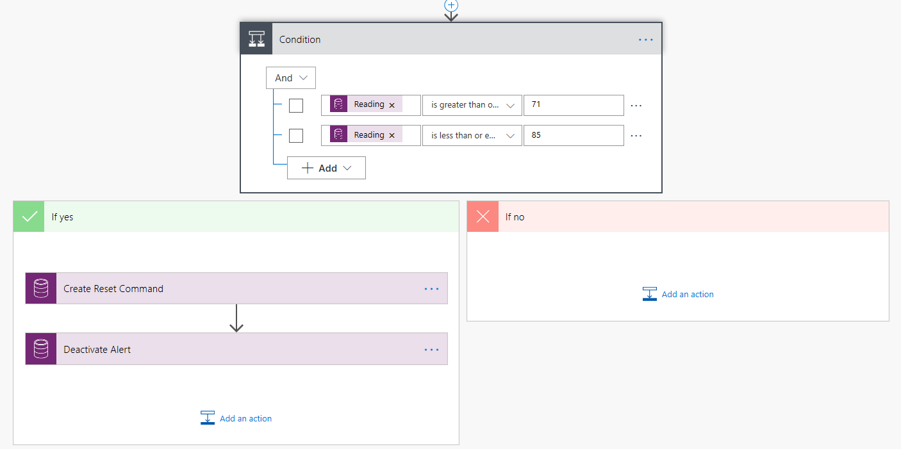

يوفر حل Connected Field Service من Dynamics 365 القدرة على مراقبة الأجهزة الممكّنة لـ IoT عن بُعد لتعقب وقت التشغيل وإحصائيات الجهاز والحالات الشاذة والمزيد. بعد أن يتصل جهاز IoT بشيء خارج عن المألوف أو استثناء، يتم إرسال هذه المعلومات إلى Connected Field Service كتنبيه. بمجرد التقاط التنبيه، يمكننا الاستفادة من قدرة Dynamics 365 على إنشاء الأتمتة والعملية التجارية لتطوير العمليات المؤتمتة للعمل على المشكلات وتوجيهها وإصلاحها.

الغرض من هذا المعمل العملي هو تعريفك بإنشاء عمليات Connected Field Service وتنفيذها بشكل تلقائي، بالإضافة إلى توضيح كيفية الاستفادة من هذه الأصناف كجزء من حل IoT الشامل.

### <a name="scenario"></a>السيناريو

أنت تعمل في شركة سباكة وتدفئة تقوم ببيع الأجهزة المنزلية الذكية وخدمتها. ونظراً لأن العديد من الأجهزة التي تقوم بخدمتها هي أجهزة ذكية، يمكن التقاط المعلومات من هذه الأجهزة عن بعد للمساعدة في خدمة تلك المعدات. لدى مؤسستك العديد من السيناريوهات والعمليات المحددة التي يستخدمونها أثناء خدمة المعدات.
ويمكن أن تختلف هذه العمليات بناء على عدة عوامل تتضمن:

-   نوع الجهاز الذي يحتاج للخدمة

-   تم اكتشاف خطورة المشكلة

-   عمر الجهاز

-   موقع الجهاز

-   توفر الموارد للعمل على جهاز معين

تمثل العناصر المذكورة أعلاه جزءاً صغيراً فقط من العوامل التي تستخدمها مؤسستك لتحديد عملية خدمة المعدات.

مؤخراً، قمت بتثبيت الكثير من أجهزة الترموستات الذكية.
كانت هذه الأجهزة مفيدة للغاية في القدرة على تعقب قراءات درجة الحرارة والرطوبة في المناطق عندما يكون من المهم الحفاظ على درجة حرارة ورطوبة ثابتة. الآن نظراً لتوفر المزيد من المعلومات، فقد أجبرت على إنشاء عمليات جديدة للتعامل مع المشكلات التي أبلغت عنها هذه الأجهزة وحلها. المجال الأول الذي ترغب في التركيز عليه في الأتمتة هو العملية المستخدمة في المشاكل المتعلقة بدرجة الحرارة.

تتطلع مؤسستك إلى تنفيذ العملية التالية:

-   إذا اكتشف الجهاز قراءة درجة حرارة تزيد عن 70 درجة، فيجب أن يظهر تنبيه في بيئة Connected Field Service الخاصة بك.

-   إذا كانت قراءة درجة الحرارة بين 70 و85 درجة، فيجب إرسال أمر لإعادة ضبط الجهاز عن بُعد لمعرفة ما إذا كانت المشكلة تحل نفسها.

-   إذا كانت قراءة درجة الحرارة بين 86 و100 درجة، فيجب أن يكون مندوب الخدمة قادراً على إنشاء حالة لمحاولة حل المشكلة.

    -   إذا تعذر على مندوب الخدمة حل المشكلة، فيجب إنشاء أمر عمل، ويجب جدولة فني في الموقع للصنف.

-   إذا كانت قراءة درجة الحرارة أكثر من 100 درجة، يُعد هذا حدثاً كارثياً محتملاً، ويجب إنشاء أمر عمل، ويجب جدولة فني في الموقع للصنف.

## <a name="exercise-1-automate-and-customize"></a>التدريب 1: أتمتة وتخصيص 

**قبل البدء:** يفترض هذا التدريب أن لديك بالفعل عملية نشر Connected Field Service متصلة إما بمثيل Azure IoT Hub أو مثيل IoT Central. إذا لم يكن لديك بيئة Connected Field Service متاحة، فمن المستحسن أن تقوم بإجراء المقدمة إلى الوحدة النمطية Connect Field Service. سيساعدك هذا في إعداد وتكوين بيئة Connected Field Service.

### <a name="task-1-create-a-new-iot-alert-process-solution"></a>المهمة 1: قم بإنشاء حل جديد لعملية تنبيه IoT

في هذه المهمة الأولى، سننشئ حل Dynamics 365، يمكننا استخدامه لتخزين جميع التخصيصات والعمليات التي سننشئها في هذه الوحدة النمطية. لن يؤدي ذلك فقط إلى تسهيل نقل هذه التخصيصات لاحقاً، ولكنه سيساعد أيضاً في تنظيف بيئاتنا بعد الانتهاء من الدورة التدريبية.

1.  انتقل إلى Power Apps <https://make.powerapps.com> وتأكد من أنك في البيئة الصحيحة.

1.  حدد **الحلول** وانقر فوق **حل جديد**.

1.  قم بتسمية حل **عمليات تنبيه IoT**.

1.  انقر فوق القائمة المنسدلة **للناشر** وحدد **+ الناشر**.

1.  قم بتكوين **الناشر** على النحو.

    -   **اسم العرض:** *دورة Connected Field Service*

    -   **البادئة:** *cfs*

1.  انقر فوق **حفظ وإغلاق**.

1.  انقر فوق القائمة المنسدلة **للناشر** وحدد الناشر الذي أنشأته.

1.  في حقل **الإصدار**، أدخل **1.0.0.0**. وانقر فوق **إنشاء**.

1.  انقر لفتح حل **إجراء تنبيه IoT** الذي قمت بإنشائه.

1. انقر فوق **إضافة موجود** وحدد **الكيان**.

1. حدد **الحالة**، **تنبيه IoT**، وكذلك **أمر العمل** ثم انقر فوق **التالي**.

1. حدد **تضمين كافة المكونات** لكافة الكيانات الثلاثة وانقر فوق  **إضافة**.

### <a name="task-2-customize-the-iot-alert-entity"></a>المهمة 2: تخصيص كيان تنبيه IoT 

للمساعدة على تنفيذ الأصناف والإجراءات التلقائية استناداً إلى تنبيهات IoT، سيتعين علينا استخراج معلومات محددة لتنبيهات IoT التي تم إنشاؤها. يمكننا الاستعلام عنها وتشغيل الأصناف استناداً إلى تلك البيانات. نظراً لأن بيانات التنبيه تحتوي فقط على سلسلة JSON تحتوي على جميع البيانات، فسنحتاج إلى إنشاء بعض الحقول الإضافية في كيان تنبيه IoT الذي يمكننا استخدامه لإرسال بيانات محددة إلى تلك الحقول وبناء استعلامات خارجها.

1.  تأكد من أنك لا تزال في حل **عمليات تنبيه IoT**.

1.  انقر لفتح كيان **تنبيه IoT**.

1.  حدد علامة تبويب **الحقول** وانقر فوق **+ إضافة حقل**.

1.  أدخل **القراءة** **لاسم العرض**، وحدد **العدد الكامل** لنوع البيانات، وانقر فوق **خيارات متقدمة**.

1.  أدخل **0** من أجل **الحد الأدنى للقيمة**، **250** **للقيمة القصوى**، وانقر فوق **تم‏‎**.

1.  كرر العملية لإضافة الحقول المحددة أدناه:

    1.  **الحد**

        1. **اسم العرض:** *الحد*

        1. **نوع البيانات:** *عدد صحيح*

        1. **الحد الأدنى للقيمة:** *0*

        1. **الحد الأقصى للقيمة:** *250*

    1.  **نوع** **القراءة‏‎**

        1. **‎اسم العرض:** *نوع القراءة*

        1. **نوع البيانات:** *خياران‏‎*

        1. قم بتغيير قيمة **لا** إلى **درجة الحرارة**

        1.  قم بتغيير قيمة **نعم** إلى **الرطوبة**

        1. **القيمة الافتراضية:** *درجة الحرارة*

    1.  **إخراج القاعدة**

        1. **‎اسم العرض:** *إخراج القاعدة*

        1. **نوع البيانات:** *سطر نص مفرد*

    1.  **العميل**

        1. **اسم العرض:** *عميل*

        1. **نوع البيانات:** *بحث*

        1. **نوع السجل المستهدف:** *حساب*

1.  انقر فوق **حفظ كيان.**

1.  حدد علامة التبويب **العلاقات**.

1.  انقر فوق **+ إضافة علاقة** وحدد **واحد إلى متعدد**.

1. حدد **حالة** **للكيان المرتبط**، أدخل **تنبيه IoT** **لاسم عرض حقل البحث**، وانقر فوق **تم**.

1. انقر فوق **حفظ الكيان** لحفظ العلاقة وترك السجل مفتوحاً.

1. انقر فوق اسم الحلول.

1. انقر فوق **نشر كافة التخصيصات** وانتظر حتى يكتمل النشر.

1. انقر فوق الزر **...** وحدد **التبديل إلى الكلاسيكي**.

1. قم بتوسيع **الكيانات**، ثم قم بتوسيع **تنبيه IoT** وحدد  **علاقات 1: N**.

1. انقر نقراً مزدوجاً لفتح **الحالة** على علاقة **تنبيه IoT**. يمكنك تأكيد ذلك عن طريق تحديد الإدخال باستخدام **تنبيه IoT** ككيان رئيسي **والحالة** كالكيان المرتبط.

    

1. حدد **التعيينات** وانقر فوق **جديد‏‎**.

1. قم بتكوين التعيين من القائمة كما يلي، ثم انقر فوق **موافق**.

    1.  **حقل الكيان المصدر:** *cfs_customer*

    1.  **حقل الكيان الهدف:** *معرف العميل*

1. انقر فوق **حفظ وإغلاق.**

1. انقر فوق **نشر كافة التخصيصات** وانتظر حتى يكتمل النشر.

1. أغلق مستكشف الحلول.

### <a name="task-3-create-a-flow-to-populate-values"></a>المهمة 3: إنشاء تدفق لتعبئة القيم

الآن بعد أن أصبح لدينا الحقل متاحاً لتخزين البيانات التي نحتاجها، نحتاج بعد ذلك إلى ملء هذه الحقول بالبيانات الصحيحة. للقيام بذلك، سنستفيد من بعض إجراءات قيمة الحقل المستندة إلى JSON المضمنة في حل Connected Field Service. سنقوم بإنشاء تدفق ينفذ إجراء قيمة حقل يستند إلى JSON، لاستخراج جزء معين من البيانات من حقل بيانات التنبيه، ثم نشر تلك البيانات في أحد الحقول التي أنشأناها في المهمة السابقة.

1.  انتقل إلى [Power Apps](https://make.powerapps.com/?azure-portal=true) وتأكد من أنك في البيئة الصحيحة.

1.  حدد **حلولاً** وانقر لفتح حل **عمليات تنبيه IoT**.

1.  انقر فوق **+ جديد** وحدد **سير عمل**.

1.  إعادة تسمية التدفق **تعبئة حقول التنبيه**.

1.  ابحث عن **Microsoft Dataverse** وحدد **Dataverse (البيئة الحالية)**. تأكد من أنك قمت بتحديد واحدة مع "البيئة الحالية".

1.  حدد **عندما يتم إنشاء سجل أو تحديثه أو حذفه**.

1.  حدد **إنشاء** **لحالة التشغيل**، تنبيهات IoT **للكيان**، وحدد **مؤسسة** **للنطاق** وانقر فوق **+ خطوة جديدة**.

1.  ابحث عن **التحليل** وحدد **تحليل Json.**

1.  انقر فوق حقل **المحتوى** وحدد **بيانات التنبيه** من جزء **المحتوى الديناميكي**.

1. الصق مخطط Json أدناه في حقل **المخطط** وانقر فوق **+
    خطوة جديدة**.

    ```json
    {
        "type": "object",
        "properties": {
            "deviceid": {
                "type": "string"
            },
            "readingtype": {
                "type": "string"
            },
            "reading": {
                "type": "integer"
            },
            "eventtoken": {
                "type": "string"
            },
            "threshold": {
                "type": "integer"
            },
            "ruleoutput": {
                "type": "string"
            },
            "time": {
                "type": "string"
            }
        }
    }
    ```

1. ابحث عن **تحديث السجل** وحدد **تحديث سجل (البيئة الحالية)**. تأكد من أنك قمت بتحديد واحدة مع "البيئة الحالية".

1. قم بإعادة تسمية **تحديث تنبيه الخطوة**.

1. حدد **تنبيهات IoT** **لاسم الكيان** وانقر فوق حقل **معرف السجل** وحدد **تنبيهات ‎IoT** من جزء **المحتوى الديناميكي**.

    

1. انقر فوق **عرض الخيارات المتقدمة**.

1. انقر فوق حقل **القراءة** وحدد **قراءة** من خطوة **Parse Json** في المحتوى الديناميكي.

    

1. انقر فوق حقل **نوع القراءة** وحدد **إدخال قيمة مخصصة**.

1. حدد علامة التبويب **التعبير** والصق التعبير أدناه، وانقر فوق **موافق**. تأكد من أن Parse_JSON يطابق اسم خطوة Parse Json.

    ```json
    if(equals(body('Parse_JSON')?['readingtype'], 'Temperature'), false, true)
    ```

    

1. انقر فوق حقل **إخراج القاعدة** وحدد **ruleoutput‎** من **إجراء تحليل** JSON في جزء المحتوى الديناميكي.

1. انقر فوق حقل **الحد** وحدد **الحد** من إجراء  **تحليل** JSON في جزء المحتوى الديناميكي.

1. يجب أن يشبه التدفق المكتمل الصورة أدناه:

    

1. انقر فوق **حفظ**.

1. لا تغلق هذه الصفحة.

### <a name="task-4-add-the-remote-reset-flow-steps"></a>المهمة 4: أضف خطوات تدفق إعادة التعيين عن بُعد

الآن بعد أن استخرجنا البيانات الصحيحة ووضعناها في الحقول الصحيحة، سنحتاج إلى إنشاء إضافة خطوات جديدة إلى التدفق، ستحدد هذه الخطوات قيمة درجة الحرارة في حقل القراءة وإذا كانت تقع بين 71 و85 درجة، يجب إنشاء أمر جهاز IoT تلقائياً وإرساله إلى الجهاز الذي سيقوم بإجراء إعادة تعيين الجهاز.

1.  ارجع إلى التدفق وانقر فوق + خطوة جديدة.

1.  حدد **شرط**.

1.  انقر فوق حقل **حدد القيمة** وحدد **القراءة** من خطوة **تنبيه التحديث** في المحتوى الديناميكي.

    

1.  حدد **أكبر من أو يساوي**.

1.  أدخل **71** من أجل **القيمة**، وانقر فوق **+ إضافة**، وحدد **إضافة صف**.

    

1.  انقر فوق حقل **حدد القيمة** وحدد **القراءة‏‎** من خطوة **تنبيه التحديث** في المحتوى الديناميكي.

1.  حدد **أقل من أو يساوي**.

1.  أدخل **85** **للقيمة**.

1.  يجب أن تبدو حالتك الآن مثل الصورة أدناه.

    

1. انتقل إلى الفرع **نعم** وانقر فوق **إضافة إجراء**.

1. ابحث عن **إنشاء سجل جديد** وحدد **إنشاء تسجيل جديد (البيئة الحالية)**. تأكد من أنك قمت بتحديد واحدة مع "البيئة الحالية".

1. أعد تسمية الخطوة **قم بإنشاء أمر إعادة التعيين**.

1. حدد **أوامر الجهاز IoT** **لاسم الكيان**، وانقر فوق حقل  **الاسم**، وحدد **الوصف** من **عند إنشاء سجل أو تحديثه أو حذفه** في المحتوى الديناميكي.

    

1. قم بإضافة **إعادة تعيين الجهاز** إلى **الاسم** وانقر فوق **إظهار الخيارات المتقدمة**.

1. انقر فوق حقل **أصل العميل** ونوع  **msdyn_customerassets()**.

1. ضع مؤشر الماوس بين **(** وكذلك **)** وحدد **أصول العميل (القيمة)** من **عند إنشاء السجل أو تحديثه أو حذفه** في المحتوى الديناميكي.

    

1. انقر فوق حقل **جهاز** ونوع **msdyn_iotdevices()**.

1. ضع مؤشر الماوس بين **(** و **)** وحدد **الجهاز (القيمة)** من **عند إنشاء السجل أو تحديثه أو حذفه** في المحتوى الديناميكي.

    

1. انقر فوق حقل **التنبيه الأصل** ونوع **msdyn_iotalerts()**.

1. ضع المؤشر بين **(** و **)** وحدد **تنبيه IoT** من إجراء **تحديث التنبيه** في المحتوى الديناميكي.

    

1. الصق Json أدناه في حقل **الرسالة**.

    ```json
    {"CommandName":"Reset Thermostat","Parameters":{}}
    ```

    

1. انقر فوق **إخفاء الخيارات المتقدمة**.

1. انقر فوق **إضافة إجراء**.

1. ابحث عن **تحديث السجل** وحدد **تحديث سجل (البيئة الحالية).** تأكد من أنك قمت بتحديد واحدة مع "البيئة الحالية".

1. قم بإعادة تسمية خطوة **تنبيه إلغاء التنشيط**.

1. حدد **تنبيهات IoT** **لاسم الكيان**، وانقر فوق حقل **معرف السجل** وحدد **تنبيه IoT** من إجراء **تحديث التنبيه** في المحتوى الديناميكي.

    

1. انقر فوق **عرض الخيارات المتقدمة**.

1. حدد موقع حقل **الحالة** وقم بتعيينه إلى **غير نشط**.

1. انقر فوق **إخفاء الخيارات المتقدمة**.

1. يجب أن يبدو الجزء الجديد من التدفق الآن مثل الصورة أدناه.

    

1. انقر فوق **حفظ**.

### <a name="task-5-modify-the-cfs---iot-alert-process-flow"></a>المهمة 5: تعديل تدفق عملية تنبيه CFS - IoT

في الوقت الحالي، نستخدم تدفق إجراءات أعمال يسمى تدفق معالجة تنبيه CFS - IoT لإرشاد المستخدمين في حل تنبيه عند تشغيله.
عندما تكون قراءة درجة الحرارة بين 86 و100 درجة، في العملية التجارية، يجب علينا إنشاء سجل حالة ثم أمر عمل إذا تعذر حل الحالة. إذا كانت قراءة درجة الحرارة أعلى من 100 درجة، فيجب على العملية التجارية تخطي مرحلة الحالة معاً والانتقال مباشرة إلى أمر العمل. في هذه المهمة، سنقوم بتعديل تدفق عملية تنبيه CFS - IoT لتعكس هذه الاحتياجات المحددة.

1.  انتقل إلى [Power Apps](https://make.powerapps.com//?azure-portal=true) وتأكد من أنك في البيئة الصحيحة.

1.  حدد حلولاً وانقر لفتح حل **عمليات تنبيه IoT**.

1.  انقر فوق **+ إضافة عملية موجودة** وحدد **العملية‏‎**.

1.  ابحث عن **CFS**، وحدد **CFS -- تدفق معالجة التنبيه IoT** وانقر فوق **إضافة**.

1.  افتح **CFS -- تدفق عملية تنبيه IoT**.

1.  انقر فوق الزر **إلغاء تنشيط** لإلغاء تنشيط العملية.

1.  تأكيد إلغاء التنشيط.

1.  قم بتوسيع **التفاصيل** في مرحلة **تنبيه IoT التي تم إنشاؤها**.

    

1.  ضمن **المكونات**، اسحب **خطوة البيانات** الموجودة أسفل خطوة **وقت التنبيه**.

1. قم بتكوين **خطوة البيانات** على النحو التالي:

    -   **اسم الخطوة:** *القراءة*

    -   **حقل البيانات:** *القراءة*

1. انقر فوق **تطبيق** لحفظ التغييرات.

1. كرر الخطوات من 9-11 لإضافة **خطوات البيانات** التالية إلى مرحلة  **إنشاء تنبيه IoT**:

    -   **الحد**

    -   **نوع القراءة**

    -   **إخراج القاعدة**

1. حدد علامة التبويب **المكونات**، واسحب مكون **الشرط** إلى يمين مرحلة **تنبيه IoT التي تم إنشاؤها**.

    

1. في **‎اسم العرض الخاص بالشرط**، أدخل **حالة الحرارة**.

1. تكوين القاعدة 1 على النحو التالي:

    -   **الحقل:** *القراءة‏‎*

    -   **العامل:** *أكبر من أو يساوي*

    -   **النوع:** *قيمة*

    -   **القيمة:** *86*

1. انقر فوق الزر **+ جديد** لإضافة قاعدة أخرى.

1. تكوين القاعدة 2 على النحو التالي:

    -   **الحقل:** *القراءة‏‎*

    -   **العامل:** *أقل من أو يساوي*

    -   **النوع:** *قيمة*

    -   **القيمة:** *100*

1. تأكد من تعيين **منطق القاعدة** على **و**.

    

1. انقر فوق **تطبيق**

1. حدد مرحلة **حالة درجة الحرارة**، وانقر فوق رمز **الموصل**، ومن القائمة التي تظهر، حدد **إعادة الاتصال**.

1. حدد مرحلة **إنشاء أمر عمل** باعتبارها **النقطة الثانية**.

1. يجب أن يشبه تدفق إجراءات العمل الآن الصورة أدناه:

    

1. انقر فوق **حفظ** وقم **بتنشيط** **CFS - تدفق معالجة التنبيهات IoT**.

1. أغلق نافذة أو علامة تبويب متصفح محرر العملية.

1. انقر فوق **تم** في النافذة السابقة للحل.

1. حدد **الحلول** وانقر فوق **نشر جميع التخصيصات**.

### <a name="task-6-test-your-newly-created-automation"></a>المهمة 6: اختبر الأتمتة التي تم إنشاؤها حديثاً

الآن بعد أن أصبح بإمكاننا إنشاء التخصيصات الضرورية والتدفق وسير إجراءات العمل، سنستخدم جهاز محاكاة لاختبار كل شيء للتأكد من أنه يؤدي الوظيفة المطلوبة.

1.  انتقل إلى [Power Apps](https://make.powerapps.com/?azure-portal=true) وتأكد من أنك في البيئة الصحيحة.

1.  حدد **أصول العميل** وانقر فوق الزر **الجديد**.

1.  أدخل **ثيرموستات البدء** **للاسم**، وحدد **Adventure Works** **للحساب** ثم انقر فوق **حفظ**.

1.  حدد موقع حقل **معرف الجهاز**، وأدخل **‎smt-9876** وقم **بالحفظ**.

1.  انقر فوق **تسجيل الأجهزة**.

1.  انقر فوق **موافق**.

1.  في مستعرض الويب حدد علامة تبويب جديده وانتقل إلى [مدخل Azure](https://portal.azure.com/?azure-portal=true) (تسجيل الدخول إلى Azure‏‎ إذا تمت مطالبتك بذلك. أنت بحاجة إلى اشتراك Azure المرتبط بالحساب الذي تستخدمه).

1.  حدد **مجموعات الموارد** وافتح مجموعة الموارد الخاصة بك.

1.  افتح IoT Hub الذي تستخدمه مع Connected Field Service، وحدد **المحاكي‬**

1. انقر فوق **عنوان URL الخاص بالمحاكي** لفتح محاكي الثيرموستات (يجب أن يفتح المحاكي في علامة تبويب جديدة).

1. انقر فوق **اتصال** في المحاكي.

1. قم بالرجوع إلى اشتراك **Azure**، وأغلق شاشة خدمة تطبيق المحاكي.

1. افتح **IoT Hub**.

1. قم بتمييز **اسم مركز IoT** وقم **بنسخه**.

1. قم بالرجوع إلى شاشة المحاكي وقم بلصق **اسم مركز IoT** في حقل **المضيف**.

1. قم بالرجوع إلى اشتراك Azure، وحدد **سياسات الوصول المشتركة**.

1. قم بفتح سياسة **iothubowner** **وقم** بنسخ **المفتاح الأساسي**.

    

1. قم بالتبديل مرة أخرى إلى شاشة المحاكي وقم بلصق **المفتاح الأساسي** في الحقل **الأساسي**.

1. انقر فوق الزر **Connect**.

1. انقر فوق الزر **تحديث** لضمان توفر كافة الأجهزة المسجلة.

1. من القائمة المنسدلة **تحديد جهاز**، حدد الجهاز **smt-9876**. *(يجب أن تظهر نقطة خضراء بجوار الزر "تحديث"، وبعد بضع ثوانٍ يجب أن تبدأ في إرسال المعلومات.)*

    

1. على **منزلق درجه الحرارة**، قم بتعيينه إلى **75** **درجة‏‎** وانتظر حتى يتم تسجيل حالة درجة الحرارة في نافذة **الرسائل المرسلة**.

    نظراً لأن درجة الحرارة كانت بين 71 و85 درجة، فسيتم إرسال أمر إلى الجهاز لإعادة تشغيله. (قد يستغرق الأمر عدة دقائق حتى يتم إرسال أمر إعادة التشغيل إلى الجهاز، وهذا يعتمد أيضاً على سرعة الإنترنت.)

1. قم بالرجوع إلى علامة تبويب المتصفح التي تم تحميل **Connected Field Service** بها.

1. حدد **تنبيهات IoT.**

1. قم بتبديل العرض إلى **تنبيهات IoT غير النشطة**.

1. قم بفتح **درجة الحرارة 75 تجاوزت التي تجاوزت حد 70 تنبيه**.

1. حدد علامة التبويب **الأوامر**. *(يجب أن ترى الأمر الذي تم إرساله إلى الجهاز.)*

    

1. قم بالرجوع إلى علامة تبويب متصفح الويب التي تحتوي على **المحاكي** الخاص بك.

1. قم بتعيين **درجه الحرارة** على **90 درجة** وانتظر حتى يتم تسجيلها في نافذة **الرسائل المرسلة**.

1. قم بالرجوع إلى علامة تبويب المتصفح التي تم تحميل **Connected Field Service** بها.

1. حدد **تنبيهات IoT.**

1. افتح تنبيه **قراءة درجة الحرارة 90 تجاوزت حد 70**.

1. انقر فوق المرحلة **التي تم إنشاؤها**. (*لاحظ أن المعلومات التي استخرجناها مسبقاً يتم عرضها، ولأن القراءة تتراوح بين 86 و100، قم بإنشاء الحالة في المرحلة التالية.)*

    

1. في **القائمة** انقر فوق **‎إرسال أمر**.

1. انقر فوق **التبديل إلى Json**.

1. أدخل الرمز أدناه للأمر وانقر فوق **إرسال**.

    ```json
    {"CommandName":"Reset Thermostat","Parameters":{}}
    ```   

1. عُد إلى جهاز المحاكي وانتظر حتى يتم إعادة تشغيل الجهاز.

1. على **منزلق درجة الحرارة**، قم بتعيينه على **106** **درجة** وانتظر حتى يتم تسجيل حالة درجة الحرارة في نافذة **الرسائل المرسلة**.

1. قم بالرجوع إلى علامة تبويب المتصفح التي تم تحميل **Connected Field Service** بها.

1. حدد **تنبيهات IoT.**

1. افتح تنبيه **قراءة درجة الحرارة 106 تجاوزت حد 70**.

1. لاحظ أنه نظراً لأن التنبيه كان أعلى من 100 درجة، فقد تخطى مرحلة إنشاء الحالة تماماً.

    
