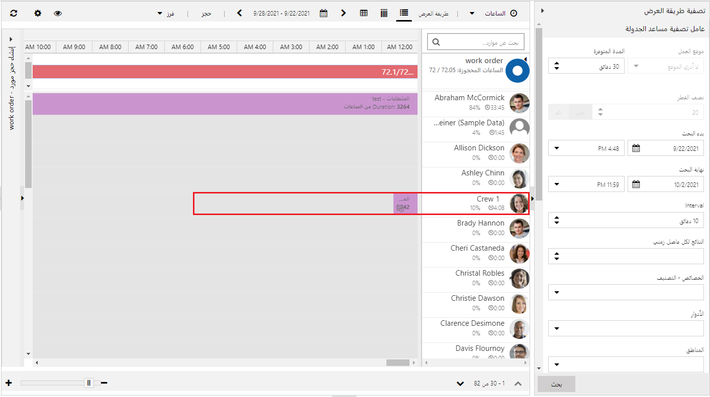
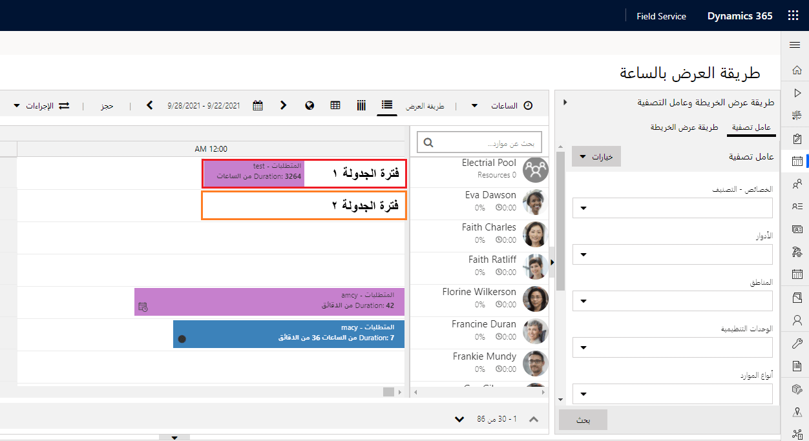
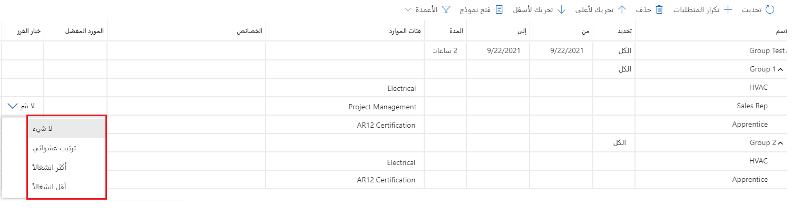

يمكن أن تتضمن احتياجات الجدولة للمؤسسات التي تنفذ Dynamics 365 for Field Service والحل العالمي لجدولة الموارد Universal Resource Scheduling ‏(URS) العديد من الظروف والسيناريوهات التي التأثير على ماذا وكيف يتم جدولة الوظائف باستخدام التطبيق. قد تقوم بعض المؤسسات فقط بجدولة الموارد الفردية للعمل في وظائف فردية، مثل إرسال أخصائي رعاية صحية منزلية إلى منزل العميل. بينما قد تحتاج المنظمات الأخرى إلى جدولة المرافق، مثل الأماكن التي تؤجر غرفاً للمناسبات مثل المؤتمرات أو حفلات الزفاف.

فيما يلي بعض الأمثلة لسيناريوهات الجدولة المختلفة التي يمكن أن تكون URS مفيدة لها:

-   متجر ميكانيكي سيارات يريد جدولة أماكن الخدمة.
-   خدمة تنظيف ترسل أطقم العمل إلى وظائف تنظيف مختلفة.
-   مركز إرسال مركزي، يقوم بحجز المواعيد مسبقاً في مناطق معينة حتى يتمكن المرسل الإقليمي من القدوم وتوفير الموارد الفعلية التي سيتم جدولتها.
-   تحتاج الشركة التي تقدم جراحة الليزك إلى حجز طبيب وممرضة وغرفة عمليات للإجراءات.

بالإضافة إلى توفير القدرة على جدولة مورد واحد مثل فني لعنصر مثل أمر العمل، يوفر URS إمكانات إضافية تحتاجها المؤسسات، مثل القدرة على جدولة موارد متعددة أو توفير عناصر نائبة للجدول أو جدولة المباني. السيناريوهات مدعومة بالميزات التالية:

- جدولة المنشآت
- جدولة الطواقم
- مجموعات الموارد
- جدولة الموارد المتعددة مع مجموعات المتطلبات

>[!VIDEO https://www.microsoft.com/videoplayer/embed/RE2Keww]

## جدولة المنشآت

تمثل موارد المنشأة المواقع المادية حيث يمكن تنفيذ العمل. في الإصدارات السابقة، كان من الممكن فقط جدولة العمل في موقع العميل. تم تقديم نوع مورد جديد يسمى "منشأة" يمكن الاستفادة منه لجدولة العمل الذي سيتم تنفيذه في موقع آخر.

يمكن استخدام المرافق في أي عدد من السيناريوهات بما في ذلك:

- لجدولة الأحداث والغرف في صناعة الضيافة.
- لحجز غرف في مركز للياقة البدنية لفصل تمارين.
- لحجز مكان في ورشة ميكانيكي.
- لحجز قارب.

## جدولة الطواقم

الأطقم هي نوع من الموارد يتم استخدامه لتمثيل مجموعة محددة مسبقاً من الأشخاص تمت جدولتهم معاً. على سبيل المثال، قد تستخدم شركة الكابلات أطقماً لتمثيل مجموعة من الفنيين المعتادين على تقديم الخدمات لمناطق جديدة. قد يستخدمونها لتمثيل كل طاقم يقوم بحفر الخنادق وتشغيل الكابلات ودفن الكابلات بعد التثبيت. تظهر الأطقم على لوحة الجدولة مثل أي مورد آخر، ولكن عندما يتم جدولة الطاقم لوظيفة ما، يتم أيضاً جدولة كل فرد من أفراد الطاقم للوظيفة أيضاً.

## مجموعات الموارد

تمكّن مجموعات الموارد المجدولين من حجز المتطلبات إلى تجمع عام دون الحاجة إلى تحديد المورد الذي سينفذ العمل. على سبيل المثال، قد يستخدم مرسل مركزي مجموعات لتمثيل موارد التثبيت في المناطق المختلفة التي يدعمونها. عندما يحتاجون إلى جدولة مورد، يمكنهم تحديد مجموعة الموارد. يمكن للمرسل المحلي العودة لاحقاً وتحديد مورد معين من المجموعة لجدولة الوظيفة.

## جدولة الموارد المتعددة مع مجموعات المتطلبات

تمثل كل من مجموعات الطاقم ومجمعات الموارد سيناريوهات يتم فيها تحديد الأعضاء مسبقاً. هناك العديد من السيناريوهات المختلفة التي تتطلب موارد متعددة، لكننا غير متأكدين من أي منها. على سبيل المثال، قد يكون لدى الشركة التي تقدم خدمات طبية غرف يتم فيها تقديم هذه الخدمات. عندما يأتي المريض للاستشارة، قد يتطلب الموعد غرفة معينة وطبيباً واستشارياً.

توفر مجموعات المتطلبات القدرة على تجميع متطلبات متعددة، مثل متطلبات المنشأة ومورد المستخدم معاً. سيتم إرجاع الموارد التي تناسب تلك الاحتياجات المحددة، وعند جدولتها، ستقوم مجموعة المتطلبات بتحديث كل متطلب فردي مرتبط بها.

بالإضافة إلى توفير القدرة على العمل مع موارد متعددة، يوفر URS أيضاً خيارات إضافية لضمان أن النوافذ الزمنية التي يقترحها مساعد الجدولة تجعلها سهلة قدر الإمكان على المرسل لاستخدامها. تفضيلات الاستيفاء هي كيانات قابلة للتخصيص تتيح لك اختيار كيفية عرض نتائج مساعد الجدولة، مثل المواعيد بالساعة أو نوافذ أوقات الصباح وبعد الظهر.

على سبيل المثال، قد يرغب صالون تصفيف الشعر في تحديد مواعيد كل ساعة لأن الفواصل الزمنية كل ساعة هي تقدير جيد لوقت عملهم، وهو في الغالب متسق ويمكن التنبؤ به. من الأسهل أيضاً توصيل المواعيد لمدة ساعة للعملاء عند الجدولة.

هناك طريقة أخرى يمكن من خلالها الاستفادة من تفضيلات التنفيذ وهي أن شركة التدفئة والتبريد تريد تجميع منشآت تكييف الهواء. قد يرغبون في قصر النوافذ على الصباح (8:00 صباحاً إلى 12:00 مساءً) وبعد الظهر (1:00 مساءً إلى 5:00 مساءً)، مع استراحة لمدة ساعة لتناول طعام الغداء بينهما. نظراً لأن التركيبات تعتمد على العديد من المتغيرات، فإن المجدولين ليسوا مرتاحين للالتزام بالوقت المحدد ؛ يفضلون التواصل مع العملاء في نطاق وقت الصباح أو بعد الظهر عند وصول موارد التثبيت لبدء العمل.
