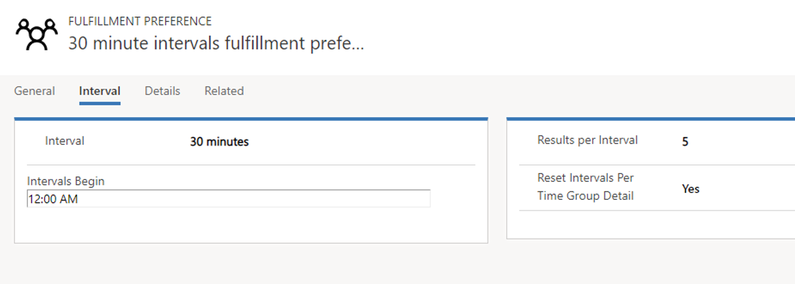
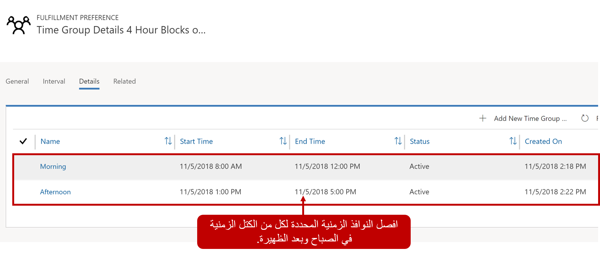
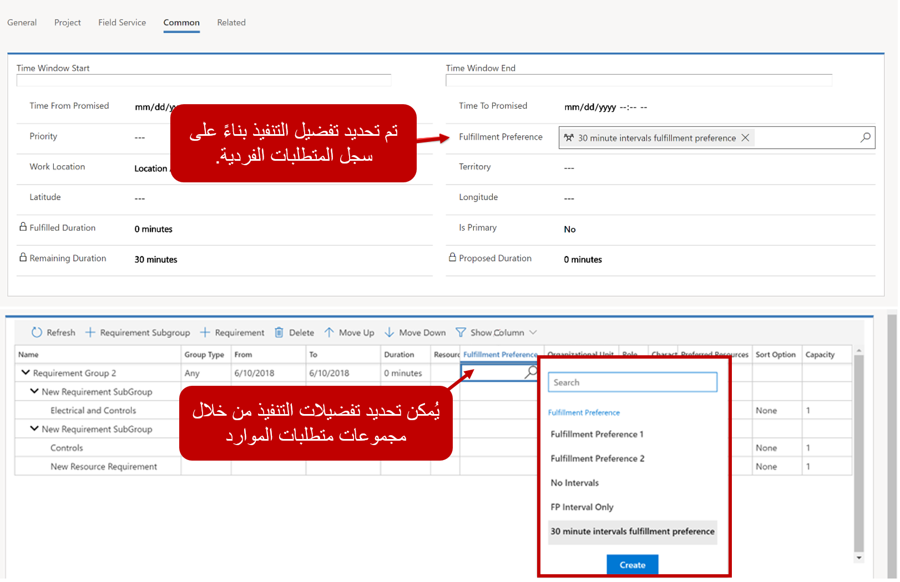
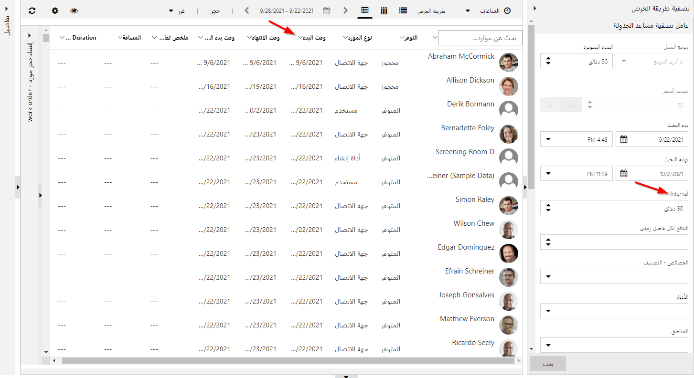
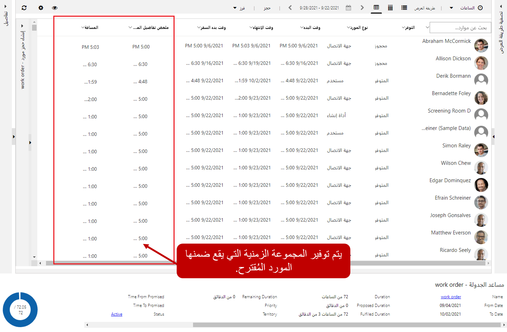
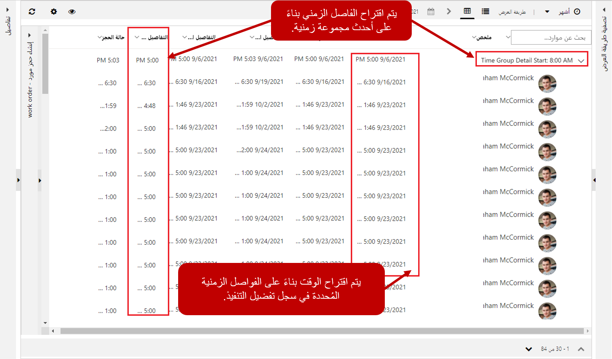

عندما يعرض مساعد الجدولة النتائج، فإنها تعتمد بالكامل على جداول الموارد وأقرب وقت متاح لها. على سبيل المثال، قد يحدد مساعد الجدولة أن أقرب وقت سيكون فيه المورد متاحاً هو 10:41 صباحاً. قد تجعل جدولة شخص ما للعمل لإجراء مكالمة في الساعة 10:41 من الصعب جدولة مواعيد أخرى حولها. قد تفضل إحدى المؤسسات أن يتم اقتراح الأوقات بفواصل زمنية مدتها ساعة واحدة، لذلك بدلاً من 10:41، سيكون هذا المورد متاحاً بدءًا من الساعة 11:00 صباحاً.

هناك اعتبار آخر وهو عندما لا تقوم المنظمات بجدولة الفنيين خلال أوقات محددة من اليوم. على سبيل المثال، قد تختار إحدى المؤسسات عدم جدولة الفنيين من الساعة 12:00 مساءً إلى 1:00 مساءً. لا يمثل هذا وقت الغداء للموارد فحسب، بل يمكن أن يعمل أيضاً كمخزن مؤقت للسماح للفنيين بتعويض الوقت إذا كانوا يركضون وراءهم. هذه الخيارات تجعل من السهل على المجدول عرض وفهم والتواصل مع العميل.

لتقديم هذه الخيارات، توفر Universal Resource Scheduling ما يسمى تفضيلات التنفيذ. تفضيلات الاستيفاء هي كيانات قابلة للتخصيص تتيح لك اختيار كيفية عرض نتائج مساعد الجدولة، مثل المواعيد بالساعة أو نوافذ أوقات الصباح وبعد الظهر.

تنقسم تفضيلات التنفيذ إلى ميزتين:

-   **الفواصل الزمنية:** تعرض الفواصل الزمنية نتائج مساعد الجدولة على فترات زمنية تحدد وقت بدء الحجوزات اللاحقة.
-   **مجموعات الوقت:** تسمح المجموعات الزمنية‬ للمجدولين بالبحث في النتائج وعرضها على شكل كتل زمنية عند استخدام مساعد الجدولة. قد تشمل الأمثلة النموذجية فترات الصباح، وبعد الظهر، والليل، والنوافذ التي تعمل بساعتين.

تفضيلات التنفيذ مرتبطة بسجلات المتطلبات. عندما يتم تنفيذ مساعد الجدولة وفقاً للمتطلبات، فإنه سيقترح الأصناف بناءً على تفضيلات التنفيذ المحددة. يتم تحديد تفضيلات التنفيذ بالانتقال إلى **Universal Resource Scheduling** \> **تفضيلات التنفيذ** وتحديد الزر الجديد.

## تحديد الفترات

يتم تحديد الفترات الزمنية لجدولة الفاصل الزمني في علامة التبويب الفاصل الزمني لسجل تفضيلات التنفيذ. هناك ثلاثة إعدادات رئيسية تم تحديدها لسجل الفاصل الزمني.

-   **الفاصل الزمني:** يحدد المدة بين الفترات الزمنية المتاحة، مثل 30 دقيقة و45 دقيقة وساعة واحدة وساعتين.
-   **الفواصل الزمنية تبدأ:** تحدد وقت بدء حساب الفاصل الزمني.
-   **نتائج واحدة لكل فترة:** تحدد عدد الخيارات التي سيتلقاها المجدول لكل فترة زمنية. إذا ترك هذا الخيار فارغاً، فسيحدد النظام 1 بشكل افتراضي.

في الصورة أعلاه، الفاصل الزمني هو 30 دقيقة مع فترات تبدأ في الساعة 12:00 صباحاً. يشير هذا إلى أن الخيارات المتاحة لعرض النتائج هي 12:00 صباحاً و12:30 صباحاً و1:00 صباحاً وما إلى ذلك. ومع ذلك، فإن النتائج تعتمد على توافر الموارد وساعات العمل.

-   إذا تُرك حقل "الفواصل الزمنية" فارغاً، فسيبدأ الفاصل الزمني في وقت الحجز.
    -   على سبيل المثال، إذا كان الفاصل الزمني 30 دقيقة وكان الخيار "بدء الفاصل الزمني" فارغاً، فعندما تحاول حجز الساعة 11:13 صباحاً، ستكون خيارات أجزاء الوقت 11:13 صباحاً و11:43 صباحاً و12:13 مساءً، وغيرها.

سيعمل هذا جنباً إلى جنب مع النتائج لكل إعداد فاصل زمني. إذا كان لدى إحدى المؤسسات 50 مورداً متاحاً جميعاً في الساعة 9:30 صباحاً، وتم تعيين النتائج لكل فترة زمنية على 50، فستظهر جميع الموارد. إذا تم تعيين النتائج لكل حقل فترة على 5، فسيتم عرض أفضل 5 نتائج فقط.

## تحديد المجموعات الزمنية

بخلاف الفترات الزمنية، فإن المجموعات الزمنية لا تفرض وقت بدء الحجوزات اللاحقة. تنظم مجموعات الزمنية النتائج ولكنها تترك وقت البدء/وقت الوصول كما هو\'بناءً على جدول المورد المحدد. لا يمكن تحديد تفاصيل مجموعة الوقت حتى يتم حفظ سجل تفضيل التنفيذ لأول مرة. بمجرد الحفظ، يتم تحديد مجموعات الأوقات من علامة تبويب التفاصيل عن طريق النقر فوق الزر إضافة مجموعة الوقت في الشبكة الفرعية لمجموعات الوقت.

عند تحديد مجموعة زمنية، ستحتاج إلى توفير:

-   **الاسم:** اسم وصفي للمجموعة مثل الصباح أو بعد الظهر أو المساء.
-   **وقت البدء:** يحدد المرة الأولى التي يمكن فيها جدولة الحجز خلال الفترة الزمنية.
-   **وقت الانتهاء:** يحدد آخر مرة يمكن فيها جدولة حجز خلال الفترة الزمنية.

>[!Important]
>يحدد وقت الانتهاء آخر مرة يمكن أن يبدأ فيها الموعد داخل الإطار. على سبيل المثال، إذا كان الإطار الزمني من 8:00 صباحاً إلى 12:00 مساءً. من الممكن أن يتم حجز الصنف له مدة في الساعة 11:30 صباحاً أو 12:00 ظهراً على الرغم من أنه في كلتا الحالتين، سيكون وقت الانتهاء خارج الإطار الزمني. 

تُظهر الصورة أدناه مثالاً نموذجياً حيث يتم تحديد الإطارات الزمنية في الصباح وبعد الظهر. يتبقى فجوة ساعة بين الساعة 12:00 والساعة 1:00 ظهراً.

## الاقتران بالمتطلبات

لكي يتم أخذ تفضيلات التنفيذ في الاعتبار لأحد المتطلبات، يجب عليك التأكد من إرفاقها بسجل المتطلبات. يمكن القيام بذلك بعدة طرق بناءً على ما تقوم بجدولته.

على سبيل المثال، إذا كنت تقوم بجدولة أمر عمل، فيمكن تحديد تفضيلات التنفيذ في قسم التفضيلات في علامة تبويب الإعدادات. عند حفظ أمر العمل، ستتم إضافة التفضيلات تلقائياً إلى سجل المتطلبات المرتبط بأمر العمل.

يمكن أيضاً إضافة تفضيلات التنفيذ إلى سجل مجموعة المتطلبات أو المتطلبات يدوياً أو يمكن ملؤها باستخدام سير عمل أو سيناريو أتمتة آخر.

## حجز المتطلبات مع مساعد الجدولة

عندما تعمل مع سجل متطلبات به فترات زمنية محددة، سيتم تحميل الفواصل الزمنية/مجموعات الوقت المحددة في تفضيل التنفيذ عند تحديد زر الحجز. سيؤدي هذا إلى تشغيل مساعد الجدولة.

- **الفواصل الزمنية:** يقدم الخيارات المتاحة بناءً على شاشة الفاصل الزمني المحددة. على سبيل المثال، الصورة أدناه تستخدم الجدول الزمني 30 دقيقة الذي حددناه.

- **مجموعات الوقت:** ستستند النتائج المعروضة إلى إعداد مجموعة الوقت المحددة في التقويم. توضح الصورة أدناه كيفية تدوين الموارد بناءً على مجموعة الوقت وعرضها.

## استخدام الفواصل الزمنية ومجموعات الوقت معاً

في بعض الأحيان، قد ترغب في استخدام مجموعة من الفواصل الزمنية ومجموعات الوقت معاً. من الممكن تحديد تفضيل التنفيذ الذي يستخدم كلاً من الفواصل الزمنية والمجموعات الزمنية، ومع ذلك، هناك بعض الاختلافات الرئيسية التي يجب مراعاتها عند استخدام كليهما.

-   لا يمكنك إضافة قيمة للفاصل الزمني يبدأ. سيبدأ الفاصل الزمني في وقت أقرب مجموعة زمنية.
-   إذا تم تعيين الخيار إعادة تعيين الفواصل الزمنية لكل تفاصيل المجموعة الزمنية‬ إلى نعم، فسيُعاد تعيين الفواصل الزمنية عندما تتداخل تفاصيل مجموعة زمنية جديدة مع فاصل زمني.

### ضع في الاعتبار السيناريو التالي

تقدم شركة تقليدية مواعيد لعملائها كل 90 دقيقة، وبالتالي تم تعيين الفواصل الزمنية إلى 90 دقيقة. بالإضافة إلى ذلك، تم فصلها إلى مجموعات زمنية للصباح وأخرى لبعد الظهر من 8:00 ص إلى 12:00 ظهرًا و 1:00 بعد الظهر إلى 5:00 مساء، مع استراحة غداء من ساعة واحدة بينهما. وبالتالي، فإن الفواصل الزمنية والمجموعات الزمنية تعتبر مفيدة لهذه الشركة.

-   إعادة تعيين الفاصل الزمني حسب تفاصيل المجموعة الزمنية = لا، ستكون المواعيد: 8:00 صباحاً، 9:30 صباحاً، 11:00 صباحاً (وليس 12:30 مساءً لأن هذا محظور لتناول طعام الغداء)، 2:00 مساءً، و3:30 مساءً.
-   إعادة تعيين الفاصل الزمني حسب تفاصيل المجموعة الزمنية = نعم، ستكون المواعيد: 8:00 صباحاً، 9:30 صباحاً، 11:00 صباحاً، (وليس 12:30 مساءً لأن هذا محظور لتناول طعام الغداء)، 1:00 مساءً (إعادة التعيين لتفاصيل المجموعة في المرة القادمة)، 2:30 مساءً، و4:00 مساءً.

لمزيد من المعلومات حول تفضيلات التنفيذ، راجع [تفضيلات التنفيذ](/dynamics365/customer-engagement/common-scheduler/fulfillment-preferences).
