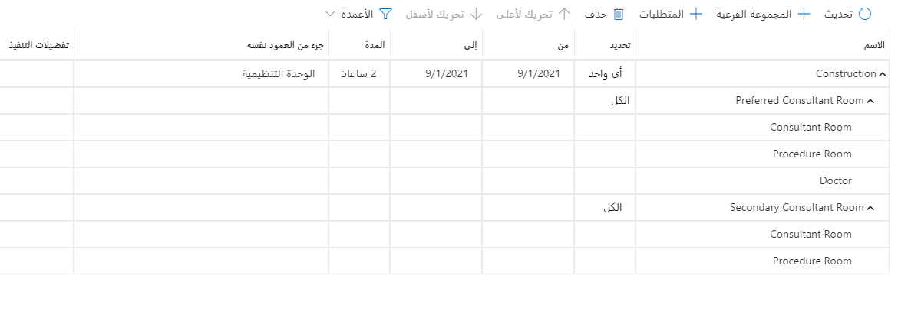
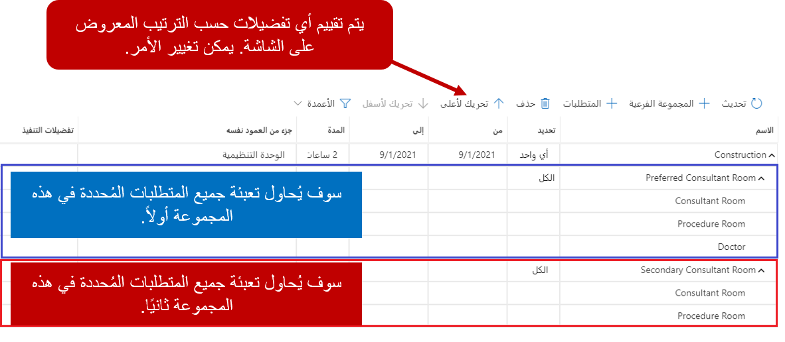
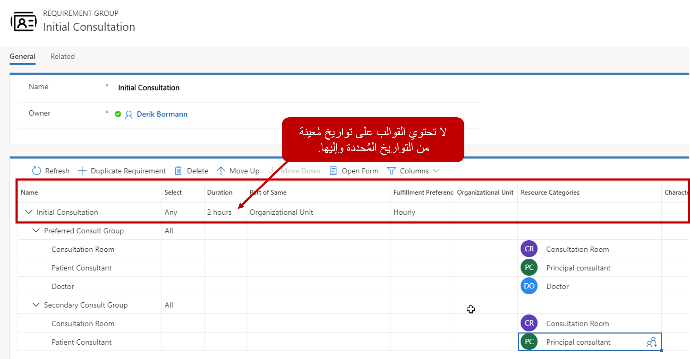
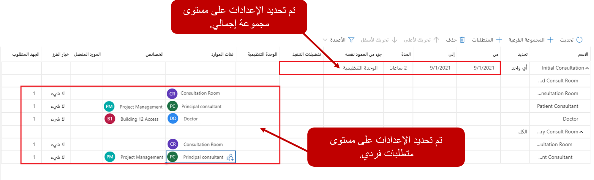

عادةً، عند إنشاء سجل ممكّن للجدولة مثل أمر العمل، يتم أيضاً إنشاء سجل متطلبات مورد مطابق. تحدد متطلبات المورد التفاصيل المتعلقة بالمورد المطلوب لجدولة العنصر.

على سبيل المثال، عند إنشاء أمر عمل، قد يتضمن سجل متطلبات المورد ما يلي:

-   نوافذ التاريخ التي يفضلها العميل أو التي وعد بها.
-   المنطقة التي ينتمي إليها العميل.
-   أي مهارات و/أو شهادات يجب أن يمتلكها المورد للعمل على أمر العمل.
-   أي موارد مفضلة لدى العميل.

بينما يقوم سجل متطلبات الموارد بعمل رائع في توصيل الاحتياجات المحددة لمورد واحد. في كثير من الأحيان، سوف تتطلب المنظمات موارد متعددة لإكمال وظيفة أو موعد معين. على سبيل المثال، قد يحتوي مركز خدمة السيارات على العديد من أماكن الخدمة والعديد من الفنيين. قد يكون لكل فني خدمة مهارات محددة. عندما يرغب العميل في حجز موعد خدمة، يحتاج المرسل إلى التأكد من توفر حجرة خدمة لديه، واعتماداً على الوظيفة، هناك فني مؤهل واحد على الأقل لإكمال الموعد.

لتحقيق ذلك، سنحتاج إلى أكثر من سجل واحد لمتطلبات الموارد. سنحتاج إلى اثنين على الأقل:

-   متطلب لمكان الخدمة.
-   متطلب لكل فني.

## مجموعة المتطلبات

تقوم مجموعة متطلبات الموارد بإنشاء وتجميع متطلبات متعددة معاً للجدولة. يتيح ذلك للمرسلين جدولة فريق كامل من الموارد لأمر عمل واحد. على سبيل المثال، في السيناريو المذكور سابقاً، سيتم إنشاء مجموعة متطلبات تتضمن متطلبات لكل فني وحجرة خدمة مطلوبة. عندما يتم إنشاء مجموعة موارد، يمكن إضافة المتطلبات مباشرة إلى المجموعة، أو يمكن تحديد المجموعات الفرعية لتوفير مرونة إضافية.

على سبيل المثال، تم إنشاء مجموعة موارد للاستشارات. تحتوي على مجموعتين فرعيتين:

-   المجموعة المفضلة
    -   غرفة استشارات
    -   مستشار الإجراء
    -   الطبيب
-   المجموعة الثانوية
    -   غرفة استشارات
    -   مستشار الإجراء
   

عند إنشاء مجموعة متطلبات، من الممكن تحديد ما إذا كان يلزم الوفاء بجميع المتطلبات أو ما إذا كان يلزم الوفاء ببعضها فقط. يمكن تحقيق ذلك باستخدام عمود التحديد. يحتوي عمود التحديد على خيارين:

-   **الكل:** تحديد أن كل متطلب محدد يجب الوفاء به.
-   **أي:** تحديد أن واحداً فقط من المتطلبات المحددة يجب الوفاء به.

على سبيل المثال، يمكننا أن نرى في الصورة أنه تم اختيار أي منها لخدمة الاستشارة. يشير هذا إلى أننا نحتاج فقط إلى ملء إما مجموعة الاستشارات المفضلة أو متطلبات المجموعة الاستشارية الثانوية ولكن ليس كليهما. لقد حددنا أيضاً أنه بالنسبة لكل مجموعة فرعية، سنحتاج إلى تلبية جميع متطلبات الموارد. الاعتبار الأخير هو الترتيب الذي تظهر به المجموعات الفرعية والمتطلبات. نظراً لأن المجموعة الاستشارية قد تم تعيينها على أي مجموعة، وتم إدراج مجموعة الاستشارات المفضلة أولاً، فهذا هو المطلب الذي ستحاول ملؤه أولاً. إذا لم تستطع تلبية المتطلبات، فسوف تنتقل إلى المجموعة الاستشارية الثانوية، والتي لا تتضمن متطلبات الطبيب.

توفر الشبكة الفرعية العديد من الخيارات للمساعدة في إنشاء المتطلبات الفردية. يتضمن ذلك تكرار المتطلبات وحذف المتطلبات وحتى القدرة على تحرير المجموعات والمجموعات الفرعية والمتطلبات المضمنة مباشرةً على الشبكة. يمكن تحديد بعض الإعدادات المتاحة التي يمكن تحريرها على الشبكة على مستوى المجموعة، ويمكن تحديد بعض الإعدادات على مستوى المتطلبات الفردية.

على سبيل المثال، يتم تحديد عناصر مجموعة المتطلبات مثل:

-   **من و إلى النوافذ:** تحديد التواريخ التي ينطبق عليها سجل مجموعة المتطلبات. تتم إضافة التواريخ تلقائياً إلى أي سجلات متطلبات تم إنشاؤها للمجموعة.
-   **المدة**: تحديد المدة التي يجب أن يستغرقها الموعد. مثل التواريخ، تتم إضافة المدة تلقائياً إلى أي سجلات متطلبات تم إنشاؤها للمجموعة.
-   **جزء من نفس الشي:** السماح لك بتحديد ما إذا كانت الموارد يجب أن تنتمي إلى نفس الوحدة التنظيمية أو شجرة الموارد أو الموقع.
-   **تفضيلات التنفيذ**: تحديد ما إذا كان هناك أي تفضيلات تنفيذ يجب استخدامها عند اقتراح الموارد.

يتم تحديد أي معايير تصفية أخرى في سجلات المتطلبات الفردية نفسها. يتضمن ذلك تحديد عناصر مثل الخصائص أو الفئات أو مستوى الموارد المفضلة. يمكن تعديل بعض المعايير مباشرة على الشبكة الفرعية للمتطلبات. يمكن فتح كل سجل متطلبات، ويمكن تحديد المعايير باستخدام نموذج المتطلبات.

العناصر الإضافية التي يجب مراعاتها على مستوى المتطلبات هي:

-   **خيار الفرز:** تحديد كيفية تقديم الموارد في نتائج البحث. هناك أربعة خيارات للاختيار من بينها:
    -   **بلا:** عدم القيام بأي فرز.
    -   **عشوائي:** تقديم مورد متاح بشكل عشوائي.
    -   **الأكثر انشغالاً:** تقديم المورد المتاح الذي يحتوي على أكبر عدد من الحجوزات.
    -   **الأقل انشغالاً:** تقديم المورد المتاح الذي يحتوي على أقل عدد من الحجوزات.

-   **الجهد المطلوب**: تحديد عدد الموارد المطلوبة لهذا النوع.

## قوالب مجموعات المتطلبات

كما ترى من المثال السابق، يمكن أن تحتوي مجموعة الموارد على بعض السيناريوهات المعقدة التي يمكن أن تؤثر على كيفية جدولتها. يجب إنشاء مجموعة موارد تلبي العناصر التي حددناها في مجموعة الاستشارات في كل مرة تحتاج فيها إلى جدولة استشارة. سيكون توقعاً غير معقول أن نفترض أن المرسل سيقوم بذلك في كل مرة يتم فيها إنشاء استشارة.

هذا هو المكان الذي يأتي فيه قالب مجموعة المتطلبات. يتيح لنا القالب تحديد العناصر المطلوبة لمجموعة المتطلبات. عند الحاجة إلى إنشاء مجموعة متطلبات الموارد، سنستخدم القالب لإنشاء المجموعة. هذا من شأنه أن يضمن وجود جميع المتطلبات المحددة.

على سبيل المثال، عند إنشاء أمر عمل، يمكنك تحديد نوع حادثة لأمر العمل. يحدد نوع الحادث أي منتجات أو خدمات أو مهام أو شهادات وما إلى ذلك يجب إضافتها إلى أي أمر عمل يستخدم هذا النوع من الحوادث. عند إنشاء نوع حادثة، يمكن ربط قالب مجموعة المتطلبات بنوع الحادث كعنصر ذي صلة. عند إنشاء أمر عمل يستخدم نوع الحادث هذا، سيتم إنشاء مجموعة متطلبات تلقائياً استناداً إلى نوع الحادث.
