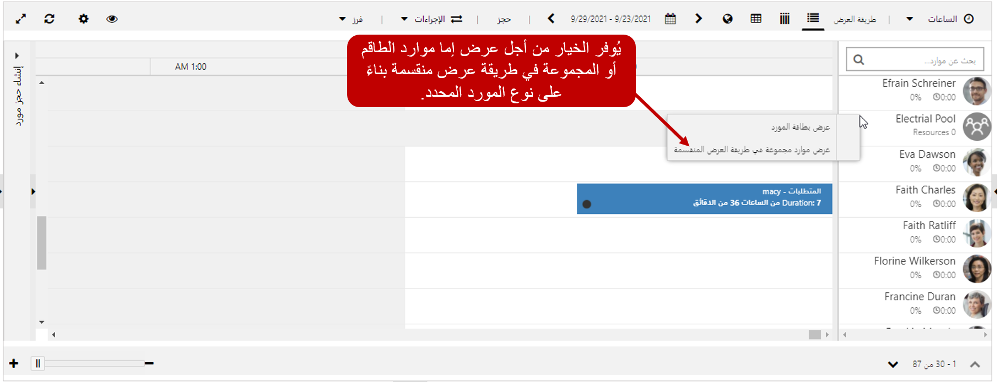
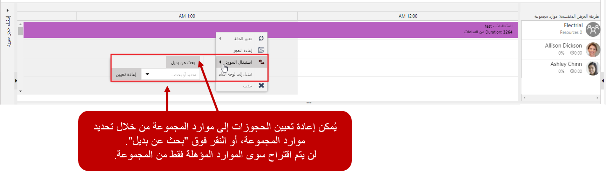
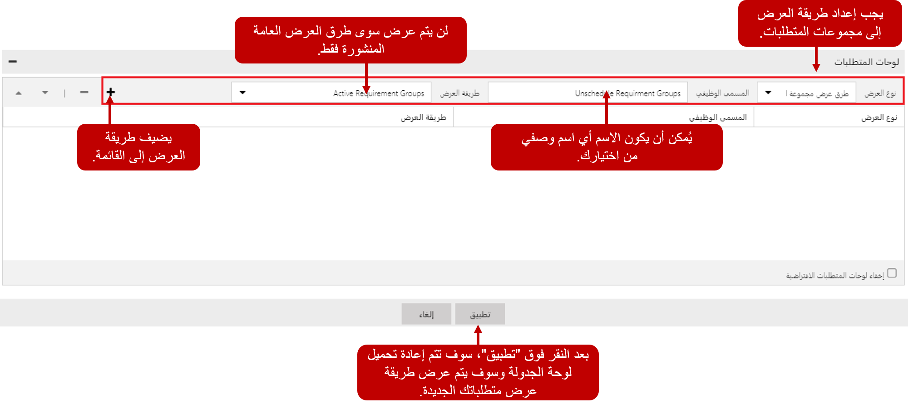

وتوفر Universal Resource Scheduling الآن القدرة على معالجة سيناريوهات الجدولة المختلفة حيث قد يلزم جدولة موارد متعددة. تم إجراء بعض التحسينات على لوحة الجدولة للمساعدة في عملية الجدولة.

## ‏‫طريقة العرض المنقسمة

عند العمل مع مجموعات الموارد وأطقمها، فإنه من الأسهل غالباً جدولة الأصناف واتخاذ القرارات إذا كنت تعرف الموارد الفعلية الموجودة في تلك الأطقم والمجموعات. للمساعدة في هذه العملية، تحتوي لوحة الجدولة على خيار جديد لعرض الموارد المقترنة بمجموعة أو طاقم في طريقة العرض المنقسمة. يمكن الوصول إلى طريقة العرض المنقسمة عن طريق النقر بزر الماوس الأيمن على مجموعة الموارد أو الطاقم، وتحديد عرض موارد المجموعة/الطاقم في طريقة العرض المنقسمة.

## العمل مع مجموعات الموارد

عند فتح مجموعة موارد في طريقة العرض المنقسمة، سيتم عرض المورد الفردي في المجموعة في الجزء السفلي. ونظراً لاستخدام مجموعة الموارد كعنصر نائب للصنف المجدول، سيظهر كصنف مجدول للمجموعة. بمجرد تحديد المورد الذي تريد نقل الحجز إليه، يمكنك النقر بزر الماوس الأيمن على الحجز وتحديد مورد بديل. إذا كان بإمكانك الاطلاع على لوحة الجدولة التي يتوفر فيها مجموعة الموارد، فيمكنك تحديد المورد يدوياً. إذا حددت البحث عن بديل، فسيفتح مساعد الجدولة ويعرض فقط أعضاء مجموعة الموارد التي تتطابق مع المهارة/الخصائص المحددة في المورد.

> [!VIDEO https://www.microsoft.com/videoplayer/embed/RE2KmlC]

## العمل مع جدولة الطاقم

عند فتح طاقم في طريقة العرض المنقسمة، سيتم عرض الموارد الفردية في المجموعة في الجزء السفلي كما هو الحال في مجموعات الموارد. يتمثل الاختلاف الرئيسي مع الأطقم في أنه عند جدولة سجل الطاقم، لا يتم إنشاء سجل حجز للطاقم فحسب، بل يتم إنشاء سجل حجز لكل عضو وجدولته أيضاً. في حالة ضرورة نقل الحجز أو إعادة تعيينه أو حذفه، يجب القيام بذلك على مستوى الطاقم. سيضمن ذلك أن التغييرات ستؤدي إلى تدفق جميع الموارد المحددة في الطاقم.

> [!VIDEO https://www.microsoft.com/videoplayer/embed/RE2Kmlx]

## جدولة مجموعة المتطلبات

ونظراً لأن مجموعات المتطلبات هي كيان منفصل عن المتطلبات، فيجب جدولتها بشكل منفصل. عند جدولة إحدى مجموعات المتطلبات، سيتم أيضاً جدولة أية متطلبات محددة في المجموعة.

وبشكل افتراضي، لم يتم تكوين لوحة المتطلبات في لوحة الجدولة لعرض مجموعات المتطلبات. إذا كانت المؤسسة بحاجة إلى جدولة مجموعات المتطلبات، فستحتاج إلى إضافة أية طرق عرض ضرورية للمتطلبات إلى لوحة المتطلبات. ويتطلب ذلك خطوتين لإضافة مجموعات المتطلبات إلى اللوحة.

-   قم بإنشاء طريقة العرض اللازمة وتحديدها على كيان مجموعات المتطلبات.
-   قم بإضافة عرض كيان مجموعة المتطلبات إلى لوحة المتطلبات في طريقة العرض.

يمكن تعديل طرق عرض كيان مجموعة المتطلبات بالانتقال إلى **الإعدادات**\> **التخصيصات** \> **تخصيص النظام**. بعد توسيع كيان مجموعة المتطلبات، يمكنك تحرير طرق العرض الضرورية التي ترغب في استخدامها أو إنشائها.

بمجرد أن تصبح طرق العرض جاهزة، يجب إضافة عروض مجموعة متطلبات الموارد إلى لوحة المتطلبات. يتم ذلك عن طريق تحديد زر إعدادات علامة التبويب لعلامة تبويب لوحة الجدولة التي تريد تعديلها.

في لوحة المتطلبات، ستحتاج إلى تبديل طريقة العرض إلى عرض طرق عرض مجموعة المتطلبات. عندما يتم عرض طرق عرض مجموعة المتطلبات، حدد طريقة العرض التي تريد استخدامها وقم بإعطاء اسم لها. يمكن استخدام طرق العرض العامة المنشورة فقط في لوحة المتطلبات. بعد النقر على زر إضافة وتطبيق طريقة عرض مجموعة المتطلبات الجديدة، سيتم عرضها في لوحة المتطلبات.

