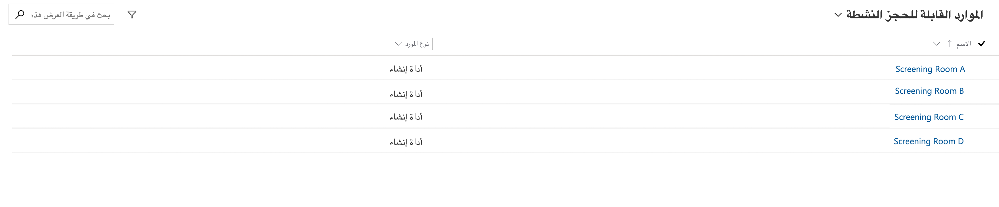
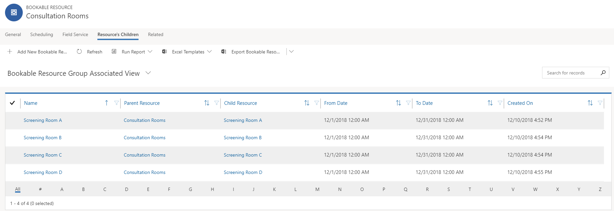
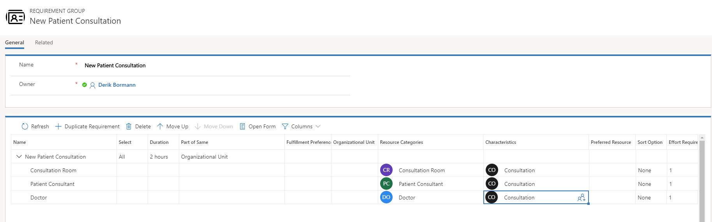

يقوم Universal Resource Scheduling بتمكين المؤسسة من جدولة أي شيء قد يكون مطلوباً لخدمة عملائهم بشكل أفضل. قد يتضمن ذلك أصناف مثل أوامر العمل في Dynamics 365 for Field Service.

الغرض من هذا التمرين العملي هو تعريفك بتكوين Universal Resource Scheduling.

### الأهداف التعليمية

في نهاية هذه التمارين، ستتمكن من تحقيق الأهداف التالية:

-   وظيفة التعيين الممكنة
-   تم تحديد ‏مورد قابل للحجز‬
-   جدولة العناصر باستخدام لوحة الجدولة
-   تمكين كيان طلب زمن التوقف الخاص بالجدولة

الوقت المقدر لإكمال هذا التمرين العملي: 60 إلى 75 دقيقة

تعمل المعامل والتمارين في هذه الوحدة بشكل أفضل عندما تتوفر لديك بعض البيانات النموذجية للعمل معها. اعتماداً على البيئة التي تعمل بها، فقد ترغب في تثبيت بعض البيانات النموذجية للمساعدة في التمارين. يوفر Dynamics 365 القدرة على إضافة بيانات نموذجية حسب الحاجة. إذا لم تتوفر لدى البيئة التي تعمل بها أي بيانات نموذجية مثبتة، فاتبع الخطوات التالية لتثبيت البيانات النموذجية في بيئتك.

>[!IMPORTANT] 
>البيانات التجريبية التي سنستفيد منها في هذا التمرين، هي مجموعة أصغر من البيانات التي ستساعد في توضيح مفاهيم التكوين المتوفرة في التطبيق. تتوفر المزيد من البيانات التجريبية الكاملة التي يمكن استخدامها لكل من Project Service Automation وField Service.

### تثبيت بيانات العرض التوضيحي لـ Field Service -- الخطوات التفصيلية

1. في Dynamics 365، حدد السهم لأسفل بجوار **Dynamics 365**، ثم حدد **Field Service**.
2. باستخدام خريطة الموقع، حدد علامة القطع (...)، وحدد **إعدادات Field Service**.
3. ضمن *إعدادات الجدول*، حدد **الخصائص**.
4. حدد **جديد**.
5. أدخل *MSCE* في حقل **الاسم**، وحدد **الشهادة** في حقل **الشهادة** **النوع**، ثم حدد **حفظ**.
6. حدد **جديد**.
7. أدخل *MCSA* في حقل **الاسم**، وحدد **الشهادة** في حقل **الأنواع**، ثم حدد **حفظ وإغلاق**.

### قم بتمكين خرائط Bing لاستخدامها مع Resource Scheduling. 

لضمان قدرتك على الاستفادة الكاملة من إمكانات الجدولة الكاملة والتخطيط المتاحة مع Universal Resource Scheduling، تحتاج إلى التأكد من تكوينه لاستخدام موفر التعيين. تعد خرائط Bing هي موفر الخريطة الافتراضي، ولكن يمكن تمكين الموفرين الإضافيين. سيتم استخدام خرائط Bing.

1.  في **Dynamics 365**، انقر فوق السهم بجوار نص **Dynamics 365**، ثم حدد **Universal Resource Scheduling**.
2.  انقر فوق رمز **خريطة الموقع** لتوسيع **التنقل**. من القائمة التي تظهر، حدد **إدارة**.
3.  حدد **معلمات الجدولة**.
4.  حدد موقع حقل **الاتصال بالخرائط**، وقم بتعيينه إلى **نعم**.

5.  **احفظ وأغلق** الإعدادات.

### إنشاء مورد قابل للحجز

قبل أن تتمكن من البدء في جدولة العناصر وتعيينها لموارد محددة في مؤسستك، تحتاج أولاً إلى إنشاء موارد قابلة للحجز في التطبيق. يمكن أن يكون المورد القابل للحجز مستخدماً داخلياً أو جهة اتصال خارجية أو حساباً أو قطعة من المعدات. عند تحديد مورد قابل للحجز، يمكنك أيضاً تقديم تفاصيل مثل المهارات التي يمتلكونها، وأين يبدأون يومهم وينتهون به وما إلى ذلك. في هذه المهمة الأولى، سننشئ سجل موارد قابل للحجز لحساب المستخدم الخاص بك.

1.  في **Dynamics 365**، انقر فوق السهم بجوار نص **Dynamics 365**، ثم حدد **Universal Resource Scheduling**.
2.  انقر فوق رمز **خريطة الموقع** لتوسيع **التنقل**. من القائمة التي تظهر، حدد **الموارد**.
3.  انقر فوق الزر **جديد** لإنشاء **مورد قابل للحجز**.
4.  قم بتكوين المورد على النحو التالي:
    -   **نوع المورد:** مستخدم
    -   **المستخدم:** سجل‏‎ المستخدم الخاص بك
    -   اترك القيمة الافتراضية في حقل المنطقة الزمنية.
5.  حدد علامة التبويب جدولة، وقم بالتكوين على النحو التالي:
    -   **الوحدة التنظيمية:** سياتل
    -   **موقع البدء:** عنوان الوحدة التنظيمية
    -   **موقع الانتهاء:** عنوان الوحدة التنظيمية
6.  حدد علامة التبويب خدمة ميدانية، وقم بالتكوين على النحو التالي:
    -   **المعدل بالساعة:** 175
7.  **احفظ** سجل المورد القابل للحجز، واتركه مفتوحاً.
8.  حدد موقع الشبكة الفرعية **الخصائص**، انقر فوق **إضافة خاصية مورد جديد قابل للحجز**
9.  قم بالتكوين على النحو التالي:
    -   **الخصائص:** الوصول إلى المبنى 12
    -   **قيمة التقييم**: ممتاز
10. يمكن إضافة المزيد من الخصائص للمورد إذا كان لديهم مهارات متعددة.
11. **احفظ وأغلق** سجل الخصائص.
12. **احفظ وأغلق** سجل المورد القابل للحجز.

### إنشاء ثلاث فئات موارد

قبل أن نبدأ في إنشاء مرافق الموارد والتجمعات ومجموعات المتطلبات التي سيتم استخدامها لدعم سيناريو الجدولة، علينا التأكد من أن لدينا مكونات الدعم الضرورية المحددة التي سيتم استخدامها للجدولة.

لتسهيل الأمر قدر الإمكان، سنضيف ثلاث فئات من الموارد يمكن استخدامها بسهولة لتحديد غرف الاستشارة والاستشاريين والمرضى والأطباء. 
1.  مع فتح تطبيق **Field Service‎**، حدد **علامة الحذف**، وحدد **إعدادات Field Service**.
2.  باستخدام **خريطة الموقع**، حدد **فئات الموارد** ضمن عنوان الجدولة.
3.  انقر فوق الزر **جديد** لإنشاء فئة موارد جديدة.
4.  أدخل **غرفة استشارة** في حقل الاسم وحدد **حفظ وإغلاق.**
5.  انقر فوق الزر **جديد** لإنشاء فئة موارد أخرى.
6.  أدخل **مستشار المريض** في حقل الاسم وحدد **حفظ وإغلاق.**
7.  انقر فوق الزر **جديد‏‎** لإنشاء آخر فئة مورد جديدة.
8.  أدخل **طبيب** في حقل الاسم وحدد **حفظ وإغلاق**.

### إنشاء خاصية الاستشارة

قد يكون بعض الأطباء قادرين على إجراء الاستشارات، والبعض الآخر قد لا. للتأكد من أنه يمكننا تحديد الأطباء القادرين على إجراء الاستشارات، سنضيف خاصية موارد جديدة تسمى الاستشارة. ستتم إضافة هذه الخاصية إلى أي مورد يمكن استخدامه في الاستشارة.

1.  أثناء تواجدك في **إعدادات Field Service**، انقر فوق **الخصائص.**
2.  انقر فوق الزر **جديد** لتعريف **الخاصية**.
3.  أدخل **استشارة** في حقل الاسم وقم **بالحفظ والإغلاق**.

### تكوين ساعات عمل المورد

أحد العوامل التي تقطع شوطاً طويلاً في ضمان أن جميع الموارد التي ستعمل معاً في المشاريع أو كجزء من مجموعة لها نفس ساعات العمل. يمكن تحديد ساعات العمل لما يصل إلى 25 مورداً في وقت واحد عن طريق إنشاء قالب ساعات العمل. يجب أن يستند قالب ساعات العمل إلى ساعات عمل مورد آخر.

سنبدأ بتحديد ساعات العمل لمورد واحد. سنستخدم هذا المورد لإنشاء نموذج ساعات العمل، وأخيراً سنقوم بتطبيق القالب على جميع مواردنا.

1.  أثناء تواجدك في **إعدادات Field Service**، انقر فوق **الموارد**.
2.  حدد موقع سجل المورد وقم بتحديده لـ **‎Bob Kozak**.
3.  في **شريط الأوامر** الأزرق بالأعلى، انقر فوق الزر **إظهار ساعات العمل**. (ملاحظة: قد تحتاج إلى السماح بالنوافذ المنبثقة إذا كنت تقوم بتشغيل مانع النوافذ المنبثقة).
4.  حدد الزر **إعداد**.
5.  من القائمة التي تظهر ، حدد خيار **الجدول ساعات العمل الأسبوعية الجديدة**.
6.  عندما يتم عرض الجدول الأسبوعي، انقر فوق الارتباط التشعبي **تعيين ساعات العمل** لتحرير ساعات العمل.
7.  تحقق من تعيين ساعات العمل إلى **8:00 صباحاً** إلى **5:00 مساءً**، ثم انقر فوق **موافق.**
8.  قم بإلغاء تحديد المربعين **السبت** وكذلك **الأحد**.
9.  انقر فوق **حفظ وإغلاق** لتطبيق جدولة العمل الجديدة.
10. تحقق من تطبيق الجدول الجديد للمضي قدماً **وأغلق** **نافذة ساعات العمل.**
11. باستخدام **خريطة الموقع**، انقر فوق **علامة الحذف...** وحدد  **جدولة الموارد**.
12. ضمن **جدولة المورد**، انقر فوق **قوالب ساعات العمل.**
13. انقر فوق الزر **جديد** لتحديد قالب جديد.
14. حدد القالب كما يلي: أ.  **الاسم:** *الساعات القياسية* ب.  **مورد القالب:** *Bob Kozak‎*
15. انقر فوق **حفظ وإغلاق.**
16. باستخدام **خريطة الموقع،** انقر فوق **علامة الحذف...** للعودة إلى **إعدادات Field Service**
17. تحديد **الموارد.**
18. قم بتمييز أول 25 مورداً مدرجاً في **الموارد النشطة القابلة للحجز** *(**هام:** تأكد من أن Bob Kozak ليس واحداً من الموارد المختارة)*. انقر فوق الزر **تعيين التقويم**.
19. في شاشة **قالب العمل**، حدد قالب **الساعات القياسية** الذي أنشأته ثم انقر فوق **تطبيق**.
20. كرر هذه العملية حتى يتم تطبيق **قالب الساعات القياسية** علي كافة الموارد في المؤسسة الخاصة بك. (تذكر أنه يمكنك فقط تطبيق قالب عمل على 25 مورداً في وقت واحد).
21. حدد كافة الموارد المدرجة في **الموارد النشطة القابلة للحجز** وانقر فوق الزر **تحرير**. في حقل المنطقة الزمنية، اضبط المنطقة الزمنية التي تريد استخدامها.

### إنشاء موارد أداة إنشاء لغرف الشاشة

الآن بعد أن قمنا بتكوين خيار الدعم، يمكننا الآن تكوين مواردنا لدعم الوظيفة التي نحتاجها. سنبدأ بتحديد غرف الاستشارات التي يمكن استخدامها كمصادر لأداة إنشاء.

1.  باستخدام **خريطة الموقع**، انتقل إلى **الموارد**.
2.  انقر فوق الزر **جديد** لإنشاء مورد جديد.
3.  قم بتكوين المورد على النحو التالي:
    -   **نوع المورد:** أداة إنشاء
    -   **الاسم:** غرفة العرض أ
4.  حدد علامة التبويب جدولة، وقم بتكوين إعدادات الجدولة على النحو التالي:
    -   **الوحدة التنظيمية:** سياتل
    -   **موقع البدء:** عنوان الوحدة التنظيمية
    -   **موقع الانتهاء:** عنوان الوحدة التنظيمية
5.  انقر فوق الزر **حفظ** لحفظ أداة الإنشاء وتركها مفتوحة.
6.  حدد موقع الشبكة الفرعية **خصائص المورد**، حدد زر المزيد من الأوامر، ويمكنك اختيار **إضافة خاصية المورد القابل للحجز.**
7.  قم بتكوين خاصية المورد القابل للحجز على النحو التالي:
    -   **خاصية:** استشارة

    -   **قيمة التقييم‬:** ممتاز
8.  انقر فوق **حفظ**
9.  حدد موقع الشبكة الفرعية **فئات الموارد**، حدد زر المزيد من الأوامر، ويمكنك اختيار **إضافة** **فئة الموارد القابلة للحجز**.
10. حدد غرفة الاستشارة **لفئة المورد.**
11. انقر فوق **حفظ وإغلاق**.
12. كرر الخطوات من 2 إلى 12 لتحديد التسهيلات التالية:
    1. غرفة العرض ب
    1. غرفة العرض ج
    1. غرفة العرض د

### إنشاء تجمع موارد أداة إنشاء

هناك أوقات يرغب فيها المجدول فقط في ملاحظة أن غرفة الفرز مطلوبة حتى يتمكنوا من تحديد الغرفة المحددة التي يريدون استخدامها حيث يتم تسجيل المزيد من التفاصيل حول الاستشارة. أسهل طريقة لتحقيق ذلك، هي باستخدام "تجمع الموارد". سننشئ تجمع موارد يحتوي على جميع موارد المنشأة التي أنشأناها للتو.

1.  إذا لزم الأمر، انتقل إلى الموارد وانقر فوق الزر جديد لإنشاء مورد جديد قابل للحجز.
2.  حدد المورد الجديد على النحو التالي:
    -   **نوع المورد:** تجمع
    -   **نوع التجمع:** أداة إنشاء
    -   **الاسم:** غرف استشارة
    -   **المنطقة الزمنية:** تعيين علي نفس الموارد الأخرى
3.  حدد علامة التبويب جدولة، وقم بتكوين خيارات الجدولة كما هو موضح أدناه:
    -   **الوحدة التنظيمية:** سياتل
    -   **موقع البدء:** عنوان الوحدة التنظيمية
    -   **موقع الانتهاء:** عنوان الوحدة التنظيمية
4.  انقر فوق الزر **حفظ** لحفظ السجل واتركه مفتوحاً.
5.  حدد موقع وحدد علامة التبويب **ذات الصلة**. من القائمة التي تظهر، حدد **التوابع الخاصة بالمورد**.
6.  حدد **إضافة مجموعة موارد جديدة قابلة للحجز**، ثم قم بتكوينها كما يلي:
    -   **الاسم:** غرفة العرض أ
    -   **المورد الأصلي:** غرف استشارة
    -   **المورد التابع:** غرفة عرض أ
    -   **من التاريخ:** بداية الشهر الحالي
    -   **إلى التاريخ:** نهاية الشهر الحالي
7.  انقر فوق **حفظ وإغلاق**
8.  كرر الخطوتين 6 و7 لإضافة الأصناف التالية:
    -   غرفة العرض ب
    -   غرفة العرض ج
    -   غرفة العرض د
9.  يجب أن يشبه تجمع موارد أداة الإنشاء المكتملة الصورة أدناه:

### أضف الخصائص وأدوار الموارد إلى الموارد

بعد ذلك، نريد التأكد من أننا عندما نبحث عن الموارد المؤهلة للمشاركة في الاستشارات، سنحصل على بعض النتائج. لتحقيق ذلك، سنقوم بتحديد بعض الخصائص والأدوار للموارد. سيتم تخصيص خاصية الاستشارة لكل مورد. سنقوم أيضاً بتحرير كل مورد للتأكد من ارتباطه بالوحدة التنظيمية في Seattle.

### الأطباء

-   Abraham McCormick
-   Allison Dickson
-   Ashley Chinn
-   Bernadette Foley

### استشاريون المريض

-   Cheri Castaneda
-   Christal Robles
-   Christie Dawson
-   Clarence Desimone

1.  إذا لزم الأمر، انتقل إلى الموارد وافتح مورد Abraham McCormick.

2.  حدد موقع الشبكة الفرعية **خصائص المورد**، حدد زر المزيد من الأوامر، ويمكنك اختيار **إضافة خاصية المورد القابل للحجز.**

3.  قم بتكوين خاصية المورد القابل للحجز على النحو التالي:

    -   **خاصية:** استشارة
    -   **قيمة التقييم‬:** ممتاز

4.  انقر فوق **حفظ**
5.  حدد موقع الشبكة الفرعية **فئات الموارد**، حدد زر المزيد من الأوامر، ويمكنك اختيار **إضافة** **فئة الموارد القابلة للحجز**.
6.  حدد **طبيب** **لفئة الموارد.**
7.  انقر فوق **حفظ وإغلاق**.
8.  حدد علامة التبويب جدولة، وقم بتكوين الجدولة على النحو التالي:
    -   **الوحدة التنظيمية:** سياتل
    -   **موقع البدء:** عنوان الوحدة التنظيمية
    -   **موقع الانتهاء:** عنوان الوحدة التنظيمية

9.  احفظ التغييرات وأغلق سجل المورد.
10. كرر الخطوات من 1 إلى 9 لتحديد معلومات الوحدة التنظيمية والسمات والفئة لما يلي **الأطباء**:
    -   Allison Dickson
    -   Ashley Chinn
    -   Bernadette Foley

11. انتقل إلى الموارد وافتح مورد Cheri Castaneda.
12. حدد موقع الشبكة الفرعية **خصائص المورد**، حدد زر المزيد من الأوامر، ويمكنك اختيار **إضافة خاصية المورد القابل للحجز.**
13. قم بتكوين خاصية المورد القابل للحجز على النحو التالي:
    -   **خاصية:** استشارة
    -   **قيمة التقييم‬:** ممتاز

14. انقر فوق **حفظ**
15. حدد موقع الشبكة الفرعية **فئات الموارد**، حدد زر المزيد من الأوامر، ويمكنك اختيار **إضافة** **فئة الموارد القابلة للحجز**.
16. حدد **مستشار المريض** **لفئة الموارد.**
17. انقر فوق **حفظ وإغلاق**.
18. حدد علامة التبويب جدولة، وقم بتكوين الجدولة على النحو التالي:

    -   **الوحدة التنظيمية:** سياتل
    -   **موقع البدء:** عنوان الوحدة التنظيمية
    -   **موقع الانتهاء:** عنوان الوحدة التنظيمية

19. احفظ التغييرات وأغلق سجل المورد.

20. كرر الخطوات من 11 إلى 19 لتحديد معلومات الوحدة التنظيمية والسمات والفئات لما يلي **مستشارو المريض**:
    -   Christal Robles
    -   Christie Dawson
    -   Clarence Desimone

الآن بعد أن حددنا الموارد وقمنا بتكوينها حسب الحاجة، فإن الخطوة الأخيرة هي التأكد من أنه يمكننا جدولة هذه الأصناف معاً كمجموعة. لتحقيق ذلك، سنفعل ما يلي:

-   إنشاء نوع أمر عمل استشاري.
-   تحديد قالب مجموعة متطلبات الموارد يسمى الاستشارة.
-   تحديد نوع الحادث يسمى الاستشارة.
-   ربط نوع حدث الاستشارة بمجموعة متطلبات موارد الاستشارة.

### إنشاء نوع طلب عمل استشارة

1.  إذا لزم الأمر، فتأكد من أنك في **إعدادات Field Service**، وانتقل إلى **أنواع أوامر العمل**.
2.  انقر فوق الزر **جديد** لإضافة نوع أمر عمل جديد.
3.  قم بتكوين نوع أمر العمل على النحو التالي: أ.  **الاسم:** استشارة ب.  **الحدث المطلوب:** رقم ج.  **خاضع للضريبة:** رقم د.  **قائمة الأسعار:** قائمة الأسعار الافتراضية
4.  انقر فوق **حفظ وإغلاق**

### قم بإنشاء قالب مجموعة موارد يسمى استشارة

1.  باستخدام **خريطة الموقع**، حدد علامة الحذف... وقم بالتغيير إلى **‎جدولة الموارد**.
2.  حدد **قوالب مجموعة المتطلبات** وانقر فوق الزر **جديد**.
3.  في الحقل **الاسم**، أدخل **استشارة مريض جديدة**.
4.  انقر فوق الزر **حفظ** لترك سجل المتطلبات مفتوحاً.
5.  في الشبكة الفرعية، حدد **استشارة مريض جديدة**، انقر فوق **الزر إضافة متطلب**.
6.  استبدل اسم المتطلب **بغرفة الاستشارة**.
7.  انقر فوق الزر **تكرار المتطلبات** واستبدل الاسم **بمستشار المريض**.
8.  انقر فوق الزر **تكرار المتطلبات** واستبدل الاسم **الطبيب**.
9.  في الحقل المدة **لاستشارة المريض الجديد**، قم بتعيين المدة إلى **2 ساعة**.
10. في الحقل **جزء من نفس**، حدد **الوحدة التنظيمية**.
11. حدد متطلب **غرفة الاستشارة**. انقر فوق الزر **فتح نموذج**.
12. قم بتعيين **نوع المورد** إلى **أداة إنشاء**.
13. حدد موقع الشبكة الفرعية **المهارات**، وحدد زر المزيد من الأوامر ، ويمكنك اختيار **إضافة خاصية متطلبات جديدة.**
14. قم بتكوين خاصية المتطلبات على النحو التالي:
    -   **خاصية:** استشارة
    -   **قيمه التقييم:** مألوفة
15. انقر فوق **حفظ**
16. حدد موقع الشبكة الفرعية **فئات الموارد**، حدد زر المزيد من الأوامر، ويمكنك اختيار **إضافة** **فئة الموارد القابلة للحجز**.
17. حدد **غرفة الاستشارة** **‎لفئة المورد.**
18. انقر فوق **حفظ وإغلاق**.
19. حدد علامة التبويب **الجدولة**، وقم بتعيين **موقع العمل** إلى **موقع غير محدد.**
20. احفظ التغييرات وأغلق متطلبات غرفة الاستشارة.
21. حدد متطلب **مستشار المريض**.
22. انقر فوق **فئات الموارد** وحدد **مستشار المريض**
23. انقر فوق حقل **الخصائص** وحدد **استشارة**
24. حدد متطلب **الطبيب**.
25. انقر فوق **فئات الموارد** **وحدد الطبيب**
26. انقر فوق حقل **الخصائص** وحدد **استشارة**
27. يجب أن يشبه قالب مجموعة المتطلبات المكتمل الصورة أدناه:

### إنشاء نوع حدث يستخدم مجموعة المتطلبات.

1.  في **خريطة الموقع** انقر فوق **علامة الحذف...** وانتقل إلى تحديد **إعدادات Field Service**
2.  حدد موقع أنواع **الحوادث** وانقر فوق الزر **جديد** لإنشاء نوع حدث جديد.
3.  أدخل **استشارة المريض** للاسم.
4.  حدد علامة التبويب **تفاصيل** وقم بتكوين تفاصيل الحدث كما هو مذكور.
   أ.  **نوع أمر العمل الافتراضي:** *استشارة* ب.  **المدة المقدرة:** *2 ساعة*

5.  انقر فوق الزر **حفظ** لحفظ نوع الحدث واتركه مفتوحاً.
6.  حدد علامة التبويب **ذات الصلة**، من القائمة التي تظهر، وحدد **مجموعات المتطلبات**.
7.  انقر فوق الزر **إضافة مجموعة متطلبات نوع حدث جديد**.
8.  أدخل **استشارة المريض** في حقل **الاسم**.
9.  حدد **مجموعة متطلبات استشارة المريض الجديدة**.
10. احفظ التغييرات وأغلق نوع حدث استشارة المريض.

### تكوين لوحة الجدولة

1.  في **خريطة الموقع**، انقر فوق **علامة الحذف...** وانتقل إلى **Field Service**.
2.  حدد **لوحة الجدولة** لفتحها. بعد تحميل لوحة الجدولة، انقر فوق الزر **إعدادات علامة التبويب**.

3.  قم بالتمرير لأسفل وقم بتوسيع **لوحة المتطلبات**.
4.  قم بالتكوين على النحو التالي:
    -   **نوع العرض:** *طرق عرض مجموعة المتطلبات*
    -   **العنوان:** *مجموعات متطلبات غير مجدولة*
    -   **العرض:** *مجموعات المتطلبات النشطة*
5.  حدد زر إضافة لوحة جديدة لوضع عرض مجموعة المتطلبات. انقر فوق الزر تطبيق.

### جدولة تجمعات الموارد ومجموعات المتطلبات

1.  باستخدام **خريطة الموقع**، انتقل إلى **أوامر العمل**.
2.  انقر فوق الزر جديد لإنشاء أمر عمل جديد وتكوين أمر العمل الجديد على النحو التالي:
    -   **‎حساب الخدمة:** Blue Yonder Airlines
    -   **‎حساب الفاتورة:** Blue Yonder Airlines
    -   **نوع أمر العمل:** فحص‏‎
    -   **‏‫خاضع للضريبة:** لا
3.  انقر فوق الزر **حفظ وإغلاق**
4.  انقر فوق الزر **جديد** لإنشاء أمر عمل جديد وتكوين أمر العمل على النحو التالي:
    -   **حساب الخدمة:** City Power & Light(عينة)
    -   **نوع الحدث الرئيسي:** استشارة مريض
5.  انقر فوق الزر **حفظ وإغلاق**
6.  باستخدام **خريطة الموقع**، انتقل إلى **لوحة الجدولة**.
7.  في الحقل **البحث عن الموارد**، أدخل **استشارة**. **سيتم عرض تجمع موارد غرف الاستشارات**.
8.  في علامة التبويب **أوامر العمل غير المجدولة** حدد متطلبات الموارد لشركة Blue Yonder Airlines واسحبها وضعها في فتحة مفتوحة لمجموعة الموارد.
9.  من خلال تحريك مؤشر الماوس فوق **غرف الاستشارة**، انقر بزر الماوس الأيمن وحدد **عرض المجموعة في طريقة العرض المقسومة**.
10. سيتم تقديم كل غرفة من غرف الشاشة كجزء من مجموعة الموارد.
11. قم بسحب **الصنف المجدول** وضعه علي سجل أداة إنشاء **غرفة الشاشة**.
12. في لوحة **مجموعات المتطلبات غير المجدولة**، حدد مجموعة المتطلبات التي تم إنشاؤها للتو عندما أنشأت أمر العمل، وحدد **بحث عن التوافر**

13. سيتم تقديم مجموعات متعددة من **مستشاري المريض** **والأطباء** **وغرف الاستشارة**.
14. حدد الاقتراح الذي تريد حجزه وانقر فوق الزر **حجز وإنهاء**.
