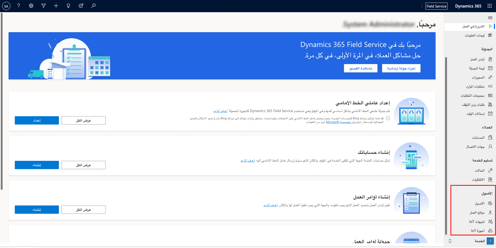

قد تقرر إحدى المؤسسات استخدام طرق متعددة لإضافة Connected Field Service كجزء من استراتيجية إدارة جهاز IoT. تعتمد استراتيجية النشر التي تقرر استخدامها على عوامل مثل حجم وحجم النشر وأنواع الأجهزة والموارد التي ستدعم النشر.

السيناريوهان الأكثر شيوعاً التي من المحتمل أن تواجههما هما:

-   **مركز IoT في Microsoft Azure** - نظام أساسي كخدمة مدارة (PaaS)، مستضافة في السحابة، تعمل كمركز رسائل مركزي للاتصال ثنائي الاتجاه بين تطبيق IoT والأجهزة التي يديرها.

-   **Microsoft Azure IoT Central** - نظام أساسي لتطبيقات IoT المستضافة الأكثر أماناً، تتوسع معك مع نمو عملك، وتتكامل مع تطبيقات عملك الحالية.

ستركز هذه الوحدة على النشر إلى مركز Azure IoT لأنه يتضمن أيضاً نموذجاً للحل يمكنك استخدامه للتعرف على الإمكانات.

يوفر نشر Connected Field Service إلى مركز Azure IoT للمؤسسة أكبر قدر من المرونة لأنه يمكنهم التحكم في كل جانب من جوانب كيفية إدارة الأجهزة والتفاعل معها وإنشاؤها تقريباً. ستفحص الأقسام التالية ما هو مطلوب، من وجهة نظر Microsoft Azure وMicrosoft Dynamics 365 Microsoft للمضي قدماً.

يعد نشر Connected Field Service إلى مركز Azure IoT عملية من أربع خطوات:

1. تثبيت أو ترقية Dynamics 365 Field Service.

2. نشر Connected Field Service وموارد Azure.

3. تخويل اتصال تطبيق Azure.

4. إعداد جهاز المحاكاة (اختياري).

## تثبيت أو ترقية Field Service

تضمين Connected Field Service مع Dynamics 365 Field Service. سيصبح متاحاً في واجهة المستخدم لأي مؤسسة تقوم بتشغيل Field Service v8.3 أو إصدار أحدث. إذا كنت لا ترى ميزات Connected Field Service، فقد تحتاج إلى تحديث بيئة Field Service الخاصة بك.

تعمل Connected Field Service جنباً إلى جنب مع إمكانات خدمة الأصول لـ Field Service. في Dynamics 365 Field Service، يتم استخدام سجل أصول العميل لتمثيل قطع المعدات التي يمتلكها العميل والموجودة في مواقعهم. يمكن أن يكون الأصل أي شيء مثل قطعة كبيرة من معدات التصنيع أو التكنولوجيا أو الجهاز أو مكيف الهواء. 

عندما تكون في الإصدار الصحيح من التطبيق، يجب أن ترى مجموعة **الأصول** في جزء التنقل الأيمن. سيتضمن التجميع عناصر Connected Field Service التالية:

-   **الأصول** - تمثيل أصول العميل.

-   **موقع العمل** - سرد جميع المواقع الوظيفية التي تم تحديدها.

-   **تنبيهات IoT** - عرض التنبيهات التي تم استلامها من الأجهزة المتصلة بIoT.

-   **أجهزة IoT** - تمثيل أجهزة IoT المسجلة في نظام إدارة IoT المتصل.

> [!div class="mx-imgBorder"]
> 

## نشر Connected Field Service وموارد Azure

في البداية، عناصر Connected Field Service التي تراها في التنقل في التطبيق غير متصلة بأي نوع من تطبيقات إدارة IoT. نظراً لأنك تريد استخدام Connected Field Service مع مركز Azure IoT، فإن الشيء التالي الذي عليك القيام به هو نشر وتوصيل مركز Azure IoT ببيئة Field Service الخاصة بك.

إن أبسط طريقة لإكمال هذه المهمة هي الانتقال إلى صفحة [تطبيق توزيع IoT‬](https://cfsdeployment.crm.dynamics.com/?azure-portal=true)، التي ستفتح معالجاً من أربع خطوات لمساعدتك في عملية النشر:

1.  تحديد مؤسسة Dynamics 365.

1.  تحديد اشتراك Azure.

1.  تحديد مجموعة موارد Azure.

1.  نشر موارد Azure.

## تحديد مؤسسة Dynamics 365

بالإضافة إلى تقديم الموافقة على سياسات مشاركة البيانات الخاصة بـ Microsoft، فإن هذه الخطوة هي المكان الذي ستحدد فيه مؤسسة Dynamics 365 التي تريد نشرها وربطها بمركز Azure IoT.

> [!div class="mx-imgBorder"]
> 

في مربع الحوار  **تحديد اشتراك Azure‬** ، ستحتاج إلى تحديد اشتراك Azure صالح. هذه الخطوة هي المكان الذي سيتم فيه إنشاء الموارد اللازمة للحل.

> [!div class="mx-imgBorder"]
> 

لمزيد من المعلومات، راجع صفحة [Microsoft Azure](https://azure.microsoft.com/?azure-portal=true).

أثناء عملية النشر، سيتم نشر عناصر متعددة في Azure مثل مركز IoT وموارد التحليلات وعينات التطبيقات. في مربع الحوار **تحديد مجموعة موارد Azure‬**، يجب عليك تحديد اسم مجموعة الموارد حيث تريد إنشاء هذه العناصر والإشارة إلى مكان مجموعة الموارد. يجب عليك تحديد موقع قريب نسبياً من منطقتك الجغرافية.

> [!div class="mx-imgBorder"]
> 

> [!IMPORTANT]
> يجب ألا يتضمن اسم مجموعة الموارد مسافات.

الخطوة الأخيرة في العملية هي المكان الذي يمكنك فيه تحديد تفاصيل أخرى مرتبطة بالنشر، مثل ما إذا كنت تريد نشر الموارد إلى مركز IoT الحالي أو تمكين ميزات اختيارية أخرى. تشمل العناصر القابلة للتكوين ما يلي:

-   **نشر موارد Azure** - بدلاً من نشر موارد جديدة، إذا كان لديك بالفعل موارد IoT الحالية التي تريد استخدامها، يتيح لك هذا الخيار استخدام هذه الموارد. قد يتضمن هذا الخيار موارد مركز IoT أو حساب تخزين أو ناقل خدمة موجوداً.

-   **نشر Microsoft Azure ‏Time Series Insights** - خطوة اختيارية لإضافة Azure Time Series Insights، وهو عبارة عن نظام أساسي لتحليلات IoT من طرف إلى طرف لمراقبة بيانات تحليلات IoT وتحليلها وتصورها على نطاق واسع. ستحتاج إلى تطبيق Microsoft Azure Active Directory (Azure AD) الذي يمكنك نشره قبل تكوين هذا الخيار. لمزيد من المعلومات، راجع [كيفية استخدام المدخل لإنشاء تطبيق Azure AD](/azure/active-directory/develop/howto-create-service-principal-portal/?azure-portal=true).

-   **خطوة اختيارية لـ Microsoft Power BI** - خطوة اختيارية لتثبيت قاعدة بيانات Azure SQL المُستخدمة لتحليلات Power BI. ستحتاج إلى وجود قاعدة بيانات Azure SQL متاحة للتحديد.

> [!div class="mx-imgBorder"]
> 

بناءً على الخيارات التي تحددها، بعد تحديد الزر **نشر**، يمكن أن يستغرق الأمر ما يصل إلى 15 دقيقة موارد Azure المطلوبة ليتم نشرها بنجاح. قبل المتابعة، تأكد من نشر جميع موارد Azure المطلوبة بنجاح وأن حالة النشر الإجمالية هي **نجاح**.

## تخويل اتصال تطبيق Azure

مورد اتصال تطبيق Azure المعتمد هو المورد الذي يتم نشره إلى موصل API الذي يتم استخدامه للتواصل مع Dynamics 365 Field Service. للحصول على معلومات مثل معلومات التسجيل والتنبيهات التي سيتم توصيلها وعرضها، ستحتاج إلى تفويض موصل API باستخدام بيانات اعتماد Dynamics 365 الخاصة بك.
عند تثبيت جميع موارد Azure المطلوبة، حدد **تخويل الموصل في Azure** لتكوين اتصال Dynamics 365 API.

> [!div class="mx-imgBorder"]
> 

لمزيد من المعلومات، راجع [تفويض اتصال API](/dynamics365/field-service/cfs-authorize-api-connection/?azure-portal=true).

في أي وقت، ستتمكن من رؤية اشتراك Azure مركز IoT المتصل كموفر IoT. هذا الاشتراك متوفر داخل Dynamics 365 Field Service عن طريق تحديد منطقة **الإعدادات** ثم تحديد **الموفرين**.

> [!div class="mx-imgBorder"]
> 

يمكن تكوين إعدادات وعناصر متعددة من داخل منطقة **الإعدادات**. تتم مناقشة الإعدادات الأخرى بمزيد من التفصيل لاحقاً.

يتم نشر العديد من أنواع الموارد المختلفة عند استخدام تطبيق IoT Deployment لإنشاء مركز IoT الخاص بك. في حين أن شرح كيفية العمل مع العناصر التي يتم نشرها هو خارج نطاق هذا التدريب، فمن الجيد أن تكون على دراية بالمكونات والموارد التي يتم نشرها.

على مستوى عالٍ، تشمل العناصر التي تم نشرها ما يلي:

-   **قائمة انتظار ناقل خدمة Microsoft Azure** - توفير قائمة انتظار للرسائل الواردة والصادرة (الأوامر) التي تتدفق بين تطبيقات Dynamics 365 و Azure. عند إرسال تنبيه IoT إلى تطبيقات Dynamics 365، أو عند إرسال أمر من تطبيقات Dynamics 365 إلى مركز IoT، سيتم وضعه في قائمة الانتظار في هذا الموقع.
    [إرسال الرسائل إلى قوائم انتظار ناقل خدمة Azure واستلامها](/azure/service-bus-messaging/service-bus-dotnet-get-started-with-queues/?azure-portal=true)

-   **Microsoft Azure ‏Logic Apps** - توفير خدمة تزامن تستخدم موصل تطبيقات Dynamics 365 وموصل قائمة انتظار. تُستخدم موصلات تطبيق Dynamics 365 لإنشاء كيانات خاصة بتطبيقات Dynamics 365، ويتم استخدام موصلات قائمة الانتظار لاستقصاء قائمة الانتظار.
    [Logic Apps](https://azure.microsoft.com/services/logic-apps/?azure-portal=true)

-   **Microsoft Azure ‏Stream Analytics** - توفير محرك لمعالجة الأحداث في الوقت الفعلي مُدار بالكامل يساعد في الكشف عن رؤى عميقة من البيانات. يساعد Stream Analytics على تسهيل إعداد حسابات تحليلية في الوقت الفعلي على البيانات التي يتم بثها من الأجهزة وأجهزة الاستشعار ومواقع الويب والوسائط الاجتماعية والتطبيقات وأنظمة البنية التحتية والمزيد. إنه يعمل كمسار لإرسال تنبيهات IoT انتقائية إلى تطبيقات Dynamics 365. [Stream Analytics](https://azure.microsoft.com/services/stream-analytics/?azure-portal=true)

-   **مركز IoT** - تقوم Connected Field Service باستخدام مركز IoT لإدارة حالة الأجهزة والأصول المسجلة. بالإضافة إلى ذلك، يرسل مركز IoT الأوامر والإشعارات إلى الأجهزة المتصلة ويتتبع تسليم الرسائل بإيصالات الاستلام. يتم إرسال رسائل الأجهزة بطريقة دائمة لاستيعاب الأجهزة المتصلة بشكل متقطع.

-   **المحاكي** - تطبيق ويب تجريبي لمحاكاة الجهاز الذي يرسل أوامر أو يستقبل أوامر من مركز IoT.
    [مركز IoT](https://azure.microsoft.com/services/iot-hub/?azure-portal=true)

-   **قاعدة بيانات SQL Microsoft Azure** - تقوم Connected Field Service باستخدام Azure SQL لتخزين رسائل نبضات الجهاز لاستخدامها لاحقاً بواسطة Power BI لإظهار حالة الأجهزة في تطبيقات Dynamics 365. [قاعدة بيانات Azure SQL](https://azure.microsoft.com/products/azure-sql/database/?azure-portal=true)

-   **تخزين Blob Microsoft Azure** - يتم تخزين الاستعلامات التي سيستخدمها Stream Analytics في تخزين Azure Blob. [التخزين](https://azure.microsoft.com/product-categories/storage/?azure-portal=true)

-   **قراءات جهاز Connected Field Service (إصدار أولي)** - استخدام Azure Time Series Insights لتخزين ومعالجة والاستعلام عن قياسات أجهزة IoT من مركز IoT. [تصور قراءات الجهاز](/dynamics365/field-service/cfs-visualizations-iot-hub/?azure-portal=true)

## إعداد جهاز المحاكاة (اختياري)

عند استخدام تطبيق نشر IoT لنشر Connected Field Service وإنشاء مركز IoT الخاص بك، يتم أيضاً نشر تطبيق محاكاة منظم الحرارة لمجموعة الموارد. يسمح لك المحاكي باختبار Connected Field Service دون الحاجة إلى توصيل أجهزة فعلية. تُعد هذه الطريقة طريقة رائعة للتعرف على الإمكانات لأنها تتيح لك محاكاة أجهزة وبيانات IoT لمساعدتك على فهم الأجزاء المختلفة التي تساهم في تحويل بيانات IoT إلى أوامر عمل بشكل أفضل.

إذا كنت ترغب في استخدام جهاز المحاكاة لمحاكاة أجهزة IoT، فستحتاج إلى توصيل جهاز المحاكاة بمركز IoT الخاص بك. للعثور على عنوان URL الخاص بالمحاكي، قم بتسجيل الدخول إلى اشتراك Azure الخاص بك. افتح مجموعة الموارد التي تم إنشاؤها عند نشر Connected Field Service. ستحتوي **مجموعة الموارد** على المحاكاة باستخدام **نوع** من **خدمة التطبيق**.

> [!div class="mx-imgBorder"]
> 

سيكون عنوان URL الخاص بالمحاكي في الزاوية العلوية اليمنى. بعد تحديد الارتباط، وعند فتح صفحة المحاكاة، يمكنك تكوينه عن طريق تحديد **اتصال**.

ستحتاج إلى تقديم تفاصيل التكوين التالية:

-   **المضيف** - اسم مركز IoT الذي تم إنشاؤه ونشره في **مجموعة الموارد**.

-   **اسم السياسة** - تحديد سياسة وصول الأمان التي سيتم استخدامها لإنشاء رموز الأمان. لأغراض الاختبار، اتركه كـ **iothubowner**.

-   **المفتاح** - مفتاح الأمان المرتبط بسياسة وصول الأمان.
    يتوفر هذا المفتاح بموجب سياسات الوصول المشترك على مركز IoT.

> [!div class="mx-imgBorder"]
> 

بعد الاتصال بلوحة الوصل، يمكنك البدء في إرسال أوامر الاختبار. ستدرس الوحدات المتبقية كيفية إنشاء الأجهزة التي سيتم عرضها في جهاز المحاكاة.

> [!NOTE]
> لمزيد من المعلومات، راجع  [مركز الثقة في Microsoft Azure](https://azure.microsoft.com/support/trust-center/?azure-portal=true) و[قائمة انتظار ناقل الخدمة](/azure/service-bus-messaging/service-bus-dotnet-get-started-with-queues/?azure-portal=true).
