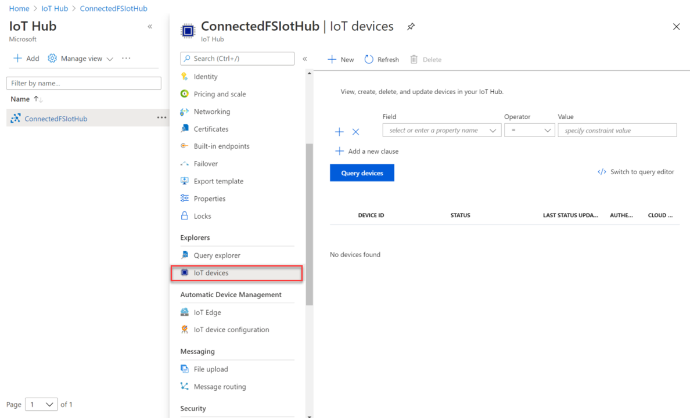
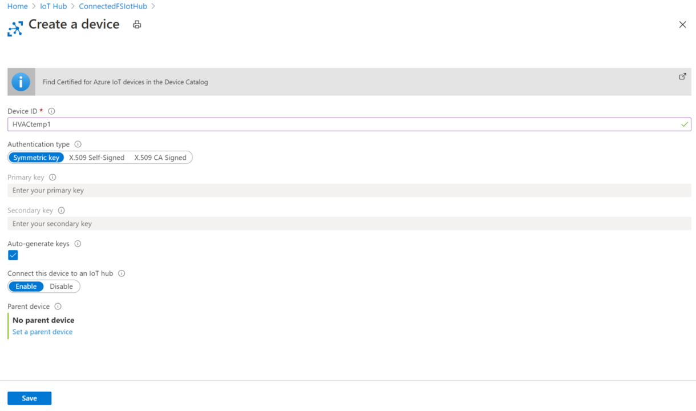
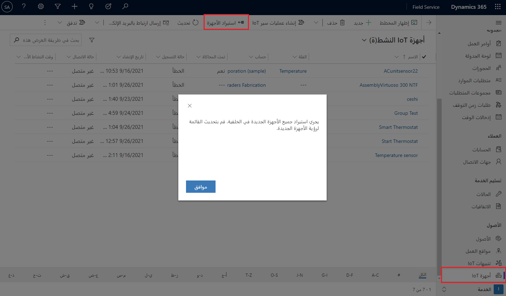
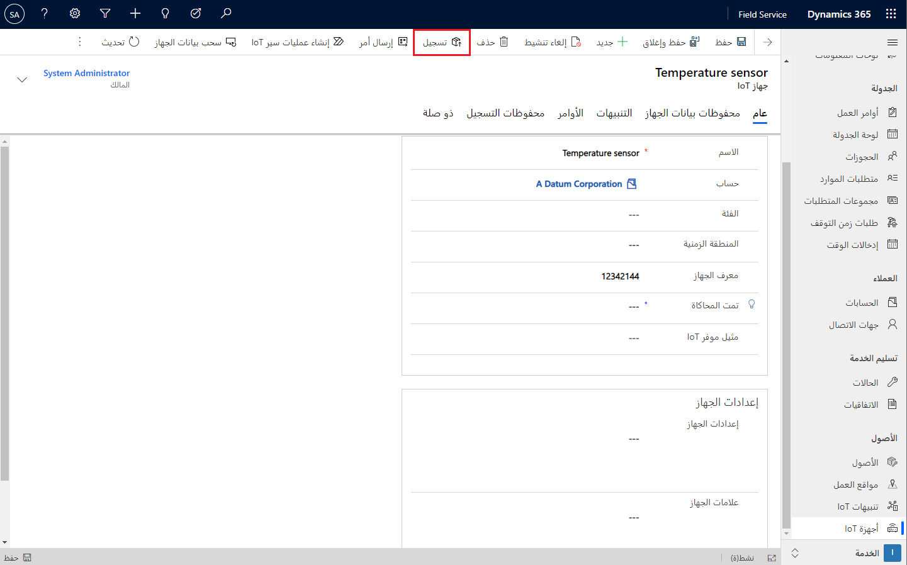
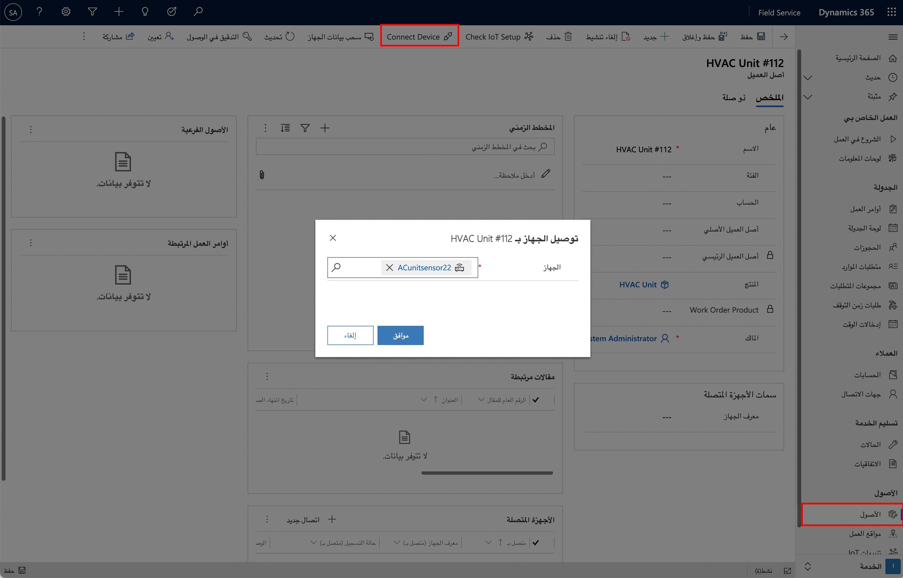

عندما تقوم بنشر Connected Field Service، فإنها تتضمن مكونات متعددة تُستخدم كجزء من الحل للتفاعل مع الأجهزة، بالإضافة إلى مكونات خدمة الأصول مثل أصول العميل والمواقع الوظيفية. تم تضمين الجداول التالية في هذه الحلول وهي مجموعة فرعية أساسية من الكيانات التي تدعم التكامل مع Azure IoT.

يبرز الجدول التالي الجداول الأكثر شيوعاً التي ستتعامل معها.

|     اسم الجدول              |     الوصف                                                                                                                                                                                  |
|-----------------------------|--------------------------------------------------------------------------------------------------------------------------------------------------------------------------------------------------|
|     تنبيه IoT               |     حدث تم إرساله بسبب حدث بارز من قياس تتبع الاستخدام IoT Hub.                                                                                                                        |
|     جهاز IoT              |     جهاز متصل يمكن تسجيله في IoT Hub.                                                                                                                                     |
|     فئة الأجهزة         |     السماح بتجميع أجهزة IoT حسب فئة معينة.    يمكن استخدام فئات الأجهزة مع جدول تعريفات الأوامر لتسهيل إدارة الجهاز.                         |
|     أمر الجهاز          |     يستخدم للتفاعل عن بعد مع جهاز IoT المتصل عن طريق تمرير أوامر JSON إلى الجهاز.                                                                                               |
|     تعريفات الأوامر     |     تُستخدم لتحديد الأوامر مسبقاً لتبسيط إرسالها إلى الأجهزة.  عند إنشاء أمر، يمكنك تحديد تعريف الأوامر، وسيتم ملء أي خصائص محددة.        |
|     تعريفات الخاصية    |     يُستخدم لتحديد خصائص معينة يمكن تمريرها كجزء من تعريف الأوامر.                                                                                                   |
|     موفرو IoT           |     تمثيل موفر IoT، مثل Azure IoT Hub حيث يتم تخزين الأجهزة.                                                                                                        |

خلال الجزء المتبقي من هذه الوحدة، ستتم مناقشة معظم هذه الأصناف والتفاعل معها بمزيد من التفصيل.

بعد قيامك بنشر Connected Field Service، يجب أن تبدأ في تحديد الأجهزة التي تريد العمل معها. لكي يصبح الجهاز أو أي أصل آخر ذكياً ويتصل بشبكة IoT، يجب أن يحتوي على مستشعرات يمكنها أخذ قراءات الجهاز وإرسال هذه المعلومات إلى السحابة. تسمى هذه المستشعرات بأجهزة IoT.

عادةً، قد يتفاعل عامل الخط الأمامي مع أجهزة IoT بعدة طرق:

-   **التثبيت** - ربما يقوموا بتثبيت أصل جديد تماماً، مثل مكيف الهواء، الذي يحتوي على جهاز أو أجهزة IoT مضمنة.
    يجب أن يكون الجهاز مسجلاً بشبكة IoT المناسبة ليبدأ العمل.

-   **الخدمة** - قد يحتاج العامل إلى خدمة أصل موجود ثم تثبيت جهاز IoT الجديد الذي سيبدأ في إرسال الإشارات إلى شبكة IoT.

-   **تفاعل الجهاز** - أثناء التواجد في الموقع، قد يحتاج العامل إلى التفاعل مع أجهزة إنترنت IoT الموجودة وتلقيها من أجل استكشاف أخطاء الصيانة أو الإصلاح وإصلاحها بشكل أفضل.

قبل أن تتمكن من التفاعل مع أحد الأجهزة، تحتاج إلى تسجيل الجهاز ثم التأكد من أنه مرتبط بأصل العميل الصحيح في Field Service.
في Dynamics 365 Field Service، يتم استخدام أصول العميل لتعقب معدات العملاء المسؤولة عن الفحص والصيانة والإصلاح. في كثير من الأحيان، يمكن توصيل أصول العملاء بأجهزة استشعار IoT التي توفر تفاصيل مثل مراقبة سلامة الأصول وتشغيل تنبيهات IoT وأوامر العمل حسب الحاجة. ولتنفيذ هذه الوظيفة، يجب تسجيل أجهزة IoT (مثل أجهزة الاستشعار) وربطها بسجلات مثل أصول العملاء في Field Service.

لمزيد من المعلومات، شاهد الفيديو في [تسجيل أجهزة IoT في Dynamics 365 Field Service](/dynamics365/field-service/cfs-register-devices?azure-portal=true).

> [!NOTE]
> بينما يمكن لمؤسستك استخدام موفري IoT المخصصين مع Connected Field Service، لأغراض هذا التدريب، يتم استخدام Azure IoT Hub في الأمثلة.

## تسجيل الجهاز

يمكن أن تختلف الظروف المتعلقة بوقت وكيفية تسجيل أجهزة IoT بناءً على عوامل مثل احتياجات المؤسسة أو نوع الجهاز الذي يتم تسجيله أو الاحتياجات الأخرى. بالإضافة إلى ذلك، قد يتم تحديد ظروف التسجيل بناءً على الوظائف المضمنة. إذا قمت بتلخيص العملية في أبسط أشكالها، فسيتم تسجيل الأجهزة بإحدى الطريقتين:

-   **في IoT Hub** - تم إنشاء الجهاز وتسجيله مباشرةً في IoT Hub. بعد تسجيله، يتم استيراد الصنف في Dynamics 365 Field Service، حيث يمكن إقرانه بسجل مثل أصل العميل.

-   **من Dynamics 365 Field Service** - يتم إنشاء الجهاز في Dynamics 365 Field Service. يتم استخدام الأتمتة لإنشاء الجهاز وتسجيله في IoT Hub.

## إنشاء وتسجيل من IoT Hub

قد يتم إنشاء جهاز أولاً وتسجيله مباشرةً في IoT Hub لعدة أسباب مختلفة. قد تحدث هذه السيناريوهات عندما يلزم تسجيل عدة سجلات في وقت واحد، أو عند إنشاء تطبيق تسجيل جهاز معين، أو عند وجود نوع من التسجيل الذاتي، أو لعدة أسباب أخرى. بغض النظر عن السبب، يتم إنشاء جهاز IoT وتسجيله مباشرة في IoT Hub. بعد إنشاء الجهاز وتسجيله، سيلزم عرضه في Connected Field Service إذا كنت تريد أن تكون قادراً على إدارته والتفاعل معه من خلال Dynamics 365.

لتسجيل جهاز مباشرةً في IoT Hub، افتح [مدخل Azure](https://portal.azure.com?azure-portal=true) ثم افتح IoT hub الذي تم إنشاؤه عندما قمت بنشر Connected Field Service. على يسار IoT hub، حدد **أجهزة IoT** ثم حدد الزر **جديد** لإنشاء جهاز جديد.

> [!div class="mx-imgBorder"]
> 

عند إنشاء جهاز، فإنك تحتاج إلى إنشاء معرف له. سيتم استخدام هذا المعرف للتحديد والاستخدام للتأكد من أن سجل جهاز IoT في Dynamics 365 مقترن بالسجل الصحيح في IoT Hub. على سبيل المثال، إذا كان مستشعر درجة الحرارة موجوداً على جهاز HVAC، فيمكنك تعيين المعرف على **HVACtemp1**. بناءً على نوع الجهاز واحتياجات مؤسستك، يمكنك تقديم مزيد من التفاصيل.

> [!div class="mx-imgBorder"]
> 

الآن بعد أن تم تسجيل الجهاز في IoT Hub، فأنت بحاجة إلى استيراده إلى Connected Field Service. يمكنك إكمال هذه المهمة من خلال Dynamics 365 Field Service. ضمن مجموعة **الأصول**، حدد **أجهزة IoT** ثم حدد الزر **استيراد أجهزة** في شريط الأوامر. ستظهر الآن الأجهزة الجديدة المسجلة في Azure IoT Hub في قائمة أجهزة IoT النشطة في Field Service.

لمزيد من المعلومات، راجع [إنشاء أجهزة وتسجيلها من Azure IoT Hub](/dynamics365/field-service/cfs-register-devices#create-and-register-an-iot-device-from-iot-hub/?azure-portal=true).

> [!div class="mx-imgBorder"]
> 

## إنشاء وتسجيل من Field Service

هناك طريقة أخرى يمكن من خلالها إنشاء أجهزة IoT وتسجيلها وهي مباشرة من Dynamics 365 Field Service. في تطبيق Field Service، حدد **أجهزة IoT** ثم حدد **جديد** في شريط الأوامر لإنشاء جهاز.

عند تحديد جهاز من Field Service، يمكنك تقديم التفاصيل التالية:

-   **الاسم** - تحديد اسم جهاز IoT الذي سيظهر في Field Service.

-   **الحساب** - تحديد سجل الحساب الذي يقترن به جهاز IoT.

-   **معرف الجهاز** - يمثل معرف الجهاز كما يظهر في IoT Hub. إذا تم ترك هذا الحقل فارغاً، فسيتم ملؤه عند مزامنته مرة أخرى من IoT Hub.

-   **تمت محاكاته** - تحديد ما إذا كان الجهاز إصدار فعلي لجهاز تمت محاكاته.

-   **مثيل موفر IoT** - تحديد مثيل IoT Hub الذي سيتم استخدامه لمعالجة المعلومات المرتبطة بهذا الجهاز.

> [!div class="mx-imgBorder"]
> 

بعد التقاط التفاصيل التي تريدها للجهاز، حدد الزر **تسجيل** في شريط الأوامر. سيتم تشغيل التسجيل في الخلفية. بعد تسجيل الجهاز ومزامنته مرة أخرى مع Field Service، سيتم إنشاء معرف الجهاز وإضافته إلى سجل جهاز IoT.

لمزيد من المعلومات، راجع [إنشاء أجهزة وتسجيلها من Field Service](/dynamics365/field-service/cfs-register-devices#create-and-register-an-iot-device-from-field-service/?azure-portal=true).

## توصيل الاجهزة بالأصول

غالباً ما تمثل أجهزة IoT مستشعرات IoT في سجلات أصول العملاء. بعد إقران الجهاز بسجل جهاز IoT، يجب أن يكون مقترناً بأصل عميل جديد أو موجود. على سبيل المثال، يمكنك توصيل مستشعر جهاز IoT الجديد الذي تم تركيبه في وحدة تكييف الهواء بسجل أصول العملاء الخاص بوحدة تكييف الهواء.

> [!div class="mx-imgBorder"]
> 

يمكنك توصيل أصول العميل بأجهزة IoT من سجل أصول العميل. في السجل **أصل العميل** ، حدد **توصيل جهاز** في شريط الأوامر، ثم حدد الجهاز الذي ترغب في إرفاقه به. بعد إقران جهاز IoT بالأصل، سيظهر قسم جديد يسمى **الأجهزة المتصلة**، حيث يمكنك عرض معلومات حول جهاز IoT الجديد.

لمزيد من المعلومات، راجع [الاتصال بالأصول والأجهزة](/dynamics365/field-service/cfs-register-devices?azure-portal=true#connect-to-asset).
